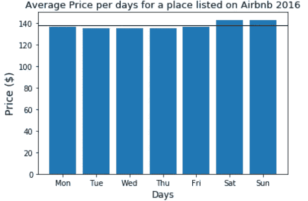
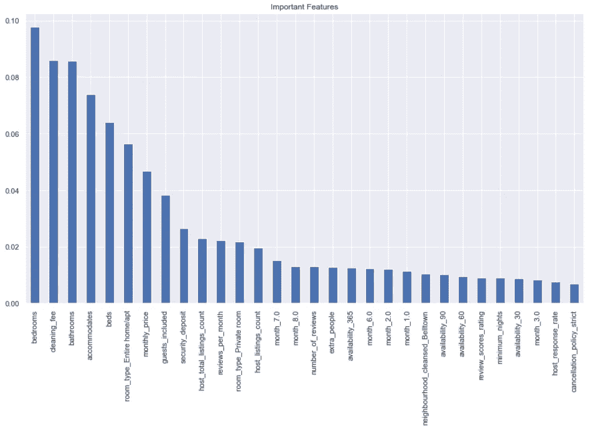
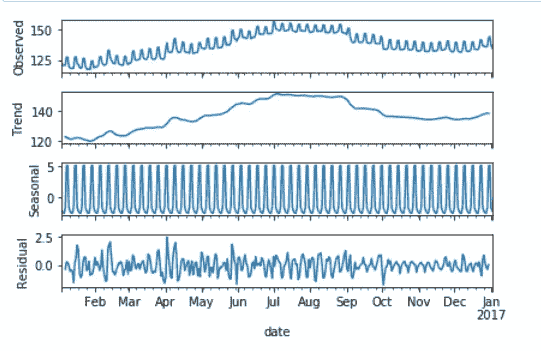
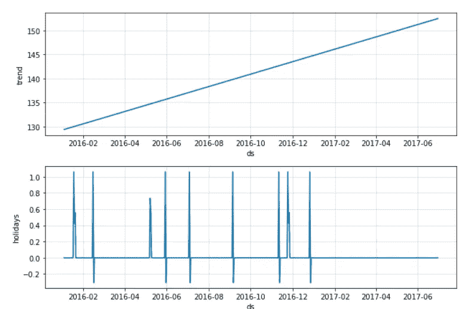
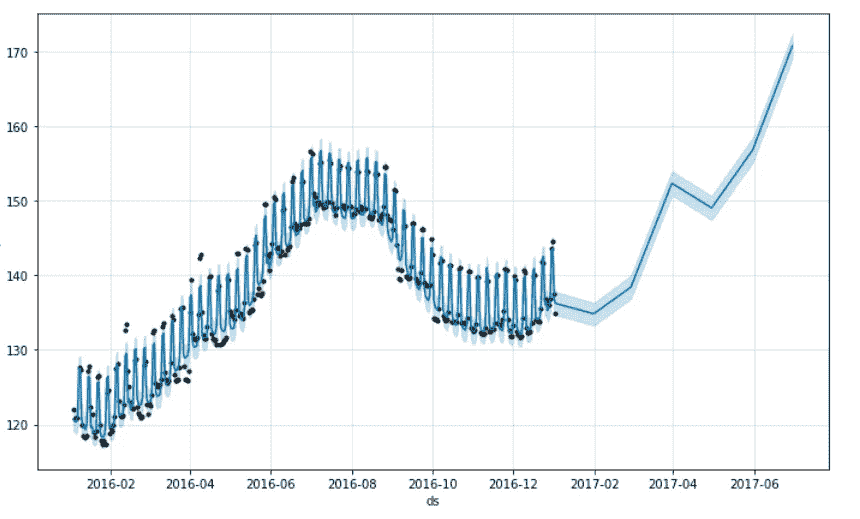
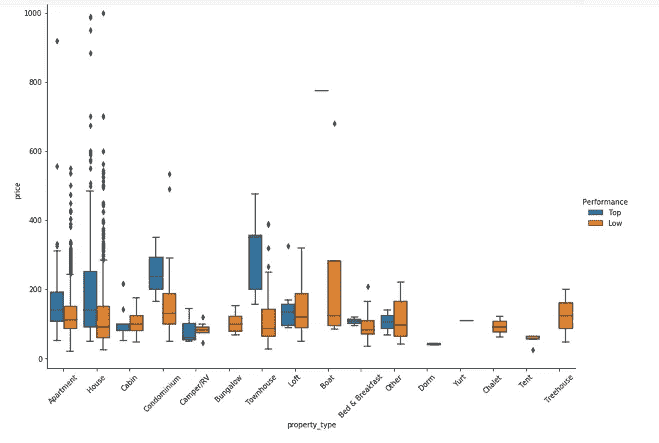
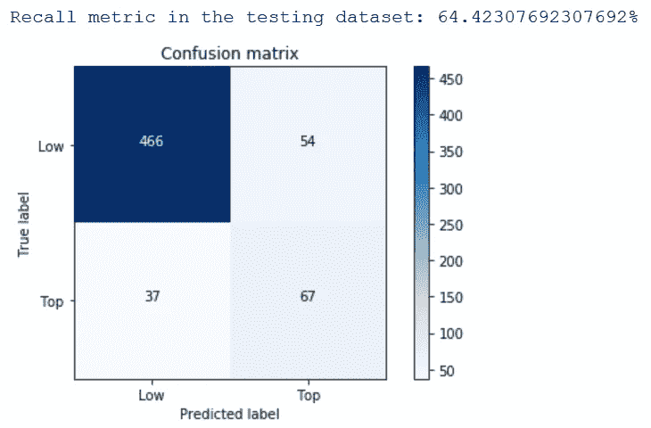

# 为什么要帮助西雅图 Airbnb 的主人和客人做出更明智的决定？！

> 原文：<https://towardsdatascience.com/using-data-to-help-seattle-airbnb-hosts-and-guests-make-smarter-decisions-39749cc43ae?source=collection_archive---------28----------------------->

Photo by [Zhifei Zhou](https://unsplash.com/@phoebezzf?utm_source=medium&utm_medium=referral) on [Unsplash](https://unsplash.com?utm_source=medium&utm_medium=referral)

在任何地方旅行之前，首先想到的问题是住宿。在过去的八年里，Airbnb 证明了它是解决这类旅行问题的最便捷、最便宜的解决方案。它也允许房主通过分享他们的房子来增加他们的收入。

**动机:**

Airbnb 为短期住宿提供了一个极好的解决方案。但现在是时候利用数据，引导新主机估算更合理的价格，同时实现收入最大化。还有，帮助客人了解哪些住宿因素他们更应该注意，以节省一些钱。西雅图 Airbnb 开放数据可以在[这里](https://www.kaggle.com/airbnb/seattle)找到。

我试图集中回答可能对双方都有帮助的问题，因为我们每个人都可以既是主人也是客人。根据 Airbnb 的定价提示，约 60%的主机收入来自物业因素和设施，另外 40%来自全年的需求。所以，我决定应用机器学习和时间序列技术来分析这些关键因素；价格、收入和需求。

**利率上升的主要驱动因素是什么？**

2016 年的平均挂牌价约为每晚 137 美元。但是它会随着不同的月份和工作日而变化。夏天甚至接近 160 度。西雅图是一个寒冷的地方，由于需求较高，夏季价格较高是有道理的。

西雅图 Airbnb 上列出的周末住宿地点似乎比其他工作日更贵。

因此，时间和市场是主要驱动因素，并应被视为机器学习模型中的回归变量，这在统计上具有重要意义。房屋和公寓是最受欢迎的房产，但价格合理，每晚不到 150 美元。但是，一些功能，如船，阁楼，公寓和联排别墅是昂贵的，很少上市。

为了确定更高评级的驱动因素，我清理、缩放和格式化了数据，为预测分析做好准备，还删除了具有相似性能和多重共线性的变量。然后使用随机森林回归找出最重要的列表特征，以解释是什么导致了价格范围的变化。

随机森林通过测量两个性能指标来选择关键特征，减少节点杂质，提高准确性。所有可能的价格驱动因素都给出了分数。权重越高，列表特征区分价格值的效果越显著。关于随机森林如何排列每个元素的值的细节超出了这个项目的范围。

首先，我拟合了随机森林模型，然后通过调整模型超参数来增强它，以达到最高的精度。

该建议解决方案的结果表明，以下特征有助于在采油树中做出关键决策，并且可以解释价格范围中 90%的变化:

这个回归变量中的基本元素是卧室数量、浴室数量、床位数量、包括的客人数量、评论数量、季节、邻居、取消费用和政策严格性。

一般来说，这些特征可以分为三大类:一个是物业特点，以前的评论，以及季节性和每周的需求，我将在下一部分进行更多的分析。

【2016 年 Airbnb 的需求和价格如何变化？

正如我之前提到的，西雅图从 2016 年 1 月到 2017 年 1 月的平均价格表明，市场是价格范围中的一个重要因素。在夏季，更高的需求导致更高的费率，并在 2016 年初和 2017 年急剧下降。

我分解了每日价格序列，以确定价格趋势和季节性，并了解对 Airbnb 业务至关重要的基于时间的模式。此外，本部分的另一个基本目标是调查是否有可能使用 2016 年的数据确定一个显示未来模式的预测模型。

平均价格有季节性，不是固定不变的。为了检查数据是否满足时间序列预测的平稳性要求，我将数据分成两部分，并比较每组的均值和方差。由于均值和方差差异较大，且差异具有统计学意义；我对这个系列进行了对数变换，使其保持平稳。

自相关图显示了每个滞后时间的价格；它与其过去的值高度相关，并且可以通过使用时间序列技术来预测。但我决定使用 Prophet，而不是经典的统计时间序列方法。

Prophet 是由脸书推出的一种程序，用于基于加法模型预测时间序列数据，其中非线性趋势符合不同的季节性和假日效应。你可以在这里阅读更多关于先知[的信息。此外，Prophet 具有易于解释的参数，可以调整这些参数来改进趋势和季节性预测。](https://facebook.github.io/prophet/)

在这里，我训练了一个线性趋势的加性回归模型，每周，每天和每年的季节性，考虑了假期的影响。一般来说，我假设我的时间序列有三个主要部分:趋势、季节性和节假日。

成分图显示，周末、夏季和节假日对价格上涨有积极影响。还有，2017 年日均价格会从 137 涨到 150 以上。

在下图中，蓝线代表预测值，而黑点代表每天的实际值。从图中可以看出，该模型似乎可以捕捉季节性，并很好地拟合历史数据，但我建议添加 2017 年和 2018 年的数据集，如果可以验证模型预测能力的话。

Prophet 中趋势变化点和不确定性区间的数量可以调整，以克服过度拟合和欠拟合。

哪些上市更有利可图并带来更多收入？

为了回答这个问题，我定义了一个度量收入的指标，因为原始数据集中没有这样的数据点。我假设主人的收入是通过每晚的价格乘以预定房间的最少次数来估算的。我将所有列出的资产分为两组，一组表现更好，每年带来超过 10000 美元的收入，另一组表现相反。这个阈值可以根据平均收入的分配情况而改变。然后，我比较了顶部和底部上市绩效的具体特征。

结果显示，公寓和房屋带来了更多的收入，但不仅仅是因为价格高，而是因为它们被预订得最多。

下面的条形图比较了不同酒店中表现最佳和表现最差的 5 家酒店的数字汇总。

为了确定哪些因素导致一个列表比其他更有利可图，我应用了不同的分类器梯度推进，逻辑回归，支持向量机和 K 近邻。然后，我调整了梯度增强分类器超参数，以达到更高的精度并克服过度拟合。大约 83%的房源是分类的，收入低于 10000 美元，17%在 2016 年赚得更多。因此，我应用了 SMOTE 等重采样技术，以确保分类器能够捕捉所有不寻常的列表。特性重要图表示，如果一个主机成为超级主机，在一两个小时之间做出响应并增加容纳更多人的能力将比其他人赚更多的钱。

在 520 个低表现者列表中，大约 466 个被该分类器准确预测。ROC 曲线下的面积显示，对于新数据集，对这两组进行分类的模型准确度为 89%。

这个模型可以通过在精确度和召回率之间定义一个更加可释放的折衷来改进。此外，可以使用另一个收入度量或阈值来增强评估度量。

最后，我想说明的是，这个项目是 Udacity 的数据科学纳米学位课程的一部分。如果你对审查代码或改进它感兴趣，我的 Github 的链接是可用的[这里](https://github.com/RahilBA/Seattle-Airbnb-Open-Data)。