# 使用深度学习进行基于手指静脉的生物认证

> 原文：<https://towardsdatascience.com/using-deep-learning-for-finger-vein-based-biometric-authentication-3f6601635821?source=collection_archive---------10----------------------->

**这个手指静脉识别项目是在** [**AlgoDeep AI 平台**](https://algodeep.ai/?utm_source=medium_LJ&utm_medium=blog&utm_content=biometry) **上完成的。更多详情可以阅读** [***本文***](https://medium.com/@ljinstat/from-idea-to-ai-deployment-using-deep-learning-for-finger-vein-recognition-2cce4c273730) **关于执行这个项目的全过程**，**从研究到部署。AlgoDeep 的首席运营官** [**鲁迪·德卢亚**](https://medium.com/@rudy.delouya) **a 是这两篇文章的合著者，也是手指静脉识别项目的合作者。**

> 当伊森·亨特在《碟中谍 5》中使用英国首相的生物识别技术解锁红盒子时，你是否惊叹于认证系统？

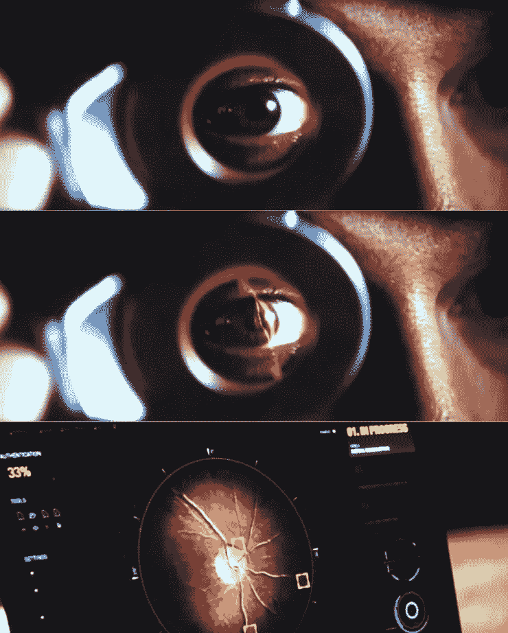

Retina Scan (images from Mission Impossible 5)

动作和科幻电影中出现了多种生物认证系统，如视网膜扫描仪、虹膜扫描仪、人脸识别、指纹、声音识别，甚至步态识别。生物认证系统是近年来的研究热点。一些解决方案发展迅速，已经应用于现实生活中的安全场景。

# 生物认证系统

生物认证系统是通过测量个人身体的特定特征或行为来验证个人身份的实时系统。虹膜扫描仪等生物识别设备收集个人的生物识别数据，并将其转换为数字形式。通过使用算法来匹配模式，生物认证系统可以通过将数据与数据库中其他注册的生物数据进行比较来完成识别或验证个人的任务。设计了生物认证系统的两种主要模式，*识别或验证，*。在识别模式中，输入数据与数据库中所有注册的模式进行比较。系统可以判断这个人是否来自数据库。当处于验证模式时，将生物测定输入数据与一个人的特定模式进行比较。它旨在确定他们是否是同一个人，并防止多人使用同一身份。

# 基于手指静脉的生物认证系统

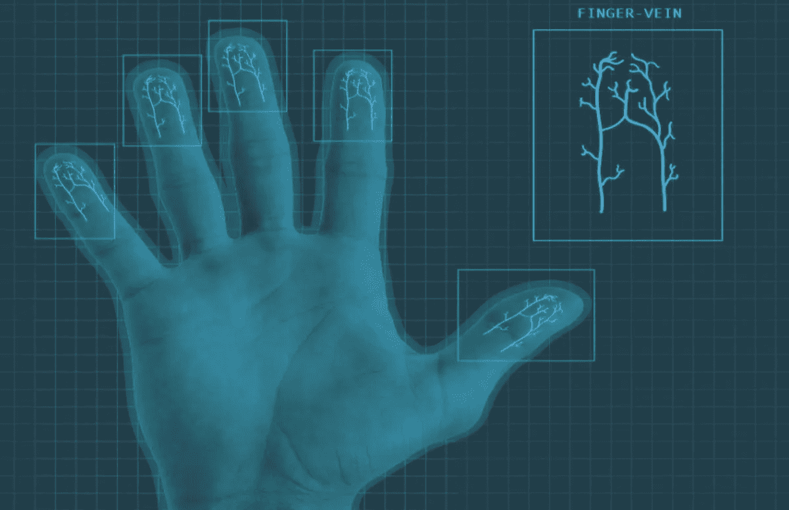

Credit to [Teiss](https://www.teiss.co.uk/information-security/mobile-authentication-with-finger-vein-biometrics/)

然而，正如我们在电影和科幻小说中看到的那样，一些生物认证系统可以被假冒的资源所欺骗。在丹·布朗的小说《天使与魔鬼》中，哈萨辛挖出了列奥纳多的眼睛，偷走了安装在装有视网膜扫描仪的门后的安全反物质。虽然视网膜的生物特征对每个人来说都是独一无二的，但黑客也可以找到破解认证系统的方法。在不同的生物特征中，安全级别也不同。与其他方法相比，我们今天讨论的基于手指静脉的生物认证系统更难被欺骗，因为它只能识别活人皮肤下的独特手指静脉模式。

## 手指静脉数据的收集

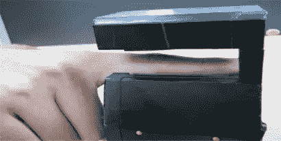

Finger-vein capture device. From the paper [2]

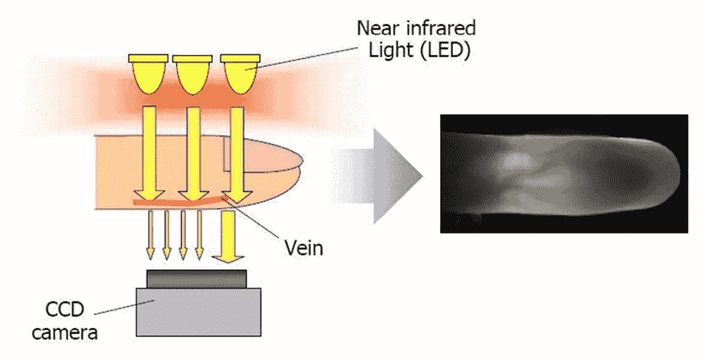

How to capture finger veins [3]

使用特殊的捕获机器来收集手指静脉数据。该捕捉设备主要由近红外光源、透镜、滤光器和图像捕捉设备组成。由于手指静脉隐藏在皮肤之下，可见光无法看到它们。这种捕捉设备使用可以穿过人体组织的近红外光。此外，血红蛋白和黑色素等色素会阻挡近红外光。

## 使用深度学习进行手指静脉识别

从第一个著名的神经网络 LeNet 识别 10 个手写数字的图像，到更复杂的神经网络在 ImageNet 中对 1000 类图像进行分类，深度神经网络(DNNs)，特别是卷积神经网络(CNN)在计算机视觉中的能力是众所周知的。CNN 通常表现良好，甚至优于传统的计算机视觉方法，因为它们非常擅长自动从图像中提取特征。

手指静脉识别可以看作是一个图像分类问题。用 CNN 处理手指静脉识别问题一定很有趣！我们应该如何设计实验来适应生物认证系统的需求？根据以前使用的手指静脉识别方法，其中许多方法进行特征提取，然后计算两个特征之间的距离。根据特征距离的分布来固定阈值。如果距离值高于阈值，则这两个特征不被归类为来自同一个人。否则，如果距离低于阈值，这两个特征被视为来自同一个人。

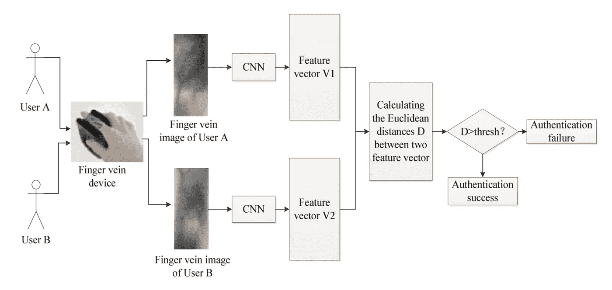

CNN-based finger-vein recognition system. Image from [3]

## 手指静脉数据集

一些研究机构提供公开的手指静脉数据集。我们使用的数据集是来自 SDUMLA-HMT 数据库的手指静脉数据集。感谢山东大学文学硕士实验室提供的山东大学文学硕士-HMT 数据库。该数据集注册了 106 个人的手指静脉图像。双手的三个手指，食指、中指和无名指被抓获。每个手指有 6 张图片。因此，总共由 3，816 个图像组成。图像的格式是 320x240 像素大小的“bmp”。

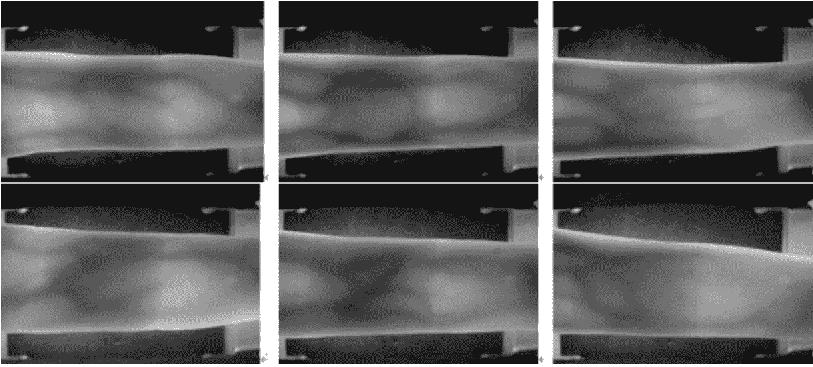

Image from [5]

## 图像预处理—感兴趣区域(ROI)提取

正如我们从上面的图像中可以观察到的，捕获的图像不仅包含手指，还包含作为捕获机器的背景。提取 ROI 的目的是保存手指部分，去除背景。必须找到上限和下限来获取 ROI。

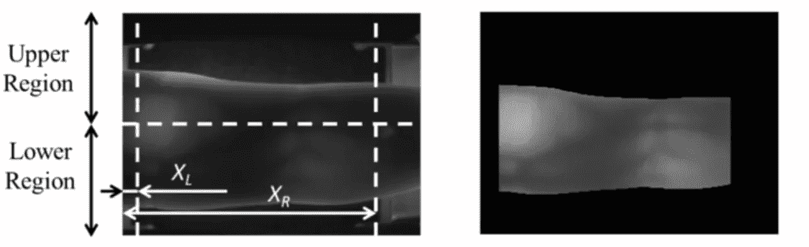

Image from [6]

我们通过以下步骤建立了我们的 ROI 系统:

*   将图像裁剪为 240x240 像素
*   将图像分成两半，并应用过滤器来检测上下边界
*   仅保留上限和下限之间的区域
*   做线性拉伸

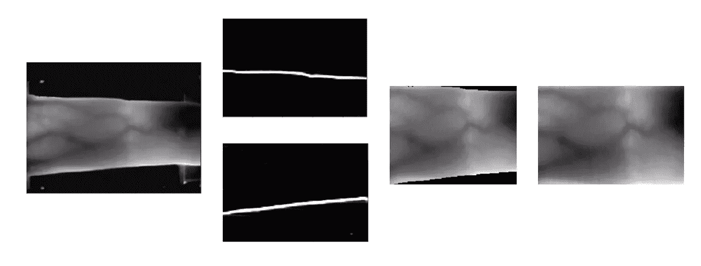

From left to right: cropping, masking limits, keeping areas and linear stretching

## 手指静脉识别的迁移学习

通常，在大数据集上提供令人满意的结果的 CNN 模型具有巨大的参数。如果要从零开始训练一个复杂的 CNN 模型，是非常耗时耗资源的。通常，我们没有足够的数据来从头开始训练。我们也应该考虑过度拟合的问题。如果模型太复杂，而我们的数据集又很小，那么它就很有可能过度拟合。

迁移学习就是来解决这个问题的。迁移学习旨在将现有模型(基于大量数据的预训练模型)应用于其他领域或其他类型的任务。例如，我们可以使用在大型猫狗数据集上预先训练的模型来对大象和猴子进行分类，或者对卡通猫狗进行分类。

正如我们可以想象的，将预先训练的模型直接应用到其他领域或其他任务可能不会很好地工作，因为模型在训练时看不到来自该领域的信息。我们通常有两种选择。一方面，预训练的 CNN 模型可以被视为特征提取器。可以通过使用提取的特征作为输入来构建线性分类器。另一方面，经常采用微调的方法对一些高层进行微调。早期图层中的功能更加通用。而后面的层中的特征包含原始数据集的更具体的信息。冻结早期层可以为我们带来许多任务的通用和有用的功能。微调后续图层可以生成更多存在于数据集中的特定要素。

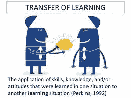

Image from [6]

在我们的案例中，我们尝试微调 VGG-16 预训练模型中的一些后续层。事实证明，当我们从最后一个卷积层进行训练时，我们的结果最好。

# 手指静脉识别实验

实验主要受本文[“使用 NIR 图像传感器的基于卷积神经网络的手指静脉识别”](https://www.ncbi.nlm.nih.gov/pmc/articles/PMC5492434/#B46-sensors-17-01297)的启发。提出了手指静脉识别的两种情况。第一种情况使用手指静脉图像作为输入。分类器允许对不同的手指进行分类。另一种情况旨在使用不同的图像来分类真实匹配(相同类别的输入和登记的手指静脉图像之间的匹配)和冒名顶替者匹配(不同类别的输入和登记的手指静脉图像之间的匹配)。两种情况都使用预训练的 CNN 模型，并用手指静脉数据集微调该模型。正如我们之前介绍的，生物认证系统有两种可能的模式，识别和验证。实验的第一种情况对应于识别模式，第二种情况对应于验证模式。

进行实验的过程如下:

*   数据预处理:将数据集分成训练、验证和测试数据集，通过小范围地随机平移和旋转图像来扩充训练集，如果我们考虑 ROI，则将 ROI 应用于三个数据集。(对于第二种情况，区别真实和冒名顶替匹配的图像)。
*   设置模型:冻结 VGG-16 中的早期图层，仅微调后面的图层。

## 数据预处理

第一步是分割数据集。SDUMLA-HMT 数据集包含 636 个类(3 个手指* 2 只手* 106 个人)。每个手指是一个类，它由 6 个图像组成。对于我们实现的两种情况，我们使用了不同的分割策略。

对于第一种情况，在开始时，数据集被分成三个数据集，前三个图像用于训练集，第四个图像用于验证集，其余的用于测试集。然而，使用这种分割数据的方法会导致测试集的过度拟合。通过检查错误分类的类的图像，我们观察到一些类的最后两个图像不同于其他四个图像。这意味着训练集和验证集的分布与测试集的分布不对应！在分割数据集之前，我们已经检查了一些类。但是，碰巧我们只检查了图像相似的类。*要学习的一个教训:在训练之前，一定要确保验证集和测试集的分布是相同的。*

对于第二种情况，数据集被随机分成两半。每个部分现在包含 318 人。第二部分被分成两半，一部分用于验证集，另一部分用于测试集。

接下来，由于每个类别的三个图像不足以训练合格的模型，所以使用数据扩充方法来增加训练集中的图像数量。数据扩充是一种正则化方法。当数据集的大小不足以概括结果时，可以应用数据扩充来生成更多数据并降低过度拟合的风险。一些动作可以增强图像，例如旋转、平移、翻转、亮度修改。在我们的数据扩充方法中，通过轻微的平移、旋转和亮度修改，为训练集中的每个图像生成 12 个图像。

对于第二种情况，生成差异图像以进行真实和冒名顶替者匹配。从训练集的每个类中，选择一个用于注册的图像。对于剩余图像中的每一个，通过减去该图像和来自相同类别的登记图像来计算真实差异图像，并且通过减去该图像和从不同类别中随机选择的登记的一个图像来计算冒名顶替者差异图像。最后，真实差图像和冒名顶替差图像的数量相同。在第二种情况下，该模型引入了一个二元分类器，用于对真实匹配和冒名顶替匹配进行分类。

## 模型架构

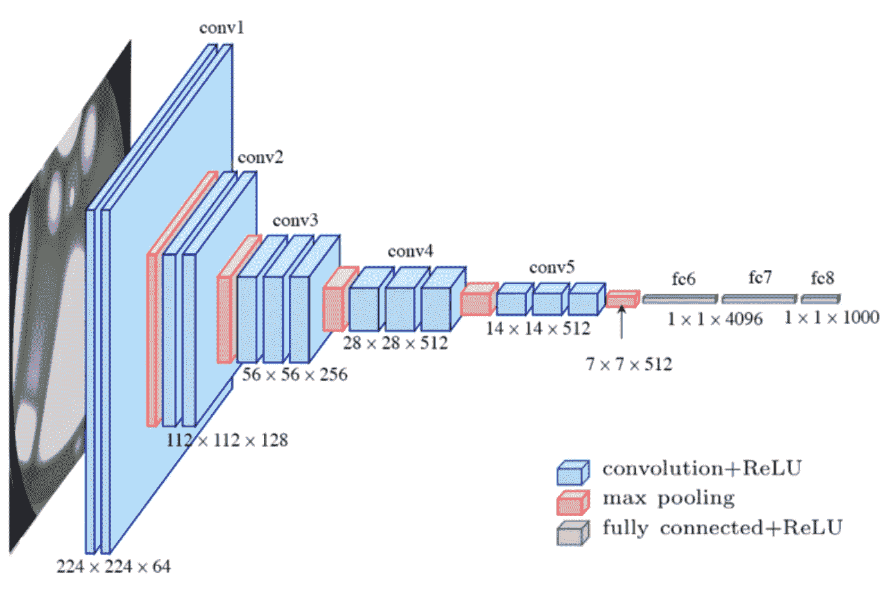

VGG-16\. Image from [6]

VGG-16 是一个非常深的卷积神经网络，它有 1.38 亿个参数。这种深度架构的训练需要大规模数据集。然而，我们的训练数据比 ImageNet 小得多。因此，一个预先训练的 VGG-16 模型在我们的数据集上进行了微调。尝试从不同层面进行训练。如果训练更多的早期层，过度拟合的风险将会上升。然而，如果只训练输出层，性能是不令人满意的。最后，选择从最后一个卷积层微调的模型。

# 结果和分析

进行了许多实验来找出更好的超参数和更好的训练策略。虽然模型还可以进一步改进，但我们目前得到的结果是有希望的。

## 分类器的结果

我们对两种模型进行了实验。第一个模型是用于识别的多类分类模型。另一个模型是用于验证的二元分类模型。二元分类模型的输入是差异图像。这两个模型都是从预训练的 VGG-16 模型的最后一个卷积层进行微调的。以下结果来自未经 ROI 预处理的模型。我们也对具有 ROI 数据的模型进行了实验，但是我们发现结果不在预期之内。由于我们使用的数据集是低质量的数据集，并且一些 ROI 预处理图像的质量没有保证，因此该模型不能很好地对类别进行分类。

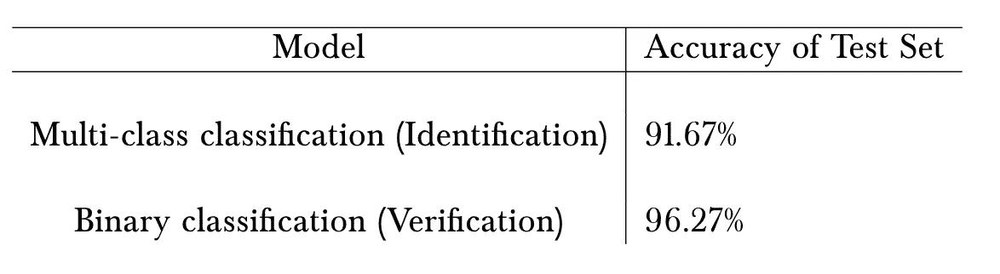

Results of classifiers

## 生物认证系统的度量

与通过准确性评估的分类模型不同，生物认证系统有其度量标准来衡量认证的质量。三个最常用的指标是错误拒绝率(FRR)、错误接受率(FAR)和等错误率(EER)[11]。

*   **错误拒绝率(FRR):** 系统无法检测到输入模式与数据库中匹配模板匹配的概率。它测量被错误拒绝的有效输入的百分比。(#错误剔除样本数/#匹配样本数)
*   **错误接受率(FAR):** 系统错误匹配输入模式和数据库中不匹配模板的概率。它衡量被错误接受的无效输入的百分比。(#错误接受的样本数/#不匹配的样本数)
*   **等误差率(EER):** 接受和拒绝误差相等的比率。该值表示错误接受的比例等于错误拒绝的比例。相等错误率值越低，生物统计系统的准确度越高。

对于识别模型，FAR、FRR 和 EER 的计算基于图像之间的欧几里德距离。首先，我们计算类内和类间距离来定义阈值范围。距离阈值的跨度在 83 和 2024 之间。然后，绘制一个远 FRR 图来确定能效比。最终的 EER 是 4.1%。

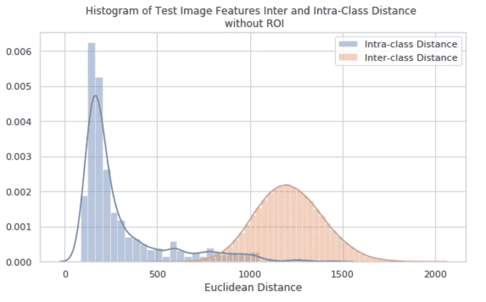

Intra-class and Inter-class distance of the identification model

FAR-FRR plot of the identification model

对于验证模型，如果直接使用欧氏距离作为特征距离的度量，将会导致难以解释的结果。这里的类间和类内距离是相同类的差异图像的距离和不同类的差异图像的距离。很难解释“两个不同图像的距离”的含义。差异图像提供了关于两个图像之间的差异的信息，并且该差异可大可小，这取决于原始图像。因此，差异图像的特征的欧几里德距离在这里似乎不适合作为度量。此外，在二元分类问题中，FAR 和 FRR 是容易估计的。FAR 是 FP(假阳性)/ #匹配样本，FRR 是 FN(假阴性)/#非匹配样本。我们使用预测的概率作为度量，然后计算 FAR 和 FRR。我们得到的误差是 1.9%。

# 结论

我们知道深度学习方法是数据驱动的。数据质量是获得成功实验结果的关键因素。我们使用的数据集质量不是很好，但结果仍然很有希望。识别模型和验证模型的最终结果都优于参考文献中的结果。与其他模型不同，深度学习方法实现起来很快，构建起来更简单，无需投入太多复杂的功能处理和工程。然而，与其他论文中的一些结果(不总是使用深度学习方法)相比，我们仍然需要在数据预处理、模型架构和超参数选择方面进行改进。

# 参考资料:

[1]尹一龙，，孙希伟.SDUMLA-HMT:一个多模态生物特征数据库。第六届中国生物识别大会(CCBR，2011 年)，LNCS 7098，第 260-268 页，中国，2011 年。

[2]杨国荣，X，殷玉英.基于个性化最佳位图的手指静脉识别.*传感器(巴塞尔)*。2012.

[3]沙希德、卡希夫和伊德、韩刚和、刘和杨、和库雷希、伊姆兰和古、杰和尹、一龙。手指静脉识别技术的系统综述。信息(瑞士)。2018.

[4]孟，龚，方，张，张.基于卷积神经网络的手指静脉识别.在 *MATEC 网络会议* EDP 科学。2017

[5]http://mla.sdu.edu.cn/info/1006/1195.htm 的 HMT 数据库

[6][https://www . analyticsvidhya . com/blog/2017/06/transfer-learning-the-art-of-fine-tuning-a-pre-trained-model/](https://www.analyticsvidhya.com/blog/2017/06/transfer-learning-the-art-of-fine-tuning-a-pre-trained-model/)

[7]范道明、朴 YH、阮道泰、权熙、朴韩国。采用近红外图像传感器的非介入式手指静脉识别系统及各种因素下的精度分析。*传感器(巴塞尔)*。2015.

[8]费格森、马克斯&阿克、罗内&李缇娜、容村& H .劳、金乔。基于卷积神经网络的铸件缺陷自动定位。2017.

[9]西蒙扬，卡伦&齐塞尔曼，安德鲁。用于大规模图像识别的非常深的卷积网络。2014.

[10]洪亨，李明波，朴元淳。基于卷积神经网络的近红外图像传感器手指静脉识别。*传感器(巴塞尔)*。2017.

[11]生物统计学原理[http://www.biometria.sk/en/principles-of-biometrics.html](http://www.biometria.sk/en/principles-of-biometrics.html)