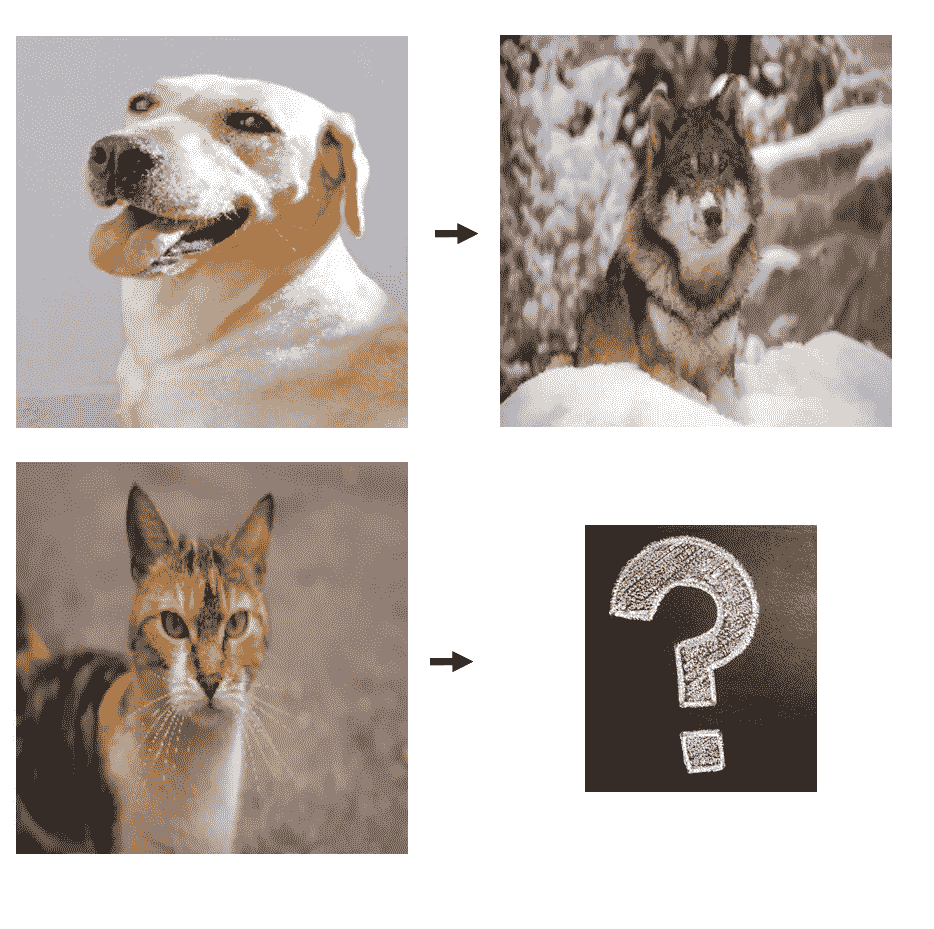
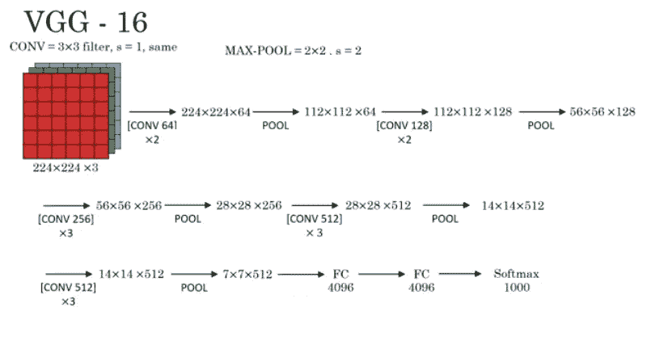
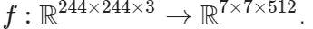
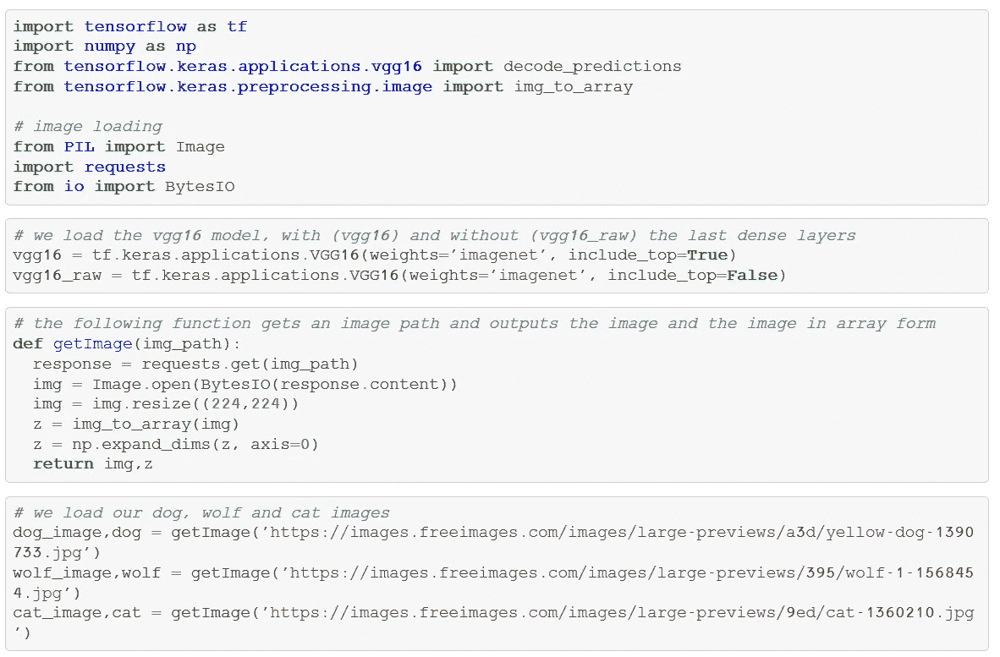
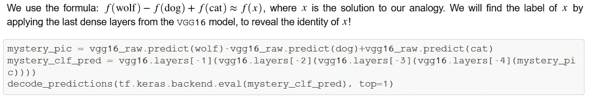
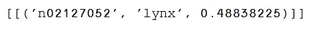
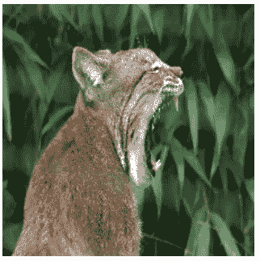

# 使用深度学习进行图像类比

> 原文：<https://towardsdatascience.com/using-deep-learning-for-image-analogies-aa2e7d7af337?source=collection_archive---------20----------------------->

我将回答以下问题:

狗对于狼就像猫对于 __？

通过使用经过训练的深度卷积神经网络对照片进行分类。

*A dog is to wolf as a cat is to ___ ?*

# 卷积神经网络

我会使用预先训练好的 VGG16 图像分类模型。该模型由一个接一个堆叠的 CNN 层组成，由 max pooling 层连接。网络的输入是 244×244×3 的图像(即图像宽度和长度是 244 像素，3 个通道)，在应用所有卷积层之后，我们得到 7×7×512 的阵列。

(diagram taken from [deeplearning.ai](https://www.deeplearning.ai/) course by Andrew Ng, “Convolutional Neural Networks”)

在网络的末端，我们有一个额外的展平层、两个完全连接的密集层和一个 softmax 层，它输出图像属于第 I 个标签的概率 P(x∈i)，其中 i=1，…，1000(标签数)。

# 单词嵌入和类推

另一个与语言处理和深度学习相关的概念是*单词嵌入*。给定一个大的文本语料库，比方说有 100，000 个单词，我们建立一个嵌入或映射，给每个单词一个在 n=500 维的较小空间中的向量。

这种维度的减少给了我们一个单词的紧凑表示。事实上，单词嵌入对许多任务都很有用，包括情感分析、机器翻译，还有单词类比(例如这里的)也就是说，解决一个类比形式的问题*“一个男人是国王还是一个女人是 ____？”*。特别是，一旦我们有了嵌入，解决类比就非常简单了——我们使用向量空间的结构来应用线性运算。

# 图像类比

我试图采用使用单词嵌入的概念来解决使用文本的类比，使用预先训练的图像分类模型来解决使用图像的嵌入。想法是使用网络在最后完全连接的层之前，得到一个特征提取地图

这个方法似乎很有效，并为我们的类比提供了一个解决方案:

*狗之于狼如同猫之于* ***猞猁***

这也给出了一个不寻常的方法来解决一个单词类比问题，对不对？

下面是代码的概述。我们首先加载 VGG16 模型和图像。

然后，我们以与使用单词嵌入相同的方式解决类比，但是使用我们的 CNN 特征提取图:

这是结果:

我们有将近 50%的可能性得到“山猫”。

总而言之，我们的类比完成得很好！如果你不知道什么是猞猁，这里有一张参考照片:

lynx