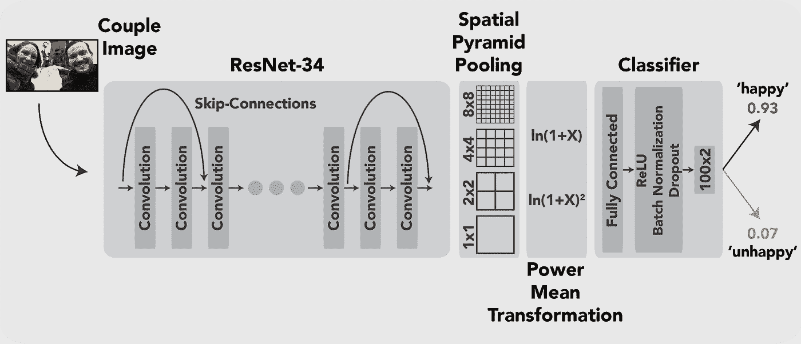
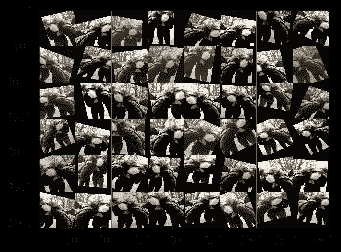
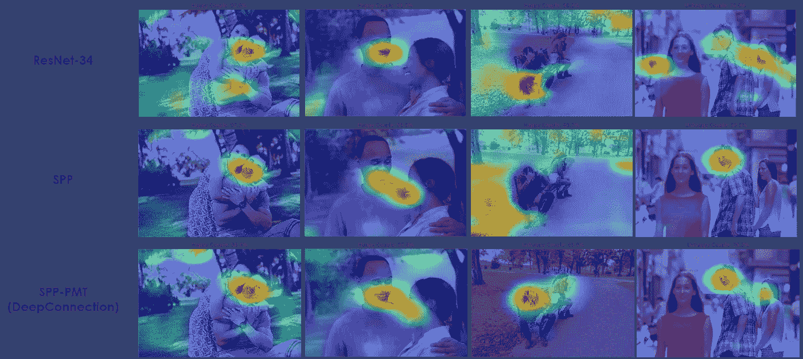
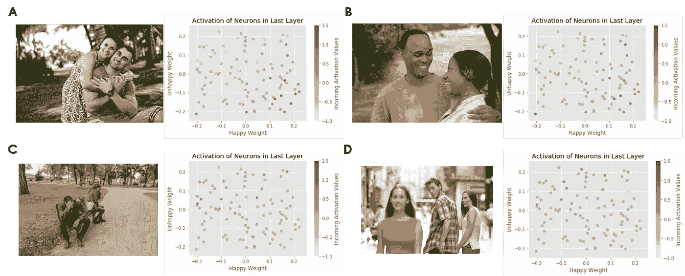

# 使用深度学习来分类具有深度连接的关系状态

> 原文：<https://towardsdatascience.com/using-deep-learning-to-classify-relationship-state-with-deepconnection-227e9124c72?source=collection_archive---------16----------------------->

## 《PyTorch》中浪漫情侣的形象分类



Model scheme of DeepConnection.

如果最近深度学习的爆发有一个根域，那肯定是计算机视觉，即图像和视频数据的分析。因此，当你在研究深度学习时尝试一些计算机视觉技术并不令人惊讶。长话短说，我和我的搭档( [Maximiliane Uhlich](https://eft-coupletherapy.ch/therapist/?uid=13) )决定将这种形式的深度学习应用于浪漫情侣的图像，因为 Maximiliane 是一名关系研究员和情侣治疗师。具体来说，我们想知道我们是否能准确地分辨出任何一对特定的情侣，在图像或视频中描绘的，在他们的关系中是否幸福？事实证明，我们可以！由于分类准确率接近 97%，我们的最终模型(我们称之为 DeepConnection)能够清楚地区分不幸福和幸福的夫妇。你可以在我们的[预印本](https://psyarxiv.com/df25j/)中阅读完整的故事，以下是我们所做的粗略概述。

对于我们的数据集，我们做了一些网上搜集(使用[这个](https://github.com/hardikvasa/google-images-download)方便的 Python 脚本)快乐的&不快乐的夫妇的图像。最终，我们得到了一个大约 1000 张图片的训练集。这并不多，所以我们调用了数据增强和转移学习的力量来拯救我们。数据扩充，图像方向，色调和强度的微小变化，以及许多其他事情，会阻止你的模型学习一些不相关的联系。例如，如果幸福夫妇的图像平均比不幸福夫妇的图像更明亮，我们不希望我们的模型描绘出这种联系。我们利用了(great) [ImgAug](https://github.com/aleju/imgaug) 库，并进行大量的数据扩充，以确保我们的模型是健壮的。基本上，在每批的每个图像上，至少应用一部分增强技术。下面您可以看到一个示例性的数据批次，其中相同的图像有 48 次，具有代表性的数据扩充轮廓。



Exemplary batch with data augmentation.

到目前为止，一切顺利。因为我们在这里讨论图像，所以我们决定使用 ResNet 类型的模型作为 DeepConnection 的基础，并在庞大的 ImageNet 数据集上进行了预训练。在对各种图像进行预训练后，这个模型已经学习了许多有用的形状和形式，并通过这种迁移学习取得了领先。顺便说一下，我们所有的模型都在 PyTorch 中，我们使用了 Google Colab 上的免费 GPU 资源进行训练和推理。该基础模型本身已经是分类的良好开端，但我们决定更进一步，将 ResNet-34 基础模型的最后一个自适应池层替换为空间金字塔池层( [SPP](https://arxiv.org/abs/1406.4729) )。这里，处理后的图像数据被分成不同数量的方块，只有最大值被传递用于进一步分析。这使得该模型能够关注重要的特征，使其对不同的图像尺寸具有鲁棒性，并且不受图像扰动的影响。之后，我们放置了一个幂平均变换( [PMT](https://www.sciencedirect.com/science/article/pii/S0031320318304503) )层，用几个数学函数来变换数据，以引入非线性，并允许 DeepConnection 从数据中捕捉更复杂的关系。这两项增加都提高了我们的分类准确性，我们最终在单独的验证集上获得了大约 97%的准确率。您可以在下面查看 SPP / PMT 和后续分类层的代码。

```
class SPP(nn.Module):
  def __init__(self):
    super(SPP, self).__init__()

    ## features incoming from ResNet-34 (after SPP/PMT)
    self.lin1 = nn.Linear(2*43520, 100)

    self.relu = nn.ReLU()
    self.bn1 = nn.BatchNorm1d(100)
    self.dp1 = nn.Dropout(0.5)
    self.lin2 = nn.Linear(100, 2)

  def forward(self, x):
    # SPP
    x = spatial_pyramid_pool(x, x.shape[0], [x.shape[2], x.shape[3]], [8, 4, 2, 1])

    # PMT
    x_1 = torch.sign(x)*torch.log(1 + abs(x))
    x_2 = torch.sign(x)*(torch.log(1 + abs(x)))**2
    x = torch.cat((x_1, x_2), dim = 1)

    # fully connected classification part
    x = self.lin1(x)
    x = self.bn1(self.relu(x))

    #1
    x1 = self.lin2(self.dp1(x))
    #2
    x2 = self.lin2(self.dp1(x))
    #3
    x3 = self.lin2(self.dp1(x))
    #4
    x4 = self.lin2(self.dp1(x))
    #5
    x5 = self.lin2(self.dp1(x))
    #6
    x6 = self.lin2(self.dp1(x))
    #7
    x7 = self.lin2(self.dp1(x))
    #8
    x8 = self.lin2(self.dp1(x))

    x = torch.mean(torch.stack([x1, x2, x3, x4, x5, x6, x7, x8]), dim = 0)

    return x
```

如果你有敏锐的眼睛，你可能已经注意到了最终分类层上的八个变体。看似浪费的计算实际上是相反的。这个概念最近被提出来作为[多样本丢失](https://arxiv.org/abs/1905.09788)，并且在训练期间极大地加速了收敛。它基本上是防止模型学习虚假关系(过度拟合)和试图不丢弃来自漏失掩码的信息之间的折衷。

我们在项目中做了一些其他的调整，最好在 [GitHub](https://github.com/Bribak/DeepConnection) 上查看预印本或相关代码以获取更多信息。简单地提几个:我们用混合精度训练模型(使用 [Apex](https://github.com/NVIDIA/apex) 库)来大大降低内存使用，使用早期停止来防止过度拟合，并根据余弦函数学习速率退火。

在达到令人满意的分类精度(相应地具有较高的召回率和精确度)后，我们想知道我们是否可以从 DeepConnection 执行的分类中学习一些东西。因此，我们从事模型解释，并使用一种称为梯度加权类激活映射的技术( [Grad-CAM](https://arxiv.org/abs/1610.02391) )。基本上，Grad-CAM 采用最终卷积层的输入梯度来确定显著的图像区域，这些区域可以被可视化为原始图像之上的上采样热图。如果你想看看那是什么样子，看看下面的图，然后是 Grad-CAM 代码。



Grad-CAM for all three models, with saliency heatmaps for representative images. Model prediction and confidence are displayed on top of the images.

我们在论文中进一步讨论了这一点，并将其嵌入到现有的心理学研究中，但 DeepConnection 似乎主要集中在面部区域。从研究的角度来看，这很有意义，因为交流和情绪主要通过面部表情来传达。我们还想看看，除了 Grad-CAM 获得的视觉感之外，我们是否可以通过模型解释获得实际特征。为此，我们创建了激活状态图来可视化最终分类层的哪些神经元被任何给定的图像激活。



State-of-activation plot of DeepConnection for representative images. For every neuron in the last layer, its happy and unhappy weights are colored according to the incoming activation. Activation in the bottom right corner are strongly indicative for happy and the top left corner is most relevant for unhappy couples.

与其他模型相比，DeepConnection 还发现了具体的不快乐特征，并且不仅仅使用不快乐特征的缺失作为不快乐的分类。但是需要进一步的研究来将这些特征映射到人类可以理解的方面。我们还在之前模型没有看到的夫妇的视频帧上尝试了 DeepConnection，效果相当好。

总的来说，模型的稳健性是它的一大优势。精确分类适用于同性恋夫妇、有色人种夫妇、图像中有其他人的夫妇、面部不完全可见的夫妇等等。对于图像中出现其他人的情况，DeepConnection 甚至可以识别这些人是否快乐，但仍然将预测集中在这对夫妇本身。

除了进一步的模型解释，下一步将是使用更大的训练数据集，该数据集有可能训练更复杂的模型。将 DeepConnection 用作夫妻治疗师的助手也很有趣，在治疗期间或之后，可以获得关于(拍摄的)夫妻当前关系状态的实时反馈，以供分析。此外，我鼓励你和你的伴侣一起输入你自己的形象，看看 DeepConnection 对你们的关系有什么看法！我很高兴地报告，这至少祝福了我们的关系，所以我想这是一个好的开始！

让我知道你是否有任何想法，如何推进这项工作，或者你希望看到什么添加/改进！

如果你感兴趣的话，这里有[预印本](https://psyarxiv.com/df25j/)和 [GitHub repo](https://github.com/Bribak/DeepConnection) 的链接。