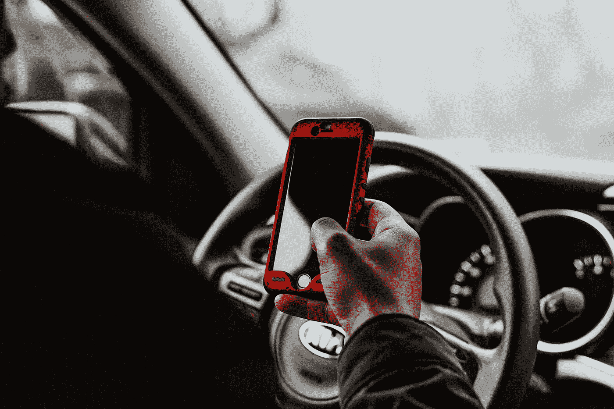
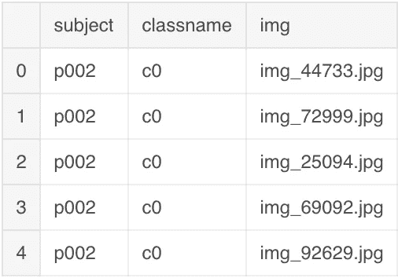
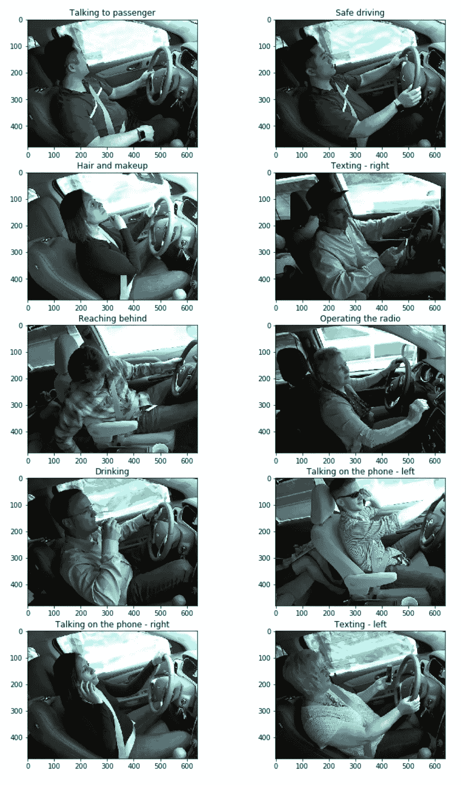
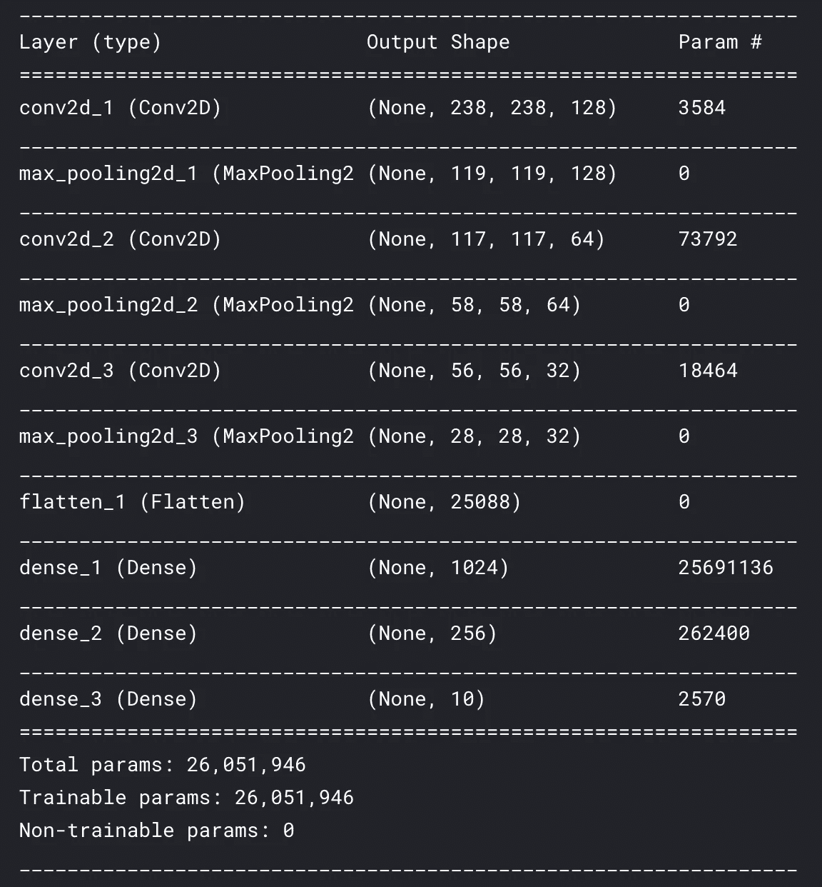
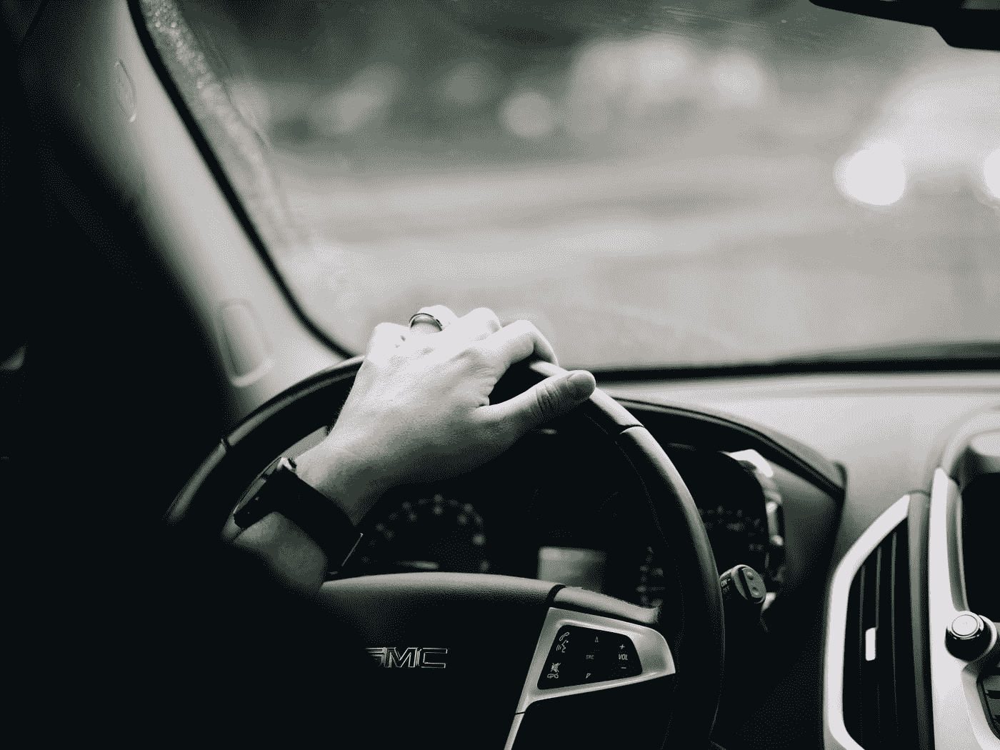

# 使用深度学习通过确保驾驶员的注意力来拯救生命

> 原文：<https://towardsdatascience.com/using-deep-learning-to-save-lives-by-ensuring-drivers-attention-e9ab39c03d07?source=collection_archive---------18----------------------->

## 现实生活中的卷积神经网络

Photo by [melissa mjoen](https://unsplash.com/@melissamj?utm_source=medium&utm_medium=referral) on [Unsplash](https://unsplash.com?utm_source=medium&utm_medium=referral)

> 仅在 2017 年，就有 3166 人在涉及分心司机的机动车事故中丧生。— [NHTSA](https://www.nhtsa.gov/risky-driving/distracted-driving)

驾驶机动车本身就是一项复杂的任务。然而，当我们把注意力分散加入其中时，它会变得更加困难，因为道路上的司机缺乏注意力。那么，如果我们能识别司机何时分心呢？这样做将有助于我们发现它，并提醒司机，以防止事故发生！

在这篇文章中，我将使用**卷积神经网络**来解决检测分心驾驶员的问题，甚至将他们除安全驾驶之外所做的活动分类。这里有一个 [Kaggle 内核](https://www.kaggle.com/bhanotkaran22/cnn-to-detect-driver-actions?scriptVersionId=14365759)的链接。

# 导入库

我使用 Keras 和 Tensorflow 作为后端来创建卷积神经网络，因此，我导入了必要的库。

`os.environ[‘KERAS_BACKEND’] = ‘tensorflow’`将`keras`后端设置为`tensorflow`，`os.environ[‘TF_CPP_MIN_LOG_LEVEL’] = ‘3’`隐藏所有 tensorflow 日志。

# 导入数据集

csv 文件`driver_imgs_list.csv`包含所有训练图像的列表，以及对人和类名的引用。类名是对图像中的人正在进行的活动类型的引用。

Top 5 rows of the dataframe

# 图像概述

我决定通过显示每个类的图像来查看图像数据集。由于标签`classname`不是描述性的，我决定用一张地图给每张图片添加标题。

`train`文件夹有 10 个文件夹，每个文件夹对应一类图像。我遍历所有文件夹，并从每个文件夹中绘制第一幅图像。使用`plt.subplot(5, 2, image_count)`，我定义将有 10 个图像组成 5 行和 2 列。image_count 定义了从 1 到 10 范围内的图像计数。

Drivers doing different things

# 构建模型

我将创建一个具有 3 个`Conv2D`层(每个层后面是`MaxPooling2D`层)、1 个`Flatten`层和 3 个`Dense`层的卷积神经网络。在进行了几次试验并从其他内核中获得线索后，我最终确定了神经元。因为这是一个多类问题，我有最后一个密集层，有 10 个神经元，损失是使用`categorical_crossentropy`识别的。

Classifier model

# 创建培训数据

使用`ImageDataGenerator`，我将增加我可以训练模型的图像数量。此外，我将使用`flow_from_directory`方法从相应的文件夹中读取对应于每个类的图像，并创建 80%和 20%的训练和验证分割。请注意，我通过将所有值除以 255 来重新调整每张图像。

现在，我将根据这些数据训练模型，并获得验证准确性和损失。

# 训练模型

用`fit_generator`，我来训练模型。

> 该模型达到了 97%的验证准确率。

# 结论

Photo by [Maxwell Ridgeway](https://unsplash.com/@maxwellridgeway?utm_source=medium&utm_medium=referral) on [Unsplash](https://unsplash.com?utm_source=medium&utm_medium=referral)

使用**卷积神经网络**，我能够以 97% 的准确率识别驾驶员何时分心驾驶。下一步，我们可以通过增加 CNN 的复杂性和层数来进一步改进模型，并实现其对最终输出的影响。