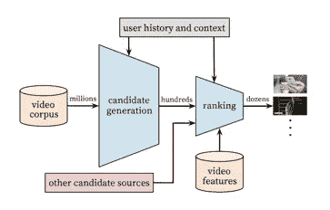

# 使用深度神经网络进行 YouTube 推荐

> 原文：<https://towardsdatascience.com/using-deep-neural-networks-to-make-youtube-recommendations-dfc0a1a13d1e?source=collection_archive---------7----------------------->

*这是 Paul Covington、Jay Adams 和 Emre Sargin 在 2016 年发表的论文《用于 YouTube 推荐的深度神经网络》的概述。*

YouTube 拥有业内最大、最先进的推荐系统之一。作为世界领先的网站之一，为了让客户满意，它必须推荐相关视频。YouTube 与其他利用推荐系统的服务(如网飞、Hulu、Spotify)略有不同，因为用户每秒钟向该平台上传数千小时的视频。YouTube 的语料库在不断变化，他们无法控制添加的内容。这就需要一个强大的模型，能够处理不断传入的数据，并实时输出质量建议。下面这个模型就是作者对这种需求的回应。

# 系统概况

The Recommendation System’s Architecture

他们设计的推荐系统有两个阶段。第一个是用于候选生成的神经网络，而后者用于排序。 ***候选生成*** 网络事件取自用户 YouTube 历史。这只能使用协同过滤来提供广泛的个性化。然后，通过标识符(如观看的视频数量、人口统计信息和搜索查询标记)对这些用户进行比较。 ***排名网*** 的操作稍有不同。它使用“描述视频和用户的丰富特征集”为每个视频分配一个分数。这种两层系统允许系统处理数百万个视频，但也可以向个人用户提供有意义的内容。

# 阶段 1:候选人生成

**作为分类的建议**

作者将推荐系统称为“极端多类分类，其中预测问题变成了对特定视频的准确分类”。在这种情况下，嵌入数据是收集的关于视频的稀疏数据:(即用户、交互、观看时间等……)深度神经网络能够处理这些数据，并使用它来区分视频和用户。为了训练具有数百万个类别(视频)的模型，作者使用数据样本，然后使用权重来校正采样。使用这种技术，他们能够以更少的计算能力获得相似的精度。

## 模型架构

该模型的灵感来自于一个连续单词包语言模型的架构。神经网络被输入学习到的关于每个视频的高维嵌入，这些视频被组织在固定的词汇表中。

为了跟踪用户观看数据，数据被转换成不同的视频 id 数组，这些数组通过前面提到的视频的嵌入被映射成密集向量表示。然后，使用梯度下降反向传播来学习嵌入信息以及其他模型参数。

**管理新数据**

在这个具体的例子中，神经网络有几个优点。使用神经网络作为矩阵分解的一般化允许将任意数据(连续的和分类的)容易地添加到模型中，这是该模型由于不断变化的语料库而需要的。

可以通过将搜索查询历史标记为一元词和二元词(指定短语中有多少单词的类别)来使用它。然后对这些见解进行平均，并创建一个相当密集的搜索历史，然后该模型可以使用它来帮助预测用户未来可能喜欢的内容。用户的人口统计特征，这在预测没有观看任何视频的用户时是有帮助的，被改变成二元选项[0，1]。

**新鲜度:**

作为一个平台，最近的相关内容对 YouTube 至关重要，它有助于保持用户参与和更新，然而，模型通常偏向于根据过去的数据进行预测。为了纠正这一点，他们将训练数据的年龄设置为一个特征，并将其设置为非常接近零(基本上使所有数据都来自同一个时间点)。这有助于模型在训练的最新部分进行优化和预测——在数据末尾进行预测意味着它可能会预测下一个视频，因为它最接近当前，这些视频也仍然与用户相关。

**语境**:

用户以各种方式使用 YouTube。他们可以直接在网站上观看，也可以观看嵌入在网站或其他社交媒体网站上的视频。该模型使用所有这些信息来收集关于用户的数据，并通过其网络传播这些数据。为了提高性能和避免过度拟合，需要从模型中限制几个与上下文和信息有关的关键见解。其中一个见解是为每个用户创建固定数量的输入，因为如果有无限的输入，那么高容量用户将主导损失函数，并且模型将过度拟合他们的倾向。

*这个怎么重要*？

YouTube 上有各种类型的视频和流派。一些节目有时间顺序，这意味着它们将按顺序观看，而音乐视频通常以该艺术家最受欢迎的歌曲开始，然后用户转向该艺术家较小的利基作品。如果这些推荐受到高流量用户的影响，这可能会中断低流量用户查看其订阅源中的视频的方式。他们可能会错过利基市场或可能不会看到最受欢迎的视频基于行动的较高比率的用户在该空间。

反过来，通过预测用户将要观看的下一个视频，而不是使用历史数据来随机选择使用维持数据的视频，可以获得更多的成功。这种方法有其缺陷，因为它会将未来的数据泄露给模型，从而导致过度拟合。

**特性实验**:

向试图解决如此重大问题的模型添加质量特性有助于极大地提高准确性和可伸缩性。超过 100 万个视频和 100 万个搜索令牌以小数形式嵌入包中，最多可包含 50 个最近观看的手表和 50 个最近搜索。关键问题是使用这些特性来帮助创建每个用户的每个动作的时间标记。

# 第二阶段:排名

推荐系统的第二部分涉及视频排名。为了推荐优质内容，YouTube 需要一种方法来确定用户正在观看和欣赏哪些内容。

**特色工程**

作者观察到，在预测推荐时，之前与一个或多个类似视频的互动非常重要。这很直观，因为如果观众喜欢特定类型的内容，他们可能会观看该细分市场中的许多视频。他们还注意到，来自特定频道的视频对于决定下一步推荐什么也非常重要。另一方面，如果用户被推荐了视频，但忽略了它们——那么下次页面刷新时，视频将会来回移动并改变。作为 YouTube 的用户，我已经经历过很多次了。

其他功能是以典型的机器学习方式设计的。分类变量是一次性编码的，而连续特征是标准化的(神经网络在标准化数据下表现更好),并通过模型学习。在最初的分离之后，模型开始变得复杂。特征被分成单价和多价组，这意味着它们分别贡献单个值或多个值。特征也被分类为印象和查询。印象每秒计算一次，而查询特征每个请求只计算一次。

**建模预期观看时间**

能吸引观众注意力的视频通常被认为质量较高。为了推荐高质量的视频，需要对模型进行训练，以便它可以预测观众将观看视频的时间。通过预测视频将被观看多长时间，该模型可以对视频进行排名。在它对视频进行排名后，它将能够决定是否推荐该视频。

为了预测观看时间，作者使用了加权逻辑回归。它被加权的原因是只有正面的视频被赋予权重。积极的视频是用户实际上已经点击了视频，这有助于算法只学习用户与之交互的视频。

# 结论

作者的“深度协同过滤模型能够有效地吸收许多信号，并模拟它们与深度层的交互”，优于 YouTube 之前使用的任何模型。

关键见解:

*   使用训练样本的年龄作为输入特征消除了对过去的固有偏见，并有助于模型表示流行视频的时间相关行为。
*   排名是一种更经典的机器学习方法，但深度学习模型优于经典的线性预测模型。
*   通过用正面例子的观察时间和负面例子的单位加权训练例子来修改逻辑回归，允许更准确地学习赔率。

YouTube、Spotify 和网飞是我生活中的主要玩家。我每天都使用这些服务进行娱乐或教育。我很少在 YouTube 上手动搜索视频，非常依赖他们的推荐系统。学习一个看似简单的概念背后复杂的数学过程让我大开眼界。数据科学每天都在影响着人们的生活，我迫不及待地想要开始。

链接到研究论文: