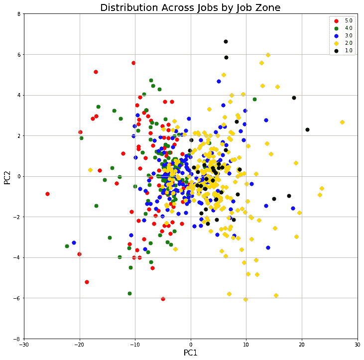
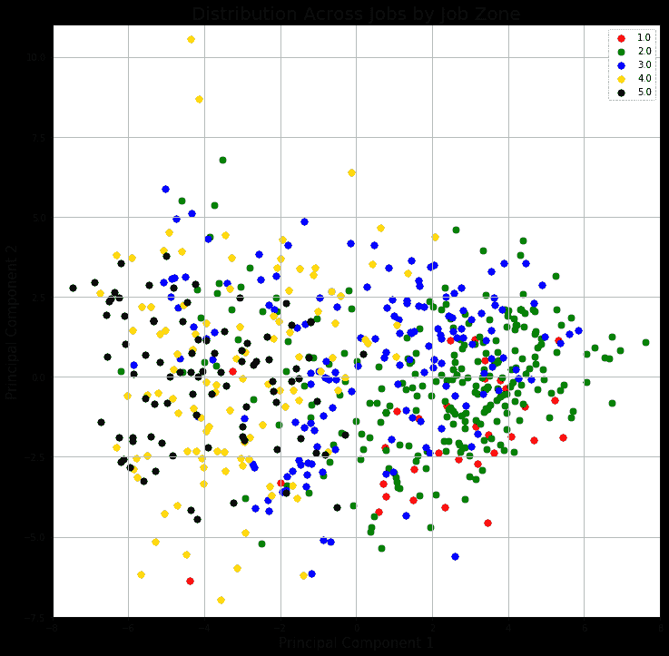
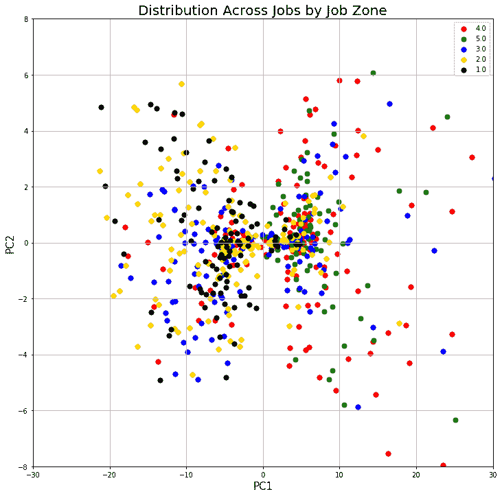

# 使用降维来可视化工作极化

> 原文：<https://towardsdatascience.com/using-dimensionality-reduction-to-visualize-job-polarization-cf2a9ceac90e?source=collection_archive---------20----------------------->



PC1 and PC2 extracted from the MDS Embedding using 2003 data. Each point represents a job, and each color represents a job zone. The smaller the job zone, the less education requirement/experience it requires.

在本帖中，我们使用来自美国政府支持的网站 [O*NET](https://www.onetcenter.org/overview.html) 的数据，说明了如何使用包括主成分分析(PCA)和多维标度(MDS)在内的降维技术来可视化自 2003 年以来工作活动的两极分化，该网站提供了一组描述工作和员工特征的丰富变量。

让我们简要回顾一下 O*NET 的数据结构，以理解为什么使用降维技术会有用。数据集是围绕每项工作所需的知识、技能、能力和工作活动的不同组合来组织的。它包含了覆盖整个美国经济的近 1000 个职业的数百个标准化和特定职业变量。

为了进行这一分析，我们使用了 2003 年 11 月和 2018 年 8 月的[工作活动文件](https://www.onetcenter.org/db_releases.html)，来比较在这 15 年间不同工作岗位上的活动是如何变化的。有 41 种不同的工作活动，如“处理和移动对象”和“解决冲突和与他人谈判”。在该文件中，为每个职业-活动-规模组合分配一个数据值。一般来说，数据值越高，活动对工作越重要。例如，在 2018 年的文件中(如下面的截图所示)，使用“重要性”衡量标准，职务“首席执行官”执行活动“获取信息”的数据值为 4.72。


# 主成分分析

为了理解在不同工作中执行的工作活动是如何变化的，人们可以随着时间的推移对每项工作分别跟踪这 41 项活动中的每一项，但这可能会很快失控。PCA 可以通过减少我们需要跟踪的活动数量来帮助解决这个问题。具体地，它通过将数据变换到新的坐标系来实现，使得第一坐标(即，第一主分量)表示具有最大数据方差的投影，第二坐标上的第二大方差，等等。

下面的代码使用 scikit-learn 库在 python 中实现了 PCA。它首先标准化特征比例:

```
from sklearn.decomposition import PCA
from sklearn.preprocessing import StandardScaler#df is the dataframe that contains the value of each of the 41 activities for all jobsx = df.loc[:, features].values
x = StandardScaler().fit_transform(x)pca = PCA(n_components=num_dim)
#num_dim is the number of dimension we want to examine. We set num_dim to be 2.
principalComponents = pca.fit_transform(x)
```

下图描绘了两个时期的主要组成部分。为了说明需要不同教育水平的工作因其所从事的工作活动而有所不同，我们通过工作所属的[工作区](https://www.onetonline.org/help/online/zones)对每个工作(由散点图上的点表示)进行了颜色编码。教育是确定工作领域的标准之一，其他标准包括经验和培训。工作区域越高，工作需要的准备就越多。属于工作区 1 的职业有时需要高中文凭，而工作区 5 的职业通常需要研究生学位。

如果两极分化日益加剧，高技能群体和低技能群体从事的活动将会更加不同。这正是我们在比较这两个时期的地块时所看到的。2018 年，相似颜色的工作更紧密地聚集在一起，这表明属于不同区域的工作之间的工作活动几乎没有重叠。实际计算显示，需要较少准备的工作(1 区和 2 区的工作)在 2018 年的 PC1 值比 2003 年大。2003 年，第 4 区(黄色部分)的工作要求相对更高的教育水平，更分散在 x 轴上。相反，在 2018 年，他们大多位于 0 的左侧，这意味着他们更多地聚集在一起。



PC1 and PC2 using PCA, 2003 on the left, 2018 on the right

为了更严格地检验这种模式，我们可以计算不同工作区的工作之间的距离。我们首先确定工作区聚类的质心，然后计算工作区质心之间的距离。2003 年，工作区 1 和 5 之间的距离为 5.7，2018 年增加到 6.7。工作区 1 和 4 之间以及工作区 2 和 5 之间距离也有类似的增加。

**解读主成分**

PCs 本身没有任何实质意义，因此为了将主成分与工作活动联系起来，我们可以检查 PCs 和工作活动本身之间的标准皮尔逊相关性。对于 2003 年，PC1 与“检查设备、结构或材料”以及其他体力劳动密集型活动的相关性最强。另一方面，PC2 与“处理信息”和“获取信息”等认知活动的相关性最强。

请注意，虽然与 PC1 相关性最高的前 3 项活动在 2003 年和 2018 年都是相同的，但 PC2 却不是这样。对于 PC2 来说，“决策和解决问题”在 2018 年出现，但在 2003 年没有，而“获取信息”在 2003 年出现，但在 2018 年没有。因此，尽管这两个维度捕捉了两个时期类似性质的活动，但它们并不完全相同。

PC1 使用 PCA:

使用 PCA 的 PC2:

# **多维标度**

另一个让研究人员可以看到不同工作岗位之间日益增长的两极分化的方法是 MDS。MDS 试图做的是保持工作之间的成对距离，同时将矩阵投影到更低的维度。MDS 模型的输入是作业之间的距离矩阵，而不是 PCA 中每个作业的数据值。因此，要将职务活动数据转换为适合 MDS 的距离矩阵，我们首先将数据值矩阵乘以它本身。下面的代码说明了这一步，以及距离矩阵在嵌入中的拟合:

```
from sklearn.manifold import MDS### multiplying the x matrix with itself
t = np.dot(x, np.transpose(x))
mds = MDS(n_components= n_dimension, max_iter=3000, eps=1e-9, random_state=12345,
dissimilarity=”precomputed”, n_jobs=1)
pos = mds.fit(t).embedding_
```

之后，我们可以像以前一样从 MDS 嵌入空间中数据集的位置提取前两个主分量:

```
# select the top 2 dimensions of data
clf = PCA(n_components=2)
pos = clf.fit_transform(pos)
```

与 PCA 分析类似，2018 年的第一个主成分捕捉了“搬运和移动物体”等更为体力劳动密集型的活动。然而，在 2003 年，第一个主成分从以前的 PCA 分析中捕捉到不同类型的活动。与体力劳动密集型活动不同，PC1 与更多的管理活动最相关，例如“制定目标和策略”以及“向他人提供咨询和建议”。这种差异揭示了使用 PCA 时不明显的另一个方面。

**PC1 使用 MDS:**

**使用 MDS 的 PC2:**

下图显示了 2003 年(左)和 2018 年(右)MDS 植入的主要组成部分。作为第一印象，不同颜色的工作在 2003 年比 2018 年更加相互混合，这意味着沿着两个主要维度，属于不同工作区的工作之间的活动重叠更多。此外，属于作业区 4 或 5 的作业在 2018 年都没有 PC1 < 0(所有红绿点都位于 PC1 中 0 的左侧)。这两种模式表明，随着时间的推移，每项工作所执行的活动变得更加分散。



PC1 and PC2 using MDS, 2003 on the left, 2018 on the right

总之，这两种方法都说明了需要不同准备程度的工作所执行的工作活动的日益两极分化，但它们也可以揭示数据微妙之处的差异。