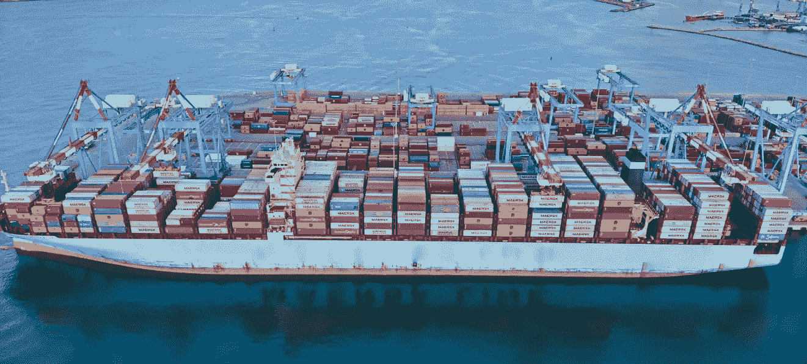
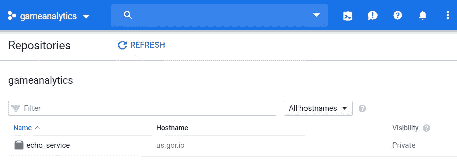
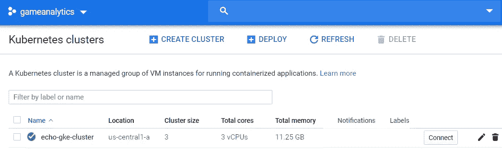
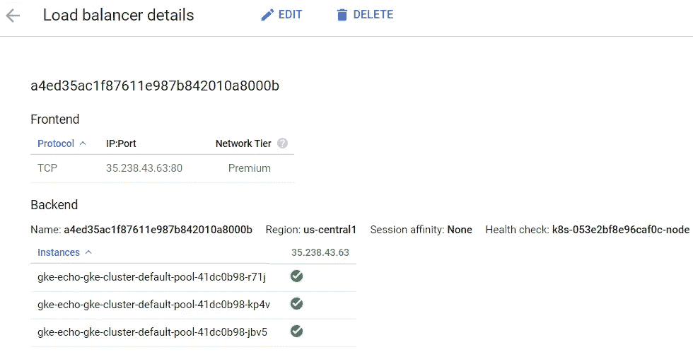

# 使用 Docker & Kubernetes 托管机器学习模型

> 原文：<https://towardsdatascience.com/using-docker-kubernetes-to-host-machine-learning-models-780a501fda49?source=collection_archive---------5----------------------->



Source: [https://www.pexels.com/photo/baltic-sea-blue-sea-cargo-ship-container-port-2945314/](https://www.pexels.com/photo/baltic-sea-blue-sea-cargo-ship-container-port-2945314/)

## 第 4 章“生产中的数据科学”节选

*Docker 是在云中部署 ML 模型的绝佳工具。如果你想在云中建立一个生产级的部署，AWS 和 GCP 有很多选择。在我正在编写的书的第 4 章中，我将重点放在为模型服务的 ECS 上，但也将在最后探索 Google Kubernetes 引擎。这篇文章省略了关于部署容器的 AWS 部分，但是包括了本章的其余部分。*

[](https://leanpub.com/ProductionDataScience) [## 生产中的数据科学

### 从初创公司到数万亿美元的公司，数据科学在帮助组织最大化…

leanpub.com](https://leanpub.com/ProductionDataScience) 

# 第 4 章—可重现模型的容器

部署数据科学模型时，能够重现用于培训和服务的相同环境非常重要。在第 2 章中，我们在两个环境中使用了相同的机器，在第 3 章中，我们使用了一个`requirements.txt`文件来确保用于模型服务的无服务器生态系统与我们的开发环境相匹配。Docker 之类的容器系统提供了一种构建可复制环境的工具，并且它们比虚拟机之类的替代方法要轻得多。

容器的概念是，它是一个隔离的环境，您可以在其中设置执行任务所需的依赖关系。任务可以是执行 ETL 工作、服务 ML 模型、建立 API 或者托管交互式 web 应用程序。容器框架的目标是提供轻量级实例之间的隔离。使用容器框架，您可以指定代码需要的依赖项，并让框架处理管理不同执行环境的跑腿工作。Docker 是容器的事实上的标准，有大量的工具建立在这个平台上。

弹性容器环境(如弹性容器服务器(ECS ))提供了与无服务器功能类似的功能，在这种环境中，您希望从托管数据科学模型中抽象出服务器的概念。关键的区别在于，无服务器生态系统受限于特定的运行时，通常具有内存限制，这使得使用深度学习框架具有挑战性，并且是云特定的。使用 ECS，您负责设置用于服务模型的实例类型，您可以使用服务模型所需的任何语言，并且可以根据需要占用尽可能多的内存。ECS 作为一个专有的 AWS 工具仍然有问题，但是更新的选项，比如 EKS，是建立在开源的可移植的 Kubernetes 之上的。

以下是我见过的一些关于容器的数据科学用例:

*   **可重复的分析:**容器提供了一个打包分析的好方法，这样其他团队成员可以在几个月或几年后重新运行你的工作。
*   web 应用程序:在第二章中，我们用 Dash 构建一个交互式 Web 应用程序。容器提供了一种很好的方式来抽象出部署应用程序的托管问题。
*   **模型部署:**如果您想要将您的模型公开为一个端点，容器提供了一种将模型应用程序代码从模型服务基础设施中分离出来的好方法。

本章的重点将是最后一个用例。我们将从第 2 章中取出 web 端点，并将应用程序包装在 Docker 容器中。我们将从在 EC2 实例上本地运行容器开始，然后探索使用 ECS 来创建模型的可伸缩、负载平衡和容错的部署。然后我们将展示如何使用 Kubernetes 在 GCP 上实现类似的结果。

既然我们正在探索可扩展的计算环境，那么在使用 ECS 和 GKE 时关注云成本就非常重要。对于 AWS 来说，关注提供了多少 EC2 实例是很有用的，在 GCP 上，计费工具提供了对成本的良好跟踪。关于编排的部分是专门针对 AWS 的，并且使用了一种不能移植到不同云环境的方法。如果 AWS 不适合您的模型部署，可以直接跳到 Kubernetes 一节。

# 4.1 码头工人

Docker 和其他平台即服务工具提供了一个称为容器的虚拟化概念。容器运行在主机操作系统之上，但是为在容器内运行的代码提供了一个标准化的环境。这种虚拟化方法的关键目标之一是，您可以为目标环境编写代码，任何运行 Docker 的系统都可以运行您的容器。

容器是虚拟机的轻量级替代，虚拟机提供类似的功能。关键的区别在于，容器的运行速度更快，同时提供了与虚拟机相同的隔离级别。另一个好处是容器可以重用其他容器中的层，这使得构建和共享容器变得更快。当您需要在一台机器上运行 Python 运行时或库的冲突版本时，容器是一个很好的解决方案。

使用 docker，您可以创建一个名为 *Dockerfile* 的文件，用于定义容器的依赖关系。构建 Docker 文件的结果是一个 *Docker 映像*，它打包了运行一个应用程序所需的所有运行时、库和代码。 *Docker 容器*是运行应用程序的实例化映像。Docker 的一个有用特性是新图像可以建立在现有图像的基础上。对于我们的模型部署，我们将扩展`ubuntu:latest`图像。

本节将展示如何在 EC2 实例上设置 Docker，为构建第 2 章中 echo 服务的映像创建 Docker 文件，使用 Docker 构建映像，并运行容器。要在 EC2 实例上安装 Docker，可以使用`amazon-linux-extras`工具来简化这个过程。下面的命令将安装 Docker，在 EC2 实例上启动服务，并列出正在运行的容器，这将返回一个空列表。

```
sudo yum install -y python3-pip python3 python3-setuptools
sudo yum update -y
sudo amazon-linux-extras install docker
sudo service docker start
sudo docker ps
```

我们将部署的应用程序是第 2 章中的 echo 服务。这个服务是一个 Flask 应用程序，它解析 GET 或 POST 中的`msg`属性，并返回一个 JSON 有效负载，回显所提供的消息。与之前的应用程序的唯一区别是 Flask 应用程序现在运行在端口 80 上，如下面的`echo.py`片段中的最后一行所示。

```
*# load Flask* 
import flask
app = **flask.Flask**(__name__)*# define a predict function as an endpoint* 
@**app.route**("/predict", methods=["GET","POST"])
def **predict**():
    data = {"success": False} *# get the request parameters*
    params = flask.request.json
    **if** (params == None):
        params = flask.request.args *# if parameters are found, echo the msg parameter* 
    **if** (params != None):
        data["response"] = **params.get**("msg")
        data["success"] = True *# return a response in json format* 
    return **flask.jsonify**(data)

*# start the flask app, allow remote connections*
**app.run**(host='0.0.0.0', port = 80)
```

现在我们已经安装了 Docker 和一个我们想要容器化的应用程序，我们需要编写一个 Docker 文件来描述如何构建一个映像。执行该任务的 docker 文件如下面的代码片段所示。第一步是使用`FROM`命令确定要使用的基本图像。`ubuntu`映像提供了一个支持`apt-get`命令的 linux 环境。`MAINTAINER`命令添加了与图像相关的元数据信息，添加了图像维护者的名字。接下来，使用`RUN`命令安装 python，设置一个符号链接，并安装 Flask。对于包含许多 Python 库的容器，也可以使用 requirements.txt 文件。`Copy`命令将我们的脚本插入到映像中，并将文件放在根目录中。最后一个命令指定了执行应用程序所要运行的参数。

```
FROM ubuntu:latest
MAINTAINER Ben Weber RUN apt-get update \  
  && apt-get install -y python3-pip python3-dev \  
  && cd /usr/local/bin \  
  && ln -s /usr/bin/python3 python \  
  && pip3 install flask  

COPY echo.py echo.py ENTRYPOINT ["python3","echo.py"]
```

编写 docker 文件后，可以使用 docker 提供的`build`命令来创建图像。下面代码片段中的第一个命令展示了如何使用文件`./Dockerfile`构建一个标记为`echo_service`的图像。第二个命令显示实例上可用的 Docker 图像列表。输出将显示我们用作图像基础的 ubuntu 图像，以及我们新创建的图像。

```
sudo docker image build -t "echo_service" .
sudo docker images
```

要将图像作为容器运行，我们可以使用下面代码片段中显示的 run 命令。`-d`标志指定容器应该作为守护进程运行，即使关闭终端，守护进程也将继续运行。`-p`标志用于将主机上的端口映射到容器用于通信的端口。如果没有这个设置，我们的容器将无法接收外部连接。`ps`命令显示了正在运行的容器列表，现在应该包括 echo 服务了。

```
sudo docker run -d -p 80:80 echo_service
sudo docker ps
```

为了测试容器，我们可以使用与之前相同的过程，在 web 浏览器中使用 EC2 实例的外部 IP，并将一个`msg`参数传递给`/predict`端点。因为我们设置了从主机端口 80 到容器端口 80 的端口映射，所以我们可以通过 open web 直接调用容器。来自 echo 服务容器的调用和结果示例如下所示。

```
http:**//**34.237.242.46/predict?msg=Hi_from_docker{"response":"Hi_from_docker","success":true}
```

我们现在已经完成了构建 Docker 映像并在 EC2 实例上将该映像作为容器运行的过程。虽然这种方法确实提供了一种在一台机器上隔离不同服务的解决方案，但是它不提供伸缩性和容错性，而这是生产级模型部署的典型要求。

# 4.3 的 Kubernetes

谷歌云平台提供了一项名为谷歌 Kubernetes 引擎(GKE)的服务，用于服务 Docker 容器。Kubernetes 是一个容器编排系统，最初由 Google 开发，现在是开源的。这个平台有各种各样的用例，但是我们将把重点放在使用托管 Kubernetes 托管我们的 echo 服务的特定任务上。

使用 Kubernetes 托管 Docker 容器类似于 ECS，第一步是将您的图像保存到 Docker 注册表中，该注册表可以与编排系统交互。这个注册服务的 GCP 版本被称为容器注册。为了将我们的映像从 AWS 上的 EC2 实例发送到 GCP 容器注册中心，我们将再次使用 docker login 命令。为了让这个过程工作，您需要我们在第 1 章中设置的 GCP 凭证 json 文件。下面的代码片段展示了如何将 json 文件传递给 docker login 命令，标记图像以将其上传到注册表，并将图像推送到容器注册表。

```
cat dsdemo.json | sudo docker login -u _json_key 
                               --password-stdin https:**//**us.gcr.io
sudo docker tag echo_service us.gcr.io/[gcp_account]/echo_service 
sudo docker push us.gcr.io/[gcp_account]/echo_service
```

您需要用完整的 google 帐户 ID 替换这个脚本中的`gcp_acount`参数。执行完这些步骤后，echo 服务映像应该在 GCP 控制台的注册表视图下可见，如图 [4.8](/4-3-kubernetes-on-gcp.html#fig:ch4-reg) 所示。通常，如果您使用 GCP 来服务模型，很可能您将使用 Google Compute instances 而不是 EC2，但是最好练习不同云平台中的组件之间的接口。



图 4.8:GCP 集装箱登记处的回波图像。

与使用 ECS 所需的所有步骤相比，使用 GKE 托管容器的过程得到了简化。我们将首先使用 GCP 控制台在 Kubernetes 上设置一个容器，然后将服务公开给 open web。要部署 echo 服务容器，请从 GCP 控制台执行以下步骤:

1.  搜索并选择“Kubernetes 引擎”
2.  单击“部署容器”
3.  选择“现有容器图像”
4.  选择`echo_service:latest`
5.  将应用程序命名为“echo-kge”
6.  单击“部署”

我们现在已经部署了一个 Kubernetes 集群，并准备好为 echo 服务提供服务。在 GKE 上部署 Kubernetes 集群可能需要几分钟的时间。一旦部署完成，您应该会在集群列表下看到 echo 集群，如图 [4.9](/4-3-kubernetes-on-gcp.html#fig:ch4-kubes) 所示。



图 4.9:通过 Kubernetes 部署的 echo 图像。

要使用该服务，我们需要通过从 GCP 控制台执行以下步骤将集群公开到开放的 web:

1.  从 GKE 菜单中，选择您的集群
2.  点击“工作负载”
3.  选择“echo-gke”工作负载
4.  选择“操作”选项卡，然后选择“公开”
5.  对于服务类型，选择“负载平衡器”

执行完这些步骤后，集群将配置一个可以用来调用服务的外部 IP，如图 [4.10](/4-3-kubernetes-on-gcp.html#fig:ch4-live) 所示。GKE 将根据需要自动进行负载平衡和扩展服务，以匹配工作负载。



图 4.10:部署到开放 web 的 echo 服务。

```
http:**//**35.238.43.63/predict?msg=Hi_from_GKE{"response":"Hi_from_GKE","success":true}
```

上面的代码片段显示了一个使用该服务的示例。我们能够快速获取 Docker 映像，并使用 GKE 将其部署在 Kubernetes 生态系统中。使用 Kubernetes 来托管 Docker 图像是一件好事，因为它是一个可移植的解决方案，可以跨多个云环境工作，并且被许多开源项目所采用。

# 4.4 结论

使用容器来确保您的分析和模型在不同的环境中是可重复的是非常有用的。虽然容器有助于保持单个机器上的依赖关系干净，但主要的好处是它们使数据科学家能够编写模型端点，而不用担心容器将如何被托管。这种关注点的分离使得与工程团队合作将模型部署到生产中变得更加容易，或者使用本章中显示的方法，数据和应用科学团队也可以拥有模型到生产中的部署。

服务模型的最佳方法取决于您的部署环境和预期的工作负载。通常，在公司工作时，您会受限于特定的云平台，因为您的模型服务可能需要与云中的其他组件进行交互，例如数据库或云存储。在 AWS 中，托管容器有多种选择，而 GCP 在 GKE 上作为单一解决方案。要问的主要问题是，使用无服务器功能技术还是弹性容器技术来为您的模型提供服务更具成本效益。正确答案将取决于您需要处理的流量、最终用户可以容忍的延迟量以及您需要托管的模型的复杂性。容器化的解决方案非常适合服务于复杂的模型，并确保您可以满足延迟要求，但与无服务器功能相比，可能需要更多的 DevOps 开销。

本·韦伯是 Zynga 的一名杰出的数据科学家。我们正在[招聘](https://www.zynga.com/job-listing-category/data-analytics-user-research/)！