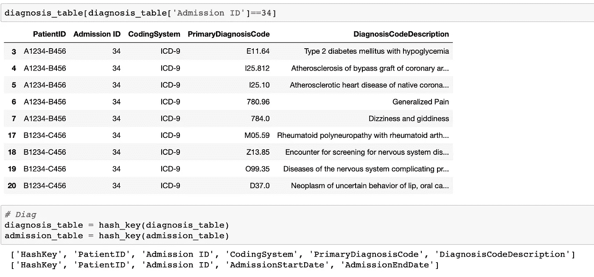
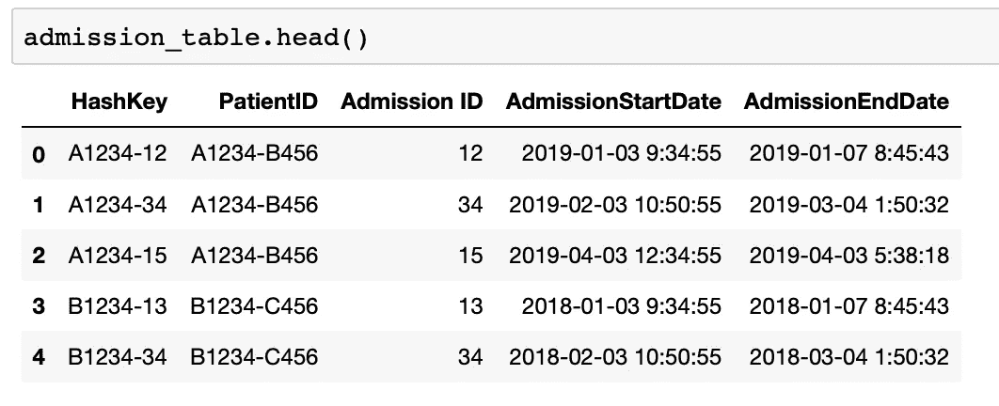
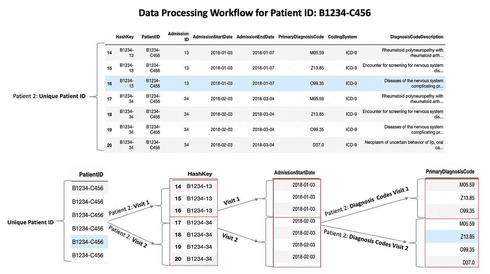
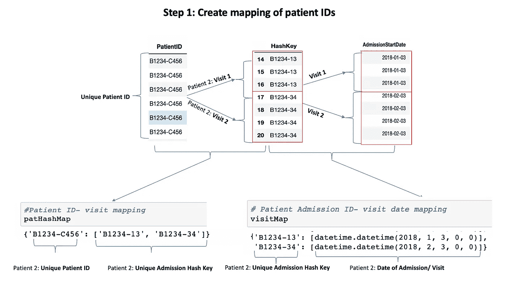
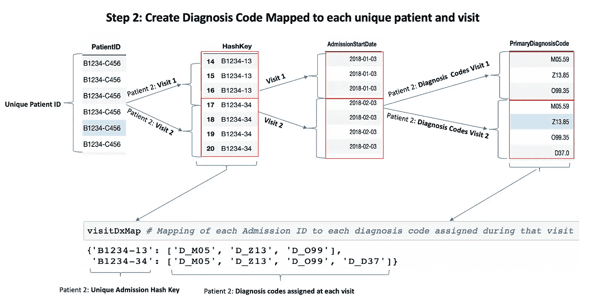
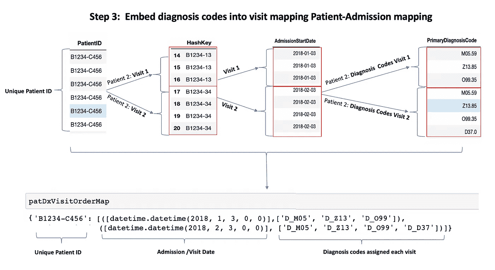
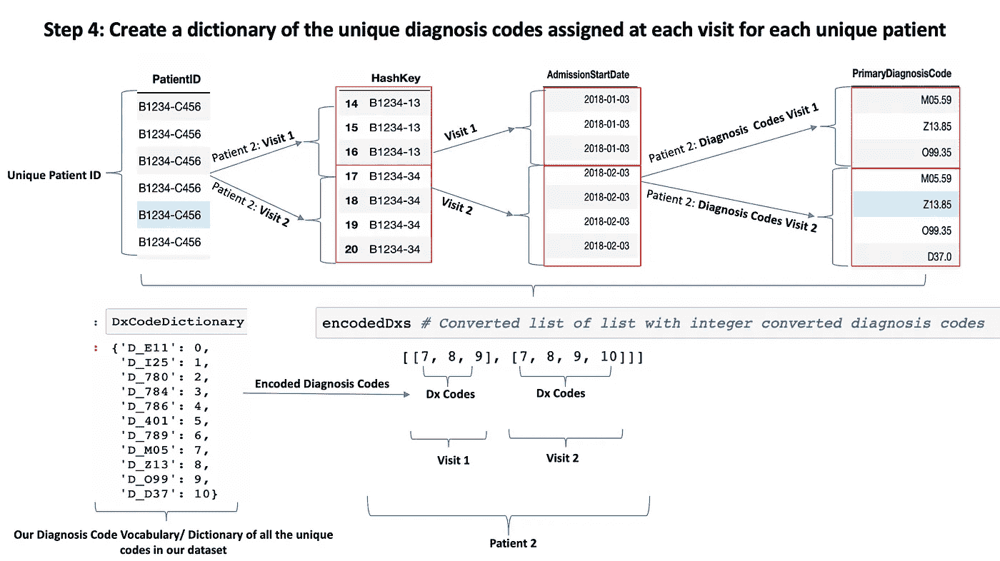
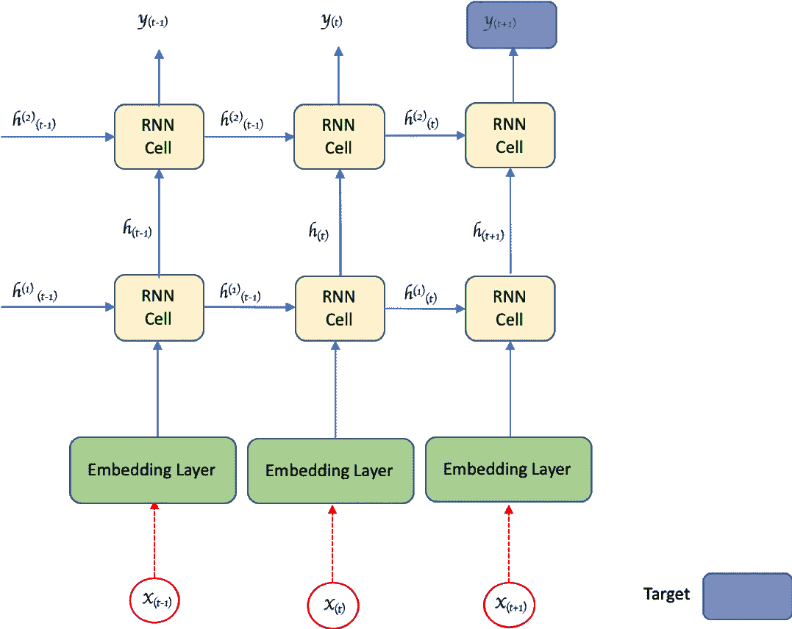

# 使用电子健康记录预测具有门控循环单元的未来诊断代码

> 原文：<https://towardsdatascience.com/using-electronic-health-records-ehr-for-predicting-future-diagnosis-codes-using-gated-recurrent-bcd0de7d7436?source=collection_archive---------9----------------------->

## 背景:AI 医生的详细综述:通过递归神经网络预测临床事件(Choi et.al 2016)

由:[闪耀的拉塞尔-普勒里](https://www.linkedin.com/in/sparkle-russell-puleri-ph-d-a6b52643)和[道林-普勒里](https://www.linkedin.com/in/dorian-puleri-ph-d-25114511)

电子病历(EMRs)有时也称为电子健康记录(EHRs ),主要用于以电子方式数字化存储患者健康数据。虽然这些系统的使用在今天似乎很常见，但最显著的是由于 2014 年通过了《经济和临床健康法案卫生信息技术》。美国医疗机构的适应性实施非常缓慢。尽管如此，EMR 电子病历系统现在拥有丰富的纵向患者数据，可以使我们更接近开发以患者为中心的个性化医疗保健解决方案。也就是说，EHR 的数据可能非常杂乱和稀疏。尽管存在这些挑战，但如果利用得当，EHR 数据可以提供关于患者旅程、治疗模式的真实世界数据洞察，预测患者的下一个诊断代码或再入院风险和死亡率等。

截至 2018 年，据报道，仅医疗保健数据就占全球数据产量的 30%左右。因此，众所周知，许多公司和投资者将医疗保健视为下一个重大投资。然而，为了在患者层面提供真正的解决方案，我们需要了解如何利用和处理我们手头的大量数据。为此，本教程将重点讨论如何处理人工智能算法中使用的 EHR 数据。希望有了这种使用模拟数据的洞察力，我们可以让更多的数据科学家和爱好者参与到医疗保健数据的民主化中来，并使 EHR 数据在患者层面上变得可行。

为了这个三部分教程的目的，我们生成了一些人工 EHR 数据来演示 EHR 数据应该如何被处理以用于序列模型。请注意，这些数据与临床无关，仅用于培训目的。

## 本教程分为以下几个部分:

**第一部分:**生成人工 EHR 数据

**第二部分:**预处理人工生成的 EHR 数据

**第三部分:**艾博士 Pytorch 极简实现

**完全实现:** [**使用快速 AI API**](https://medium.com/@sparklerussell/predicting-future-medical-diagnoses-with-rnns-using-fast-ai-api-from-scratch-ecf78aaf56a2)

如果你需要快速查看 GRUs 的内部运作，请参见 [**门控循环单元查看**](https://medium.com/@sparklerussell/gated-recurrent-units-explained-with-matrices-part-2-training-and-loss-function-7e7147b7f2ae) 。

Github 代码:[https://github.com/sparalic/Electronic-Health-Records-GRUs](https://github.com/sparalic/Electronic-Health-Records-GRUs)

# 第 1 部分:生成人工电子健康记录(EHR)数据

## 病人入院表

此表包含患者入院历史和时间的信息。生成的特征有:

1.  `PatientID` -永久留在患者身上的唯一标识符
2.  `Admission ID` -具体到每次就诊
3.  `AdmissionStartDate` -入院日期和时间
4.  `AdmissionEndDate` -特定入院 ID 护理后的出院日期和时间

## 患者诊断表

诊断表非常独特，因为它可以包含同一就诊的多个诊断代码。例如，患者 1 在他/她的第一次就诊(`Admission ID` :12)期间被诊断患有糖尿病(`PrimaryDiagnosisCode` :E11.64)。但是，这个代码在后续的访问中也会出现(`Admission ID` :34，15)，这是为什么呢？如果一个病人被诊断出患有不可治愈的疾病，他/她这个代码将会与所有后续的就诊相关联。另一方面，与紧急护理相关的代码会随着`PrimaryDiagnosisCode` :780.96(头痛)来来去去。

## 用于将数据从字典解析到数据帧的辅助函数

DataFrame of artificially generated EHR data

## 为入场 ID 创建一个哈希键

为什么要做这一步？除非您的 EHR 系统对每个就诊患者都有唯一可识别的入院 ID，否则很难将每个患者 ID 与唯一的`Admission ID`相关联。为了证明这一点，我们特意创建了两位数的`Admission ID` s，其中一个为两位患者重复(`Admission ID` : 34)。为了避免这种情况，我们采取了预防措施，创建了一个散列键，它是唯一`PatientID`的前半部分与患者特定`Admission ID`的唯一组合。

## 用假 EHR 数据生成的最终入院和诊断表

Admission table with artificially generated data

Diagnosis table with artificially generated d

## 将表格写入 csv 文件

# 第 2 部分:预处理人工生成的 EHR 数据

在本节中，我们将演示如何处理数据，为建模做准备。本教程的目的是详细介绍如何使用 Pytorch 对 EHR 数据进行预处理以用于 RNNs。这篇论文是为数不多的提供代码基础的论文之一，它开始详细研究我们如何建立利用时间模型预测未来临床事件的通用模型。然而，尽管这篇被高度引用的论文是开源的(使用 https://github.com/mp2893/doctorai 的来写)，它还是假设了很多关于它的读者。因此，我们在 python 3+中对代码进行了现代化，以方便使用，并提供了每个步骤的详细解释，以允许任何人使用计算机和访问医疗保健数据，开始尝试开发创新的解决方案来解决医疗保健挑战。

## 重要免责声明:

这个数据集是在本系列的第 1 部分中用两个病人人工创建的，以帮助读者清楚地理解 EHR 数据的基本结构。请注意，每个 EHR 系统都是专为满足特定提供商的需求而设计的，这只是大多数系统中通常包含的数据的一个基本示例。此外，还需要注意的是，本教程是在与您的研究问题相关的所有期望的排除和纳入标准都已执行之后开始的。因此，在这一步，您的数据将会得到充分的整理和清理。

## 负载数据:快速回顾一下我们在第 1 部分中创建的人工 EHR 数据:

## 步骤 1:创建患者 id 的映射

在这一步中，我们将创建一个字典，将每个患者与他或她的特定就诊或`Admission ID`对应起来。

## 步骤 2:创建映射到每个独特患者的诊断代码并进行访问

该步骤与所有后续步骤一样非常重要，因为将患者的诊断代码保持在正确的就诊顺序非常重要。

## 步骤 3:将诊断代码嵌入就诊映射患者入院映射

该步骤实质上是将分配给患者的每个代码添加到字典中，其中包含患者入院 id 映射和就诊日期映射`visitMap`。这使我们能够获得每位患者在每次就诊期间收到的诊断代码列表。

## 步骤 4a:提取患者 id、就诊日期和诊断

在此步骤中，我们将创建所有诊断代码的列表，然后在步骤 4b 中使用该列表将这些字符串转换为整数以进行建模。

## 步骤 4b:为每个独特的患者创建每次就诊时分配的独特诊断代码的字典

在这里，我们需要确保代码不仅被转换为整数，而且它们以唯一的顺序保存，即它们被用于每个唯一的患者。

## 步骤 6:将数据转储到一个 pickled list 列表中

## 完整脚本

# 第 3 部分:AI Pytorch 医生最小实现

我们现在将把从本系列的 [GRUs 教程](/gate-recurrent-units-explained-using-matrices-part-1-3c781469fc18)和[第 1 部分](https://medium.com/@sparklerussell/using-electronic-health-records-ehr-for-predicting-future-diagnosis-codes-using-gated-recurrent-bcd0de7d7436)中获得的知识应用到一个更大的公开可用的 EHR 数据集。本研究将利用 [MIMIC III 电子健康记录(EHR)数据集](https://mimic.physionet.org/)，该数据集由超过 *58，000 例*住院病历组成，其中包括 *38，645 例*成人和 *7，875 例*新生儿。该数据集收集了 2001 年 6 月至 2012 年 10 月期间在**贝斯以色列女执事医疗中心**的特护病房住院患者。尽管被去识别，该 EHR 数据集包含关于患者的人口统计学信息、在床边进行的生命体征测量(约 1 次/小时)、实验室测试结果、账单代码、药物、护理人员注释、成像报告和死亡率(住院期间和之后)的信息。使用在(第 1 部分&第 2 部分)中人工生成的数据集上演示的预处理方法，我们将创建一个用于本研究的同伴队列。

## 模型架构

Doctor AI model architecture

## 检查 GPU 可用性

这个模型是在支持 GPU 的系统上训练的…强烈推荐。

## 加载数据

数据预处理数据集将被加载，并按`75%:15%:10%`比率分成训练、测试和验证集。

## 填充输入

输入张量用零填充，注意输入被填充以允许 RNN 处理可变长度输入。然后创建一个掩码来提供关于填充的算法信息。注意这可以使用 Pytorch 的实用程序`pad_pack_sequence`函数来完成。然而，考虑到这个数据集的嵌套性质，编码的输入首先被多对一热编码。这种偏离过程创建了高维稀疏输入，然而该维度随后使用嵌入层被投影到低维空间中。

## GRU 级

这个类包含开始计算算法的隐藏状态所需的随机初始化的权重。请注意，在本文中，作者使用了使用 skip-gram 算法生成的嵌入矩阵(W_emb ),这优于该步骤中所示的随机初始化方法。

## 用于处理两层 GRU 的自定义层

这个类的目的是执行最初的嵌入，然后计算隐藏状态并执行层间的分离。

## 火车模型

这个模型是 Edward Choi 创建的 Dr.AI 算法的最小实现，而功能性的它需要大量的调整。这将在后续教程中演示。

## 最终注意事项/后续步骤:

这应该作为启动和运行模型的起始代码。如前所述，需要进行大量的调优，因为这是使用定制类构建的。本教程的第 2 部分展示了本文的完整实现。

## 参考资料:

1.  艾医生:通过递归神经网络预测临床事件(【https://arxiv.org/abs/1511.05942】)