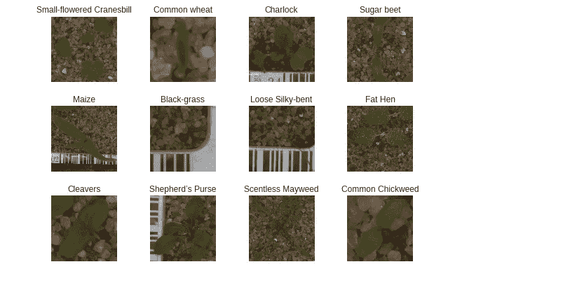
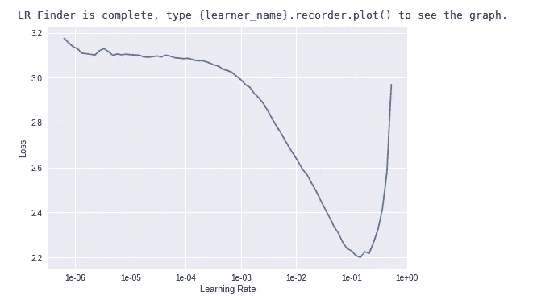
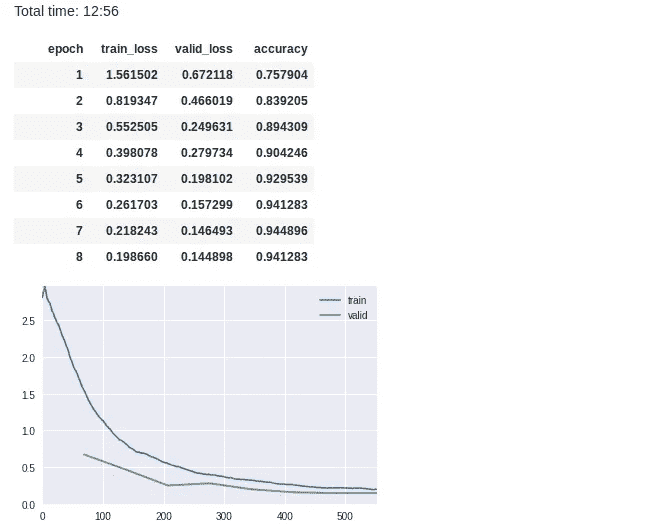

# 利用 Fastai 进行图像分类

> 原文：<https://towardsdatascience.com/using-fastai-for-image-classification-54d2b39511ce?source=collection_archive---------10----------------------->

## 了解如何使用 fastai 快速构建最先进的图像分类器

我最近偷看了杰瑞米·霍华德关于深度学习的 [2019 课程](https://course.fast.ai/)。我以前从未使用过`Fastai`库，所以我对它的抽象程度感到非常惊讶，它允许你在几分钟内用少得可笑的代码创建最先进的神经网络。在接下来的文章中，我将提供一个关于用`Fastai`构建 CNN 图像分类器的简短教程，它应该同时作为对我自己的关键概念的有用总结和对新手的清晰概述。

我选择了 Kaggle 的[植物幼苗数据集作为示例数据集。](https://www.kaggle.com/c/plant-seedlings-classification)

# 关于 Fastai

如果你还没听说过`Fastai`，我推荐你看看他们的[主页](https://www.fast.ai/)。在他们的使命声明中，他们不仅希望加速和帮助深度学习研究，还希望降低每个人的准入门槛。这句台词来自他们 2017 年 9 月为`Fastai`推出的`PyTorch`[(来源)](https://www.fast.ai/2017/09/08/introducing-pytorch-for-fastai/):

```
Everybody should be able to use deep learning to solve their problems with no more education than it takes to use a smart phone. Therefore, each year our main research goal is to be able to teach a wider range of deep learning applications, that run faster, and are more accurate, to people with less prerequisites.
```

即使你看了`Fastai`的 2019 年课程，你也可以感受到这种雄心，这让我对该领域的发展方向有了良好的感觉。正如在研究中经常发生的那样，知识和工具只对特定的少数人开放。这在深度学习研究中更加明显，你需要强大的 GPU 中的海量 RAM 来解决大量问题(查看这个无关的[视频](https://www.youtube.com/watch?v=-P28LKWTzrI)关于 GPU vs CPU)。

此外，现在许多云计算平台都提供了对`Fastai`的支持，比如 [Paperspace](https://paperspace.com) 、 [Cradle](https://enterprise.braincradle.com/) 和 [AWS](https://aws.amazon.com/deep-learning/) 等等。但是由于这些服务都是要花钱的，我将坚持谷歌最近刚刚宣布的`Colaboratory`，让你免费使用谷歌的 GPU。是的，零成本！活着真是太不可思议了。

# 设置 Google Colab

为了避免网上的冗余，请查看由 [Manikanta Yadunanda](https://towardsdatascience.com/@manikantayadunanda) 撰写的这篇[中的帖子，快速了解如何使用谷歌合作实验室(Colab)和`Fastai`。自从这篇介绍写完之后，Google 已经在 Colab 中包含了官方的`Fastai`和`PyTorch`支持，所以你可能甚至不需要在连接到运行时之后安装它。您可以使用下面的代码行检查是否所有重要的`pip`包都已安装。如果没有，取消最后一行的注释，用它来为 Python 3.6.x 和 CUDA 9.x 安装`Fastai`和`PyTorch`](/fast-ai-lesson-1-on-google-colab-free-gpu-d2af89f53604)

# 克隆此笔记本

要访问这个笔记本并自己运行计算，您可以直接从我的 GitHub 库导入它。只需进入文件…打开笔记本…，选择 GitHub 选项卡，并在搜索栏中输入“verrannt/Tutorials”。选择‘fastai-plant-sleeves-classification . ipynb’就大功告成了。就这么简单。检查 Colab 是否配置了`Fastai`支持后，您可以继续数据准备部分。

# 数据准备

## 获取数据

由于我们使用 Kaggle 作为我们的数据集供应，您需要一个 [Kaggle](http://localhost:8888/files/kaggle.com) 帐户来下载数据集。如果你有一个，到你的帐户设置中去，获得一个新的 API 密匙，你可以在 Kaggle CLI 中使用。

以下代码安装 CLI 并注册新的 API 密钥。然后我们下载植物幼苗数据集并解压。确保您位于 fastai 目录的/content 文件夹中。

## 检查数据

让我们检查数据。我们从 Kaggle 下载并提取的文件夹有 12 个子文件夹，每个子文件夹对应一种类型的幼苗，里面有各自的图像。这些将是我们分类任务的标签。

如果我们打印这些文件夹内容的长度，我们可以看到每个文件夹包含不同数量的图像。差异很大，例如,“松散的丝般弯曲”的图像最多(762)，而“普通小麦”的图像最少(253)。我们将在后面看到这是否意味着预测精度的不同。

这将输出以下内容:

```
No. of labels: 12
-----------------
Small-flowered Cranesbill, 576 files
Common wheat, 253 files
Charlock, 452 files
Sugar beet, 463 files
Maize, 257 files
Black-grass, 309 files
Loose Silky-bent, 762 files
Fat Hen, 538 files
Cleavers, 335 files
Shepherd’s Purse, 274 files
Scentless Mayweed, 607 files
Common Chickweed, 713 files
```

让我们来看看这些图像。对于 12 个标签中的每一个，我们将随机打印一个幼苗。



好吧，他们看起来很好，很容易区分，除了“松散的丝般弯曲”和“黑草”。这些对网络来说可能更难识别，但是我们会看到的。我们开始吧！

# 创建 Fastai 模型

我们现在可以使用`Fastai`库创建 CNN 模型。自从对 v1 进行重大更新以来，它变得更加清晰和一致，因此我们只需要导入我们的度量标准的视觉模块和准确性。

```
from fastai.vision import *
from fastai.metrics import accuracy
```

有一个非常好的类来处理与视觉任务的输入图像相关的一切。它被称为`[ImageDataBunch](https://docs.fast.ai/vision.data.html#ImageDataBunch)`,具有不同的功能，以不同的方式将数据呈现给网络。由于我们的图像被放在名称与图像标签相对应的文件夹中，我们将使用`ImageDataBunch.from_folder()`函数创建一个包含图像数据的对象。这非常有用，可以非常容易地将数据读入我们的模型，稍后您会看到这一点。

更方便的是，`Fastai`可以自动将我们的数据分成训练集和验证集，所以我们甚至不需要自己创建它们。

我们现在需要的唯一超参数是指向我们数据集的**路径变量**、输入的**大小**和每个梯度下降迭代的**批量大小**。为了简单起见，`ImageDataBunch`对象会将所有图像缩放到一个尺寸*尺寸的平方图像，除非另有指示。

关于图像大小的一个快速提示:图像越大，CNN 能够从中提取的细节就越多。同时，更大的图像意味着更长的计算时间。同样，你的 GPU 可能会因为批量过大而耗尽内存。如果是这种情况，您可以将批量大小减半。

```
path = “./plant_seedlings-data/”
size = 224
bs = 64
```

我们将创建一个名为`data`的变量，在其中放置`ImageDataBunch`对象。我们用上面讨论过的`from_folder()`函数创建这个对象。在获取数据、图像和批次大小的路径中，还需要:

*   一个名为`get_transforms()`的函数参数，它在调用时返回可用图像转换的列表。
*   参数`valid_pct`,控制将被随机选择在验证集中的图像的百分比
*   参数`flip_vert`除了控制水平翻转外，还控制垂直翻转和 90°旋转。(因为我们的植物图像是从上面拍摄的，所以我们可以毫无问题地执行这些操作，这在例如面部数据上是不可行的。)

为了规范化我们对象中的数据，我们简单地在对象上调用`normalize()`。这里可以使用 *ImageNet* 、 *CIFAR* 或 *MNIST* stats 作为模板，如果留空，这个函数将简单地从我们的对象中抓取一批数据，并计算它的统计数据(平均值和标准差)并相应地归一化数据。因为我们将为在 ImageNet 上训练的模型使用 ResNet 架构，所以我们将使用 ImageNet stats。

```
data.**normalize**(imagenet_stats)
```

这将输出一个摘要:

```
ImageDataBunch;

Train: LabelList
y: CategoryList (4432 items)
[Category Small-flowered Cranesbill, Category Small-flowered Cranesbill, Category Small-flowered Cranesbill, Category Small-flowered Cranesbill, Category Small-flowered Cranesbill]...
Path: plant-seedlings-data
x: ImageItemList (4432 items)
[Image (3, 237, 237), Image (3, 497, 497), Image (3, 94, 94), Image (3, 551, 551), Image (3, 246, 246)]...
Path: plant-seedlings-data;

Valid: LabelList
y: CategoryList (1107 items)
[Category Maize, Category Black-grass, Category Common Chickweed, Category Cleavers, Category Charlock]...
Path: plant-seedlings-data
x: ImageItemList (1107 items)
[Image (3, 529, 529), Image (3, 945, 945), Image (3, 171, 171), Image (3, 125, 125), Image (3, 163, 163)]...
Path: plant-seedlings-data;

Test: None
```

就是这样，两行代码优化了我们的训练数据集，增加了不同种类的转换和规范化！我想请你在这里停一会儿，花一秒钟来欣赏它的美丽。高水平图书馆之美；仅仅两行代码，我们就极大地增加了数据集的多样性。我已经可以听到我丑陋的 batchnorm 代码在垃圾桶里哭泣。

现在剩下的就是创建实际的网络并训练它，这再简单不过了。

`Fastai`在其视觉模块中为我们提供了一个名为`[create_cnn()](https://docs.fast.ai/vision.learner.html#create_cnn)`的功能。这个函数创建了一个叫做`learner`的对象，我们将把它放入一个适当命名的变量中。请注意，我们将 ResNet 架构指定为迁移学习的基础模型。一旦调用，经过训练的架构将通过`Fastai` API 下载并存储在本地。

我们将使用准确性作为我们的衡量标准。如果您查看[文档](https://docs.fast.ai/metrics.html)，您可以看到其他可用指标的列表。定义回调函数`ShowGraph`只是告诉学习者，无论它做什么，它都应该返回一个图，这对我看模型是否仍在改进非常有用。

```
learner = **create_cnn**(data, models.resnet18, metrics=[accuracy], callback_fns=ShowGraph)
```

# 寻找学习率

我们创建的学习者对象带有一个内置函数，可以为训练找到最佳的学习率或学习率范围。它通过拟合几个时期的模型并保存损失减少最多的学习率来实现这一点。

我们希望选择一个学习率，其损失*仍在减少，*即我们不希望学习率具有最小损失，而是具有最大斜率。

在下面的图中，存储在我们的*学习器*的*记录器*对象中，我们可以看到学习率在 0.001 和 0.01 之间的情况。

```
learner.lr_find()
learner.recorder.plot()
```



## 首次拟合和评估

现在让我们用 0.001 到 0.01 之间的学习率来拟合 8 个时期的模型

```
learner.fit_one_cycle(8, max_lr=slice(1e-3, 1e-2))
```



看起来已经很好了！在最初几个 1/5 的迭代中，损耗减少了很多，之后会减少，但会持续减少。

让我们看看算法在哪里犯的错误最多:

```
interpreter = ClassificationInterpretation.from_learner(learner)interpreter.**most_confused**(min_val=2)## OUTPUTS:
[(‘Black-grass’, ‘Loose Silky-bent’, 28),
 (‘Loose Silky-bent’, ‘Black-grass’, 7),
 (‘Shepherd’s Purse’, ‘Scentless Mayweed’, 4)]
```

这向我们展示了这种算法最常混淆“黑草”和“松丝弯”这两个类别。我们已经在之前展示的样本图像中看到，这些图像看起来最相似，因此这是有意义的。

# 改进模型

## 解冻和微调

在我们解冻层并再次学习之前，我们保存权重，以便在我们搞砸的情况下可以返回。

```
learner.save(‘stage-1’)
#learner.load(‘stage-1’)learner.unfreeze()
learner.fit_one_cycle(12, max_lr=slice(1e-5, 1e-4))
```


我们将坚持这一点，因为验证错误比测试错误更严重，看起来这种趋势只会增加。如果我们从这一点开始继续训练，模型将开始**过度拟合训练数据**！

*干得好*，我们成功地为一个定制数据集训练了一个最先进的图像分类器，仅用几行代码就达到了 96.5%的准确率！

**来源**
【1】[Fastai MOOC](https://course.fast.ai/)
【2】[Fastai 库](https://docs.fast.ai/)
【3】[植物幼苗数据集](https://www.kaggle.com/c/plant-seedlings-classification)