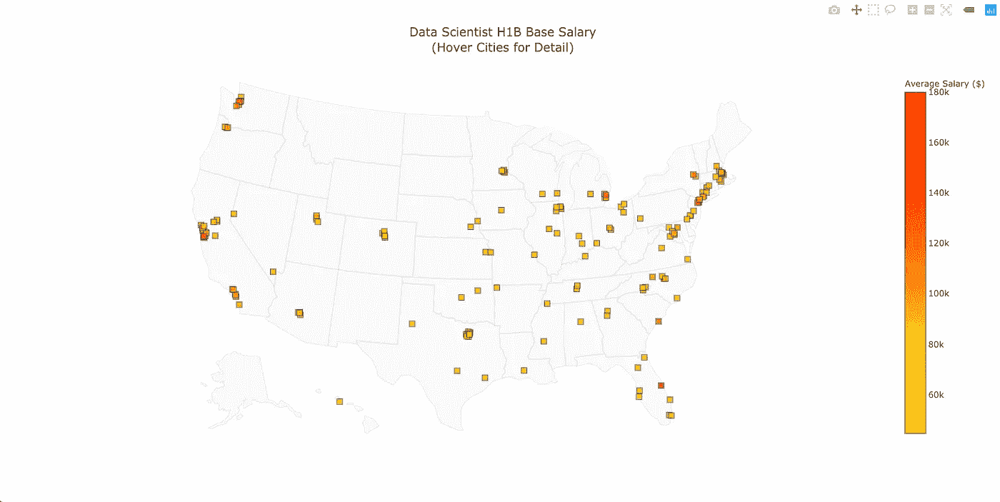
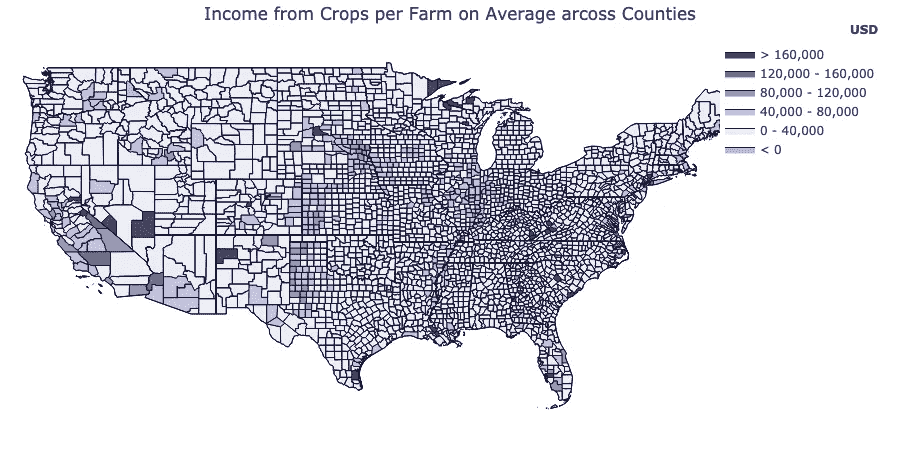

# 用 FIPS 形象化情节

> 原文：<https://towardsdatascience.com/using-fips-to-visualize-in-plotly-14fa7a6ddcf0?source=collection_archive---------13----------------------->

最近我和 Plotly 一起做了两个可视化项目，可视化加州每平方英尺的平均租金和全美数据科学家的平均工资。我使用了两种不同的方法在地图上显示数据——地图上的散点图和氯普图。

**为什么 Plotly？**
Plotly 是 Python 中强大的可视化软件包之一。使用 Plotly 的一个好处是你可以用 Python 生成 d3 图，因为 Plotly 是建立在 d3 之上的。学习 d3 需要很长的时间，但 Plotly 可以帮助消除恼人的时刻，并更专注于理解数据。Plotly 有一个丰富的地图可视化库，并且易于使用。地图是 Plotly 中可以缓解你的挫折感的类型之一。

**地图散点图**
当数据单位是城市时，在地图上制作散点图是个好主意，所以我选择用这种方法来显示美国各地数据科学家的平均工资，因为平均工资是基于城市的。

制作这个可视化的过程和在 Plotly 中制作散点图差不多，只是背景是一张地图。这意味着数据是基于经度和纬度绘制在地图上的，分别对应于 x 和 y 值。

准备好包含平均工资和城市的数据框后，获取每个城市的经度和纬度，并存储在同一个数据框中。下一步是分配你想要的颜色来区分薪水的高低。最后一步是定义可视化的情节和布局。Plotly 很好，因为你可以去 plotly.graph_objs，在那里你可以找到美国地图的散点图。

Figure 1: Data Scientist H1B Base Salary across the United States

这个可视化引用自官方 Plotly 文档中的例子，你可以在文章底部找到链接。如果你想看看我的代码，你也可以在文章底部找到链接。

地图上的散点图最适合基于城市的可视化数据，并且非常容易中断。如果你尝试在美国地图上可视化数据，这没有问题，因为有大量的非美国地图可用。然而，如果数据集中的城市彼此非常接近，效果就不太好。例如，如果在湾区有太多的数据点，一些点会相互堆叠，观众可能很难发现该区域的差异。

**Choropleth Map**
在地图上可视化数据的另一种方法是 Choropleth Map。Choropleth 地图是一种基于县的地图，它在地图上填充了县的颜色。看起来是这样的:

Figure 2: Choropleth to visualize average income per farm across the US

choropleth 图的一个优点是数据点不会相互叠加。您可能认为这很难绘制，因为您不能使用经度和纬度在地图上绘制，但是您可以使用 FIPS 来定位县。

**FIPS 县代码**
FIPS 县代码代表联邦信息处理标准，美国联邦政府为全国各县分配一个编号。Plotly 的 choropleth 地图的一个很好的特点是 Plotly 将 FIPS 县代码作为参数。FIPS 县代码有 5 个数字，前 2 个数字代表州，后 3 个数字代表县。例如，旧金山县的 FIPS 县代码是 06075。06 代表加州，075 代表旧金山。由于 FIPS 县代码是为每个县指定的，所以您不会在 Plotly 中错误的数据上绘制数据。你可以在联邦政府网站上找到 FIPS 县代码的列表，我在这篇文章的底部提供了链接。

**Choropleth 地图示例** 在我研究生院的一个项目中，我的教授给了我一组来自 Craigslist 的加州租金数据，我决定找出加州每平方英尺租金的中位数。数据集包含少量加州以外的数据，FIPS 的好处是我可以排除没有以 06 开始的 FIPS 的观察值，因为 FIPS 以其他值开始不是加州。

一旦数据准备就绪，您可以从 plotly.figure_factory 导入 create_choropleth，并传递 FIPS、值和颜色来创建 choropleth。我最终的视觉效果是这样的:

Figure 3: Median rent per Square foot by county across California

你也可以在这个图像上找到我的代码。

绘制 choropleth 地图的缺点是我只发现它对美国地图有用。有一次我试图在英国地图上绘制一个 choropleth 地图，但是我找不到任何支持它的包或选项。目前的版本在美国非常适合可视化，但在美国以外的地方就不行了。

我已经提到了 Plotly 支持的两种地图可视化方式——地图上的散点图和 choropleth 地图。这两种地图服务器的地图用途不同，取决于您是要按城市还是按县进行绘图。如果你想按城市绘制数据，你应该在地图上用散点图，并准备好经度和纬度。通过韵文，如果你想按县绘制数据，choropleth 地图是一个好方法，你应该准备好 FIPS 县代码。如果数据集来自联邦政府，很可能 FIPS 县代码已经与数据配对。因此，Plotly 的 choropleth map 是一个方便的软件包，可以可视化来自联邦政府的美国国家数据。

**参考**
地图上的 Plotly 散点图:
[https://plot.ly/python/scatter-plots-on-maps/](https://plot.ly/python/scatter-plots-on-maps/)

FIPS 县来源:
[https://www . census . gov/geographies/reference-files/2013/demo/popest/2013-geocodes-all . html](https://www.census.gov/geographies/reference-files/2013/demo/popest/2013-geocodes-all.html)

[https://www . nrcs . USDA . gov/wps/portal/nrcs/detail/national/home/？cid=nrcs143_013697](https://www.nrcs.usda.gov/wps/portal/nrcs/detail/national/home/?cid=nrcs143_013697)

我的 Github:
[https://github.com/jacquessham](https://github.com/jacquessham)

全美工资数据(散点图):
[https://github.com/jacquessham/ds_salary_opt](https://github.com/jacquessham/ds_salary_opt)

加州各县每平方英尺租金中位数(Choropleth 地图):
[https://github.com/jacquessham/california_rent](https://github.com/jacquessham/california_rent)