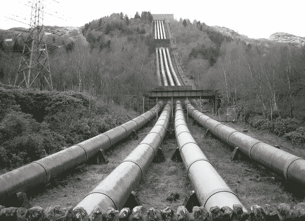
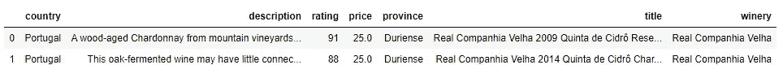
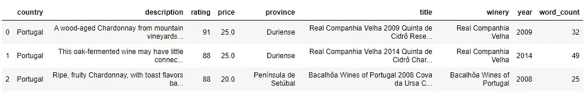
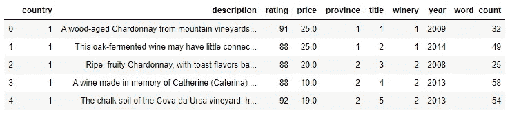
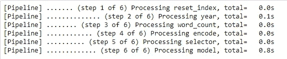
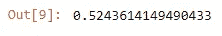

# 在 SkLearn 中使用 FunctionTransformer 和 Pipeline 预测 Chardonnay 评级

> 原文：<https://towardsdatascience.com/using-functiontransformer-and-pipeline-in-sklearn-to-predict-chardonnay-ratings-9b13fdd6c6fd?source=collection_archive---------7----------------------->



# 发现管道

学习编码的最大好处之一是，当你发现新概念时，你会掉进无数个兔子洞。我在 DataCamp 上做的一个练习让我接触到了 Scikit-Learn 中的 Pipeline，它让我大吃一惊！[管道](https://scikit-learn.org/stable/modules/generated/sklearn.pipeline.Pipeline.html)允许你顺序转换数据，实现 *fit()* 。做完练习后，我就开始应用我所学到的知识，精心制作了一个管道来清理葡萄酒评论数据集，并预测霞多丽的评级。这是对我在创建管道和预测模型时所经历的过程的深入回顾。**我讨论创建特征、应用分类编码器、构建管道和生成预测。完整的代码和 github repo 的链接可以在文章的底部找到**:

# 导入从属关系和数据

数据来源于 Kaggle 上的[葡萄酒评论数据集。我已经写了几篇关于探索数据集的文章，并且已经将它存储在一个 SQLite 数据库中。数据仅被部分清理，并且需要被转换，以便可以在机器学习模型中使用。](https://www.kaggle.com/zynicide/wine-reviews)

```
import numpy as np
import pandas as pd
import sqlite3
import category_encoders as ce
import refrom sklearn.feature_selection import chi2, SelectKBest
from sklearn.model_selection import train_test_split
from sklearn.feature_extraction.text import HashingVectorizerfrom sklearn.pipeline import Pipeline, FeatureUnion
from sklearn.impute import SimpleImputerfrom sklearn import ensemblefrom sklearn.preprocessing import MaxAbsScaler
from sklearn.preprocessing import FunctionTransformerconn = sqlite3.connect('db/wine_data.sqlite')
c = conn.cursor#create Dataframe
df = pd.read_sql("select country  \
                 ,description     \
                 ,rating          \
                 ,price           \
                 ,province        \
                 ,title           \
                 ,winery from wine_data where variety = 'Chardonnay'", conn)
df.head(2)
```



> 注意有多少列包含文本数据。

为了在机器学习模型中使用它们，必须使用编码来转换文本。对葡萄酒厂、国家、省份和头衔等分类数据进行编码有几种策略，我将在类别编码器一节中介绍它们。在我对它们进行编码之前，我需要创建一些可能有助于预测模型的特征。

# 创建新功能

可以进行特征工程来提取数据中潜在的预测质量，并将其作为一列添加到数据集中。我已经创建了一组函数，接收数据帧并输出转换后的数据帧。使用 [Scikit Learn 的函数转换器](https://scikit-learn.org/stable/modules/generated/sklearn.preprocessing.FunctionTransformer.html)，我可以使用管道中的函数来转换数据帧。我试图使用全局变量让函数动态化。

## 从标题中提取年份

我想添加的一个特性是在 ***标题*** 列中找到的葡萄酒年份。函数 **extract_year** 接收一个数据帧并返回一个添加了 ***year*** 列的数据帧。

```
def extract_year(dataframe):#set the column name containing the year using a global variable
    global year_column
    years = dataframe[year_column]
    #years.reset_index(inplace=False)
    #years.fillna("", inplace=True)
    l = []
    i = 0 #use for loop to extract the year from each title row
    for year in range(len(dataframe)):
        temp = re.findall(r'\d+', years[i]) 
        res = list(map(int, temp)) 
        try: 
            if len(str(res[0])) == 4:
                l.append(res[0])
            elif len(str(res[0])) != 4:
                l.append(0)
        except:
            l.append(0)
        #print(res[0])
        i+=1
    dataframe['year'] = lreturn dataframe
```

## 统计描述中的单词

在浏览数据集时，我注意到评论较短的葡萄酒往往评级较低。正因为如此，我将把描述的字数添加到模型中，看看它是否是一个预测器。我使用一个依赖于名为 word_count_column 的全局变量的函数来指示使用数据帧的哪一列。它接收一个数据帧并返回一个添加了 ***word_count*** 列的数据帧。

```
def word_count(dataframe):
    global word_count_column
    dataframe['word_count'] = dataframe[text].apply(lambda word: len(str(word).split(" ")))
    return dataframe
```



Data Frame with Added Features

我们可以看到这两个函数工作并产生了所需的数据帧。

> 添加了这两个数字特性后，就该考虑对列 ***【国家】******省******职称*** 和 ***酒厂*** *中的分类数据进行编码了。*

# 类别编码器

由于机器学习模型将数字作为输入，因此必须对文本进行转换。用于编码数据的策略会对模型的准确性产生很大影响。为了轻松尝试各种编码策略，我推荐使用与 Scikit Learn 一起工作的[类别编码器包](http://contrib.scikit-learn.org/categorical-encoding/index.html)。

> 包中可用的类别编码器与 Pipeline 兼容，因为它们是转换器。

```
pip install category_encoders
OR
conda install -c conda-forge category_encoders
```

包里有 15 个左右的编码器。我建议在模型管道中尝试这些方法，看看不同的策略如何影响模型的准确性。

*   [詹姆斯-斯坦编码器](http://contrib.scikit-learn.org/categorical-encoding/jamesstein.html)
*   [漏掉一个](http://contrib.scikit-learn.org/categorical-encoding/leaveoneout.html)
*   [M-估计值](http://contrib.scikit-learn.org/categorical-encoding/mestimate.html)
*   [序数](http://contrib.scikit-learn.org/categorical-encoding/ordinal.html)
*   [目标编码器](http://contrib.scikit-learn.org/categorical-encoding/targetencoder.html)

尽管它们与 Pipeline 兼容，但我创建了一个函数，这样我就可以传入额外的逻辑。我传入一个数据框和两个全局变量来控制在转换中使用哪个类别和目标列。

```
# encoder = ce.JamesSteinEncoder(cols=[...]) --maybe 
# encoder = ce.LeaveOneOutEncoder(cols=[...]) --maybe
# encoder = ce.MEstimateEncoder(cols=[...]) --maybe
# encoder = ce.OrdinalEncoder(cols=[...]) --maybe
# encoder = ce.TargetEncoder(cols=[...]) --maybedef category_encode(dataframe):
    global category_columns
    global category_target
    x = dataframe[category_columns]
    y = dataframe[target]
    ce_ord = ce.OrdinalEncoder(cols=category_columns)
    dataframe[category_columns] = ce_ord.fit_transform(x, y)
    return dataframe
```



Example of Ordinal Encoder

> 请注意，分类文本列已经转换为数字列。

***描述*** 列可以在模型中使用，但是需要经过不同的转换方法。相反，我将使用一个函数从数据帧中选择数字列，并忽略 ***描述*** 列。

```
get_numeric_data = FunctionTransformer(lambda x: x[numeric], validate=False)
```

# 建造管道

管道很棒，因为它们在转换过程中强制执行顺序，使得工作流紧凑且易于理解。这也可以使作品更容易复制。

> 请记住，pipeline 使用转换器，因此我们需要在函数上使用 FunctionTransformer，以使它们兼容。

## 创建转换函数

使用 FunctionTransformer，很容易使特征工程和列选择过程中使用的函数与管道兼容。

```
get_year = FunctionTransformer(extract_year, validate=False)
get_word_count = FunctionTransformer(word_count, validate=False)
get_encoded_text = FunctionTransformer(category_encode, validate=False)
get_numeric_data = FunctionTransformer(lambda x: x[numeric], validate=False)
```

因为有些函数依赖于索引值，所以我需要创建一个函数来重置索引，以便在将数据分成训练集和测试集之后管道能够正常工作。

```
def reset_index(dataframe):
    dataframe = dataframe.reset_index(inplace = False)
    return dataframeget_reset_index = FunctionTransformer(reset_index, validate=False)
```

## 设置全局变量

我创建的函数使用全局变量而不是硬编码的值，因此它们更容易重用。因此，需要设置所有的全局变量:

```
year_column = 'title'
word_count_column = 'description'
category_columns = ['country','province','title','winery']
target = 'price'
numeric= ['price', 'year', 'word_count', 'country', 'province', 'title', 'winery']
```

## 选择模型

管道可用于选择您想要使用的模型。要了解更多关于建立模型选择渠道的信息，我推荐阅读 Rebecca Vickery 的这篇文章。为了简单起见，我只使用 Scikit Learn 中的[梯度提升回归器。](https://scikit-learn.org/stable/modules/generated/sklearn.ensemble.GradientBoostingRegressor.html)

```
#create Gradient Boosting Regressor model 
model = ensemble.GradientBoostingRegressor(
    n_estimators = 100, #how many decision trees to build
    learning_rate = 0.5, #controls rate at which additional decision trees influes overall prediction
    max_depth = 6, 
    min_samples_split = 21,
    min_samples_leaf = 19, 
    max_features = 0.9,
    loss = 'huber'
)
```

## 把它放到管道里

一旦选择了模型，设置了全局变量，并且所有函数都已转换并与管道兼容，就该将这些部分组合在一起了:

```
pl = Pipeline(memory=None,
    steps=[
        ('reset_index', get_reset_index),
        ('year', get_year),
        ('word_count', get_word_count),
        ('encode', get_encoded_text),
        ('selector', get_numeric_data),
        ('model', model)
    ], verbose=True)
```

> 注意，我设置了 Verbose = True。这样打印步骤就完成了。这使得调试过程更加透明。



Verbose = True output

## 把所有的放在一起

要测试管道，使用列车测试分割来分割数据，并通过管道运行:

```
features = df.drop(['rating'], axis=1)X = features
y = df['rating']
X_train, X_test, y_train, y_test = train_test_split(X, y
                                                   , test_size = .3
                                                   #, stratify=y
                                                   )
pl.fit(X_train, y_train)
pl.score(X_test, y_test)
```



Score

# 完整的代码

```
import numpy as np
import pandas as pd
import sqlite3
import category_encoders as ce
import refrom sklearn.feature_selection import chi2, SelectKBest
from sklearn.model_selection import train_test_split
from sklearn.feature_extraction.text import HashingVectorizerfrom sklearn.pipeline import Pipeline, FeatureUnion
from sklearn.impute import SimpleImputerfrom sklearn.linear_model import LogisticRegressionfrom sklearn.preprocessing import MaxAbsScaler
from sklearn.preprocessing import FunctionTransformerconn = sqlite3.connect('db/wine_data.sqlite')
c = conn.cursor#create Dataframe
df = pd.read_sql("select country  \
                 ,description     \
                 ,rating          \
                 ,price           \
                 ,province        \
                 ,title           \
                 ,winery from wine_data where variety = 'Chardonnay'", conn)
#df.head(2)def extract_year(dataframe):
    global year_column
    years = dataframe[year_column]
    #years.reset_index(inplace=False)
    #years.fillna("", inplace=True)
    l = []
    i = 0 
    for year in range(len(dataframe)):
        temp = re.findall(r'\d+', years[i]) 
        res = list(map(int, temp)) 
        try: 
            if len(str(res[0])) == 4:
                l.append(res[0])
            elif len(str(res[0])) != 4:
                l.append(0)
        except:
            l.append(0)
        #print(res[0])
        i+=1
    dataframe['year'] = lreturn dataframe
#df = extract_year(df)def word_count(dataframe):
    global word_count_column
    dataframe['word_count'] = dataframe[word_count_column].apply(lambda word: len(str(word).split(" ")))
    return dataframe
# df = word_count(df)
# df.head(3)# encoder = ce.JamesSteinEncoder(cols=[...]) --maybe (best score)
# encoder = ce.LeaveOneOutEncoder(cols=[...]) --maybe
# encoder = ce.MEstimateEncoder(cols=[...]) --maybe (good)
# encoder = ce.OrdinalEncoder(cols=[...]) --maybe
# encoder = ce.TargetEncoder(cols=[...]) --maybeyear_column = 'title'
word_count_column = 'description'
category_columns = ['country','province','title','winery']
target = 'price'
combine_text = ['country','province','title','winery', 'description']
numeric= ['price', 'year', 'word_count','country','province','title','winery']def category_encode(dataframe):
    global category_columns
    global category_target
    x = dataframe[category_columns]
    y = dataframe[target]
    ce_ord = ce.OrdinalEncoder(cols=category_columns)
    dataframe[category_columns] = ce_ord.fit_transform(x, y)
    return dataframe# df = category_encode(df)
# df.head()get_year = FunctionTransformer(extract_year, validate=False)get_word_count = FunctionTransformer(word_count, validate=False)get_encoded_text = FunctionTransformer(category_encode, validate=False)get_numeric_data = FunctionTransformer(lambda x: x[numeric], validate=False)def reset_index(dataframe):
    dataframe = dataframe.reset_index(inplace = False)
    return dataframeget_reset_index = FunctionTransformer(reset_index, validate=False)from sklearn import ensemble 
model = ensemble.GradientBoostingRegressor(
    n_estimators = 100, #how many decision trees to build
    learning_rate = 0.5, #controls rate at which additional decision trees influes overall prediction
    max_depth = 6, 
    min_samples_split = 21,
    min_samples_leaf = 19, 
    max_features = 0.9,
    loss = 'huber'
)pl = Pipeline(memory=None,
    steps=[
        ('reset_index', get_reset_index),
        ('year', get_year),
        ('word_count', get_word_count),
        ('encode', get_encoded_text),
        ('selector', get_numeric_data),
        ('model', model)
    ], verbose=False)features = df.drop(['rating'], axis=1)X = features
y = df['rating']
X_train, X_test, y_train, y_test = train_test_split(X, y
                                                   , test_size = .3
                                                   #, stratify=y
                                                   )
pl.fit(X_train, y_train)pl.score(X_test, y_test)
```

# 开源代码库

[](https://github.com/bendgame/wine_rating_predictions) [## bend game/wine _ rating _ 预测

### 此时您不能执行该操作。您已使用另一个标签页或窗口登录。您已在另一个选项卡中注销，或者…

github.com](https://github.com/bendgame/wine_rating_predictions) 

# 谢谢大家！

*   *如果你喜欢这个，* [*在 Medium 上关注我*](https://medium.com/@erickleppen) *了解更多*
*   [*通过订阅*](https://erickleppen.medium.com/membership) 获得对我的内容的完全访问和帮助支持
*   *我们连线上* [*LinkedIn*](https://www.linkedin.com/in/erickleppen01/)
*   *用 Python 分析数据？查看我的* [*网站*](https://pythondashboards.com/)

[**—埃里克·克莱本**](http://pythondashboards.com/)