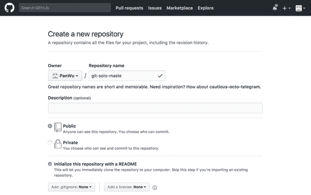
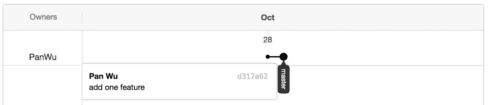
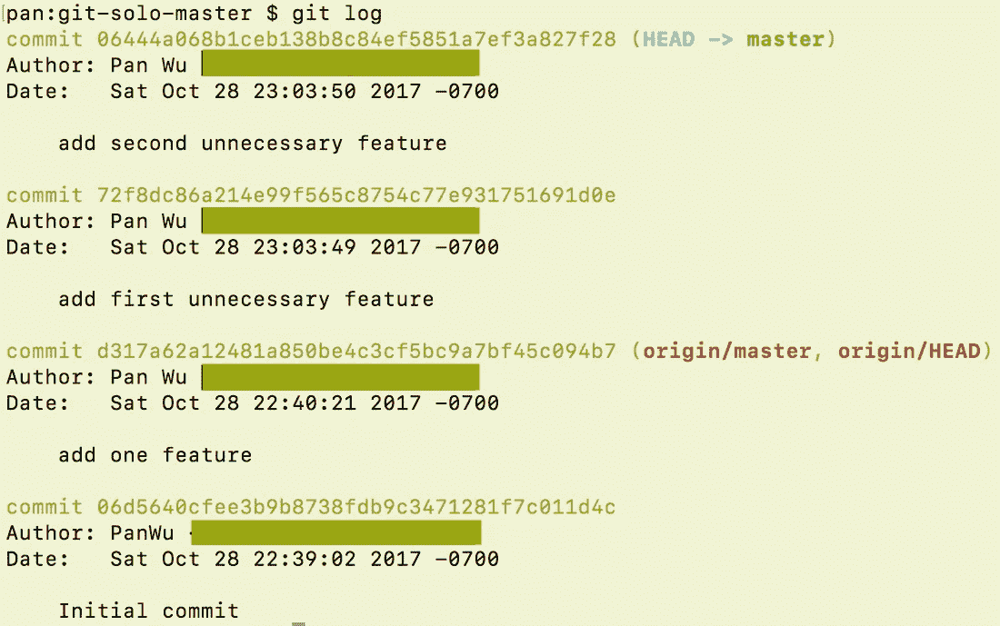
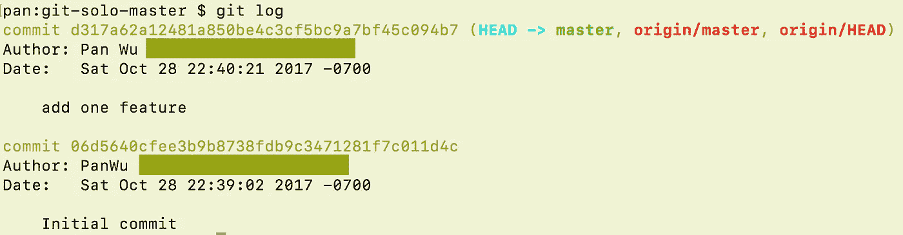
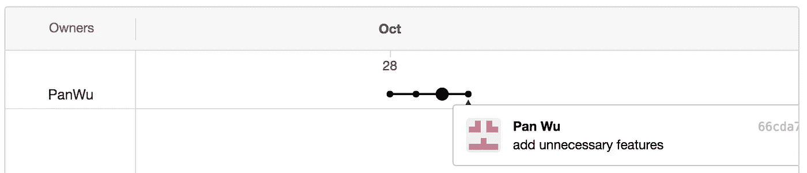
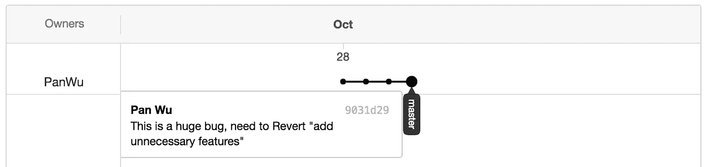
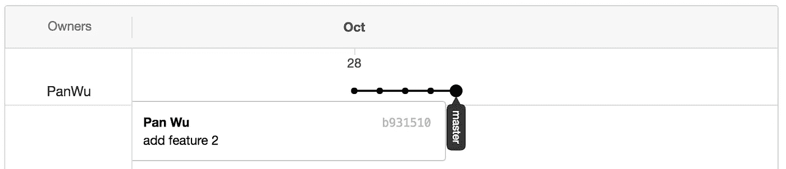
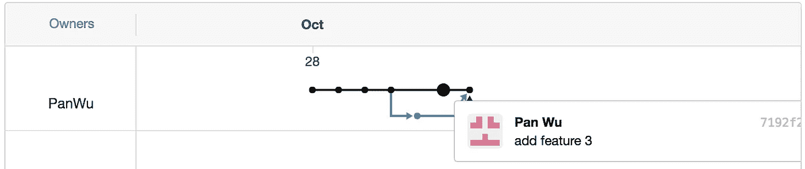
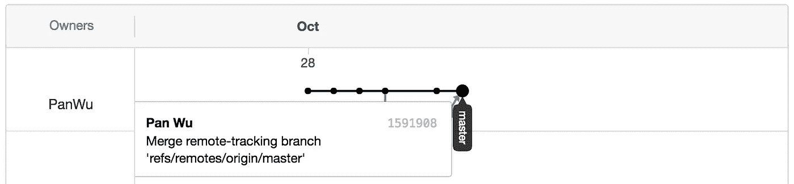

# 在数据科学中使用 Git:独唱大师

> 原文：<https://towardsdatascience.com/using-git-in-data-science-the-solo-master-954577bc9f9a?source=collection_archive---------42----------------------->


The solo tree in Tongva Park, Santa Monica, CA (I took the photo during a lunch break back in 2014)

Git 是一个非常流行的版本控制系统，用于跟踪计算机文件中的变化，并协调多人对这些文件的工作。它在数据科学项目中被很好地用于跟踪代码和维护并行开发。Git 可以以非常复杂的方式使用，但是，对于数据科学家来说，我们可以保持简单。在这篇文章中，如果你是一个“独行侠”，我将介绍主要的用例。

# **什么是“Solo Master”？**

当你使用 GIT 只是为了保护你的代码安全，避免在你的笔记本电脑坏了/被偷了之后变得疯狂，所有的改变都只在“主”分支上。现在你处于“独唱大师”模式。在这种模式下，事情相对容易，主要有六种可能的情况:


Credit. [https://vignette.wikia.nocookie.net/character-stats-and-profiles/images/a/a9/Neo_%28BOS%29.png](https://vignette.wikia.nocookie.net/character-stats-and-profiles/images/a/a9/Neo_%28BOS%29.png)

1.  一个工作空间，没有出错
2.  一个工作空间，在“git add”前出错
3.  一个工作空间，在“git commit”之前出错
4.  一个工作空间，在“git push”之前出错
5.  一个工作空间，在“git push”后出错
6.  多个工作空间

注意。有很多很棒的资源在谈论“什么是 Git”和“Git 的基本概念”，我会参考 Git 官方网站上的“[入门— Git 基础](https://git-scm.com/book/en/v2/Getting-Started-Git-Basics)”

现在我们可以开始一些很酷的项目了！首先，让我们去 Github 创建一个空项目，然后开始在本地笔记本电脑上正确配置它。



Create the Git repository in GitHub

```
git clone git@github.com:PanWu/git-solo-master.gitcd git-solo-master/git config user.name "Your Name"git config user.email yourname@gmail.com
```

# **案例一。一个工作空间，一切正常**

这是最理想也是最简单的情况，您需要做的只是在一次提交中添加更多的文件，提交代码，然后推送到远程主分支。在这样的情况下，生活是如此轻松。

```
echo 'GOOD CODE' > feature_1.pygit add feature_1.pygit commit -m 'add feature'git commit --amend -m 'add one feature'git push origin master# after this, your Git structure will look like following
```



# **案例二。一个工作空间，在“git add”前出错**

这总是会发生…你开始玩弄你的想法，并在文件中添加了一些草稿代码，然后很快发现这个想法不可行，现在你想重新开始。怎么做呢？幸运的是，如果您没有在新文件上运行任何“git add ”,这是非常容易的。

更多详情请参考“ [Git checkout](https://git-scm.com/docs/git-checkout) ”。

```
echo 'BAD CODE' > feature_1.pygit checkout -- feature_1.py# Now, feature_1.py file will contain only "GOOD CODE"
```

# **案例三。一个工作空间，在“git commit”之前出错**

您认为这个想法可行，添加了一些文件，做了一些更改，做了一些“git add ”,最后，您发现结果不对。现在你想摆脱混乱，回到美好的，正确的，旧的代码。

更多详情，请参见“ [Git 复位](https://git-scm.com/docs/git-reset)”。

```
echo 'BAD CODE' >> feature_1.pyecho 'BAD CODE' > feature_2.pygit add feature_1.py feature_2.pygit resetgit checkout -- feature_1.py# Now, feature_1.py file will contain only "GOOD CODE"# and feature_2.py will be considered as "Untracked files" in the folder
```

# **案例四。一个工作空间，在“git push”之前出错**

这次你更进一步，不仅你做了“git add ”,而且这个修改花了几个小时，你还做了几个“git commit ”!啊，又一个巨大的错误，怎么办？！

更多详情请参考“ [Git 复位](https://git-scm.com/docs/git-reset)”。

```
# if there is only 1 incorrect "git commit"echo 'BAD CODE' > feature_1.pygit add feature_1.pygit commit -m 'add an unnecessary feature'git reset HEAD~git checkout -- feature_1.py# if there is more than 1 incorrect "git commit"echo 'BAD CODE' >> feature_1.pyecho 'BAD CODE' > feature_2.pygit add feature_1.pygit commit -m 'add first unnecessary feature'git add feature_2.pygit commit -m 'add second unnecessary feature'# now you need to run "git log", find out where the "origin/master"# and "origin/HEAD" points to d317a62a12481a850be4c3cf5bc9a7bf45c094b7# now the "HEAD -> master" is 2 commits ahead of the "origin/HEAD"git loggit reset d317a62a12481a850be4c3cf5bc9a7bf45c094b7git checkout -- feature_1.py# if you run "git log" again, you will see now "HEAD -> master" is the same# as "origin/master"
```



Git commits history: when you made a mistake and commit into the branch



Git commits history: after you reset the HEAD to the previous “good” commit

# **案例五。一个工作空间，在“git push”后出错**

您将代码推向生产，而其他成员发现这是一个大错误。现在您需要将代码恢复到原来的位置。

更多详情请参见“ [Git revert](https://git-scm.com/docs/git-revert) ”。

```
echo 'BAD CODE' >> feature_1.pyecho 'BAD CODE' > feature_2.pygit add feature_1.py feature_2.pygit commit -m 'add unnecessary features'git push origin mastergit revert HEAD# or first use "git log" to find current head# then run "git revert 66cda7e93661df0c81c8b51fec6eec50cf1e5477"# either way, you need to edit and save the revert messagegit push origin master# now although the master/HEAD gets to where it was, your mistake is forever# recorded in Git system :( so pay attention to your push!
```



Git commits history: it is recorded on the GitHub server!



Git commits history: after revert, the mistake is no longer there. However, you leave a permanent log in the server.

# **案例六。多个工作空间**

你有两个工作空间，一个在你的笔记本电脑上，一个在你的桌面工作站上。您在一个工作空间开发特征 2，在另一个工作空间开发特征 3。

```
# SPACE 1git clone git@github.com:PanWu/git-solo-master.gitcd git-solo-master/git config user.name "Your Name"git config user.email yourname@gmail.comecho 'NEW CODE 2' > feature_2.pygit add feature_2.pygit commit -m 'add feature 2'# SPACE 2git clone git@github.com:PanWu/git-solo-master.gitcd git-solo-master/git config user.name "Your Name"git config user.email yourname@gmail.comecho 'NEW CODE 3' > feature_3.pygit add feature_3.pygit commit -m 'add feature 3'# In SPACE 1: we pushed successfullygit push origin master# In SPACE 2: the same cod will failgit push origin master# error: failed to push some refs to 'git@github.com:PanWu/git-solo-master.git'# hint: Updates were rejected because the remote contains work that you do# hint: not have locally. This is usually caused by another repository pushing# hint: to the same ref. You may want to first integrate the remote changes# hint: (e.g., 'git pull ...') before pushing again.# hint: See the 'Note about fast-forwards' in 'git push --help' for details.
```

现在你看到问题了，解决方法是先用“git pull”。
“Git pull”=“Git fetch”+“Git merge”或“Git fetch”+“Git rebase”
具体参见“ [Git pull](https://git-scm.com/docs/git-pull) ”。记住，现在远程分支如下所示



```
# In SPACE 2# first, pull the current most up-to-date HEADgit pull# this equals "git fetch" + "git merge"# then, edit and save the merge message# you may also try 'git pull --rebase", see what's the differencegit push origin master
```



现在，只要你在每一个工作空间开发每一个单独的功能，这个过程就不会有问题。这被认为是比在不同的工作空间中处理同一特征更好的做法。因为如果同一个文件在不同的空间被修改,“合并”过程将会有许多冲突，解决这些冲突对“单飞大师”来说是一件大事。

很好，现在在这些简单的案例研究之后，您成为了在数据科学中使用 Git 的真正的“独行侠”。你永远不会丢失任何代码(它会一直被推到云端)或者担心多个工作空间的代码不一致(只要正确使用“git pull”)。

享受使用 Git 吧！

注意。这篇文章最初发布在我的个人[博客](http://www.magic-analytics.com/blog/using-git-the-solo-master)上，并在 Medium 上转载。