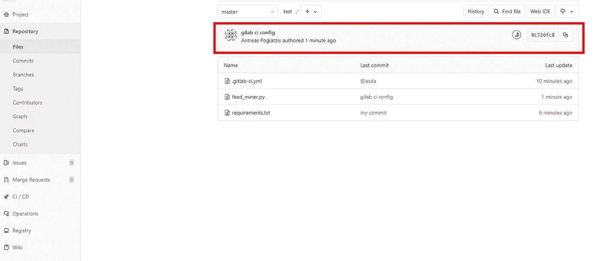
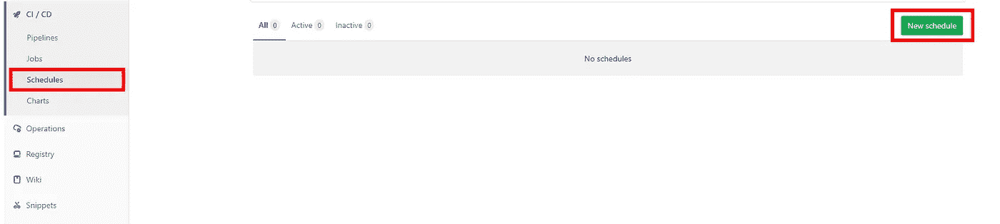
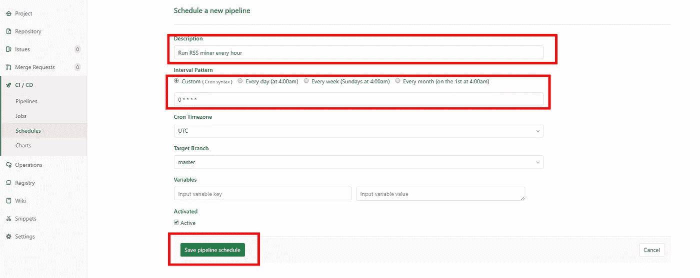
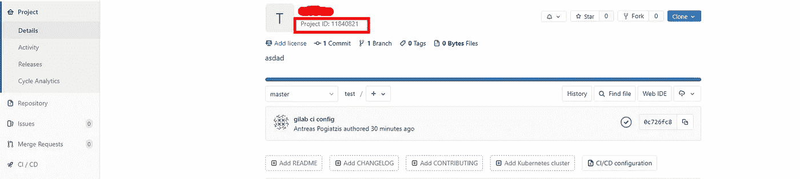
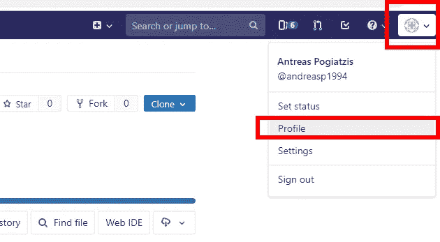
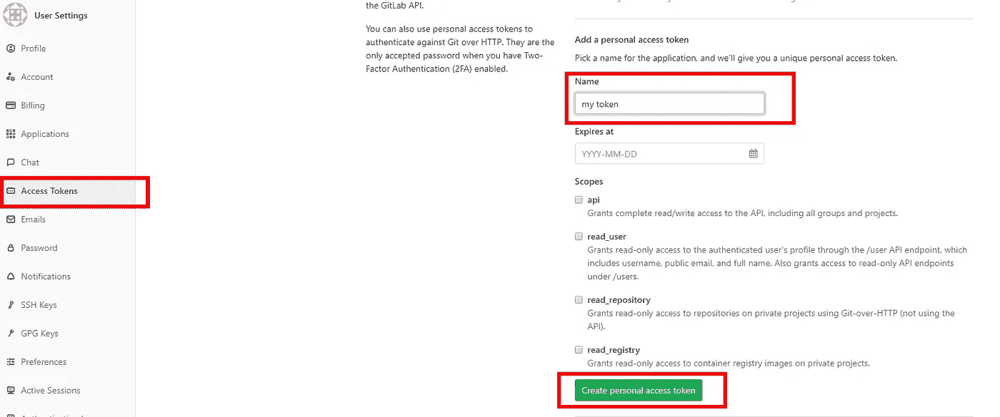
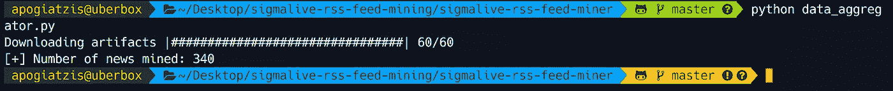

# 使用 Gitlab 的 CI 进行周期性数据挖掘

> 原文：<https://towardsdatascience.com/using-gitlabs-ci-for-periodic-data-mining-b3cc314ecd85?source=collection_archive---------11----------------------->

## 用最少的代码和努力无服务器地周期性挖掘新闻门户 RSS 提要


Photo by [Patrick Lindenberg](https://unsplash.com/photos/1iVKwElWrPA?utm_source=unsplash&utm_medium=referral&utm_content=creditCopyText) on [Unsplash](https://unsplash.com/search/photos/timer-data?utm_source=unsplash&utm_medium=referral&utm_content=creditCopyText)

标准数据科学开发流程中最耗时、最困难的阶段之一是创建数据集。在这种情况下，你已经提供了一个数据集 kudos 给你！你刚刚为自己节省了大量的时间和精力。尽管如此，在许多情况下，情况并非如此。事实上，数据挖掘阶段可能是项目时间表中最没有动力的阶段之一。因此，当有简单和容易的技术来挖掘所需的数据时，它总是有利的。

也就是说，在这篇文章中，我将描述 GitLab 的 CI 管道如何用于周期性的数据挖掘工作，而不需要存储桶、VPSes、外部服务器等等。所以，事不宜迟，让我们在教程潜水。

# 用例

为了实现本教程的价值，我将把这项技术放在一个用例中，这是我正在做的一个附带项目的一部分。更具体地说，我一直在尝试对一个希腊新闻数据集应用一些自然语言处理。因此，我们将使用塞浦路斯新闻门户(【http://www.sigmalive.com】T2)的 RSS 提要来定期获取和存储发布在门户中的新闻文章。

在对该网站的全球 RSS 提要进行了一些初步检查后，发现它返回了最近发表的 25 篇文章。考虑到帖子的频率，每小时拉一次 RSS 提要应该不会错过任何东西。但是即使我们错过了一些，这也不是什么大事。

因此，我需要写一个脚本，让**下载并存储来自** RSS feed 的文章，但是**一直在后台运行**并且**每小时触发一次。这些是我的主要要求。**

# 实施前的一些想法

直觉上，当谈到重复的周期性任务时，cron 作业是最常见的事情。**一种选择是编写一个 python 脚本，作为 cron 作业每小时下载、存储并执行一次。嗯……看起来很简单，但是我需要确保我的电脑 24/7 都可以上网。不太方便。**

或者，**我可以从云提供商那里获得一个 VPS，并在那里运行我的 cron 作业**。听起来似乎可行，但这需要设置 VPS，在远程文件系统中存储新闻文件，并随着时间的推移维护这一切。另外，我需要支付服务器的费用。

> 我的懒惰本能坚持认为应该有更简单的方法…

就在那时，我突然想到了！从 DevOps 的角度来看，我可以创建定期运行的 CI 管道！因为我不想托管任何东西，所以我可以免费使用 Gitlab 的托管 CI 平台。此外，在存储新闻方面，我可以将它们作为 CI 作业的工件公开，然后将它们下载到一起进行聚合。鉴于 Gitlab 每月提供 2000 个免费管道小时，它们应该绰绰有余。

使用 GitLab 的 CI 完成这项任务的另一个额外好处是内置的监控和报告。如果任何管道作业失败，将向您的收件箱发送一封电子邮件。多方便啊？

没有云桶，没有 google drive，没有外部服务器。听起来是个不错的计划。让我们继续讨论实现。

但是在开始之前，我假设你已经有一个 GitLab 帐户，并且知道如何使用 Git。你也可以从这里的[克隆我的库，直接跳到完整的代码。](https://github.com/apogiatzis/sigmalive-rss-feed-miner)

# 履行

为了透明起见，我将使用 Python 3.6.5，但它应该可以在任何 Python 3 版本中工作。

为了获取新闻，我编写了一个 python 脚本，它执行一个普通的 HTTP 请求，解析 XML 并将其保存在一个 JSON 文件中。

事实上，我正在使用 tiny DB(【https://tinydb.readthedocs.io/en/latest/】)一个非常轻量级的 python 包，它在存储中间件之上提供了一个简单而干净的 DB API。(默认情况下，它只是将它们存储在一个 JSON 文件中，这样就可以了)。

以下是脚本源代码:

您可以随意测试代码，但是要确保通过运行以下命令安装了所有附加的依赖项:

```
pip install requests
pip install tinydb
pip install xmltodict
```

太好了，现在是时候做些开发工作了。

首先，我们应该将 python 依赖项导出到 Gitlab 作业的 *requirements.tx* t 文件中:

```
pip freeze > requirements.txt
```

任务列表上的下一件事是通过配置 CI 管道。 *gitlab-ci.yml* 文件:

如果您以前从未见过这些文件，它只是 Gitlab 的一个配置文件，用于了解在每个 CI 管道中执行什么。在上面的配置中，我定义了一个名为“scrape”的阶段(这可以是您喜欢的任何东西)，我在执行脚本之前安装 python 需求，最后在“scrape”作业中运行脚本，目录中的所有 JSON 文件都作为工件公开。

让我们把它付诸实践。创建一个新的 GitLab 存储库，并推送我们刚刚创建的文件。这些应该是:

```
- feed_miner.py
- .gitlab-ci.yml
- requirements.txt
```

如果您导航回 GitLab 项目页面，CI 作业应该已经开始运行。



更重要的是，在 GitLab 中导航到 *CI/CD- > Pipelines* 以获得所有作业状态的概述并下载工件:


下载工件并提取内容证实了我们的脚本在 Gitlab 的 runners 上运行得非常好。但是等一下，我们希望它每小时运行一次！为此，我们将使用 GitLab 的 CI 计划。

导航至 *CI / CD - >日程*并点击*新日程*



填写描述以及希望作业运行的频率。频率应该是 **cron 格式**([http://www.nncron.ru/help/EN/working/cron-format.htm](http://www.nncron.ru/help/EN/working/cron-format.htm))。最后，点击*保存管道进度表。*



你都准备好了！此时，我们有一个脚本，它下载并存储我们需要的新闻，并且每小时运行一次。

然而，工件在每次作业运行时都会被分割，因此我们需要编写另一个脚本来下载我们所有的 JSON 工件，并将它们聚集在一个数据集中。

## 聚集工件

因为我们将使用 GitLab 的 API 来下载工件，所以我们需要获得一些初始信息，比如项目的 ID 和 HTTP 请求的访问令牌。

要查找项目 id，只需导航到项目的 GitLab 页面:



要创建新的访问令牌，请从右上角转到您的配置文件设置:



点击*访问令牌*选项卡，填写令牌名称，点击*创建个人访问令牌:*



令牌应该显示在页面的顶部。把它保存在某个地方，因为我们在接下来的步骤中会用到它。

有了这些，您可以使用下面的脚本来下载所有工件，将它们提取到一个目录中，并加载到内存中:

确保在运行之前已经替换了 *CONFIG* 类中的 ***project-id*** 和 ***access-token*** 值。此外，还需要一个额外的*进程*依赖项，因此您可以继续安装它:

```
pip install progress
```

这是本教程最后需要的部分。在等待了几天之后，我运行了我的聚合脚本，我的数据集中已经有 340 个不同的新闻条目了！整洁！



# 概述

如果您遵循了前几节中的所有步骤，您应该会得到以下文件:

```
- feed_miner.py
- requirements.txt
- aggregate.py
- .gitlab-ci.yml
```

其中包括:

1.  一个将 RSS 提要下载并存储到 json 文件的脚本。
2.  Gitlab CI 配置文件，定义了安装 python 依赖项和运行 miner 脚本的管道。(计划每小时运行一次)
3.  一个聚合脚本，从成功的作业中下载所有工件，提取它们并读取内存中的所有新闻记录，同时删除重复项。

有了这些，您就可以高枕无忧了，因为数据正在被挖掘并存储在您的 Gitlab 存储库中。一个潜在的改进是创建另一个管道，大约每周运行一次聚合脚本，并创建一个 csv 文件，但是进一步的数据处理完全取决于您。

我希望你喜欢这个教程！你可以在我的 github 库[这里](https://github.com/apogiatzis/sigmalive-rss-feed-miner)找到完整的代码。