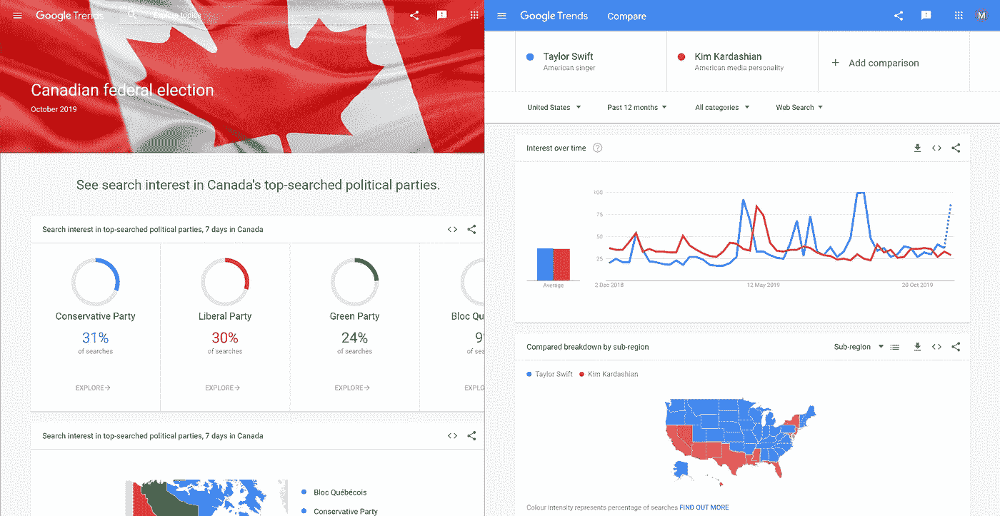
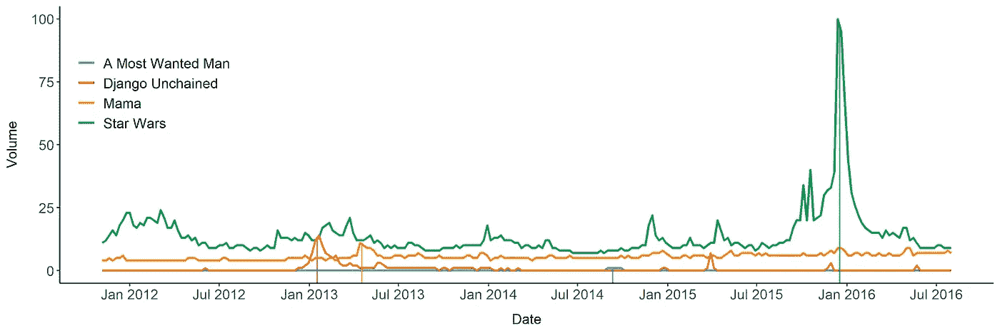
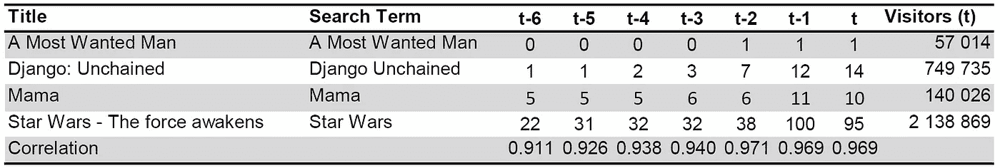
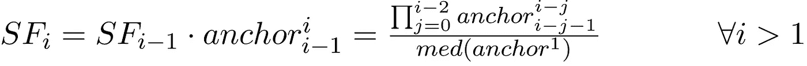
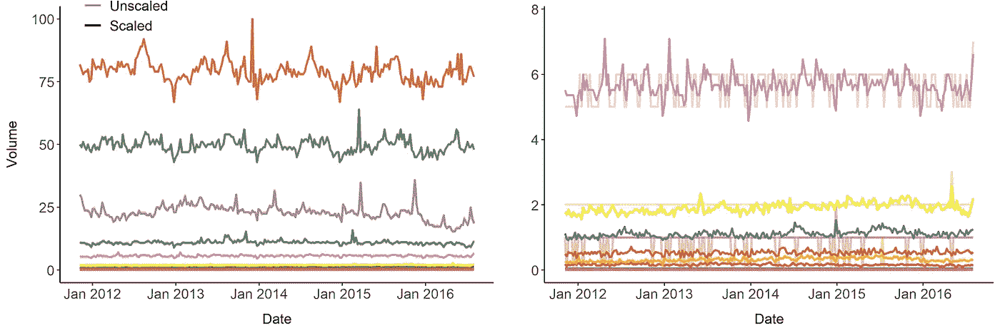
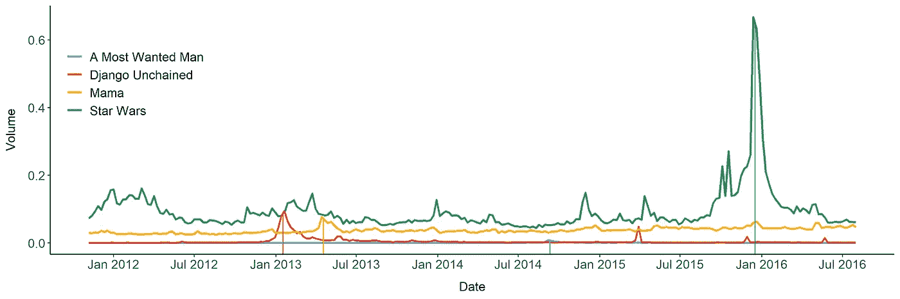
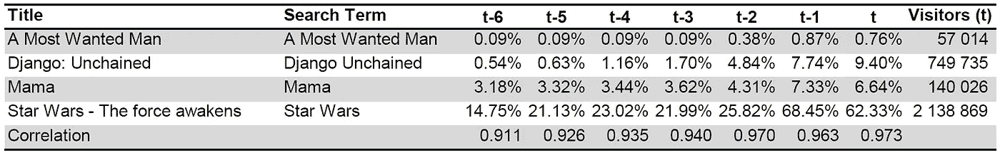
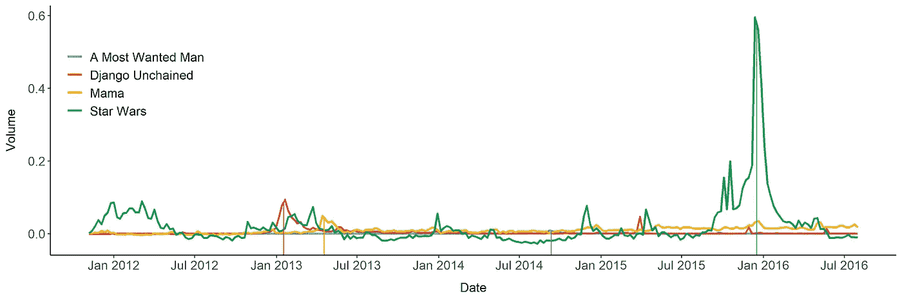
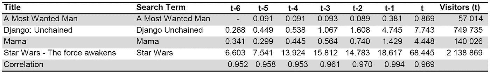

# 使用谷歌趋势数据来利用你的预测模型

> 原文：<https://towardsdatascience.com/using-google-trends-data-to-leverage-your-predictive-model-a56635355e3d?source=collection_archive---------12----------------------->

在预测模型中使用谷歌趋势数据有一些缺陷。本文描述了一种使 Google 趋势数据可用于模型的方法，通过使用 Google 搜索量预测电影成功的实际例子来提供突破性的结果。

自 2006 年发布以来，[谷歌趋势](https://trends.google.de/trends/?geo=DE)成为人们可能想到的任何主题的搜索量的综合信息来源——从 2019 年 10 月[加拿大大选](https://trends.google.com/trends/story/US_cu_7mKsiWsBAAApaM_en)的信息内容到美国哪个州对泰勒·斯威夫特更感兴趣以及哪个州更喜欢搜索金·卡戴珊的不太相关的数据。

Source: [Google Trends](https://trends.google.com/trends)

当然，如果发现如此丰富的数据源，首先想到的是如何在您的模型中利用它。然而，也有一些陷阱:

1.  一次只能获得 5 个搜索词的数据
2.  Google Trends 对数据进行了缩放，使其对用户而言具有可比性，但对模型而言则不具可比性
3.  即使你能够以一种无标度的方式得到每一个搜索词，由于搜索词的模糊性，它仍然可能是有偏见的

尽管如此，在我的研究生课程期间，我从事了一个项目，该项目需要使用谷歌趋势数据来预测电影在首映周末的成功。我们和一名同学一起开发了一种方法，使数据变得可用，并将其输入到模型中。遗憾的是，我一直没有抽出时间来重构代码，放到 github 上。直到现在。该项目的 R 代码可在此处找到，并且将参照该项目描述使 Google Trends 数据可用于任何类型的预测模型的一般方法

我们收到了一个约 900 部电影的数据集，其中包含类型、评级、制片厂等信息，当然还有首映周末的观影人数。受谷歌自己发布的白皮书的启发，我们试图从谷歌趋势收集数据，以将搜索量纳入我们的预测模型。在谷歌搜索上捕捉 900 部电影的流行度是一项艰巨的任务，主要是由于 3 个事实。首先，一次只能提取 5 个搜索词的数据。这个问题可以很容易地通过分块搜索词来解决。然而，这导致了块之间不可比的结果。其次，电影名称并不总是模糊的，这意味着搜索 [*【被解放的姜戈】*](https://www.imdb.com/title/tt1853728/) 几乎肯定会将你带到与塔伦蒂诺电影相关的结果，而搜索像 [*希区柯克*](https://www.imdb.com/title/tt0975645/) 这样的传记电影可能会导致关于导演本身的网页。第三，谷歌上的搜索词的搜索量信息不是以可评估的形式公开提供的，这意味着谷歌趋势只提供自然数，从而在观察的时间和地理框架中的最大相对值被缩放到 100，这使得不可能将像 [*《星球大战——原力觉醒》*](https://www.imdb.com/title/tt2488496/) 这样的电影与像 [*《头号通缉犯》*](https://www.imdb.com/title/tt1972571/) 这样的独立电影进行比较，因为*《头号通缉犯》*的量即使不总是被缩放，也大多会被缩放因此，使谷歌趋势数据可用于预测模型的主要任务有三个方面:

1.  获取所有感兴趣的搜索词的可比数据
2.  从艺术电影到大片，将数据换算成所有电影的真实值
3.  确保所提供的请求仅涉及电影

为了获得捕捉人们对电影的兴趣的 KPI，定义了 3 个可能的搜索词的线性组合。这些搜索词分别是电影主标题(如*《霍比特人》*)、电影主标题+后缀*电影*(德语为*电影*)和完整标题(如 [*《霍比特人:意外之旅》*](https://www.imdb.com/title/tt0903624/) )。根据谷歌发表的这篇文章[,搜索词的绝对搜索量除以给定时间和地理范围内的总搜索量。](https://medium.com/google-news-lab/what-is-google-trends-data-and-what-does-it-mean-b48f07342ee8#.3efc7z5l9)

> 对讲故事最有用的是我们的标准化趋势数据。这意味着，当我们查看一段时间内对某个主题的搜索兴趣时，我们会将该兴趣视为在该时间和地点谷歌上对所有主题的所有搜索的比例。当我们查看某个主题的区域搜索兴趣时，我们是在查看某个给定区域中该主题的搜索兴趣占同一时间同一地点谷歌上所有主题的所有搜索的比例。

在此之后，数据被归一化到从 0 到 100 的自然数范围，由此五个转换的查询结果的相对最大值被缩放到 100。

> 我们的数据背景也很重要。我们将数据索引为 100，其中 100 是所选时间和地点的最大搜索兴趣。

这导致不可比的值，使得预测不可行。

Google Trends data for the search terms Django Unchained, A most wanted Man, Mama and Star Wars. Vertical lines mark the premiere date of each movie.

上面的图显示了电影*星球大战——原力觉醒*、*被解放的姜戈、* [*妈妈*](https://www.imdb.com/title/tt2023587/) 和 [*通缉犯*](https://www.imdb.com/title/tt1972571/) 的谷歌趋势数据。垂直线标志着这些电影的首映日期。显而易见,《星球大战》甚至远远超过了像《被解放的姜戈》这样的大片。相比之下，Mama(德语中妈妈的意思)的得分稳定在 5 分左右，仅在所谓的电影首映前几周略有上升。*《头号通缉犯》*即使在首映周也是定值 0，因此根本没有可比性。首映前 6 周的搜索词的确切数据如下:

Search volume for the movies 6 weeks prior premiere date t

表格中的最后一行显示了首映周末在时间 *t.* 的搜索量和实际访客数量之间的相关性。相关性本身已经非常高了，但是特别是*和头号通缉犯*的数量根本不能用于预测，而*和*的数量似乎有很大偏差。

好吧，但是如何克服这些问题呢？让我们解决一个又一个问题。首先，让我们将数据相互比较，得到真实值而不是自然数，以便得到可用的数据，即使是对一个头号通缉犯*。我们可以通过引入锚定条款计划来实现这一点。这背后的想法是为每个*搜索词的*创建一个到*单个值的关系。*为此，我们需要定义一个锚项列表，其搜索量尽可能随时间保持不变，以防止扰乱搜索项的标准化。城市或报纸是这类术语的一个好选择；从大城市开始，继续到地方报纸。第一个锚点由其自己的中值标准化，以获得第一个缩放因子:*

为了将每个搜索项链接到第一个锚点的中间值，有必要自上而下地链接锚点。为此，计算 s *缩放因子*作为一个锚和下一个较低锚项的搜索量的分数。比例因子的一般公式由下式给出:

为了制作类似《星球大战——原力觉醒》和《头号通缉犯》的电影，搜索词被从上到下提取并链接到锚词。因此，在第一步中，使用第一锚点绘制搜索项，并使用其缩放因子进行缩放。级别 *i* 的缩放搜索量现在给出为

如果感兴趣的时间窗口内的搜索词的最大缩放搜索量低于缩放锚的给定百分比(在我们的项目中我们使用 25%)，则必须用下一个较低的锚词来重新绘制。链接的锚项的结果(以及每个级别 *i* 的缩放因子)如下所示，其中右边的图只是放大了低级锚项。

Scaling factors used in the project

特别是在右侧，可以看到缩放搜索项的效果。未缩放的粉红色搜索词的数量大多在 5 到 6 之间，而缩放版本的数量介于两者之间。将这种缩放方法应用于我们感兴趣的 4 部电影的搜索词，会产生下面的图。

Scaled Google Trends data for the search terms Django Unchained, A most wanted Man, Mama and Star Wars. Vertical lines mark the premiere date of each movie.

仅通过观察该图，人们可能看不出与第一个图相比有如此大的差异，除了 y 轴现在在 0 和 1 之间缩放，而不是在 0 和 100 之间。这是因为我们现在看到的数字是相对于第一个锚项的中值进行缩放的。换句话说,《星球大战》现在在首映周末的搜索量是第一个主播词中值的 65%。四舍五入后的数字如下。

Scaled search volume for the movies 6 weeks prior premiere date t

相关性的微小改善并不值得，但看看一个头号通缉犯的数字，你会注意到它们现在是实值的，这意味着我们解决了第一个问题:数据现在是可比较的，因为我们根据固定的绝对值对其进行了缩放，这样做甚至变得实值化和更具信息性。然而，*妈妈*的数字似乎还是太高了。为了解决这个问题，我们简单地减去我们感兴趣的时间范围之前的时间序列的中值。

下图显示了 4 部电影在减去预测范围第一天前 52 周(即首映前 58 周)每个时间序列的中值后的谷歌趋势数据。

Scaled Google Trends data for the search terms Django Unchained, A most wanted Man, Mama and Star Wars after median substraction. Vertical lines mark the premiere date of each movie.

这张图说明了中位数减法的用处。每个搜索项在其首播日支配所有其他搜索项。甚至在 2014 年 8 月首播的《头号通缉犯*T5》中，蓝线也占据了其他所有搜索词的首位。请注意，这并不意味着*一个头号通缉犯*在那段时间里比*星球大战*被谷歌搜索的次数更多，而是一个头号通缉犯的搜索量比前 52 周的中位数高 1 个百分点，而*星球大战*的搜索量比相应的中位数低 5 个百分点。所有的数据点仍然是相对于上锚位进行缩放的。*

Scaled search volume for the movies 6 weeks prior premiere date t after median substraction Multiplied by factor 100.

下表显示了减去中位数后每个搜索项的数字。看看《妈妈》*的数字，我们发现我们能够解决我们的模糊问题，因为它们不再像《被解放的姜戈》的数字那么高了——如果你看看访问者的数量，这就说得通了。与未缩放的数据相比，这导致了更高的相关性，并允许我们在我们的模型中使用它的无偏版本来预测首映周末的电影观众数量。*

*如上所述，该项目的代码，也包括预测模型和进一步的描述性分析，在 [github](https://github.com/mcschmitz/box_office_success_prediction) 上，可以适应任何用例。记住锚词的重要之处:它们必须尽可能的稳定，并且应该与你所在的地区相关。使用我们的美国或印度谷歌趋势数据的锚词列表根本行不通，因为(我假设)在洛杉矶或钦奈没有人会对在阿尔高出版的本地报纸感兴趣。*