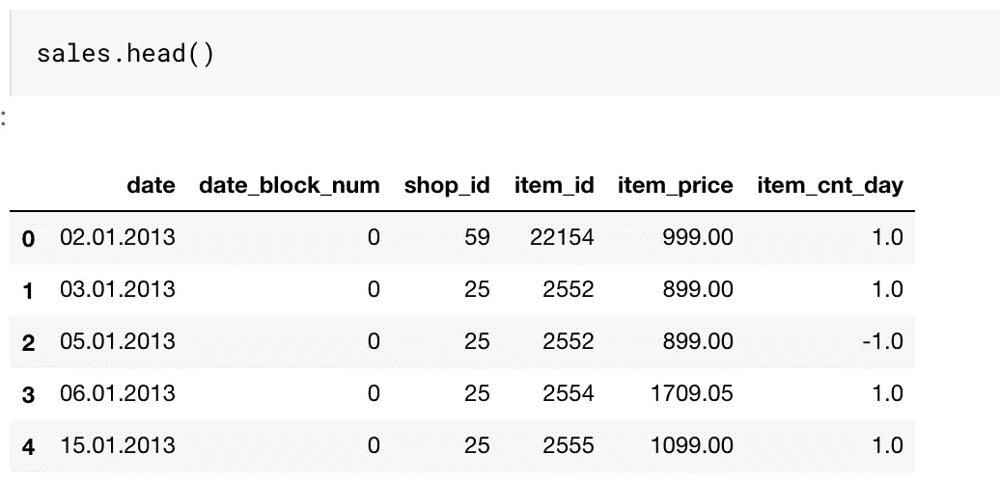
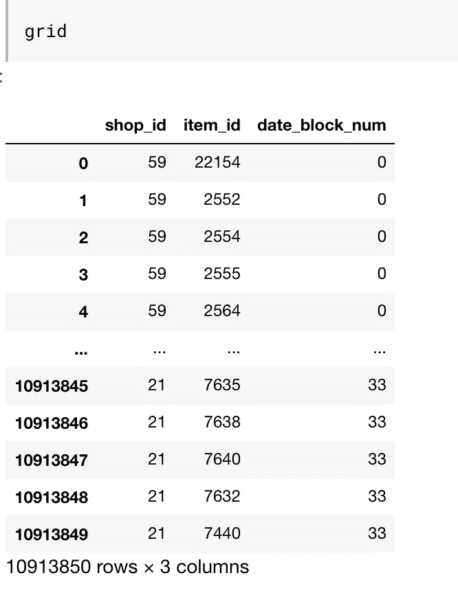
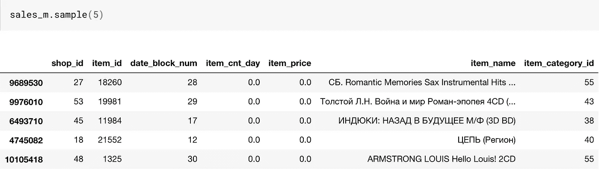
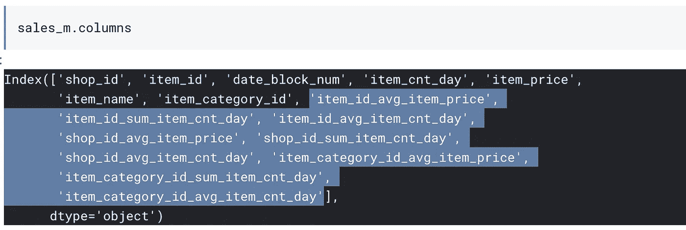
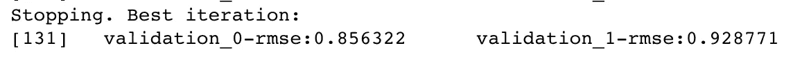
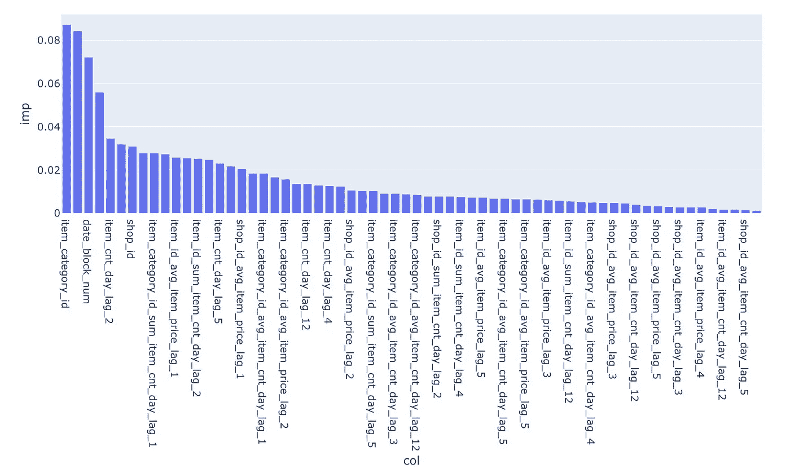
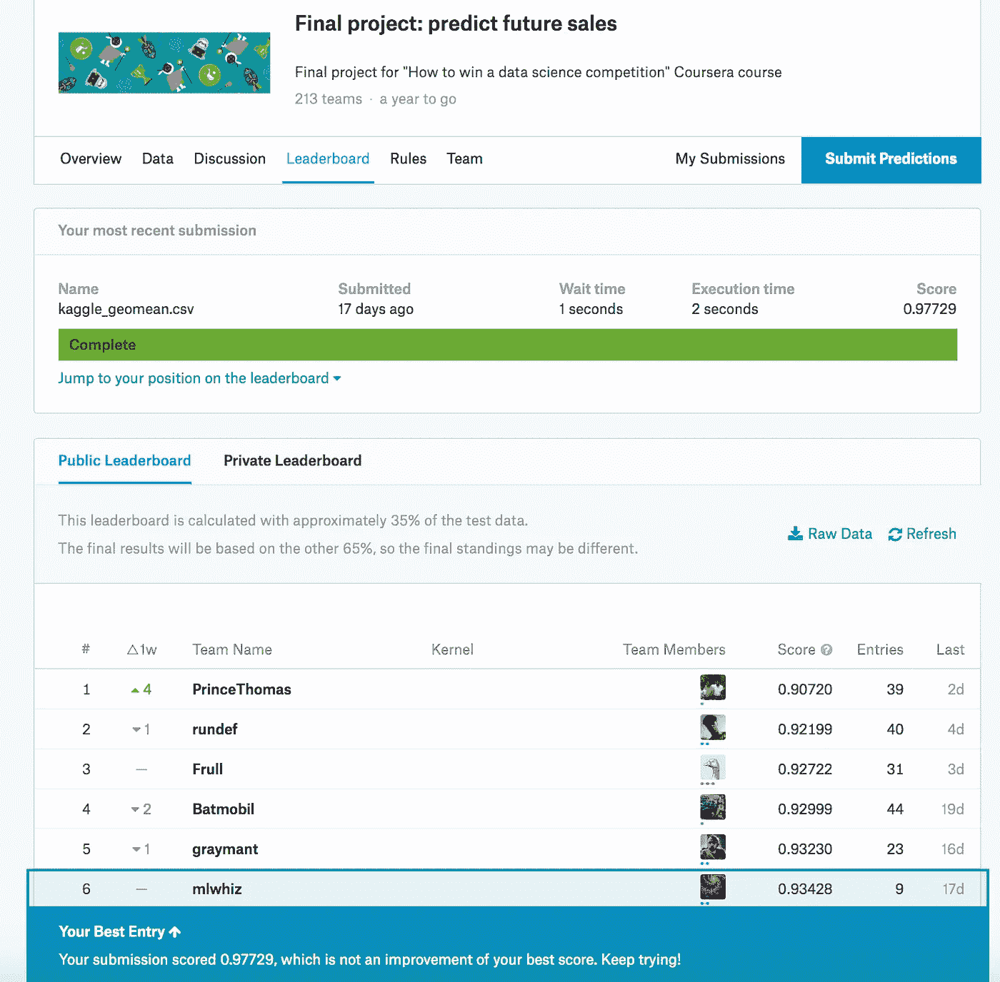

# 对时间序列预测任务使用梯度增强

> 原文：<https://towardsdatascience.com/using-gradient-boosting-for-time-series-prediction-tasks-600fac66a5fc?source=collection_archive---------3----------------------->


[Pixabay](https://pixabay.com/?utm_source=link-attribution&utm_medium=referral&utm_campaign=image&utm_content=1149701)

## 简单的时间序列建模

时间序列预测问题在零售领域相当常见。

像沃尔玛和塔吉特这样的公司需要记录有多少产品应该从配送中心运送到商店。在劳动力管理、库存成本和缺货损失方面，即使对这种需求预测系统进行很小的改进也可以帮助节省大量的美元。

虽然有许多技术来解决这个特殊的问题，如 ARIMA，先知和 LSTMs，我们也可以把这样的问题作为一个回归问题，并使用树来解决它。

***在本帖中，我们将尝试使用 XGBoost 解决时间序列问题。***

***我要关注的主要事情是这样一个设置需要什么样的功能，以及如何创建这样的功能。***

# 资料组


Kaggle 大师 Kazanova 和他的一些朋友一起发布了一个[“如何赢得数据科学竞赛”](https://www.coursera.org/specializations/aml?siteID=lVarvwc5BD0-BShznKdc3CUauhfsM7_8xw&utm_content=2&utm_medium=partners&utm_source=linkshare&utm_campaign=lVarvwc5BD0) Coursera 课程。这门课程包括一个期末专题，它本身是一个时间序列预测问题。

在这场比赛中，我们得到了一个由日常销售数据组成的具有挑战性的时间序列数据集，该数据集由俄罗斯最大的软件公司之一 1C 公司提供。

我们必须预测下个月每个产品和商店的总销售额。

数据如下所示:



我们得到了每天的数据，我们希望建立一个模型来预测下个月每个产品和商店的总销售额。

变量 date_block_num 是一个连续的月数，为方便起见而使用。2013 年 1 月为 0，2015 年 10 月为 33。你可以把它看作月变量的代理。我认为所有其他变量都是不言自明的。

那么我们如何处理这类问题呢？

# 数据准备

我注意到的主要事情是，当我们试图使用回归来解决时间序列问题时，数据准备和[特征生成](/the-hitchhikers-guide-to-feature-extraction-b4c157e96631)方面是最重要的事情。

## 1.进行基本的 EDA 并去除异常值

```
sales = sales[sales['item_price']<100000]
sales = sales[sales['item_cnt_day']<=1000]
```

## 2.按照您希望的预测级别对数据进行分组:

我们首先创建一个不同的日期块数量、商店和商品组合的数据框架。

这一点很重要，因为在我们没有商品商店组合数据的几个月里，机器学习算法需要被明确告知销售额为零。



网格数据框架包含所有商店、商品和月份的组合。

然后，我们将网格与销售额合并，得到月销售额数据框架。对于没有任何销售的月份，我们也用零替换所有的 NA。



## 3.创建目标编码

为了创建目标编码，我们按特定的列分组，并取平均值/最小值/总和等。目标列的名称。这些特征是我们在模型中创建的第一个特征。

***请注意，这些特性可能会在我们的系统中引起大量泄漏/过拟合，因此我们不会在模型中直接使用它们。我们将在接下来创建的模型中使用这些特性的基于滞后的版本。***

我们按`item_id`、`shop_id`和`item_category_id`分组，并在`item_price`和`item_cnt_day`列上聚合，以创建以下新特性:



We create the highlighted target encodings

我们也可以为此使用[特征工具](/the-hitchhikers-guide-to-feature-extraction-b4c157e96631)。**特征工具**是一个执行自动化特征工程的框架。它擅长将时态和关系数据集转换为机器学习的特征矩阵。

## 4.创建滞后要素

我们的模型需要的下一组特征是基于滞后的特征。

当我们创建常规分类模型时，我们将训练示例视为彼此完全独立。但在时间序列问题的情况下，在任何时间点，模型都需要过去发生的信息。

我们不能对过去的所有日子都这样做，但是我们可以使用我们的目标编码特征为模型提供最新的信息。

因此，我们的目标是在数据中添加一些特征的过去信息。我们为我们创建的所有新功能和`item_cnt_day`功能都这样做。

一旦有了滞后特性，我们就用零填充 NA。

我们最终创建了许多具有不同滞后的滞后特征:

```
'item_id_avg_item_price_lag_1','item_id_sum_item_cnt_day_lag_1', 'item_id_avg_item_cnt_day_lag_1','shop_id_avg_item_price_lag_1', 'shop_id_sum_item_cnt_day_lag_1','shop_id_avg_item_cnt_day_lag_1','item_category_id_avg_item_price_lag_1','item_category_id_sum_item_cnt_day_lag_1','item_category_id_avg_item_cnt_day_lag_1', 'item_cnt_day_lag_1','item_id_avg_item_price_lag_2', 'item_id_sum_item_cnt_day_lag_2','item_id_avg_item_cnt_day_lag_2', 'shop_id_avg_item_price_lag_2','shop_id_sum_item_cnt_day_lag_2', 'shop_id_avg_item_cnt_day_lag_2','item_category_id_avg_item_price_lag_2','item_category_id_sum_item_cnt_day_lag_2','item_category_id_avg_item_cnt_day_lag_2', 'item_cnt_day_lag_2',...
```

# 系统模型化

## 1.删除不需要的列

如前所述，我们将删除目标编码特征，因为它们可能会导致模型中的大量过度拟合。我们还失去了项目名称和项目价格功能。

## 2.只取最近的一点数据

当我们创建滞后变量时，我们在系统中引入了很多零。我们使用的最大滞后为 12。为了应对这种情况，我们删除了前 12 个月的指数。

```
sales_means = sales_means[sales_means['date_block_num']>11]
```

## 3.训练和 CV 分割

当我们进行时间序列分割时，我们通常不进行横截面分割，因为数据是与时间相关的。我们想创建一个模型，看到现在，并能很好地预测下个月。

```
X_train = sales_means[sales_means['date_block_num']<33]
X_cv =  sales_means[sales_means['date_block_num']==33]Y_train = X_train['item_cnt_day']
Y_cv = X_cv['item_cnt_day']del X_train['item_cnt_day']
del X_cv['item_cnt_day']
```

## 4.创建基线


在我们继续建模步骤之前，让我们检查一个简单模型的 RMSE，因为我们想让[有一个与](/take-your-machine-learning-models-to-production-with-these-5-simple-steps-35aa55e3a43c)比较的 RMSE。我们假设我们将预测上个月的销售额作为基线模型的本月销售额。我们可以使用这个基线 RMSE 来量化我们模型的性能。

```
1.1358170090812756
```

## 5.列车 XGB

我们使用来自`xgboost` scikit API 的 XGBRegressor 对象来构建我们的模型。参数取自这个 [kaggle 内核](https://www.kaggle.com/dlarionov/feature-engineering-xgboost)。有时间的话可以用 hyperopt 来[自动自己找出超参数](/automate-hyperparameter-tuning-for-your-models-71b18f819604)。

```
from xgboost import XGBRegressormodel = XGBRegressor(
    max_depth=8,
    n_estimators=1000,
    min_child_weight=300, 
    colsample_bytree=0.8, 
    subsample=0.8, 
    eta=0.3,    
    seed=42)model.fit(
    X_train, 
    Y_train, 
    eval_metric="rmse", 
    eval_set=[(X_train, Y_train), (X_cv, Y_cv)], 
    verbose=True, 
    early_stopping_rounds = 10)
```



运行这个之后，我们可以在 CV 集上看到 RMSE 在 ***0.93*** 的范围内。基于我们对 ***1.13*** 的基线验证 RMSE，这是非常令人印象深刻的。因此，我们致力于部署这个模型，作为我们持续集成工作的一部分。

## 5.地块特征重要性

我们还可以看到来自 XGB 的重要特性。



Feature importances

# 结论

在这篇文章中，我们讨论了如何使用树进行时间序列建模。目的不是在 kaggle 排行榜上获得满分，而是了解这些模型是如何工作的。



几年前，当我作为[课程](https://www.coursera.org/specializations/aml?siteID=lVarvwc5BD0-BShznKdc3CUauhfsM7_8xw&utm_content=2&utm_medium=partners&utm_source=linkshare&utm_campaign=lVarvwc5BD0)的一部分参加这个比赛时，通过使用树木，我接近了排行榜的顶端。

随着时间的推移，人们在调整模型、超参数调整和创建更多信息功能方面做了大量工作。但是基本方法保持不变。

你可以在 [GitHub](https://github.com/MLWhiz/data_science_blogs/tree/master/time_series_xgb) 上找到完整的运行代码。

看看 Google Cloud Specialization 上的[高级机器学习。本课程将讨论模型的部署和生产。绝对推荐。](https://coursera.pxf.io/5bDx3b)

将来我也会写更多初学者友好的帖子。让我知道你对这个系列的看法。在[](https://medium.com/@rahul_agarwal)**关注我或者订阅我的 [**博客**](https://mlwhiz.ck.page/a9b8bda70c) 了解他们。一如既往，我欢迎反馈和建设性的批评，可以通过 Twitter [@mlwhiz](https://twitter.com/MLWhiz) 联系。**

**此外，一个小小的免责声明——这篇文章中可能会有一些相关资源的附属链接，因为分享知识从来都不是一个坏主意。**