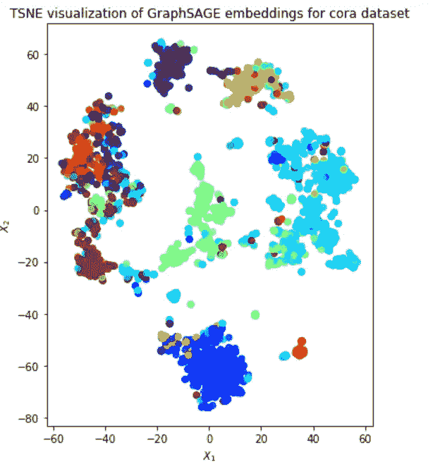

# 使用 GraphSAGE 学习 CORA 中的论文嵌入

> 原文：<https://towardsdatascience.com/using-graphsage-to-learn-paper-embeddings-in-cora-a94bb1e9dc9d?source=collection_archive---------12----------------------->

## 这里我们使用 stellargraph 库通过 GraphSAGE 算法学习 CORA 上的论文嵌入。

# **简介**

CORA[1]是七个不同班级的学术论文的数据集。它包含论文之间的引用关系，以及每篇论文的二进制向量，该向量指定某个单词是否出现在论文中。因此，CORA 包含每篇论文的基于内容的特征和论文之间的关系特征。我们可以用一个网络来模拟这些特征，在这个网络中，每篇论文用一个节点来表示，这个节点带有基于内容的特征，引用用边来表示。

> 利用图模型，我们可以使用几何深度学习方法来学习每篇论文的嵌入。在这个故事中，我们使用 GraphSAGE。

GraphSAGE 是一种无监督的节点嵌入算法，因其在大型图上的成功而闻名。它可以利用节点特征和节点关系来学习表示图中邻域结构的每个节点的向量。要阅读更多关于 GraphSAGE 的内容，你可以参考链接中的故事。

[](/an-intuitive-explanation-of-graphsage-6df9437ee64f) [## GraphSAGE 的直观解释

### 归纳学习在动态数据集中很有用。这里我们讨论一个关于图的归纳学习算法。

towardsdatascience.com](/an-intuitive-explanation-of-graphsage-6df9437ee64f) 

为了实现 GraphSAGE，我们使用了一个 Python 库 *stellargraph* ，其中包含了几种流行的几何深度学习方法的现成实现，包括 GraphSAGE。stellargraph 的安装指南和文档可以在[这里](https://stellargraph.readthedocs.io/en/stable/)找到。此外， ***本文中使用的代码基于该库的 GitHub 库[2]中的示例。***

# **图形创建**

stellargraph 库使用 *StellarGraph* 对象来表示图形。幸运的是，我们可以很容易地从 networkx 图中初始化 StellarGraph 对象。因此，我们通过将 CORA 中的链接视为一个*边列表*来创建一个 networkx 图。请注意，这将自动创建必要的节点。然后，我们通过解析 *cora.content* 文件并从 1 到唯一单词数(1433)索引每个唯一单词，向每个节点添加基于内容的特性。我们还将这些特性分别存储在一个名为 *node_features* 的变量中。我们使用这些特性来创建一个 StellarGraph 对象。

```
**cora_dir = './cora/'
edgelist = pd.read_csv(cora_dir+'cora.cites, sep='\t', header=None, names=['target', 'source'])
edgelist['label'] = 'cites'** # set the edge type**Gnx = nx.from_pandas_edgelist(edgelist, edge_attr='label')
nx.set_node_attributes(Gnx, 'paper', 'label')**# Add content features **feature_names = ["w_{}".format(ii) for ii in range(1433)]
column_names =  feature_names + ['subject']
node_data = pd.read_csv(data_dir+'cora.content), sep='\t', header=None, names=column_names)
node_features = node_data[feature_names]**# Create StellarGraph object
**G = sg.StellarGraph(Gnx, node_features=node_features)**
```

多亏了 networkx 和 pandas，我们将 CORA 加载到 networkx 图中，然后只用几行代码就创建了一个 StellarGraph 对象。我们现在可以使用创建的对象来实现 GraphSAGE。

# 模特培训

为了实现 GraphSAGE，我们将使用 stellargraph 中的模块。stellargraph 包含一个 *UnsupervisedSampler* 类，用于从图中对给定长度的多个行走进行采样。我们还使用 *GraphSAGELinkGenerator* 来生成损失函数中需要的边。注意，GraphSAGE 利用链路预测任务为相邻节点创建类似的嵌入。生成器根据采样的行走创建边。

```
# Specify model and training parameters **nodes = list(G.nodes())
number_of_walks = 1
length = 5
batch_size = 50
epochs = 4
num_samples = [10, 5]****unsupervised_samples = UnsupervisedSampler(G, nodes=nodes, length=length, number_of_walks=number_of_walks)****train_gen = GraphSAGELinkGenerator(G, batch_size, num_samples)
                                   .flow(unsupervised_samples)**
```

生成了遍历和链接生成器之后，我们现在定义并构建 GraphSAGE 模型。构建的对象返回输入/输出占位符，供我们稍后填充。基于输出占位符，我们添加一个具有 sigmoid 激活的预测层，因为链接预测是一个二元分类问题。

```
**layer_sizes = [50, 50]
graphsage = GraphSAGE(layer_sizes=layer_sizes, generator=train_gen, bias=True, dropout=0.0, normalize='l2')**# Build the model and expose input and output sockets of graphsage, # for node pair inputs **x_inp, x_out = graphsage.build()****prediction = link_classification(output_dim=1, output_act='sigmoid', edge_embedding_method='ip')(x_out)**
```

最酷的部分来了！我们可以使用预测层和输入占位符来创建一个 *keras* 模型，并训练它学习嵌入！由于 stellargraph 在其代码中使用了 keras 的层，每个实现的图算法都与 keras 兼容。因此，我们可以以本机方式使用 keras 的实用程序，如损失跟踪和超参数调整。

```
**model = keras.Model(inputs=x_inp, outputs=prediction)****model.compile(
    optimizer=keras.optimizers.Adam(lr=1e-3),
    loss=keras.losses.binary_crossentropy,
    metrics=[keras.metrics.binary_accuracy],
)****history = model.fit_generator(
    train_gen,
    epochs=epochs,
    verbose=1,
    use_multiprocessing=False,
    workers=4,
    shuffle=True,
)**
```

我们已经训练了边缘预测模型来学习纸张嵌入。给定一个节点，我们可以使用这个模型创建一个嵌入生成器。为此，我们创建另一个名为 *embedding_model* 的 keras 模型，并创建一个 *GraphSAGENodeGenerator* 对象。结合这两个，我们可以获得每篇论文在 CORA 中的嵌入情况！

```
**x_inp_src = x_inp[0::2]
x_out_src = x_out[0]
embedding_model = keras.Model(inputs=x_inp_src, outputs=x_out_src)****node_ids = node_data.index
node_gen = GraphSAGENodeGenerator(G, batch_size,num_samples) 
                                             .flow(node_ids)****node_embeddings = embedding_model.predict_generator(node_gen, workers=4, verbose=1)**
```

为了验证这些嵌入是有意义的，我们使用 TSNE 在 2D 上绘制了结果嵌入。我们根据数据集中的类别对每篇论文进行着色，并观察到该类别的论文在图中被分组在一起。鉴于我们在训练中没有利用职业标签，这是一个惊人的结果！



2D visualization of paper embeddings learned by GraphSAGE [2].

# 结论

在这个故事中，我们在 CORA 数据集上运行 GraphSAGE，并学习了论文嵌入。我们使用了 *stellargraph* 库，因为它提供了一个易于使用的接口，并且与 networkx 和 keras 库兼容。多亏了 stellargraph，我们可以快速尝试不同的几何不同学习方法，并比较它们的结果。这使得 stellargraph 成为创建基线和尝试基于网络的方法来解决手头问题的理想起点。

## 参考

[1] [科拉](https://relational.fit.cvut.cz/dataset/CORA)

[2] s [tellargraph GitHub](https://github.com/stellargraph/stellargraph/blob/master/demos/embeddings/embeddings-unsupervised-graphsage-cora.ipynb)