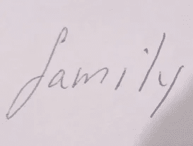
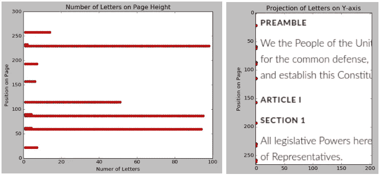
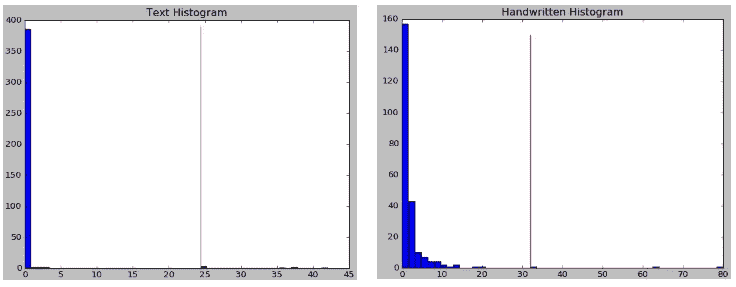
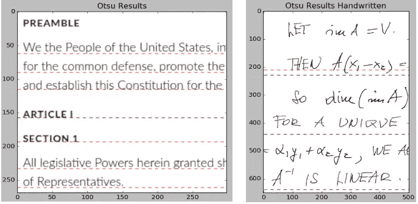
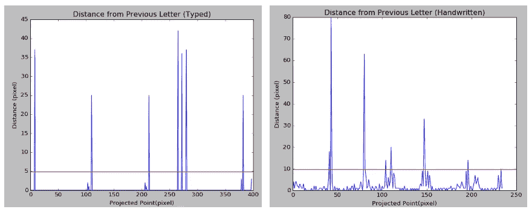
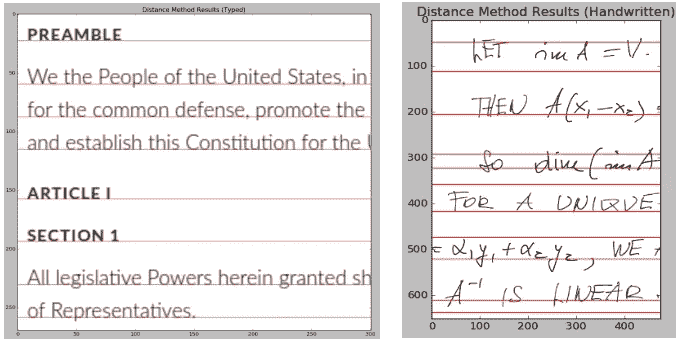
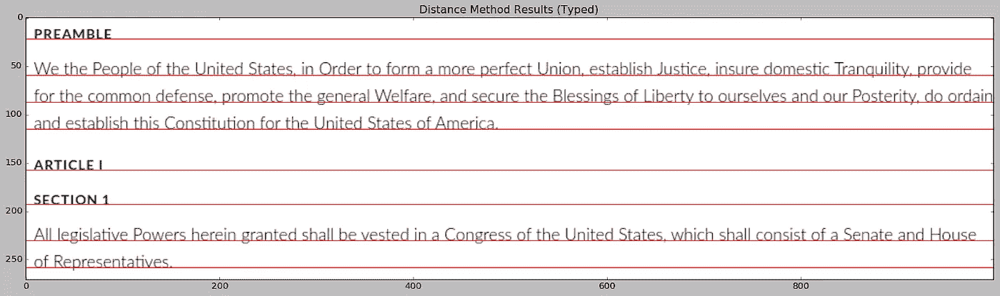
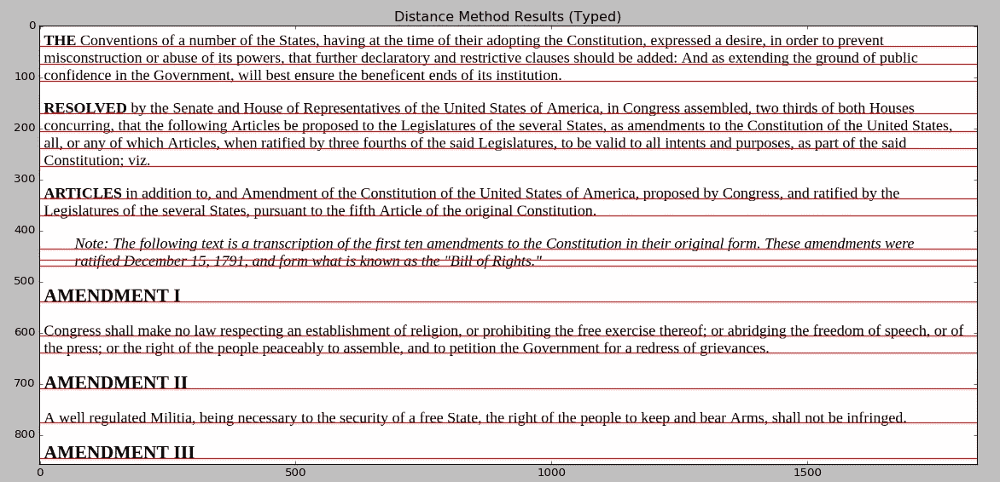
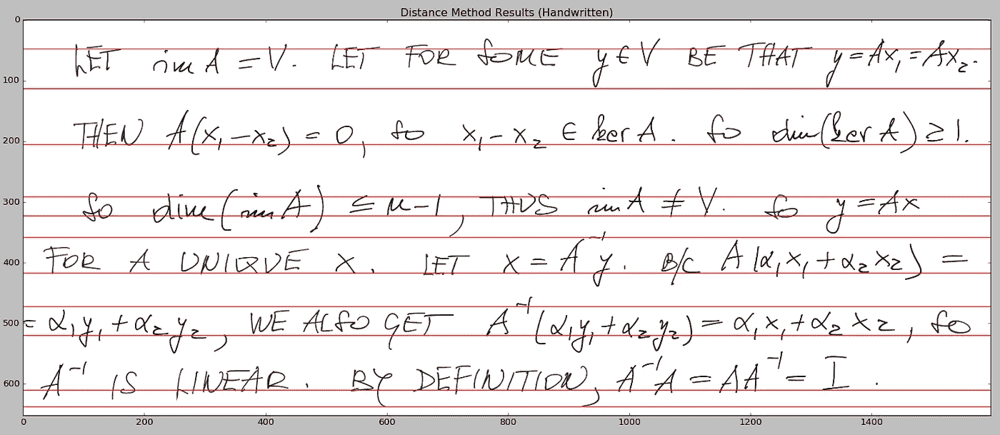

# 使用图像数据确定文本结构

> 原文：<https://towardsdatascience.com/using-image-data-to-determine-text-structure-5c361e76aae?source=collection_archive---------8----------------------->

Painting by Patrick Henry Bruce

## 点点滴滴，循线而行

在我之前的[文章](https://medium.com/@theclassytim/using-image-processing-to-detect-text-8be34c677c11)中，我讨论了如何实现相当简单的图像处理技术来检测图像中的文本斑点。实际上，该算法只不过是在图像中找到高对比度的像素区域。然而，这个简单的过程仍然为基本的光学字符识别(OCR) Python 脚本奠定了基础。

在这篇文章中，我将讨论对前面的代码所做的添加。具体来说，我感兴趣的是通过将字母分配到它们所属的行来检测文本的结构。为了使算法更加稳健，我将结合字母“I”和“j”上面的点。阅读本系列文章的读者会记得，在前面的过程中，字母上面的点被认为是独立的对象。正如后面将要说明的，这些点会干扰图像中的检测线。

## **观察差距**

说实话，在解决点问题之前，我已经开始探索线检测。由于我对如何实现线检测有一个模糊的理解，清理点和它们的父符号之间的间隙是一个相当大的设计决策。一种想法是使用图像中的数据，我最终需要这些数据来进行线条检测。但是这种方法感觉太不稳定了。或者，使用点的几何属性及其与周围字母的关系的解决方案似乎是更具体的解决方案。

我还是做了一些假设。首先，我认为圆点并不常见。此外，我假设一个点将有一个小面积的手写和打字文本。这个点应该是圆形的。为了将异常点与其他笔画和破折号区分开，这是必要的。有一些方法被避免了。一个想法是定位圆点，然后沿着 y 轴找到它下面的第一段文本。虽然实现的解决方案与这个想法相差不远，但是这种简单的方法对于倾斜的文本可能会失败。

That dot is not above the “i”

这些假设影响了接下来的设计。首先收集每个字母的边界框的面积。计算这些区域的平均值和标准偏差，并用于找出异常值。这种寻找点的方法基于我们的假设，即点的出现和面积是异常值。然后循环通过每个异常值，并使用 OpenCV 工具在每个异常值周围找到一个紧密的边界框。minAreaRect()"。这个函数用来计算物体的宽高比，也就是它的圆度。这个比率越接近 1，形状就越像一个圆。误差幅度包括在内。最初，我试验了一个‘+-0.4’的误差。我使用的字体似乎特别加宽了几个像素，如果某些字母在它旁边的话。因此，误差幅度增加到了“+-1”。

Success (Left) and failure (Right)

一旦这些点被识别出来，寻找它们父母的行动就开始了。目前使用一个基本策略。对于每个点，每个潜在的字母都被扫描。首先，字母在图像中必须较低(在 y 轴上较高)。其次，选择与点最接近的字符作为最佳选项。这是否总是给出正确的结果？不，还有很多可以改进的地方。

我想利用第二个字符的圆形，或者考虑被比较字符的两个中心之间的斜率。这两个想法都需要更多的硬编码数字，这些数字对于其他字体和风格来说不太可能是可靠的。我想将来识别一个字母有一个随机的点可能会更容易。虽然连接点并不总是产生完美的解决方案，但它大大有助于清理线条检测的图像。

## **一往无前**

有两种方法可以找到属于同一行的所有字母。这两个想法都是基于处理从图像中提取的数据。一行文本的特征是一系列单词在页面上处于相同的高度。简单地说，属于特定行的每个字母应该有一个相似的 y 轴值。该方法受[主成分分析](https://en.wikipedia.org/wiki/Principal_component_analysis)的启发，主成分分析是一种简化数据集维数的手段。

Number of overlapping letters (Right) the projection of the constitution on the Y-axis (Left)

此时，将坐标投影到 y 轴上的想法似乎很巧妙。然而，如何从这一步开始还不清楚。最初，我想把它框架为一个[聚类问题](/the-5-clustering-algorithms-data-scientists-need-to-know-a36d136ef68)，并应用均值漂移算法来寻找潜在的聚类。我担心均值漂移需要引入额外的硬编码参数。我不想建立一个只能读取宪法文本的 OCR。

对于第一种方法，我从著名的图像处理技术 Otsu's threshold 中获得灵感。Otsu 阈值传统上用于寻找图像的全局阈值。当直方图中有双峰分布时，效果最好。我在许多其他的[项目](https://medium.com/@theclassytim/using-image-processed-hough-lines-for-path-planning-applications-e895618d759e)中使用过这种方法。

阈值方法的核心是一种数学技术，可以应用于组织成直方图的任何集合。寻找阈值是基于最小化直方图数据的类内方差的技术。在 [OpenCV 文档](https://docs.opencv.org/3.0-beta/doc/py_tutorials/py_imgproc/py_thresholding/py_thresholding.html#how-otsu-s-binarization-works)中展示了用 Python 实现该算法的有力解释。

我没有直接使用投影坐标，而是从这些点推断出更远的日期。在每一对相邻的投影点之间，我找到了位置的差异(分开的距离)。我认为 y 轴上每个点之间的距离可以区分一条新的线是否已经开始。这些距离被放入直方图中。

Histogram of typed (Left) and handwritten (Right) text

一旦确定了阈值，就依次检查每个字母。找到了字母和它所引导的字母之间的距离。如果差异大于阈值，则认为这两个字母在不同的行上。否则，字母在同一行。

这种方法对键入的文本相当有效。虽然 Otsu 法有时很难拾取线条，但当线条间距一致时，它工作得很好。手写文本没有产生成功的结果，这是一个慷慨的批评。该方法确实找到了行。然而，从测试图像来看，只找到了一半的线条。此外，由逗号、括号和下标引起的不规则性会产生假阳性。

另一种方法是将每个像素之间的距离视为一个函数。这样的函数创建一个图，其中出现新线条的区域包含一个大尖峰。同一行上的字母将产生低值区域，理想情况下为零。

这种方法仍然使用一个阈值来确定一个字母是否在下一行。取距离的平均值和标准偏差。平均值和标准偏差之和作为阈值。沿着函数的每个点都被循环通过。两个阈值通过尖峰之间的区域被认为是单线。找到这些区域的中心点就给出了那条线上的一个字母的索引。字母的底部尺寸用于确定 y 轴上线条的位置。

第二种方法产生了令人印象深刻的好结果。使用基本示例完全确定了键入的文本。一个更复杂的例子(显示在最后)确实遇到了超级脚本的问题，比如引号。手写笔迹能够找到线条，尽管结果确实更杂乱。在下面的例子中，每行字母的上方和下方都有一个红色条。上面的红线实际上是检测悬挂的上标。在打印的文本中，这通过组合我们的点而减轻。手写的文本取自线性代数讲座，并且充满了被检测为单独行的指数。

总的来说，我对我的定制方法的结果相当满意。在这种情况下，最好检测无关的线，而不是没有线。可以执行进一步的数据分析来识别哪些行属于上标。一旦确定了这一点，就可以将该线与其较低的相邻线合并。

既然我们知道了哪些字母属于哪一行，我们就可以确定哪些字母属于哪个单词。为了找到这些线，y 轴坐标被投影。为了找到单词，应该投影每行的 x 轴坐标。类似的距离算法将能够检测出哪个字母是同一个单词的一部分。

## 后来添加的东西

虽然我喜欢从零开始构建 OCR 的绝对起点，但对于这个项目的剩余部分，我计划切换到使用 [Tesseract](https://opensource.google.com/projects/tesseract) 。Tesseract 是 Google 支持的开源 OCR。我可能会花更多的文章来编写我自己的复杂的神经网络来解释文本。然而，我确实希望这个项目最终是强大的，我相信谷歌的好人们会在这方面帮助我。

## 开源代码库

快速免责声明。这个 Github 中的脚本目前非常混乱，并不代表最终代码。我计划以后花些时间清理代码。

 [## TimChinenov/PictureText

### 一个基本的图像处理代码，用于检测高对比度图像上的文本

github.com](https://github.com/TimChinenov/PictureText) 

Notice the error caused by the quotations between 400 and 500

