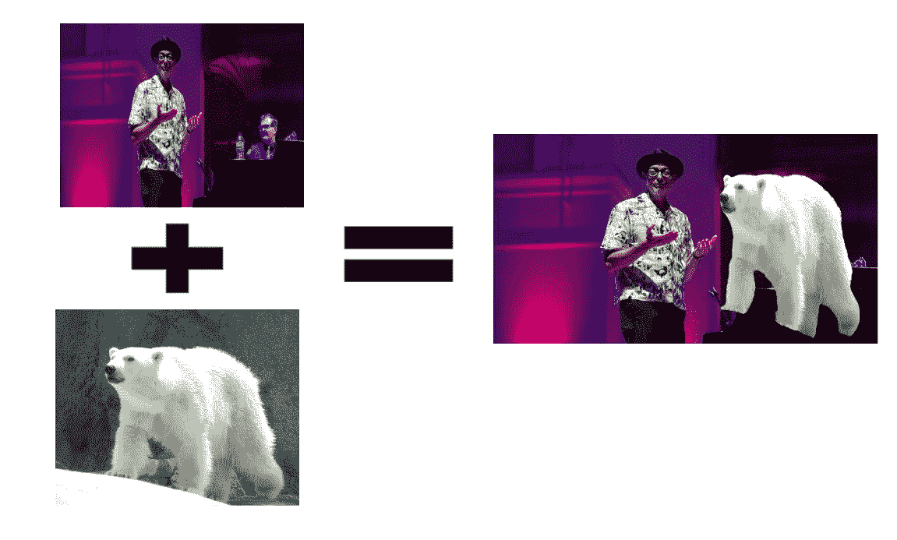
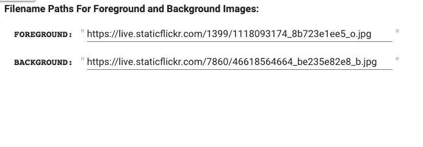
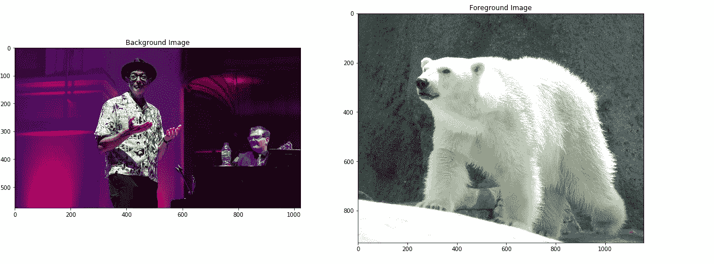
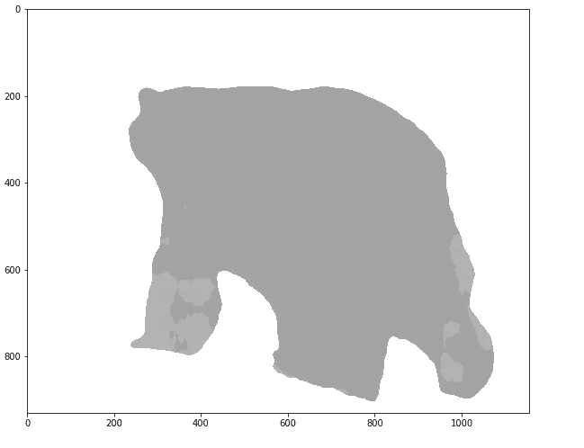
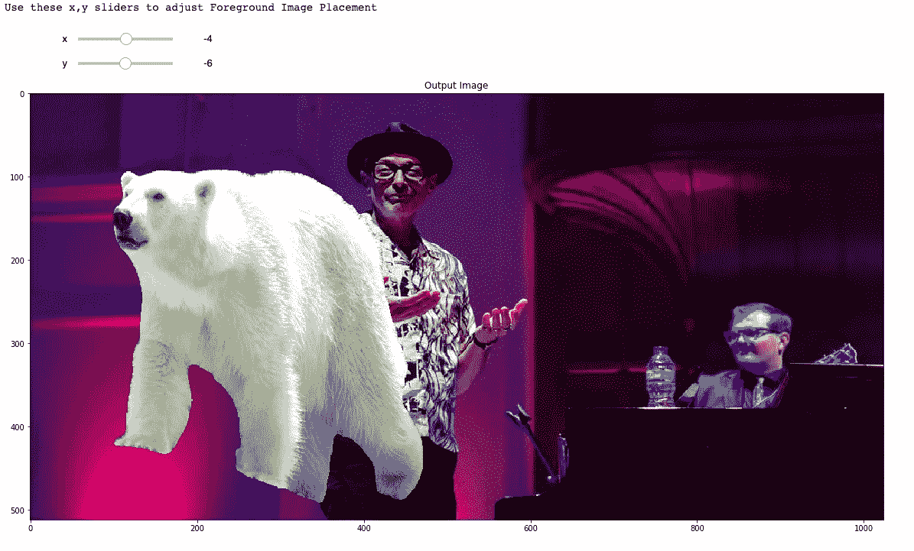
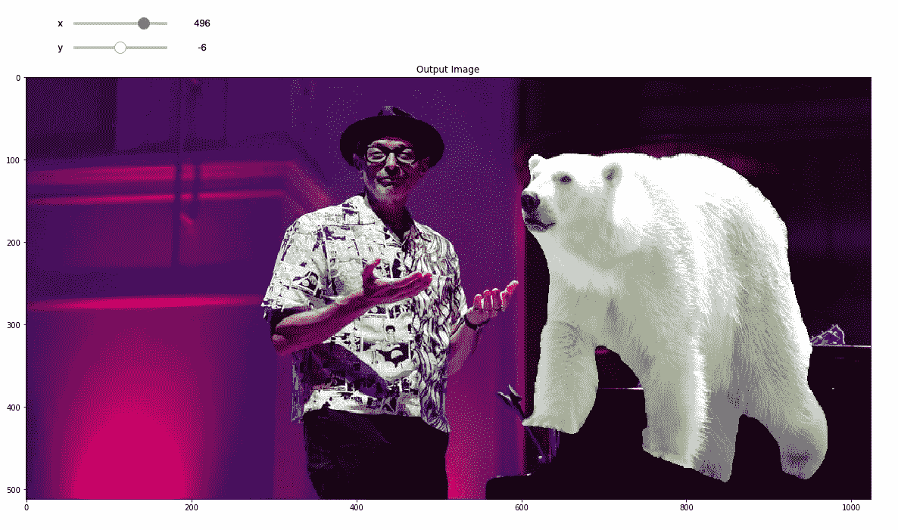

# 使用图像分割来处理 Photoshop 图像

> 原文：<https://towardsdatascience.com/using-image-segmentation-to-photoshop-images-db8c04942747?source=collection_archive---------30----------------------->

在这一集用 Colab 和 Python 做有趣的事情中，我们将使用深度学习从一幅图像中裁剪出对象，并将其粘贴到另一幅图像中。

深度学习部分是图像分割，也就是识别图像中的对象，我们可以随后屏蔽并最终剔除这些对象。

当作者对 Opencv 的有限知识变得太明显时，我们使用令人敬畏的 Opencv 库进行所有的剪切和粘贴。

为了好玩，让我们把一只北极熊放在杰夫·高布伦旁边。

你可以从这里开始:

 [## 谷歌联合实验室

### 编辑描述

colab.research.google.com](https://colab.research.google.com/drive/19-lKjG_8xhaniXfuANfoOPdhvPtHvkXy) 

我们从下载所需的图像开始。为此，我们需要一个前景图像(裁剪对象的图像)和背景图像(粘贴对象的图像)。

我们可以观看图像。

*Foreground Image Credit:* [*https://live.staticflickr.com/1399/1118093174_8b723e1ee5_o.jpg*](https://live.staticflickr.com/1399/1118093174_8b723e1ee5_o.jpg) *& Background Image Credit:* [*https://live.staticflickr.com/7860/46618564664_be235e82e8_b.jpg*](https://live.staticflickr.com/7860/46618564664_be235e82e8_b.jpg)

为了裁剪出熊，我们需要生成一个遮罩。接下来的几个细胞这样做，我们得到:

现在我们有了蒙版，我们可以将前景图像粘贴到背景图像上。通过传入遮罩，我们可以确保只粘贴前景图像的一部分，而忽略其余部分。

耶！有用！但是我们看到熊被贴在一个尴尬的地方。让我们使用 x 和 y 滑块来调整它的位置。对于这个例子，我们只需要将熊一直移动到右边。

成功！我们在杰夫·高布伦旁边放了一只北极熊！

我相信你可以想出更多有创意的例子，所以试一试，请分享结果。:)

Colab 链接:

 [## 谷歌联合实验室

### 编辑描述

colab.research.google.com](https://colab.research.google.com/drive/19-lKjG_8xhaniXfuANfoOPdhvPtHvkXy) 

这是完整的代码: