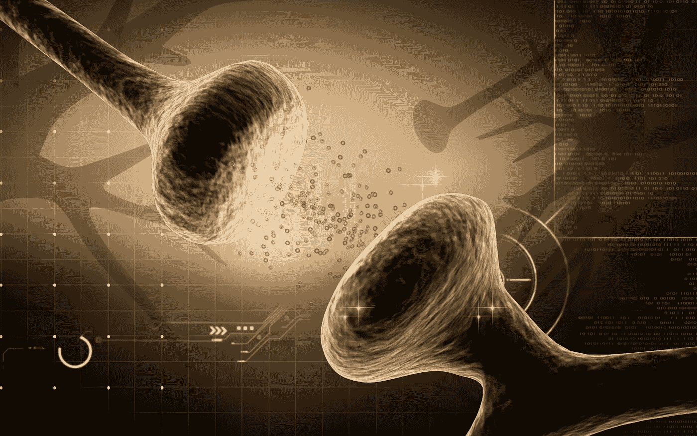
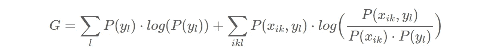
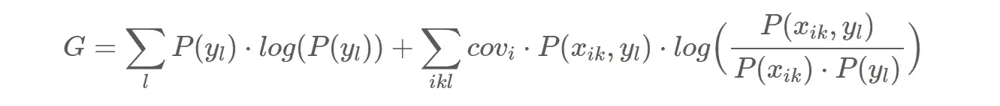
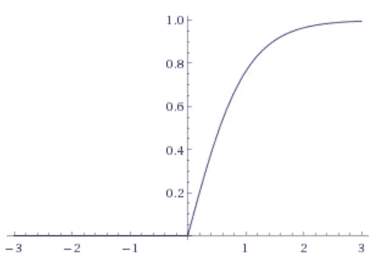
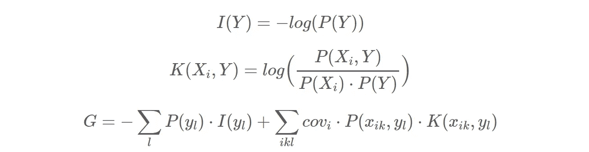
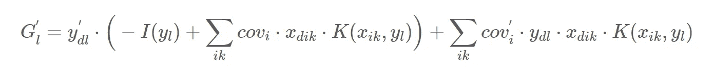

# 利用信息增益对兴奋性神经元进行无监督训练

> 原文：<https://towardsdatascience.com/using-information-gain-for-the-unsupervised-training-of-excitatory-neurons-e069eb90245b?source=collection_archive---------21----------------------->

寻找一种生物学上更合理的方法来训练神经网络。

传统上，人工神经网络是使用 Delta 规则和反向传播来训练的。但这与神经科学对大脑功能的发现相矛盾。不存在通过生物神经元向后传播的梯度误差信号(见这里的和这里的)。此外，人脑可以在自己的视听训练数据中找到模式，而不需要训练标签。当父母向孩子展示一只猫时，孩子并没有利用这些信息去学习构成猫的每一个细节，而只是将一个名字与猫的概念联系起来。另一方面，深度神经网络需要数以千计的有猫和没有猫的图像，以及这些图像的精确训练标签。深度神经网络将试图在其输出层学习猫的概念。但它也会尝试学习中间层中较低级别的功能。例如，该网络可以尝试学习像猫耳朵、胡须、爪子、猫眼等概念，以帮助识别整只猫。然而，问题是，这些低级概念是以一种非常间接和模糊的方式从标签中学来的，这些标签告诉我们哪些图像显示了猫，哪些没有。在我看来，这不是学习这些概念的好方法。或许更好的方法是直接从数据中学习这些概念，而不依赖于输出标签。如果我们仔细观察猫眼，我们会发现有许多低级特征，如瞳孔的形状、眼睑的形状、眼睛出现的环境等等，这些特征同时出现，构成了眼睛的模式。那么我们为什么不利用这种特征的共现来学习构成眼睛的模式呢？

如果我们回到人工神经网络研究的最开始，我们会偶然发现唐纳德 o 赫布的一些非常有趣的想法。在他的书《行为的组织》中，Hebb 认为现实世界物体的内部表征由外部刺激激活的皮层细胞组成。他称这组同时激活的神经元为细胞集合体。赫布认为所有这些细胞都是相互联系的。只要活动在神经元细胞集合的回路中循环，物体的内部表征就会保留在短期记忆中。此外，他假设，如果神经元细胞组合的激活持续足够长的时间，它将通过“生长过程”导致巩固，通过这一过程，相互回路变得更有效；一起放电的神经元也会连接在一起。因此，如果组件中只有一小部分细胞被后来的刺激激活，现在放大的互易电路将使整个细胞组件再次激活，回忆起外部刺激的整个内部表征。他的理论被称为“赫布边理论”,遵循这一理论的模型被认为表现出“赫布边学习”。Hebb 规则的等式如下，其中 *wi* 是突触权重， *α* 是学习速率， *y* 是神经元的输出激活，x *i* 是突触 *i* 的输入激活:

正如我们很容易看到的那样，这个等式过于简单，并且不会导致稳定的训练模型，因为权重只是增加了。

## 兴奋性和抑制性神经元

那么，我们怎样才能找到一种避免这个问题的希伯来人学习模式呢？首先，我们需要认识到，Hebbian 学习只描述了某一类神经元(即兴奋性神经元)的学习机制。赫比学习适用于共现特征的学习，但不适用于类别的学习。兴奋性神经元本质上是连接的。它们允许表示由许多单独特征组成的模式。另一方面，抑制性神经元本质上是分离的，并且可以将兴奋性神经元分组。它们被称为抑制性神经元，因为它们可以形成负反馈环路，抑制兴奋性神经元。兴奋性和抑制性神经元的生物学角色模型是大脑皮层的棘状锥体细胞和棘状星状细胞。锥体细胞通常表现出兴奋性特征，有些具有连接大脑其他部分的长距离轴突。另一方面，星状细胞通常是具有短轴突的抑制性中间神经元，与附近的神经元形成回路。

## 信息增益

由于我们只是试图训练兴奋性神经元，让我们退一步，从信息论的角度来看这个问题。如果我们将神经元视为数据源，将神经元激活视为事件，我们可以使用香农熵来测量神经元产生信息的平均速率。(在我们的例子中， *k* 只迭代活动和非活动两个选项。)

作为一个例子，考虑一组神经元，每个代表一个字母，其中每个神经元都有自己的熵值。如果我们认为这些神经元是独立的，我们可以简单地将熵值相加。但是这些神经元真的是独立的吗？当然不是。在一些单词中，这些字母神经元的子集经常一起被激活。因此，我们或许可以通过引入代表单词或其他类型模式的兴奋性神经元来降低网络的整体熵。这些兴奋性神经元然后压缩包含在字母神经元激活中的信息。换句话说，在一个单词神经元中，我们需要比用单个字母神经元更少的信息来表示一个单词。如果我们遵循降低网络总熵的目标，我们可能可以使用这个信息论框架来为我们的兴奋性神经元提出一个训练规则。为了调整我们兴奋性神经元的突触权重，以降低总熵，我们首先需要为我们的兴奋性神经元定义一个[成本函数](https://en.wikipedia.org/wiki/Loss_function)，我们可以在优化过程中使用它。让我们通过查看通过兴奋性神经元的单个突触 *i* 获得的相对熵来开始制定这样的成本函数。这种相对熵也被称为[库尔贝克-莱布勒散度](https://en.wikipedia.org/wiki/Kullback%E2%80%93Leibler_divergence)，可以表述如下:

其中 *Xi* 是输入神经元的离散随机变量，而 *Y* 是输出神经元的离散随机变量。对于分布 *Q* ，假设 *Xi* 和 *Y* 的联合概率分布为[独立](https://en.wikipedia.org/wiki/Independence_(probability_theory))。这是计算相对熵的参考分布。所以，如果分布 *P(Xi，Y)* 也是独立的，那么信息增益为 0。

因此，我们为神经元获得的总信息增益看起来像这样:

由于我们已经向网络添加了一个新的兴奋性神经元来降低总熵，因此我们也需要考虑这个新神经元的熵:

我们需要注意的另一件事是，只考虑那些实际上参与压缩的突触。如果兴奋性神经元的输入突触的权重为 0，它也应该对成本函数没有影响。为了实现这一点，我们使用覆盖项 *covi* 来确定突触 *i* 对输出神经元的影响有多强。稍后我们将更详细地讨论如何计算 *covi* 。现在我们最终的成本函数看起来像这样:

## 兴奋性神经元模型

在我们展示如何使用成本函数来优化突触权重之前，让我们更仔细地看看兴奋性神经元的模型。该模型实际上非常简单，因为它计算所有输入突触的加权和，并使用偏差值来设置阈值。

然后通过激活函数 *φ* 发送结果，以计算输出激活值 *y* 。

兴奋性神经元和普通神经元之间的唯一区别是前者的偏置值可以拆分如下:

因此，如果兴奋性神经元的所有输入都是完全活跃的，那么 *net* 将等于 *b* 。我们使用的激活函数 *φ* 是双曲正切函数的正半部分。

它的导数，我们稍后会用到，由下式给出:

最后，我们已经提到的覆盖项 *covi* 计算如下:

这表明突触 *i* 能够多好地抑制兴奋性神经元的激活。如果突触权重 *wi* 等于或大于偏差 *b* ，那么 *covi* 值将为 1。

## 计数频率

由于熵的计算依赖于概率分布，我们应该简短地介绍一下这些是如何计算的。首先，通过对所有训练实例 *d* 上的输入激活 *xd* 和输出激活 *yd* 求和来计算频率。

然后通过将频率除以训练实例的数量 *N* 来计算概率分布。

然而，这种简单形式的频率计数有两个问题。首先，样本可能太小，不可靠。在这种情况下，[狄利克雷分布](https://en.wikipedia.org/wiki/Dirichlet_distribution)可能有助于估计分布的可靠性，但这变得相当复杂。第二个问题是分布是一个移动的目标。由于我们不断调整兴奋性神经元的权重，这意味着概率分布也在变化。这个问题可以通过使用[移动平均线](https://en.wikipedia.org/wiki/Moving_average)来计算概率来解决。

## 成本函数的导数

为了得到可以调整突触权重的训练规则，现在必须计算成本函数的导数。首先，我们移除等式中的[信息内容](https://en.wikipedia.org/wiki/Information_content)部分，并在以下步骤中将它们视为常数:

假设 *covi* 对于除当前训练实例 *d* 之外的所有实例都是常数，我们可以导出以下外部推导:

当涉及到神经元输出值的导数*y’l*时，我们可能需要调整几个变量。存在所有输入突触 *j* 的突触权重 *wj* 并且存在偏差。当调整突触权重 *wj* 时，我们需要将 *b* 视为常数，或者将 *bc* 视为常数，这取决于我们看到的是活动输入突触还是非活动输入突触。当然，如果假设一个偏置值不变，另一个也必须改变。主动输入突触的情况如下:

不活跃输入突触的情况是这样的:

偏置值的推导由下式给出:

当考虑主动输入突触的情况时，我们需要引入不对称性。如果兴奋性神经元的代价函数想要增加神经元的活性，只有增加突触的权重。这就是“什么一起点燃电线”的情况。但是如果成本函数想要降低神经元的活动，则仅降低偏差值。当输入字母出现在由兴奋性神经元表示的单词之外时，就是这种情况。在这种情况下，我们只想降低神经元的活性，而不降低突触的强度。

最终的训练规则将是这样的，其中 *α* 是学习率:

因此，为了训练突触 *j* ，兴奋性神经元的所有其他输入突触 *i* 被用于计算调整突触 *j* 的权重的目标方向。等式*G′*的*cov′I*部分充当一种用于弱突触的自举机制。等式的这一部分也防止了偏差变得太大，因为如果发生这种情况，许多突触突然变成弱突触，covi 再次变得活跃。推导*G′*也很好地抓住了直觉，即频繁激活的输入突触应该被认为是不太相关的。甚至有可能通过连接负反馈突触作为输入，以受监督的方式训练兴奋性神经元。

# 开放式问题

迄今尚未回答的一些问题是:

*   **如何诱导新的兴奋性神经元？为了解决这个问题，我们可以从一个成熟的输入神经元开始，并开始观察是否有其他神经元同时放电。**
*   **如何防止重复？**
    对于这个问题，我们可能需要抑制神经元来形成一个反馈回路，可以抑制潜在的重复。
*   抑制性神经元的训练是什么样的？
    本文描述的更新规则仅涵盖基于共现特征的训练。但是基于类别的抑制神经元的训练需要完全不同的训练方法。一种可能性是根据共有的属性将兴奋性神经元聚集在一起。

## 实施和相关工作

这个训练规则的实现可以在[**【GitHUB】**](https://github.com/aika-algorithm/aika)上的 [**【爱歌】**](http://aika.network) 项目的 [**兴奋性神经元**](https://github.com/aika-algorithm/aika/blob/master/src/main/java/network/aika/training/excitatory/ExcitatoryNeuron.java) 类中找到。 [**本文**](/using-meta-neurons-to-learn-facts-from-a-single-training-example-781ca0b7424d) 给出了一些可以使用兴奋性神经元的上下文。最后， [**这篇文章**](/on-adding-negative-recurrent-synapses-to-a-neural-network-25a28409a6f2) 描述了兴奋性神经元是如何嵌入反馈回路的。