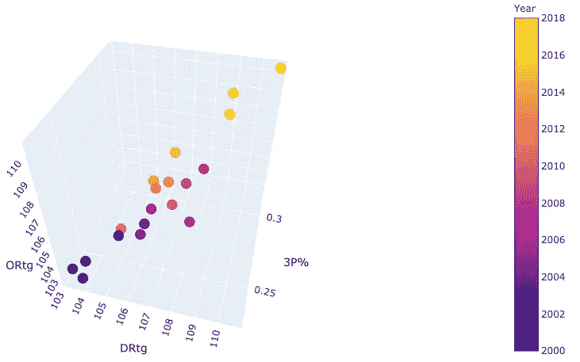

# 利用 K-Means 聚类算法重新定义 NBA 位置并探索花名册的构建

> 原文：<https://towardsdatascience.com/using-k-means-clustering-algorithm-to-redefine-nba-positions-and-explore-roster-construction-8cd0f9a96dbb?source=collection_archive---------18----------------------->

# 项目描述和动机

NBA 中的传统位置并不能准确反映球员为球队提供的比赛风格或功能角色。打球的整体风格已经发生了巨大的变化，NBA 各个时代都表明了这一点。同样，球员的比赛风格也反映了这种变化。目前联盟的节奏很快，场地空间也越来越大。证明这一点的一个例子是中锋们投三分球并为他们的球队拓展场地。这些中心是多方面的，但仍然与传统中心归为一类，没有方法区分两者。这个项目的目的是找到一个更好的方法来定义这些球员的角色，基于他们给他们的团队带来的价值。

# 数据源

从篮球参考中收集信息，并收集 2011 年至 2018 年每个球员的统计数据。2011 年被用作最初的开始年，因为它反映了无位置篮球开始形成的时间(勒布朗是迈阿密的主要推动者，也是金州王朝的开始)。最终的数据集中包含了大约 3000 个观察值。总共有 30 个特征描述每个球员。功能包括方块得分指标，如分，篮板，盖帽，抢断。还使用了高级指标，如:USG%、PER 和正负分数。所有的特征都是由每 100 人拥有量来定义的。这样做是为了确保球员的统计数据是可比的，不管他们打了多少分钟或多少场比赛。游戏时间不超过 400 分钟的玩家被排除在数据集之外，因为他们对游戏没有显著影响。

# 初步探索性数据分析

为了更好地理解我的数据集，我开发了一些初步的视觉效果。

**散点图显示一段时间内联盟平均 3 个百分点**

League Average for 3 pt % over time

**显示一段时间内各种特征(Ortg，Drtg，3P%)的联赛平均水平的图表**

League Average for various features over time

这两个图是集中于某些特征的例子，并表明随着时间的推移呈上升趋势。这些图表的特点包括三个指针，以及展示效率和整体进攻的其他指标。从联盟的角度来看，这种变化表明球员的角色/风格也随着赛季的发展而变化。

**说明常规头寸平均统计数据的图表。**

Average stats by conventional NBA positions

这个图表不能告诉我们那些不符合他们传统角色的球员。举个例子，大前锋也是促进者吗？还是扮演多维角色的警卫？

显示常规头寸平均分布的饼图

Distribution of conventional positions

常规位置的聚类可视化

Clusters representing conventional NBA positosn which take all 30 features into consideration

每个点代表一个玩家。分配到相同常规位置的玩家分散在整个图形中。表明它们没有相似的演奏风格。(主成分分析用于将 30 个特征的维度减少为 3 个成分)。

## 聚类后…

Results After Clustering…

# 使用的数据科学方法

*   主成分分析(PCA)用于降低视觉效果的维数。因为有超过 30 个特征描述每个球员，所以不可能用这么多特征创建视觉集群。使用主成分分析后，所有特征中 90 %的变异仍然保留。它们被简化为 3 个组件，因此是一个 3D 模型。PCA 用于常规职位聚类的可视化，以及在实施 k 均值聚类算法后的新角色的可视化。
*   K-means 聚类是一种无监督的算法，其中没有给定标签。基本思想是指定质心(n ),然后根据观察(玩家)与质心的接近程度开始聚类(分组)。
*   肘法和剪影评分。为了计算出有多少集群(新角色)是理想的，使用了 silhoutte 分数。轮廓分数解释了每个簇的密度和簇与簇之间的分离。肘方法显示随着聚类数的增加，侧影分数变化的程度。一旦速率明显下降，选择一个更高的“n”个簇的数量就没什么用了。对于这个项目，我最终总共有 9 个集群。
*   缩放功能。由于 k-means 使用距离度量来评估和分配每个观察值所属的聚类，因此缩放所有特征非常重要。比如 40 分和 2 块是没有可比性的，它们本质上是不同的单位。我还为各种特征分配了权重，以突出某些风格。例如，助攻和失误可以说代表了控球，所以与其他特征相比，它被赋予了不同的权重。

# K-均值聚类后的结果

新角色饼图

## 分配了新角色的群集可视化

通过查看每个集群的平均统计数据，然后查看每个集群中的球员列表，标签被分配给新的 9 个集群。通过使用领域知识和聚类中揭示的内容，生成一个标签来描述该聚类。

与为传统角色生成的集群相比，现在的集群更加精简和有序。这表明集群代表了他们的比赛风格/角色，并为球队和球迷提供了更多的洞察力。

Lets take a look at how labels were assigned to each cluster

# **深入了解每个集群，以及如何为新角色分配新标签**

*值得注意的是，虽然 5-6 名玩家被列在“著名玩家”下，但实际上每个集群都有超过 250 名玩家。*

## **集群 1** : **外围边锋/得分手**

**著名球员:**

*   威尔森·钱德勒
*   杰伦·亚当斯
*   凯文·诺克斯(尼克斯球迷)
*   康特尼·李
*   斯坦利·约翰逊

## 群组 2:“三个& D”

**值得注意的玩家:**

*   特雷沃·阿里扎
*   肯特·巴兹摩尔
*   威尔·巴顿
*   OG Anounoby
*   托里恩·普林斯
*   罗伯特·卡温顿

## **群组 3:“全部完成”**

**值得注意的玩家:**

*   凯尔·安德森
*   布兰登·英格拉姆
*   达尼罗·加里纳利
*   凯文·乐福
*   凯利·乌布雷
*   扎克·拉文

## 集群 4:精英之翼

**值得注意的玩家:**

哈里森·巴恩斯

杰伦·布朗

德马雷·卡罗尔

阿隆·戈登

丹尼·格伦

埃里克·戈登

## 集群 5:备份 big(内部)

**值得注意的玩家:**

乔丹·贝尔

泰森·钱德勒

-内内·希拉里奥

科斯塔·库佛斯

阿隆·贝恩斯

## 集群 6:精英大佬(内部)

**值得注意的玩家:**

*   艾德·戴维斯
*   特里斯坦·汤普森
*   梅森·普拉姆利
*   格雷格·门罗
*   扎扎·帕楚里亚
*   马辛·戈塔特

## 星团 7:大恒星(内部)

**值得注意的玩家:**

*   史蒂芬·亚当斯
*   拉马库斯·阿尔德里奇
*   安德烈·德拉蒙德
*   尤素夫·努尔基奇
*   德里克·费沃斯

## 第八组:所有的星星

**值得注意的球员:**

*   布拉德利·比尔
*   德文·布克
*   吉米·巴特勒
*   布雷克·格里芬
*   托拜厄斯·哈里斯
*   克莱·汤普森
*   拉塞尔·维斯特布鲁克

## 集群 9:超级明星

**值得注意的玩家:**

*   扬尼斯·阿德托昆博
*   斯蒂芬·库里
*   安东尼·戴维斯
*   凯文·杜兰特
*   詹姆斯·哈登
*   勒布朗·詹姆斯

然后，我想发展更实际的洞察力，并创造了一些问题，探索名册的多样性。

# 商业洞察力问题

*   **精英队伍&一般队伍在球员角色/风格上有什么区别？**
*   获胜的球队有更多或更少的球员有特定的角色/风格吗？花名册的多样性对获胜有影响吗？

为了回答这些问题，我比较了过去 4 年中被认为“一般”(几乎没有进入季后赛或者是第 8 种子)的球队和过去 4 年中进入总决赛的球队的阵容结构。两个小组都有同等数量的来自西部和东部联盟的球队。

过去 4 年进入 NBA 总决赛的球队名单。

# 回答:

总的来说，NBA 决赛球队拥有更多的明星力量，他们的内线球员有一个保留/确定的角色。相比之下,“普通”NBA 球队的明星影响力更小，他们依赖明星内线作为焦点。想要赢的球队应该让他们的名单更能反映 NBA 决赛球队的饼状图。

希望你们喜欢我的项目！这里有一个[链接](https://github.com/haahussain/Modern_NBA_positions)到我的 GitHub 账户，它进一步解释了我为这个项目采取的步骤。最后，如果你想讨论我的项目或者只是谈论篮球，你可以在 [LinkedIn 上找到我。](https://www.linkedin.com/in/haider-hussain-mph-0050307b/)