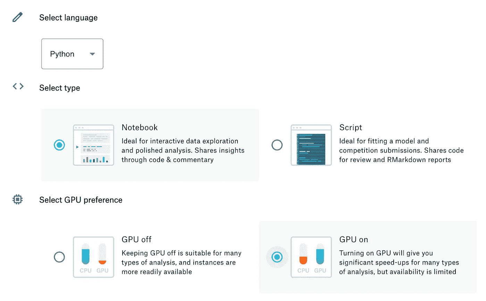
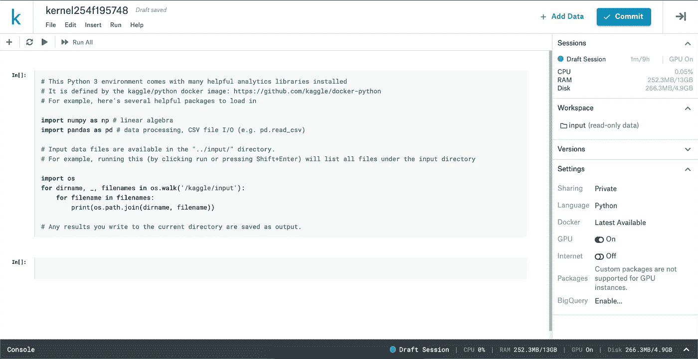
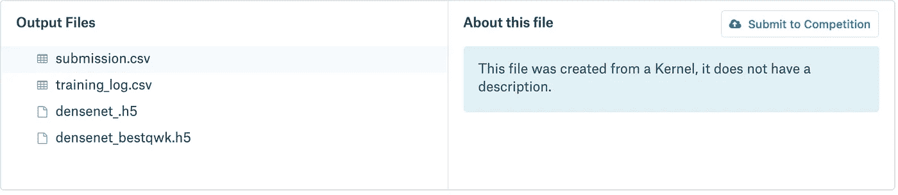

# 将 Kaggle 用于您的数据科学工作。

> 原文：<https://towardsdatascience.com/using-kaggle-for-your-data-science-work-a2e78d692395?source=collection_archive---------14----------------------->

## 停止在你的小笔记本电脑上运行神经网络！

作为数据科学家，我们都喜欢 Jupyter 笔记本。但是，当你在处理一个非常大的数据集和/或一个复杂的模型时，你的计算机就不能胜任了。好消息是，您可以将 Jupyter 笔记本文件导入 Kaggle。如果你是数据科学的新手，Kaggle 是一个举办数据科学竞赛并提供现金奖励的网站。Kaggle 还拥有丰富的信息和一个非常愿意帮助您发展数据科学教育的社区。

Kaggle 的另一个特点是他们有免费的在线云计算(有一些限制)。因此，如果您的计算机变得太热，运行时间太长，或者没有足够的处理能力或内存来运行您的模型，您可以使用 Kaggle 的内核来运行您的代码！报名就好！

# 使用 Kaggle 的好处

*   免费的！有了 Kaggle 账户，你可以免费使用他们的服务器。
*   云计算。您可以运行一个模型，提交更改，去市中心，然后在另一台计算机上调出您的模型。只要你能上网，你的作品就能跟着你(不用 Git)！
*   GPU。对于计算密集型机型，您可以使用多达 2 个内核和 13 GB 的 GPU RAM。对于那些买不起昂贵 GPU 的人来说，为什么不用 Kaggle 的呢？
*   笔记本或脚本。以你喜欢的方式导入你的代码！
*   没必要`pip install`。Kaggle 已经预装了大多数 python 包(你甚至可以`pip install`打包 Kaggle 不支持的包)。
*   黑暗模式。因为这样更好。

# 缺点和局限性

不全是神经网阳光和内核彩虹。首先，Kaggle 归谷歌所有。因此，如果你对 Alphabet 在其服务器上安装面部识别模型感到不安，那么 Kaggle 的内核可能不适合你。

还有，你网页上运行的内核，没有用户输入只能运行一个小时。所以如果你运行你的模型，离开超过一个小时，你的内核就会停止。您将丢失所有的输出，并且必须重启您的内核。您可以通过提交代码来克服这个问题。代码将在一个独立的内核中运行，而不是你在网页上看到的那个。但是*提交*的一个警告是，提交的内核的输出只有在内核完全运行后才能看到。因此，如果您的总运行时间是 5 个小时，那么您不能在 5 个小时内检查您提交的内核。如果你的代码有一个致命的错误，你要到 5 个小时后才能知道🙃

以下是使用 Kaggle 时的**硬件**和**时间限制**:

*   9 小时执行时间
*   5gb 自动节省的磁盘空间(/kaggle/working)
*   16gb 的临时暂存磁盘空间(外部/ka ggle/工作)

**CPU 规格**

*   4 个 CPU 内核
*   16 千兆字节的内存

**GPU 规格**

*   2 个 CPU 内核
*   13 千兆字节的内存

如果你要用这些规格制造一台计算机，你很容易就能花掉 1000 多美元。只要确保您的数据少于 16GB 的磁盘空间(除非您使用 Kaggle 数据集)，并且运行速度可以超过 9 小时。如果您的模型可以在这些限制下运行，那么上传您的数据并开始工作吧！

# Kaggle 入门

*   登录您的 Kaggle 帐户
*   在顶部栏中，点击**笔记本**
*   然后选择**新笔记本**

*   选择 **Python** 或 **R**
*   选择编码风格
*   如果要使用 GPU，点击**显示高级设置**，然后在上选择 **GPU**
*   然后点击**创建**

# **ka ggle 内核**

Your new online Jupyter Notebook.

如果你选择了笔记本风格，你会有宾至如归的感觉。要上传您的数据，点击右上方的`**+ Add Data**` **。**您可以选择预先存在的 Kaggle 数据集或上传您自己的数据集。请记住，您只能使用 16GBs 的数据。

在右边栏，你可以跟踪你的在线内核。“会话”选项卡会记录您有多少可用的计算能力。将您的工作区选项卡想象成一个 GUI 文件结构。如果您使用 Kaggle 数据集，您的文件将位于`/kaggle/input/your-kaggle-dataset`中。如果你上传了一个数据集，你的文件将会在`/kaggle/input/your-uploaded-data`中。在“设置”选项卡上，您可以更改之前设置的设置。

现在你都准备好了！编码并享受您的免费在线笔记本。当您完成或准备提交时，点击右上角的**提交**按钮。您的代码将在一个单独的内核中运行。一旦你所有的代码都运行了，它就变成了一个版本。您可以返回到任何版本或您提交的代码，并查看输出(如果它运行正常)。

如果你正在提交一个 kaggle 竞赛，你将进入你的内核版本。在左侧点击**输出**。如果您有一个. csv 输出，您将能够在这里看到它。选择您的。cvs 文件，点击**提交参赛**。

Kaggle 是数据科学家的强大工具。他们甚至有关于 python 的课程，使用熊猫和神经网络，都使用它们的内核。另一个免费的在线云服务，请查看 Google Colab。