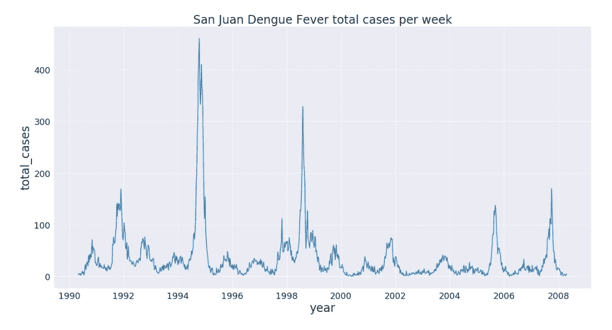
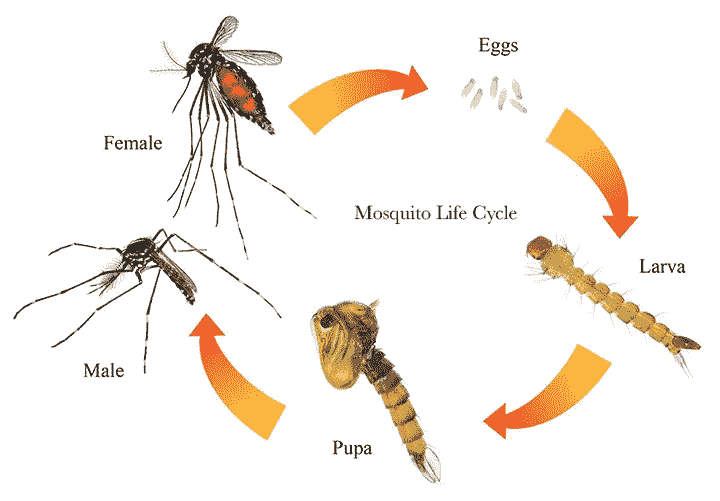
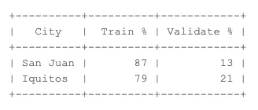
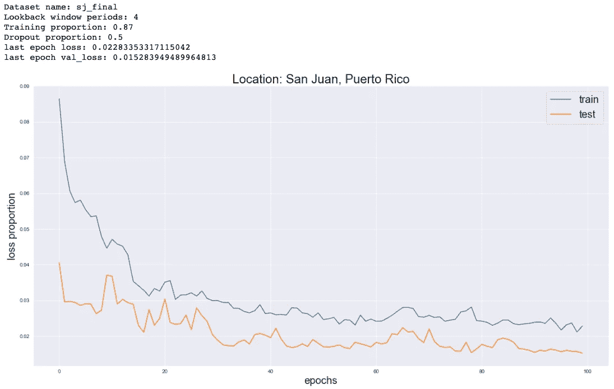
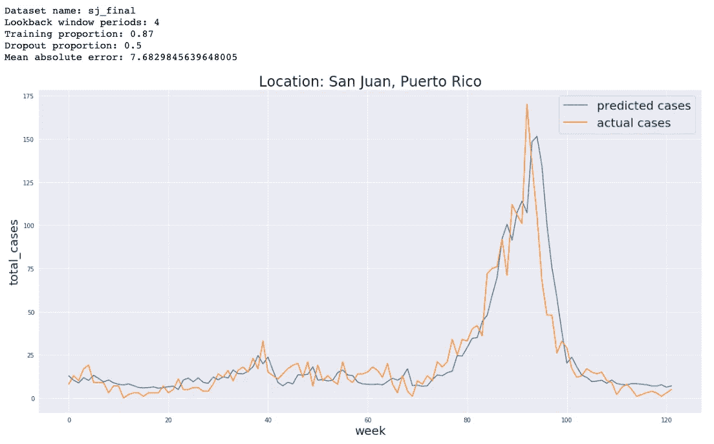

# 使用 Keras 和 TensorFlow 预测登革热暴发

> 原文：<https://towardsdatascience.com/using-keras-and-tensorflow-to-predict-dengue-fever-outbreaks-99392202bd5c?source=collection_archive---------17----------------------->

使用时间序列天气数据的机器学习预测模型。


Image licensed from Adobe Stock

# 什么是登革热？

登革热通常被称为登革热，是一种蚊媒疾病，发生在世界的热带和亚热带地区。在轻度病例中，症状与流感相似:发热、皮疹、肌肉和关节痛。在严重的情况下，登革热会导致严重出血、低血压，甚至死亡。

因为登革热是由蚊子传播的，所以登革热的传播动态与温度和降水等气候变量有关。尽管与气候的关系很复杂，但越来越多的科学家认为，气候变化可能会产生分布变化，这将对全世界的公共卫生产生重大影响。

近年来，登革热一直在蔓延。历史上，这种疾病在东南亚和太平洋群岛最为流行。如今，每年近 5 亿例病例中的许多发生在拉丁美洲([邓艾:预测疾病传播，挑战总结](https://www.drivendata.org/competitions/44/dengai-predicting-disease-spread/page/80/))。

准确预测给定地区将感染登革热的人数的能力对于公共卫生官员、医生以及最终处于感染风险中的任何人都具有重大价值。使用来自[美国国家海洋和大气管理局](https://dengueforecasting.noaa.gov) (NOAA)和[黑暗天空](https://darksky.net/dev)的历史数据，我的目标是创建一个机器学习模型，能够准确预测两个地方每周将发生的登革热病例数:波多黎各的圣胡安和秘鲁的伊基托斯。

该图显示了从 1990 年中期到 2008 年初波多黎各圣胡安每周报告的登革热病例。



在圣胡安，报告的登革热病例通常在一年的后半段达到高峰，显然有些年份感染人数会显著增加。据了解，这与蚊子数量的增加有关。蚊子在温暖潮湿的条件下和雨量充足的时候更容易繁殖。这些条件创造了更多的静水区域，因此有更多适合产卵的地方。

# 埃及伊蚊与“领域知识”



Image licensed from Adobe Stock

一只雌性埃及伊蚊吸血后，平均会产下 100 到 200 个卵，一生中最多能产五次。卵产在可能暂时被洪水淹没的潮湿表面，如树洞和人造容器，如桶、鼓、罐、盆、桶、花瓶、花盆托盘、罐、废弃的瓶子、罐、轮胎、水冷却器等。以及更多收集或储存雨水的地方。她分开产卵，不像大多数物种。并非所有的卵都是一次产下的，但它们可以分散几个小时或几天，这取决于是否有合适的基质。鸡蛋通常被放置在吃水线以上不同的距离。此外，她不会在一个地方产卵，而是将卵分散在几个地方。卵可以在干燥的环境中存活一年以上，但是当它们在潮湿的环境中时，它们可以在短短两天内孵化。剩下的成长阶段到成年可能在短短六天内发生(【denguevirusnet.com】T2)。

当训练机器学习模型时，了解这种生命周期是有用的，因为天气事件和/或条件之间可能存在关系，从而产生持续足够长时间的静止水，以使蛋达到成熟。在数据科学领域，这种类型的信息被称为“领域知识”。拥有广泛领域知识的数据科学家在其专业领域内开发机器学习模型方面具有优势。

# 获取数据

如上所述，数据是从两个来源获得的。NOAA 的每周数据已经准备好了 CSV 文件供下载。更详细和日常的黑暗天空数据必须使用 API(应用程序编程接口)获得。大约有 15，000 个 API 调用了 Dark Sky 来获取这两个城市的每日天气数据。数据被保存到文本文件中，随后被处理以创建 CSV 文件供重复使用。

这个项目的数据类型被称为时间序列。时间序列数据需要独特的模型、考虑因素和机器学习的预处理。尤其是缺失值，必须在训练任何模型之前解决。以下是这两个地方每天可用的天气变量的示例，包括圣胡安的 6，073 条记录中每个变量的缺失值计数:

```
date                             16
latitude                          0
longitude                         0
timezone                          0
offset                            0
apparentTemperatureHigh          18
apparentTemperatureHighTime      18
apparentTemperatureLow           17
apparentTemperatureLowTime       17
apparentTemperatureMax           18
apparentTemperatureMaxTime       18
apparentTemperatureMin           18
apparentTemperatureMinTime       18
cloudCover                      175
dewPoint                         18
humidity                         18
icon                             16
moonPhase                        16
precipIntensity                3695
precipIntensityMax             3695
precipIntensityMaxTime         5041
precipProbability              3695
precipType                     1561
pressure                         18
summary                          16
sunriseTime                      16
sunsetTime                       16
temperatureHigh                  18
temperatureHighTime              18
temperatureLow                   17
temperatureLowTime               17
temperatureMax                   18
temperatureMaxTime               18
temperatureMin                   18
temperatureMinTime               18
time                             16
uvIndex                          16
uvIndexTime                      16
visibility                     3918
windBearing                      18
windGust                       4854
windGustTime                   4854
windSpeed                        18
```

几乎所有的变量都有缺失值，有些接近 80%。我如何处理这些缺失数据的细节可以在 GitHub 的 Jupyter 笔记本上查看。如果你想了解更多关于处理缺失数据的内容，我在这里写了一篇关于这个主题的简短文章:[走向数据科学](/dealing-with-missing-data-17f8b5827664?source=friends_link&sk=5ecf67f2141e50bcd47dc37b33e96deb)。

在所有的数据被获取、清理和评估之后，它就可以用于一些机器学习模型了。

# 构建序列模型

我使用 Keras 和 Tensorflow 库来构建我的模型。如果使用 LSTM 的递归神经网络的细节听起来很无聊，就跳过这一节。

当我写这篇文章时，LSTM(长短期记忆)是 Keras 库中处理时序数据最强大的层，但它也是计算开销最大的层。如果您的硬件平台对于给定的时间序列项目足够强大，我推荐尝试 LSTM。

我开始使用的基本模型如下:

```
model = models.Sequential() 
model.add(LSTM(103, input_shape=(train_X.shape[1],
               train_X.shape[2])))
model.add(Dense(50, activation='relu'))
model.add(Dense(1))model.compile(loss='mae', optimizer='adam')
```

然后，我尝试添加不同比例的脱落层:

```
model = models.Sequential() 
model.add(LSTM(103, input_shape=(train_X.shape[1],
               train_X.shape[2])))
**model.add(Dropout(0.3)) # 0.3, 0.4, and 0.5 were tested**
model.add(Dense(50, activation='relu'))
model.add(Dense(1))model.compile(loss='mae', optimizer='adam')
```

添加下降图层显著提高了模型的性能。丢弃层可以是防止模型过度拟合的有效工具，这是机器学习中的一个常见问题，我计划很快写更多关于使用丢弃层的内容。

该模型使用平均绝对误差来评估其性能。

# 做预测

处理时序数据的另一个挑战是无法使用复杂的数据分割方法，如交叉验证。对于时态数据，训练/验证/测试分割的可用方法是有限的，超出了本文的范围。关于这个主题的更多信息，请看[杰森·布朗利**、**博士的这篇优秀文章](https://machinelearningmastery.com/backtest-machine-learning-models-time-series-forecasting/)

我希望训练和测试数据都包括登革热感染低和高的年份。我发现下面的分割很适合这个项目:



以下是我用来评估模型的输出示例:



在本例中，该模型使用四周的天气数据来预测下一周的登革热病例数。蓝线表示模型在训练数据上的表现，越低越好，橙线表示模型从未“见过”的数据上的表现。从左到右代表模型的每次连续迭代(在机器学习术语中称为“时期”)。上面的例子代表了我测试的模型参数的最佳组合:

*   回顾期(模型用于预测的前期周数)
*   丢弃比例(在一个时期内随机“关闭”的节点的比例。
*   要运行的时期数

我用这些参数的几种组合进行了测试。

下面的图表显示了最佳模型预测的案例数与实际案例数的对比:



7.68 天的平均绝对误差(实际病例和预测的登革热病例之间的平均差异)表明还有改进的空间，但该模型确实准确预测了第 95 周左右超过 150 例的巨大高峰。正如本文开头所提到的，这样的信息对于一个地区的决策者来说具有巨大的价值。

展望未来，我将尝试几种方法来改进这一模式:

*   尝试用不同的方法从每天的黑暗天空数据中计算出一周的数值。
*   通过获取每周的值并从上周的值中减去它们来区分数据。
*   测试其他一些为时序数据设计的机器学习模型。

感谢您阅读我的项目——我对数据科学让世界变得更美好的潜力充满热情！

简单介绍一下我:
在毛伊岛拥有/管理了一家旅馆 15 年后，我搬到了旧金山，开始了自己的科技职业生涯。我将于 2019 年 9 月完成 Flatiron School 数据科学项目，并于 2022 年获得约翰霍普金斯大学的数据科学硕士学位。