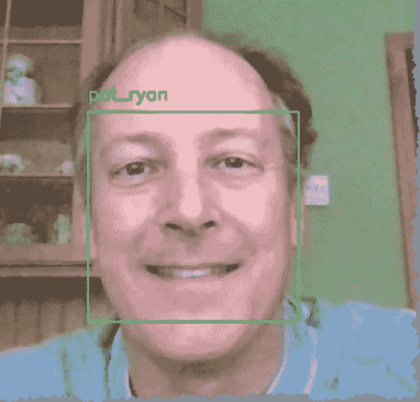

# 使用 LinkedIn 个人资料图片进行面部识别

> 原文：<https://towardsdatascience.com/using-linkedin-profile-pictures-for-facial-recognition-8be709e8fac?source=collection_archive---------25----------------------->


Photo by [Kyle Glenn](https://unsplash.com/@kylejglenn?utm_source=medium&utm_medium=referral) on [Unsplash](https://unsplash.com?utm_source=medium&utm_medium=referral)

您可能听说过《华盛顿邮报》上的一则报道，政府机构正在使用机动车管理局(DMV)的数据进行面部识别。你可以在这里找到那篇文章[，但是当你看完之后，请回到这里。](https://www.washingtonpost.com/technology/2019/07/07/fbi-ice-find-state-drivers-license-photos-are-gold-mine-facial-recognition-searches/?utm_term=.69198a87de58)

虽然我知道这是非常令人担忧的，但我们作为一个社交媒体社会泄漏(消防水管？)几乎公开的个人信息。

我将向你们展示我是如何使用一张 LinkedIn 个人资料图片来创建一个面部识别系统的，这些图片来自许多同事的 LinkedIn 个人资料，全部使用免费的开源工具。政府不需要翻遍车管所的记录——他们只需要登录 LinkedIn 或脸书或任何其他社交媒体网站。我们每天都在多次放弃我们最容易识别的属性——我们的脸。

*题外话:由于我没有权限展示或使用我在本文中实际使用的同事的 LinkedIn 个人资料照片，我将保持它的抽象性。但是你要做的就是收集一些图片。*

# 背景材料

我通常参考的技术站点是 PyImageSearch.com 的[和 MachineLearningIsFun.com 的](https://www.pyimagesearch.com)和。在这种情况下，我结合了以下帖子中的信息:

*   PyImageSearch，[利用 OpenCV、Python 和深度学习进行人脸识别](https://www.pyimagesearch.com/2018/06/18/face-recognition-with-opencv-python-and-deep-learning/)
*   PyImageSearch， [Keras 图像数据生成器和数据扩充](https://www.pyimagesearch.com/2019/07/08/keras-imagedatagenerator-and-data-augmentation/)
*   MachineLearningIsFun，[深度学习的现代人脸识别](https://medium.com/@ageitgey/machine-learning-is-fun-part-4-modern-face-recognition-with-deep-learning-c3cffc121d78)

如果你对我的 Github 回购感兴趣，你可以在这里找到。然而，你不会发现我使用的任何个人资料图片。此外，我只在 Mac 上运行过，我不确定对于 Windows 用户来说这些指令会有什么变化。

# 灵感

几个月前，我使用上面的第一个链接在我的电脑上进行面部识别，我用电脑摄像头拍了大约 30 张自己和其他几个人的照片。PyImageSearch 文章使用了一个名为 face_recognition 的库，它是由 MachineLearningIsFun 网站的所有者编写的。让我印象深刻的是，要获得良好的面部识别结果，一个人的不同照片是如此之少。

在阅读了 ImageDataGenerator 上的 PyImageSearch 文章和《华盛顿邮报》的文章后，我想知道我是否可以用单张照片训练一个面部识别模型，并生成同一张照片的 30 张新的增强图像。

对于单张照片，我选择 LinkedIn 作为我的来源，因为大多数人都有正面的干净照片。

# 训练一个模特的流程是怎样的？

# 第一步——下载一些 LinkedIn 个人资料图片

我下载了大约 8 张同事的个人资料照片，这样我可以很快试验出结果。LinkedIn 个人资料图片的好处是它不是很大，并且创建面部编码相对较快。

## 技术细节

在“original_images”文件夹中创建一个格式为“firstname_lastname”的文件夹，并将图片放入该文件夹中。

# 第 2 步—扩充个人资料图片

要了解图像增强，请参见我上面提到的这篇文章。PyImageSearch， [Keras ImageDataGenerator 和数据扩充](https://www.pyimagesearch.com/2019/07/08/keras-imagedatagenerator-and-data-augmentation/)。

在那篇文章中，作者向您展示了如何创建一个 Python 脚本来使用 Keras 从原始图像创建 30 个增强图像。增强后的图片是同一个 LinkedIn 个人资料图片——但在增强后，图片可能会稍微旋转，或垂直翻转，或稍微剪切。

当你完成所有的个人资料图片后，你应该有一个数据集文件夹，子文件夹中有人名，每个人名文件夹将有 30 张(或你选择的数量)LinkedIn 个人资料图片。

## 技术细节

要从一个图像生成多个图像，您可以在终端执行:

```
python pr_generate_images.py --image original_images/john_public/john_public.jpg --output generated_images/john_public --total 30 --prefix jp
```

在 generated_images 文件夹中，将人名作为文件夹名是很重要的。编码过程使用文件夹名称作为目标或标签值。

对您下载的每张 LinkedIn 个人资料图片运行以上命令

完成后，检查 generated_images 目录中的图像。你会看到 30 张图片，每一张都略有不同

# 步骤 3-从数据集创建面部编码

使用这些文章中的材料:

*   PyImageSearch、[用 OpenCV、Python 和深度学习进行人脸识别](https://www.pyimagesearch.com/2018/06/18/face-recognition-with-opencv-python-and-deep-learning/)
*   MachineLearningIsFun，[深度学习的现代人脸识别](https://medium.com/@ageitgey/machine-learning-is-fun-part-4-modern-face-recognition-with-deep-learning-c3cffc121d78)

你会明白面部识别软件在照片中定位一张脸，然后识别 68 个兴趣点。从那里，它创建一个 128 维值向量。对于每个扩充的 LinkedIn 个人资料图片，收集 128 个值的向量，以及与该向量相关联的人的姓名。

这些信息最终被收集到一个表格中，表格中的每一行都代表一张个人资料图片，并带有一个人名标签列。这个集合被腌制并被称为编码。

## 技术细节

现在是时候创建一个单独的编码文件了。您可以通过以下方式实现这一点:

```
python encode_faces.py --dataset generated_images --encodings-file encodings/linkedin_encodings.pkl
```

这将对“generated_images”父目录中的所有目录进行编码，并将编码文件写入编码目录。这个编码文件包含每张图片的 128 维编码，以及标签，在本例中是人名。

# 第 4 步—启动笔记本电脑网络摄像头并预测

使用本文、PyImageSearch、 [Face Recognition with OpenCV、Python 和 deep learnin](https://www.pyimagesearch.com/2018/06/18/face-recognition-with-opencv-python-and-deep-learning/) g 中的信息，您将了解如何创建一个脚本来读取网络摄像头，逐帧捕获输入帧，并运行 face_recognition 包来预测视频帧与步骤 1–3 中的编码人脸的最接近匹配。

## 技术细节

现在，您可以打开计算机的摄像头，查看面部识别功能是否正常工作。执行以下操作:

```
python recognize_faces_video.py --encodings-file encodings/linkedin_encodings.pkl --input camera
```

如果一切顺利，你下载了你的个人资料图片，你应该看看是否预测自己。

# 结果

在我按照本文描述准备的 8 张 LinkedIn 个人资料照片中，所有照片都正确地识别了我的同事。

如果你有兴趣亲自尝试一下，我强烈推荐背景材料中的链接。他们将为您提供所有必要的技术背景和示例实现。

来自我的 LinkedIn 个人资料图片:


LinkedIn Profile Picture

并生成 30 张新图片:


30 Auto Generated and Augmented pictures

我可以训练一个面部识别模型来识别我。



# 离别的思绪

人们对面部识别的使用有很大的担忧，这种担忧是有充分理由的。然而，我们不能把这个技术精灵放回瓶子里——所以我们最好理解它是如何工作的，以及用一张照片创建一个面部识别系统是多么容易。政府不需要搜索车管所，只需点击任何一个社交媒体网站，拉一张照片。