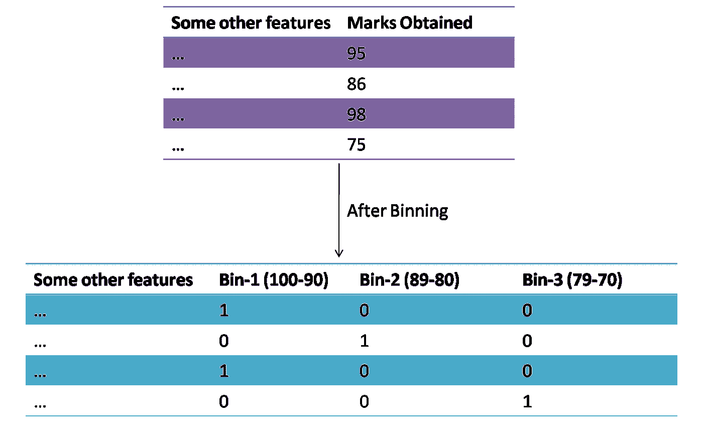
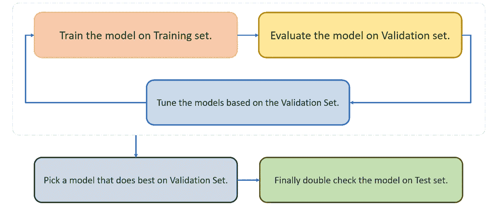
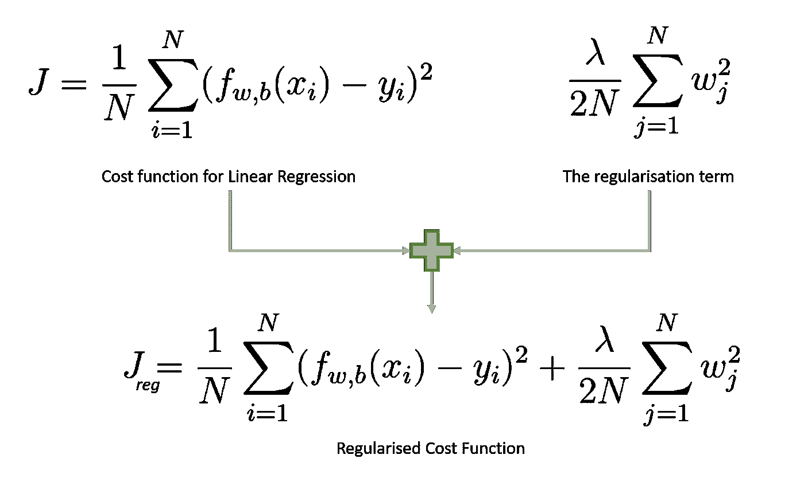
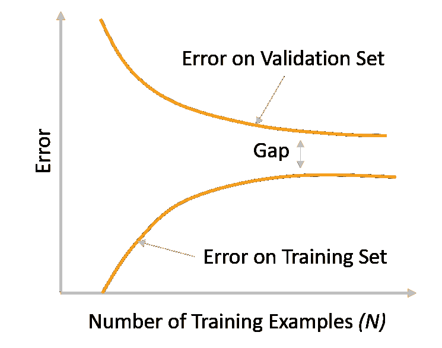

# 使用机器学习算法

> 原文：<https://towardsdatascience.com/using-machine-learning-algorithms-d47711ff4732?source=collection_archive---------38----------------------->

## 如何评估和改进机器学习模型的指南。

此时，您必须对线性回归、逻辑回归和神经网络等最常用的机器学习算法有一个基本的了解。但是，为了有效地应用这些算法，您可能需要阅读一些要点。

```
A note on the notation. x_{i} means x subscript i and x_{^th} means x superscript th.
```

# 特征工程

很明显，一个好的数据集可以产生一个好的模型。然而，考虑这样一个场景，你在一家计算机公司工作，你的新任务是预测服务器多久崩溃一次。为了构建模型，该公司向您提供了如下所示的服务器日志。

```
- - [30/Apr/2019:14:57:29 +0530] "GET /launched-version/scripts/vendor/angular-animate.min.js.map HTTP/1.1" 404 547 "-" "Mozilla/5.0 (X11; Linux x86_64) AppleWebKit/537.36 (KHTML, like Gecko) Chrome/74.0.3729.108 Safari/537.36"
```

您不能立即使用日志文件来开始预测服务器的健康状况。将原始数据转换成计算机可以操作的数据集的任务被称为*特征工程。*诸如服务器的运行时间、服务器的停机时间、客户端经历的等待时间、服务器抛出的错误类型或任何可测量的事物都可以被认为是特征。目标是创建有助于学习算法做出正确预测的特征。

现在，让我们来看几个用于特征工程的方案。

## 一键编码

大多数学习算法都适用于数值。但是，特征向量有可能是分类的。在这种情况下，我们需要将分类变量转换成数字变量。假设分类变量“血型”有四个可能的值——A、B、AB 和 o。我们可以使用以下映射将“血型”特征转换为数值。

```
A  = [1,0,0,0]
B  = [0,1,0,0]
AB = [0,0,1,0]
O  = [0,0,0,1]
```

请注意，转换增加了特征的维度。人们可能会争论执行编码，其中 1 对应于 A，2 对应于 B，3 对应于 AB，4 对应于 o。但是，这应该避免，因为它意味着值之间的排序。它可能会混淆学习算法，因为算法会试图在没有订单时找到订单。这也可能导致过度拟合。

## 扔掉

可能会出现将数值转换为分类值的罕见情况。宁滨允许进行这样的转换。例如，不是将“标记”表示为单个连续的特征，而是可以将它分成箱:100-90 之间的标记放入一个箱，89-80 之间的标记放入第二个箱，依此类推。



Example of Binning

宁滨告诉学习算法，重要的不是特定的数值(比如 85 分)，而是数值的范围(比如 89-80 分)。它有助于更好地概括学习算法。

# 分割数据集

假设约翰被分配了训练机器学习模型的任务。他决定训练一个线性回归模型。

```
A linear regression model *f(x)*,is a linear combination of the features of the input examples *x*, and is represented by *f(x) = wx+b*.Transforming the original features (consider a 1-dimensional feature vector *x*) by changing their degree such as squaring or cubing them results in polynomial models (such as *f(x) = wx²+b* or *f(x) = wx³+b*).
```

然而，他在为他的线性回归模型选择*度* *d* 时遇到了麻烦。变量，如定义模型本身的*度*被称为**超参数**。超参数甚至在训练开始前就已经设置好了。

一个解决方案是将数据集分成三个子集—

*   训练集— 70%
*   验证集— 15%
*   测试集— 15%

在分割数据集之前，将数据集随机化是很重要的。此外，分割应该代表原始数据集。


The idea behind splitting the dataset so that the split is a good representation of the original data set.

分割完成后，训练集被用于训练，这为我们提供了一个模型。然后根据验证集评估获得的模型。

数据分析师可能会调整 hyper 参数，在训练集上训练模型，在验证集上评估模型，最后选择在验证集上表现最佳的模型。一旦选择了最佳模型，就要在测试集上再次评估它的性能和通用性。

拥有测试集的想法是，持续使用训练集和验证集来调整超参数可能会“磨损它们”，并导致过度拟合的模型，而不是一般化的模型。



Using the three sets.

# 欠配合与过配合

如果算法欠拟合，则称其具有**高偏差**。也就是说，算法对数据有很强的先入之见，不想去适应数据集。另一方面，过拟合算法被认为具有**高方差。**


Over fitting and Under fitting

一个模型很可能不适合——

*   模型对于数据来说过于简单(例如，线性模型可能不适合)；
*   这些特征的信息量不足(假设您想要预测某个学生是否会通过某项考试，但是用于解决问题的特征是该学生的身高和体重。显然，功能的选择是有问题的。它们与手头的问题不相关)。

一个模型可能会过度拟合，以防—

*   模型对于数据太复杂(考虑包括所有二次和三次项来训练简单的线性回归模型)；
*   您有太多的特征，但训练示例的数量较少(只有 50 个示例的数据集，其中每个示例有 100 个特征，这可能会过度拟合，因为算法没有足够的信息来观察数据集所有特征的模式)。

防止过度配合最常用的方法之一是**调整**。

## 规范化

正则化有助于降低学习算法的复杂性。观察下面的等式—



Regularisation

这里的 *J* 是未调整的成本函数。我们的目标是找到假设函数 *f(x)* 的参数 *w* 和 *b* 的值，使得非正则成本函数值最小。

现在观察*正则化项*，它只是我们假设函数 *f(x)* 所有参数的平均值。

正则化成本函数 *J_{reg}* 是这两项的简单总和。现在的目标是最小化正则化成本函数*。*由于 *J_{reg}* 是两项之和，因此最小化其中任何一项都会导致其最小化。正则项给新的成本函数增加了额外的负担。成本函数上的每次迭代都受到正则化项的惩罚，因此，参数值随着每次后续迭代而被简化，从而防止过拟合。

*λ* 是一个超参数，用于控制惩罚成本函数的强度。如果 *λ=0* ，则成本函数完全不被惩罚，导致高方差模型。在 *λ* 被设置为非常大的值的情况下，通过将大多数参数 *w_{i}* 设置为零来最小化成本函数，这导致高偏差模型。通常会测试一系列的 *λ* 值，并为模型选择在验证集上表现最佳的值。

## 学习曲线

学习曲线也有助于解决高偏差和高方差的问题。针对训练示例的数量绘制了由验证集和训练集生成的误差的图表。有目的地限制训练样本的数量，并绘制误差图。诸如均方误差函数的任何标准误差函数可用于计算验证集和训练集的误差。



Learning Curve

训练误差最初很小，因为训练样本的数量较少，或者我们可以说要处理的数据中的变化较少。然而，随着训练样本数量的增加，数据内的变化也增加，因此训练误差也增加。

最初，使用少量训练示例来训练模型，因此它不能很好地概括，从而在验证集上给出较高的误差。但是，随着训练样本数量的增加，模型开始泛化，验证集上的错误减少。

在过拟合模型的情况下，训练集和验证集的误差之间的*差距*很小，并且两个误差都取大值。因此，如果一个算法显示了这种行为，那么获得更多的训练数据将没有任何帮助。

另一方面，在欠拟合模型的情况下，训练集和验证集的误差之间的*差距*相对较大，验证误差也保持较高，因为模型不能很好地概括。这种行为可以通过收集更多的训练样本来改进。

# 模型性能指标

一旦我们有了模型，我们就使用测试集来评估模型的性能，并决定模型的泛化程度。有一些评估指标可以帮助我们分析模型的性能—

## 混淆矩阵

混淆矩阵总结了分类问题的预测结果。考虑下面的混淆矩阵—


Confusion Matrix

从该表中可以得出结论，在总共 25 封实际垃圾邮件中，该模型正确地预测了 20 封是垃圾邮件(真阳性)，然而将 5 封电子邮件误分类为非垃圾邮件(假阴性)。类似地，在总共 510 封非垃圾邮件中，该模型正确地将 500 封电子邮件标记为非垃圾邮件(真阴性)，但是将 10 封非垃圾邮件误分类为垃圾邮件(假阳性)。

混淆矩阵让我们了解学习算法所产生的错误模式。假设一个模型具有较高的假阴性率，这意味着该模型经常将垃圾邮件预测为非垃圾邮件。在这种情况下，用更多的*垃圾邮件*例子训练模型听起来是一个合理的选择。

在多类分类*的情况下，使用一个对所有*的方法，其中除了感兴趣的类之外的所有类被分组为单个类，从而将我们的问题转换为二元分类问题。一个 *n 类*多分类器给了我们 *n 个*混淆矩阵。


A classifier predicting three classes High, Moderate and Low is evaluated for the ***High*** *class using a confusion matrix.*

## 精确

精度是模型*错误警报*率的量度。


Calculating Precision of a Model

考虑到上面的混淆矩阵——在被模型分类为垃圾邮件的 30 封电子邮件中，20 封实际上是电子邮件，而剩余的 10 封被错误地标记为垃圾邮件，因此我们的准确率为 66%,误报率为 33%。

## 回忆/敏感度


Recall also known as Sensitivity.

召回反映了该车型的*敏感度*。它显示了*真实阳性率*。对于上述混淆矩阵，在总共 25 封实际垃圾邮件中，该模型正确地标记了 20 封电子邮件，但是将 5 封电子邮件错误地分类为非垃圾邮件，从而使得该模型对将电子邮件标记为垃圾邮件 80%敏感。

## 特征

特异性是一个相关的衡量标准，它告诉我们有多少被归类为非垃圾邮件的电子邮件实际上不是垃圾邮件。它测量*真实负利率*。上述混淆矩阵具有 98%的特异性。


Specificity.

作为一名分析师，我们希望控制精确度和召回率之间的平衡。大多数情况下，这取决于手头的问题——考虑一个试图将患者分类为癌症或非癌症的模型的情况。在这种情况下，人们可能希望有更高的回忆，也就是说，你不希望将实际的癌症患者错误地分类为健康的(避免假阴性)。无论如何，较低的准确率是可以接受的，这意味着，将一个健康的人归类为癌症患者并对他进行疾病测试(愿意接受假阳性)不会有什么坏处。然而，如果我们能以某种方式将精确度和召回率合并成一个术语，那将会非常有帮助。这将为我们提供一种更简单的方法来使用单一指标评估和比较模型，而 F-measure 正是这样做的。

## f-测度


The F-Measure value.

数学上，F-measure 是*精度*和*召回的调和平均值。*对较低的值赋予较高的权重。如果精度或召回率达到一个较低的值，那么 F-measure 就会下降，迫使我们调整我们的模型以给出更好的 F-measure 值。