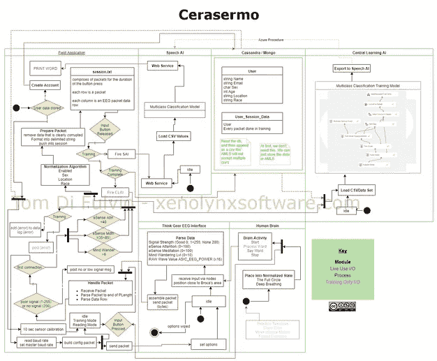
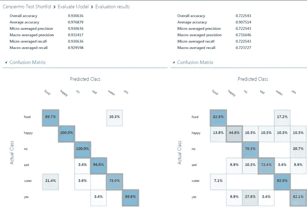

# 使用机器学习将来自大脑的 EEG 信号分类为单词

> 原文：<https://towardsdatascience.com/using-machine-learning-to-categorise-eeg-signals-from-the-brain-to-words-728aba93b2b3?source=collection_archive---------4----------------------->

*这篇文章最初发表在我 2017 年的旧博客上，我现在再次拾起它，并将在不久的将来研究扩展这项技术，特别是智能手机和物联网设备的内置 AI/ML 功能…*

这篇博文的标题差不多就是 TL；我已经尝试过(并取得了一些成功)的博士，尽管我可能一开始就不够资格去尝试。我的想法是在受试者思考说某些单词时从大脑中收集数据。在那里，我会用收集到的数据训练一个机器学习分类算法，然后使用得到的模型实时读取受试者的脑电波，并将它们分类为他们可能试图说的话。预期的结果将是一个应用程序，它可以读取试图说话的人的想法，并将这些话输出给他们试图与之交流的人。

这是在我祖母被诊断出患有一种叫做延髓麻痹的运动神经元疾病之后发生的，这种疾病开始影响她说话的方式。随着病情恶化，我开始想办法让她能够交流。她去看的医生给她提供了一个不合适的 iPad，而且对她不起作用。意大利语是她的第一语言，当她试图拼写英语单词时，使用苹果的文本到语音引擎就不会正确地拼写出来。[我设法将安卓手机的文本到语音引擎切换到谷歌的文本到语音引擎](http://www.phonearena.com/news/How-to-swap-Samsungs-default-text-to-speech-engine-with-Googles-TTS-voices_id86379)，这允许她使用带有意大利口音的扬声器，据说这是用来将意大利文本转换成意大利语音的。有趣的是，当她用被认为是说意大利语的引擎用英语写作时，你能理解她想说什么。

下一个要考虑的问题是，如果她失去了双手的功能，或者有人试图使用这种方法，但他不会拼写，就像我祖母这个年龄的许多人一样。这是我想到用机器学习把脑电波转换成文字的时候。我对脑电波知之甚少，而且当时我只是狂热地阅读和宣传机器学习，并没有真正将其付诸实践。

# 读取脑电波

我在某处看到了脑电图(EEG)读数，意识到这些读数一定是由来自大脑的原始数字组成的，所以用某种软件解析它们会有多难。当我看到另一个关于 NeuroSky MindWave 移动耳机的视频时，我正在看一个 YouTube 视频，视频中有一个人把湿海绵绑在他的头上。你可以[在这里阅读《科学美国人》的一篇文章](https://www.scientificamerican.com/article/wireless-brain-wave-monitor/)，但它本质上是一个用来制作游戏和冥想应用的设备，符合我的两个需求:

1)它能读取脑电波，而
2) [它有一个 API](http://developer.neurosky.com/docs/doku.php?id=neurosky_101) ，我可以用它来读取原始数字格式的脑电波。

我不希望任何内部软件处理我的数据，尽管 MindWave 有一个内部处理器来确定你有多放松或专注，但它也允许你获得一个原始的脑电图读数，可以很容易地分成正确类型的[脑波类别](https://www.google.com.au/search?q=brainwave+categories)。

我从阅读 Neurosky 的文档中了解到，SDK 会解析来自大脑的数据，并将其放在以下频带中:

这些值与我的想法之间的联系是，这些类别的脑电波用于解释大脑的不同状态，如上表右栏所述。更重要的是，我可以将这些值传递给机器学习算法，让它在识别这些值中的特定模式时预测一个人在想什么。我想依靠机器学习算法进行分类的原因是，我知道数据中会有噪声和差异，我无法可靠地用代码中的基本条件过滤掉自己。

# Python 原型

在我花 150 美元买耳机之前，我决定做一个软件原型来测试我的想法是否真的可行。我首先完成了微软机器学习工作室的课程，然后进行了一些涉及住房数据的测试实验；预测房价等。一旦我很高兴四处导航并熟悉了不同算法的能力，我就开始用 Python 模拟一些脑电图数据。在 Python 中，我使用了下面的[脚本，我已经将它上传到 GitHub](https://github.com/TomDF47/EEG-Test-Data-Generator/blob/master/TestDataGeneratorCSVbatch.py) 来将我的测试数据生成到一个 csv 文件中，然后我可以将它上传到我在 Azure 中的机器学习实验中。我让数据重叠，试图模拟真实数据中会出现的一些差异和噪声。我拼凑了一个机器学习实验来测试我的模拟数据，在我对结果感到满意后，我从 Neurosky 订购了耳机。

# 该系统

然后，我继续设计一个整体系统，这样我就能够朝着某个目标努力，而不会忘记我在做什么。我将我的项目命名为 Cerasermo，并提出了以下粗略的系统图…

该系统包括各种子系统，例如保存用户数据和潜在的大量 EEG 数据的数据库。我也有一些小的子程序计划去做一些我认为在解析大脑数据时可能需要做的事情。一个这样的子程序将处理这样一个事实，即我需要根据受试者的性别和可能的其他我还不知道的因素对数据进行归一化。这个想法是我从英格丽德·尼乌文胡伊斯和弗雷德里克·鲁在 T2 的交流中得到的，他们讨论了男性和女性的脑电图数据可能不同。我计划采用的跨主题数据标准化的实际实现是[在 R-Bloggers](https://www.r-bloggers.com/normalising-data-within-groups/) 上发布的。然而，就目前而言，实施将针对单一主题；我自己，最终还有我的祖母。

# 安卓应用

我开始编写一个 Xamarin 应用程序，因为我熟悉这个框架，并且以前有过将 C# Xamarin Android 应用程序发送到 Google Play 商店的经验。当我将蓝牙添加到实现中时，我遇到了问题，因为 Xamarin 当时不支持常规的蓝牙(只有低功耗的蓝牙实现)。这迫使我切换到 Android Studio，并因此将我的应用程序语言从 C#翻译成 Java。我最终得到了计划中的 Cerasermo 系统的一个极其简化的版本；我让我的应用程序从耳机中读取 EEG 数据并导出到文件中。这整个过程，包括上传到我的 Azure 机器学习实验，非常慢，最终如果要按照我的计划在日常对话中使用，系统将需要完成。

# Azure 机器学习

我使用了下面的机器学习实验，其中我将我的数据一分为二，以便我可以并排训练和测试我的两个入围算法…

我这里的两个分类算法是[多类决策森林](https://msdn.microsoft.com/library/azure/5e70108d-2e44-45d9-86e8-94f37c68fe86)和[多类神经网络](https://msdn.microsoft.com/en-us/library/azure/dn906030.aspx)。我使用了微软的[调谐模型超参数模块](https://msdn.microsoft.com/en-us/library/azure/dn905810)与整个网格扫描，以便自动选择两个模型的最佳参数。在[这个神奇的备忘单](https://docs.microsoft.com/en-us/azure/machine-learning/machine-learning-algorithm-cheat-sheet)的帮助下，我决定使用多类决策森林算法，因为我知道很难获得大量数据，我需要一个易于在短时间内用有限数据训练的模型。此外，根据我对算法本身的理解，该模型基于建立非线性决策边界，我认为这将作为分类模型很好地工作。出于好奇，我选择了多类神经网络算法来测试更多。

我最初选择了“是”和“不是”这两个词来检测，因为我觉得它们是彼此情绪上的对立面。在两个模型都达到接近 100%的预测准确率后，我决定添加单词“水”、“食物”、“快乐”和“悲伤”。我觉得我试图检测的单词类型在情感意义上是彼此对立的，因此会有很大不同的脑电波模式，使它们更容易分类。我将来自耳机的大部分数据输入算法，包括 EEG 信号的原始值、分类信号值以及注意力、冥想和眨眼值。我为每个单词记录了 5 个 30 秒间隔的数据。

两种算法的结果如下，左边是多类决策森林，右边是多类神经网络…

值得注意的是，除了比多类神经网络更准确之外，多类决策森林的训练速度也快得多。我不确定为什么多类神经网络没有更好地对脑电图数据进行分类，但我认为这与我输入模型的数据量有关。我可能需要记录更多的数据以供算法使用。对我的数据集中的字段应用权重也可能有所帮助。

我从实验中移除了多类神经网络，并在用实际数据测试之前重新训练了模型。测试时，我发现得到的模型极其准确；大约 95%的人在一系列 20 次测试中有一次错误地预测了水。当你看上面的混淆矩阵时，这是完全可以预料的。

# 对结果的反思

有趣的是，当我第二天早上再次测试该模型时，我的结果不太准确，我认为这与大脑在一段时间后和一天中不同时间的状态不同有关。大脑在处理单词时可能会发出不同的信号，这取决于情绪、饥饿、口渴和周围环境等因素。为了减轻这一点，我已经考虑过包括某种预训练，几乎是冥想，例行公事，以便集中精神提供一个更标准化的阅读。我可以通过潜在地向受试者展示某种模式或物体以及声音来实现这一点(万一他们失去了视力，他们仍然有一个可以依靠的基石)

尽管我的祖母可能无法从这项努力中受益，但我认为继续这项实验是值得的，因为它可能会帮助其他处于类似或更糟糕情况的人。我目前正在从我的祖母那里收集一天中不同时间的数据，以抵消我在训练后的早晨所经历的不准确性。我预计有了这些新数据，我可能需要重新配置算法。

虽然这个实验是一个成熟的实验，但我想象像这样的东西可以用于许多不同的目的，例如固定不动的人，或者它甚至可以用作一种安全形式或一种类似心灵感应的通信方法。另一种训练模型的方法是让它一直听并记录你的声音。和你呆了一天，听你说话后，它会知道当你想说某些单词时会发生什么，从而增加你的潜在词汇量。

在未来的博客文章中，我计划更深入地研究这个解决方案的数学原理，因为我希望有一天为了成本和速度的利益，使用我自己的算法而不是微软的算法。

欢迎在此评论或[联系](https://www.linkedin.com/in/tom-di-fulvio-3b3382a1/)。有人对我的工作进行评估并提供反馈是非常好的，也是非常受欢迎的。我在业余时间做这个，和这个领域的其他人有些脱节，希望得到反馈和/或建议。

感谢阅读！

Cerasermo is licensed under a [Creative Commons Attribution-NonCommercial-ShareAlike 4.0 International License](http://creativecommons.org/licenses/by-nc-sa/4.0/).

​