# 使用机器学习来了解你的胸痛是否是心脏病的征兆

> 原文：<https://towardsdatascience.com/using-machine-learning-to-know-if-your-chest-pain-is-the-sign-of-heart-disease-or-not-f7bcf73be71b?source=collection_archive---------18----------------------->

## 医学机器学习

## 开发机器学习模型，以通过给定的胸痛和其他属性来分类该人是否患有心脏病


Photo by [Marcelo Leal](https://unsplash.com/@marceloleal80?utm_source=medium&utm_medium=referral) on [Unsplash](https://unsplash.com?utm_source=medium&utm_medium=referral)

# 先决条件

在开始项目之前，您应该具备以下基本知识:

1.  计算机编程语言
2.  熊猫(数据分析库)
3.  科学计算库
4.  Scikit 学习(用于数据预处理和模型选择)

# 资料组

我们将使用加州大学 ***机器学习库提供的 [**心脏病数据集**](https://archive.ics.uci.edu/ml/datasets/heart+Disease) 。***

> UCI 页面提到以下人员是负责数据收集的主要研究者:
> 1。匈牙利心脏病研究所。布达佩斯:医学博士安朵斯·雅诺西。瑞士苏黎世大学医院:医学博士威廉·斯坦布伦。瑞士巴塞尔大学医院:医学博士马蒂亚斯·普菲斯特勒。弗吉尼亚医疗中心，长滩和克利夫兰诊所基金会:罗伯特·德特拉诺，医学博士，哲学博士。

# 介绍

在这个项目中，我们将通过使用患者的年龄、性别、胸痛类型、血压、胆固醇水平及其心脏病状况数据来对胸痛是否是心脏病的指征进行分类。

# 代码部分

## 2.1 准备数据

首先让我们看看我们的数据字典:

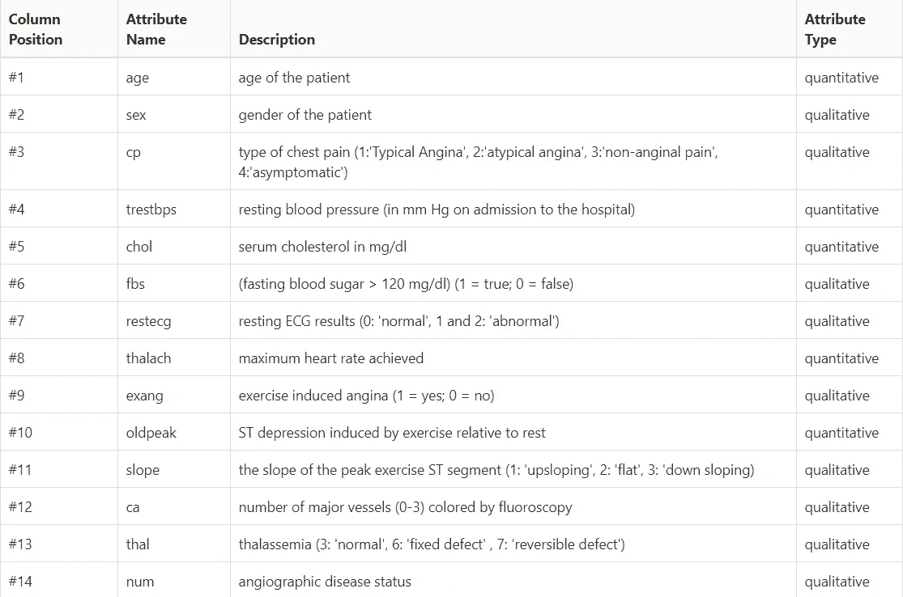

这里我们总共有 14 列，13 列是我们的特性，1 列是标签。

```
import **pandas** as **pd**df = pd.read_csv('data.csv')
```

我们正在用熊猫进行数据处理。

```
df.head()
```

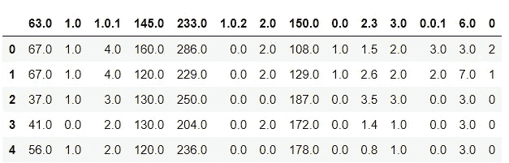

在我们的数据集中，我们没有列的名称，现在我们的任务是根据数据字典为相应的列添加名称。

同样，我们将使用 pandas 读取 csv 文件，但这次我们也将向列中添加名称。

```
df = pd.read_csv('data.csv', sep=",", names=["Age", "Sex", "CP", "Trestbps", "Chol", "Fbs", "Restecg", "Thalach", "Exang", "Oldpeak", "Slope", "CA", "Thal", "Label"])df.head()
```

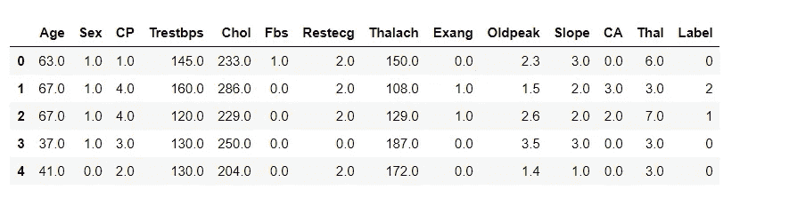

现在看起来不错。

## 2.2 探索数据

让我们检查信息，看看数据集中是否有空值。

```
df.info()
```

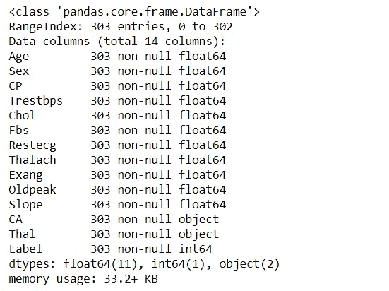

如您所见，每列有 303 个条目，没有任何空值。这对我们来说是个好兆头。

现在，让我们立即开始特征工程。

## 2.3 特征工程

众所周知，特征工程是数据科学中最关键的部分。从这里，我们应该能够深入了解我们的数据，并设计出对我们的分类贡献更大的最佳特征。

## **2.3.1 固定数据**

通过观察数据，我们可以看到标签栏中的值偏差很小。因为这是一个二元分类问题，应该有 0 或 1 个值，但这里我们有 5 个不同的值。

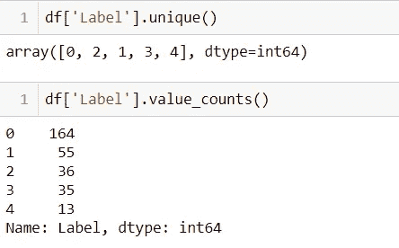

如果我们查看由 **UCI** 提供的 [**数据描述**](https://archive.ics.uci.edu/ml/machine-learning-databases/heart-disease/heart-disease.names) 我们可以看到 label(num)列值分为两类:

1.  值 0:表示没有心脏病
2.  价值 1:意味着有心脏病

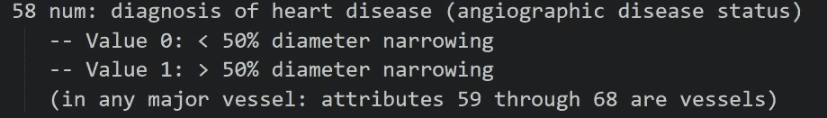

由此我们假设大于 1 的值也属于有心脏病一类。

让我们编写一个函数来映射这些值:

```
def **mapLabels**(value):
    if value > 0:
        return 1
    else:
        return 0
```

上面的函数获取值，如果值大于 0 则返回 1，否则返回 0。

让我们将其映射到我们的标签:

```
df['Label'] = df['Label'].map(mapLabels)
df['Label'].value_counts()
```

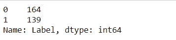

我们数据中的另一个问题是:

在我们的 CA 和 Thal 列中，我们将它作为对象数据类型，但是值是浮动的。

```
import **numpy** as **np**df.select_dtypes([np.object]).head()
```

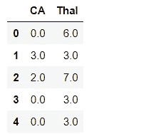

这里我们使用 numpy 从数据集中选择对象数据类型。

经过一点挖掘，我发现，CA 和 Thal 列有一些空值设置为“？”。

让我们也修复这些数据:

```
def **caToFloat**(value):
    if not value == '?':
       return float(value)
    else:
        return 0df['CA'] = df['CA'].map(**caToFloat**)
```

这里，我们将 **CA** 列的值映射到 float 值和任何带“？”的值到 0。因为只有几个人？数据，我们的数据最初属于[0–3]类；可以将它们映射到 0。


对于 **Thal** 数据:

```
df['Thal'].value_counts()
```

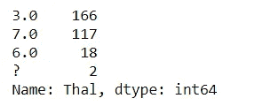

如我们所见，我们的大多数数据都是 **3.0** 值，因此我们可以映射出**'？'**值到 **3.0** ，因为它们只有 2 个数字。

```
df['Thal'] = df['Thal'].map(lambda x : 3.0 if x == '?' else float(x))df['Thal'].value_counts()
```

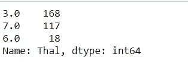

现在让我们检查我们的数据信息:

```
df.info()
```

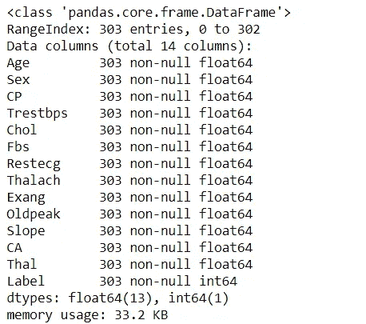

我们所有的值都是数字。

让我们将连续年龄数据转化为类数据:

```
df.loc[df['Age'] <= 16, 'Age']  = 0,
df.loc[(df['Age'] > 16) & (df['Age'] <= 26), 'Age']  = 1,
df.loc[(df['Age'] > 26) & (df['Age'] <= 36), 'Age']  = 2,
df.loc[(df['Age'] > 36) & (df['Age'] <= 62), 'Age']  = 3,
df.loc[df['Age'] > 16, 'Age']  = 4
```

这里，我们将年龄数据分为[0，1，2，3，4]类，其中:

儿童:0 青少年:1 成人:2 中年:3 老年人:4

```
df['Age'].value_counts()
```

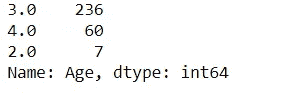

如你所见，我们的数据中没有孩子或年轻人。

这有助于更好的分类。你也可以寻找其他的特性并设计它们。

## 2.4 数据预处理

现在是准备分类数据的时候了。

```
labels = df['Label']
features = df.drop(['Label], axis=1)
```

这里，我们将特征和标签从数据帧中分离出来。

现在，我们将使用 scikitlearn 将我们的数据分成训练和测试数据。

```
from sklearn.model_selection import train_test_splittran_x, test_x, train_y, test_y = train_test_split(features,labels, shuffle=True)
```

## 2.5 型号选择

现在我们准备好训练我们的数据。

为了选择我们的最佳模型并在此基础上训练我们的数据，我们将使用 sklearn。

```
from sklearn.svm import SVC
from sklearn.tree import DecisionTreeClassifier
from sklearn.ensemble import RandomForestClassifier
from sklearn.naive_bayes import GaussianNB
from sklearn.model_selection import KFold, cross_val_score
from sklearn.ensemble import GradientBoostingClassifierk_fold = KFold(n_splits=12, shuffle=True, random_state=0)
```

在这里，我们将使用 **KFold** 交叉验证我们的数据，并从这些不同的分类模型中选择我们的最佳模型。

**KFold** 允许我们验证所有的训练数据，并帮助找到我们的最佳模型。

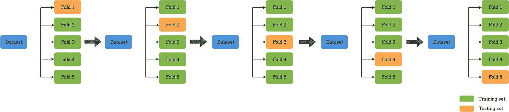

KFold

这里我们将使用 12 个折叠拆分。

现在，让我们训练我们的第一个模型是 SVC 或 SVM(支持向量机)

```
clf = SVC(gamma='auto')
scoring = 'accuracy'
score = cross_val_score(clf, train_x, train_y, cv=k_fold, n_jobs=1, scoring=scoring)
print(score)
## OUTPUT: 61.38
```

从 SVC 我们只能得到 61.38%的准确率。

让我们看看其他模型:

**梯度推进分类器**

```
clf = GradientBoostingClassifier()
scoring = 'accuracy'
score = cross_val_score(clf, train_x, train_y, cv=k_fold, n_jobs=1, scoring=scoring)
round(np.mean(score)*100, 2)## OUTPUT: 77.35
```

**决策树分类器**

```
clf = DecisionTreeClassifier()
scoring = 'accuracy'
score = cross_val_score(clf, train_x, train_y, cv=k_fold, n_jobs=1, scoring=scoring)
round(np.mean(score)*100, 2)## OUTPUT: 75.91
```

**随机森林**

```
clf = RandomForestClassifier(n_estimators=10)
scoring = 'accuracy'
score = cross_val_score(clf, train_x, train_y, cv=k_fold, n_jobs=1, scoring=scoring)
round(np.mean(score)*100, 2)## OUTPUT: 83.28
```

**朴素贝叶斯**

```
clf = GaussianNB()
scoring = 'accuracy'
score = cross_val_score(clf, train_x, train_y, cv=k_fold, n_jobs=1, scoring=scoring)
round(np.mean(score)*100, 2)## OUTPUT : 85.95
```

正如我们可以看到的，我们在朴素贝叶斯上得到了高分，所以我们将使用这个分类器进行分类。

> 我们的分数很低，因为我们没有正确设计我们的数据。你可以通过更多的数据清理和特征选择来获得更多的分数。
> 
> 您还可以调整 hyper 参数以获得更好的效果。

## 2.6 培训模式

让我们使用朴素贝叶斯分类器算法来训练我们的模型:

```
clf = GaussianNB()
clf.fit(train_x, train_y)
```

现在让我们看看我们的预测:

```
predictions = clf.predict(test_x)
values = list(zip(predictions, test_y.values))status = []
for x, y in list_of_values:
    status.append(x == y)
list_of_values = list(zip(predictions, test_y.values, status))final_df = pd.DataFrame(list_of_values, columns=['Predicted', 'Actual', "Status"])
```


这里我们可以看到我们也有一些错误的分类，您可以通过改进我们的特征选择来改善这些。

# 结论

现在，我们的模型能够通过给定的各种特征来预测心脏病的迹象😀。

分类问题有时容易，有时非常困难，这完全取决于您使用哪种数据以及您在特征选择+模型超参数选择上付出了多少努力。

对于像我们这样的初学者来说，了解 ML 如何工作，探索数据集和解决问题是最好的学习方式。

暂时就这样了。希望你喜欢这个项目，并学到了一些东西。