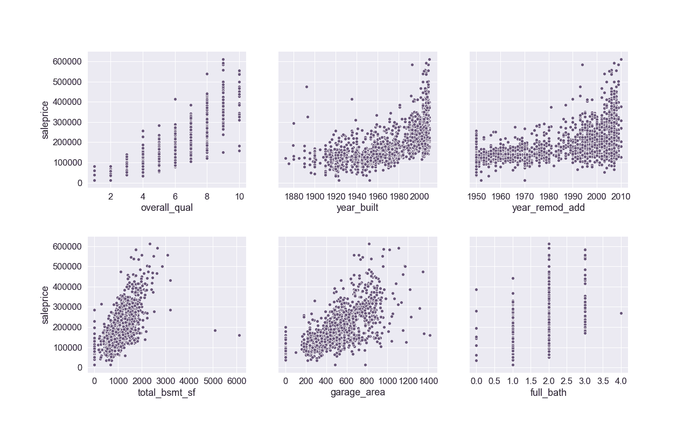

# 使用机器学习来预测房价

> 原文：<https://towardsdatascience.com/using-machine-learning-to-predict-home-prices-d5d534e42d38?source=collection_archive---------14----------------------->

## LassoCV、RidgeCV 和线性回归机器学习算法。

Photo by [Gus Ruballo](https://unsplash.com/@gusruballo?utm_source=medium&utm_medium=referral) on [Unsplash](https://unsplash.com?utm_source=medium&utm_medium=referral)

在这篇文章中，我将向你展示我使用机器学习来预测房价的数据科学过程。在开始之前，我想概述一下数据科学流程:

*   定义问题
*   收集数据
*   清理和探索数据
*   对数据建模
*   评估模型
*   回答问题

# 定义问题

我的任务是**创建一个机器学习模型，使用 Kaggle 的 Ames 住房数据集预测房价**。为了使数据科学问题更加现实，我添加了提高 [Zillow 的 Zestimate 准确性(星级)](https://www.zillow.com/zestimate/)的需求，用于像 Ames 这样有 3 颗星的地区(良好的 Zestimate)。这可能是由于假设的三星级酒店的用户网络流量增加。

# 收集数据

该数据集包含来自评估人办公室的[信息](http://jse.amstat.org/v19n3/decock/DataDocumentation.txt)，用于计算 2006 年至 2010 年在爱荷华州埃姆斯出售的个人住宅物业的评估价值。数据集包含 2051 行和 81 列(特征)信息。这些数据由 Kaggle 收集和提供。如果没有提供数据，我收集数据的方法是做研究，看看它是否公开，或者通过 Zillow 的 API 下载。

# 清理和探索数据

接下来，我执行了数据清理和探索性分析。对于前者，我检查空值和数据输入错误并做出决定。对于后者，我将数据可视化，以便更好地查看和理解关系和分布。

下面是我的目标变量——销售价格的两个可视化视图。我想了解它的分布。

the distribution of Sale Price, the target, which we can see is right-skewed

the distribution of Sale Price, the target, after taking the log — now it’s more normally distributed

我把目标的日志输入到模型中。我这样做是因为该模型将试图找到我们目标的满意中值，但如果不加处理，它会一直低估离群值，这会对 R 平方得分产生负面影响。根据 R 平方公式，我们的模型越错误，它将受到越多的惩罚，因为分子中的残差(误差)被平方。因此，对我们记录的目标进行预测将允许模型具有与欠猜一样多的过猜或更正态分布的预测。

接下来，我想了解我的特征与我的目标变量之间的关系，所以我绘制了我的特征与售价 0.50 或更高的相关性的热图。没有一个与销售价格呈负相关，相关系数为-0.50 或更低。

我想进一步研究这些关系，所以我从上面的关联热图中绘制了六个特征的散点图。

如您所见，与 0.80 的销售价格具有最强相关性的***total _ qual***在所选的六个中显示了最强的线性关系。

# 对数据建模

在这一步中，我将我的数据分为训练集和测试集，选择我的特征以馈入模型、特征工程方法和模型。我最初从一个向前选择的过程开始——选择一个特性，运行我的模型，检查性能，然后重复这些步骤。我还手动创建了一些交互术语，dummied(将分类特征转换为布尔矩阵)，并映射(评分/加权分类特征)了一些我的分类特征。我选择的每一个功能都是有意为之的，无论是原样还是手工设计的。我主要依赖于该功能与销售价格的强相关性，以及我对某个功能是否会影响销售价格所做的直觉假设。使用这种方法，我得到了很好的结果，但后来我变得急切，并做出了(不正确的)假设，即如果我模拟或映射每个分类特征，然后在它们是数字后对所有特征应用多项式特征(整体相互作用项),那么我的所有特征对我的模型都将发挥最佳作用。

我检查了我新设计的功能与我的目标变量销售价格的相关性。你可以看到下面几个的结果。

correlations of the new dummied features to Sale Price

correlations of the new mapped features to Sale Price

正如你所看到的，我绘制的特征(第二张图)比我模拟的特征与销售价格有更强的相关性。我仍然坚持我的假设，继续给我的模型添加我所有的特征(当然除了售价)。

我选择了三种机器学习算法，分别是线性回归、RidgeCV 和 LassoCV。我知道有了大量的特征，我会提高我的过度拟合的潜力，所以我想包括后面的模型，因为它们有严格的正则化方法。我还假设多项式要素会处理我的要素之间的任何多重共线性。

# 评估模型

我的模特是拉索夫。它在我的训练数据上达到了 94%的 R 平方，在看不见的数据上达到了 86%。我的测试数据的 RMSE 是 37，334。这意味着两件事:1)模型解释了数据中 86%的可变性，2)模型过度拟合。

下面你可以看到我的预测(yhat)的分布覆盖在目标变量(y)上。

最终的模型不是我最好的模型。不幸的是，我重写了我的最佳模型中的特征——在我的特征选择和工程过程中我是故意的——因为做出了错误的假设，即把所有特征转换为数值并使用多项式特征会产生更好的结果。

# 回答问题

LassoCV 模型很好地处理了看不见的数据，所以我会用它来预测房价。

## 建议

我的一个建议是，通过以下方式继续测试/学习改进模型:

*   重新审视我最初的正向选择流程
*   选择与销售价格高度相关的功能
*   创建新的并检查它们的相关性
*   输入模型并检查结果
*   跟踪改进模型的特性，并丢弃(但也跟踪)不改进模型的特性

查看 [**我的代码**](https://github.com/traintestbritt/predicting_house_prices) 和 [**我的演示**](https://docs.google.com/presentation/d/18HFR4V_COfimNcqGskrFQk7IxSU8_tn7iLrRXwrEkTg/edit?usp=sharing) 。请评论任何问题。感谢阅读！