# 使用机器学习预测 Kickstarter 的成功

> 原文：<https://towardsdatascience.com/using-machine-learning-to-predict-kickstarter-success-e371ab56a743?source=collection_archive---------4----------------------->

## Kickstarter 适合你的项目吗？你如何优化以获得成功？

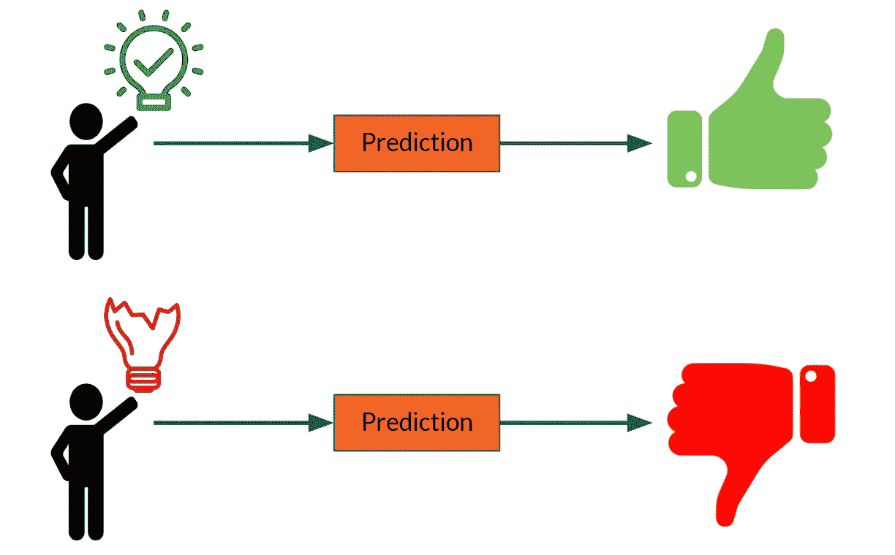

# **项目目标**

近年来，个人和小公司创建的项目的融资选择范围大大扩大。除了储蓄、银行贷款、朋友和家人的资助以及其他传统选择，众筹已经成为一种流行且容易获得的替代方式。 [Kickstarter](https://www.kickstarter.com/) ，成立于 2009 年，是一个特别知名和受欢迎的众筹平台。它有一个全有或全无的资助模式，即一个项目只有在达到其目标金额时才能获得资助；否则，资助者不会给项目提供资金。

一个项目的成败取决于各种各样的因素——一般来说，Kickstarter 也是如此。其中一些能够被量化或分类，这允许构建一个模型来尝试预测一个项目是否会成功。这个项目的目的是构建这样一个模型，并更广泛地分析 Kickstarter 项目数据，以帮助潜在的项目创建者评估 Kickstarter 对他们来说是否是一个好的融资选择，以及他们成功的机会有多大。

# 数据源

本项目中使用的数据集下载于。csv 格式，来自一个名为 [Web Robots](https://webrobots.io/kickstarter-datasets/) 的网络抓取网站。该数据集包含 Kickstarter 上托管的所有项目的数据，这些项目是从该公司 2009 年 4 月启动到 2019 年 3 月 14 日的网络搜集之日。该数据集包含 209，222 个项目，尽管其中一些是重复的。

# 清洁和预处理

为了将数据集转换成适合应用机器学习模型的格式，需要进行大量的清理工作。如果你对`df.isna()`和`df.drop()`还不够，你可以在我的 [GitHub 库](https://github.com/L-Lewis/Kickstarter-success-machine-learning)中查看完整的 Jupyter 笔记本代码。

在删除了重复的和不相关的行(例如，在活动中期取消的项目，或者仍然有效的项目)之后，我得到了一个相当大的数据集，包含 168，979 个项目。

保留或计算的列有:

*   项目目标(美元)
*   活动持续时间——从发布到截止日期的天数
*   从页面创建到项目启动的天数
*   广告词长度
*   名字字长
*   项目是否突出显示为员工选择(一键编码)
*   类别(一键编码)
*   国家(一键编码)
*   项目启动的月份(一键编码)
*   项目截止日期的月份(一次性编码)
*   项目启动的星期几(一键编码)
*   项目截止日期的星期几(一键编码)
*   项目启动的两小时时间窗口(一键编码)
*   项目期限的两小时时间窗口(一键编码)

一些功能最初是为了探索性数据分析(EDA)的目的而保留的，但后来为了使用机器学习模型而被放弃了。这些包括与结果相关的特征(例如承诺的金额和支持者的数量)，而不是与项目本身的属性相关的特征(例如类别、目标、活动的长度)。

# 探索性数据分析

现在是精彩的部分。

自 2009 年推出以来，Kickstarter 已经大幅增长，特别是在 2014 年，扩张真正开始加速。然而，在这一点上，成功的项目的比例大大降低了，因为站点被大量的项目淹没了。尽管近年来成功率一直在上升，但还是有希望的。

> **总体而言，56%的已完成项目(即那些已经完成且未被取消或暂停的项目)是成功的。**

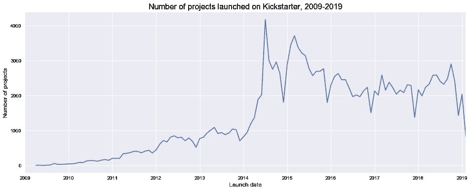

Changes over time in the number of projects launched on Kickstarter

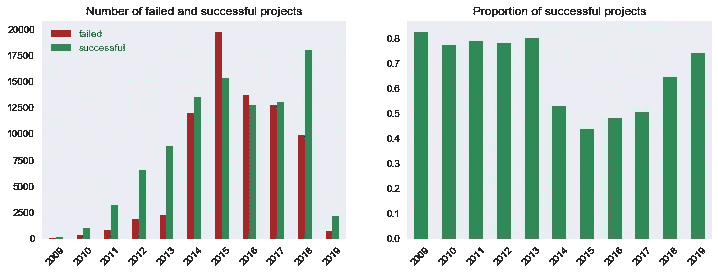

Changes over time in project successes and failures

下图显示了成功项目和失败项目在某些特征上的差异。这里的关键要点是:

*   不出所料，**成功的项目往往有更小(因此更现实)的目标** —成功项目寻求的金额中位数是失败项目的一半左右(使用中位数是因为资金和目标金额的正偏高)。
*   每个项目的承诺金额中位数的差异更令人惊讶。每个成功项目的承诺金额中值明显高于申请金额中值，这表明**达到目标的项目往往会获得更多资金，并变得“资金过剩”**。
*   与此相关的是，与目标金额相比，失败的公司和成功的公司在承诺金额和支持者数量方面的差异要大得多。可能一旦潜在的资助者看到一个项目看起来会成功，他们就更有可能加入并资助它。
*   成功的项目活动时间**稍短**，但启动时间稍长(从项目首次在网站上创建时算起)。
*   大约 20%的成功项目在网站上以员工选择的方式突出显示。在这里提出一种因果关系似乎是合理的，也就是说，被选作员工选择的**项目更有可能继续成功**，只有少数员工选择继续失败。

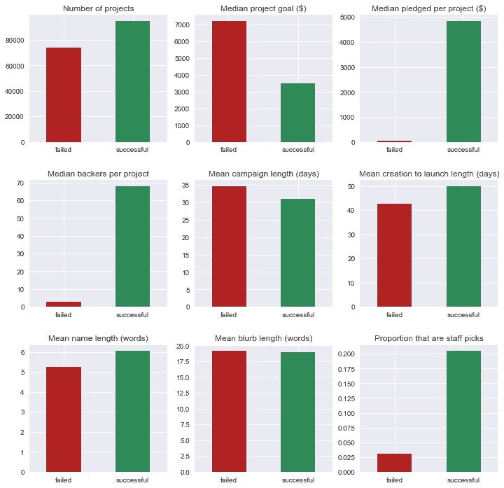

Comparison of features between successful and failed projects

在项目数量、目标和资金数额、支持者和成功率方面，探讨了各种其他特征。例如，下图显示了不同项目类别之间的差异(也提供了代码)。这里的关键要点是:

*   在 Kickstarter 上推出的最佳项目类型是**漫画**(根据成功率、支持人数和承诺金额)、**舞蹈**(成功率和承诺金额)和**游戏**(承诺金额和支持人数)。这可能至少部分是由于它们相对较小的筹资目标——如上所述，目标较小的项目往往更成功。
*   虽然**漫画**和**游戏**往往吸引最多的支持者，但每个支持者往往认捐相对较少。**舞蹈**和**电影&视频**往往吸引最慷慨的资助者。
*   **技术**项目到目前为止拥有最高的中值目标规模。然而，就实际承诺的中值金额而言，他们在排行榜上垫底。
*   表现最差的类别是**食品**、**新闻**和**科技。**

```
# Code used to create the graphs below# Importing the required libraries
import pandas as pd
import matplotlib.pyplot as plt
from matplotlib import cm
import numpy as np# Creating a dataframe grouped by category with columns for failed and successful
cat_df = pd.get_dummies(df.set_index('category').state).groupby('category').sum()# Plotting
fig, ((ax1, ax2), (ax3, ax4), (ax5, ax6)) = plt.subplots(3, 2, figsize=(12,12))color = cm.CMRmap(np.linspace(0.1,0.8,df.category.nunique()))df.groupby('category').category.count().plot(kind='bar', ax=ax1, color=color)
ax1.set_title('Number of projects')
ax1.set_xlabel('')df.groupby('category').usd_goal.median().plot(kind='bar', ax=ax2, color=color)
ax2.set_title('Median project goal ($)')
ax2.set_xlabel('')df.groupby('category').usd_pledged.median().plot(kind='bar', ax=ax3, color=color)
ax3.set_title('Median pledged per project ($)')
ax3.set_xlabel('')cat_df.div(cat_df.sum(axis=1), axis=0).successful.plot(kind='bar', ax=ax4, color=color) # Normalizes counts across rows
ax4.set_title('Proportion of successful projects')
ax4.set_xlabel('')df.groupby('category').backers_count.median().plot(kind='bar', ax=ax5, color=color)
ax5.set_title('Median backers per project')
ax5.set_xlabel('')df.groupby('category').pledge_per_backer.median().plot(kind='bar', ax=ax6, color=color)
ax6.set_title('Median pledged per backer ($)')
ax6.set_xlabel('')fig.subplots_adjust(hspace=0.6)
plt.show()
```

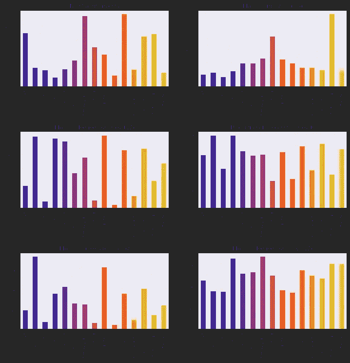

Exploring the ‘category’ feature

为了空间和视网膜的利益，只有“成功比例”图表将显示在下面的额外功能。同样，要了解更多细节，请随时查看我的 [GitHub 库](https://github.com/L-Lewis/Kickstarter-success-machine-learning)。这里的关键要点是:

*   香港的成功项目比例更高(它们的支持者人数和资助金额的中位数也更高)。
*   **周二是启动一个项目的最佳日子**，周末最糟糕(筹集的金额和支持者的数量也是如此)。
*   **世界标准时间下午 12 点到下午 2 点**是启动项目的最佳时间——这也是支持者人数和资金数额最多的时候。**世界协调时下午 6 点到凌晨 4 点**是最差的发射时间。
*   十月是启动一个项目的最佳月份——它也拥有最多的支持者和资金。七月和十二月是最糟糕的月份。

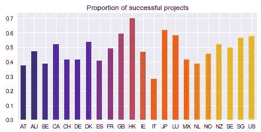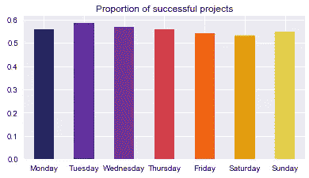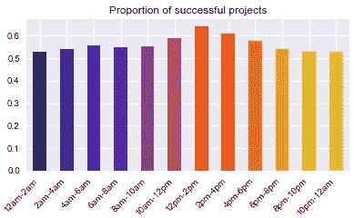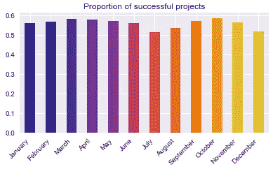

Top left: success rates by country. Top right: success rates by the day of the week on which projects were launched. Bottom left: success rates by the time of day at which projects were launched (in UTC/GMT). Bottom right: success rates by the month in which projects were launched.

# 为机器学习准备数据

这个项目的最终目标是创建一个模型，该模型能够以较高的准确度预测一个项目是成功还是失败。

为了准备机器学习的数据，采取了以下步骤(代码如下):

1.  一次性编码分类变量。
2.  将数据分为从属目标变量“y”(在本例中为“状态”，即项目成功或失败)和独立特征“X”。
3.  变换 X 轴上的要素，使其比例相同。对于这个项目，使用 Scikit-learn 的 StandardScaler 将每个特征转换为平均值 0 和标准差 1。
4.  数据被分成训练集和测试集，用于模型的稳健评估。

```
# Importing the required libraries
import pandas as pd
from sklearn.preprocessing import StandardScaler
from sklearn.model_selection import train_test_split# 1) Creating dummy variables
df_transformed = pd.get_dummies(df_transformed)# 2) Separating into X and y
X_unscaled = df_transformed.drop('state', axis=1)
y = df_transformed.state# 3) Transforming the data
scaler = StandardScaler()
X = pd.DataFrame(scaler.fit_transform(X_unscaled), columns=list(X_unscaled.columns))# 4) Splitting into train and test sets
X_train, X_test, y_train, y_test = train_test_split(X,y, test_size=0.3, random_state=123)
```

在运行机器学习模型之前，而不是之后，选择一种评估方法是一种很好的做法。选择加权平均 F1 分数。F1 分数计算精确度和召回率之间的调和平均值，并且是一个合适的度量，因为在这种情况下没有对假阳性或假阴性的偏好(两者都同样不好)。将使用加权平均值，因为这些类的大小略有不同，并且我们希望能够预测成功和失败。

> 在运行机器学习模型之前，而不是之后，选择一种评估方法是一种很好的做法。

# 模型 1:标准逻辑回归

逻辑回归可用作二元分类器，以预测数据点属于两个类别中的哪一个。

为了创建一个基线模型进行改进，使用默认参数将逻辑回归模型拟合到数据中。

```
# Importing the required libraries
from sklearn.linear_model import LogisticRegression
from sklearn.metrics import classification_report# Fitting a logistic regression model with default parameters
logreg = LogisticRegression()
logreg.fit(X_train,y_train)# Making predictions
y_hat_train = logreg.predict(X_train)
y_hat_test = logreg.predict(X_test)# Logistic regression scores
print("Logistic regression score for training set:", round(logreg.score(X_train, y_train),5))
print("Logistic regression score for test set:", round(logreg.score(X_test, y_test),5))
print("\nClassification report:")
print(classification_report(y_test, y_hat_test))
```

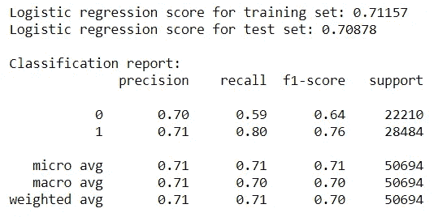

Results of the vanilla linear regression model

还不错。该模型的加权平均 F1 分数为 0.70。现在的目标是提高这个分数。

# 主成分分析

用于初始逻辑回归模型的数据集中有大量的要素(106)。PCA(主成分分析)被用于将其减少到更少数量的成分，这些成分仍然可以解释尽可能多的数据变化。这有助于提高模型拟合度和精确度。

下图(由下面的代码生成)显示 PCA 中使用的组件数量没有明显的界限。

```
# Importing the required libraries
import matplotlib.pyplot as plt
from sklearn.decomposition import PCA# Fitting PCA
pca = PCA()
pca.fit_transform(X)
explained_var = np.cumsum(pca.explained_variance_ratio_)# Plotting the amount of variation explained by PCA with different numbers of components
plt.plot(list(range(1, len(explained_var)+1)), explained_var)
plt.title('Amount of variation explained by PCA', fontsize=14)
plt.xlabel('Number of components')
plt.ylabel('Explained variance');
```

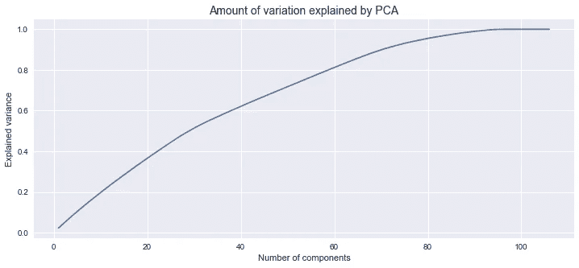

Plotting the amount of variation in the data explained by PCA using various numbers of components

发现了以下结果:

```
Number of components explaining 80% of variance: 58
Number of components explaining 90% of variance: 70
Number of components explaining 99% of variance: 90
```

为了选择在机器学习模型中使用的组件数量，使用默认参数将这些值中的每一个插入到逻辑回归模型的管道中:

```
# Running a for loop to test different values of n_components
n_comps = [58,70,90]
for n in n_comps:
 pipe = Pipeline([(‘pca’, PCA(n_components=n)), (‘clf’, LogisticRegression())])
 pipe.fit(X_train, y_train)
 print(“\nNumber of components:”, n)
 print(“Score:”, round(pipe.score(X_test, y_test),5))
```

结果显示，90 个组件的得分最高，尽管差异很小(从 58 个组件改进了约 3%):

```
Number of components: 58
Score: 0.67831Number of components: 70
Score: 0.6858Number of components: 90
Score: 0.70799
```

# 模型 2:具有 PCA 和参数优化的逻辑回归

逻辑回归模型可以通过优化其参数来进一步改进。GridSearchCV 用于测试多个不同的正则化参数(C 值)、惩罚(l1 或 l2)以及有截距和无截距的模型。

```
# Importing the required libraries
from sklearn.model_selection import GridSearchCV# Timing how long the model takes to run
logreg_start = time.time()# Building the pipeline
pipe_logreg = Pipeline([('pca', PCA(n_components=90)),
                    ('clf', LogisticRegression())])# Creating the parameters to test
params_logreg = [
    {'clf__penalty': ['l1', 'l2'],
     'clf__fit_intercept': [True, False],
        'clf__C': [0.001, 0.01, 1, 10]
    }
]# Using GridSearchCV to test multiple different parameters
grid_logreg = GridSearchCV(estimator=pipe_logreg,
                  param_grid=params_logreg,
                  cv=5)grid_logreg.fit(X_train, y_train)logreg_end = time.time()logreg_best_score = grid_logreg.best_score_
logreg_best_params = grid_logreg.best_params_# Printing the results
print(f"Time taken to run: {round((logreg_end - logreg_start)/60,1)} minutes")
print("Best accuracy:", round(logreg_best_score,2))
print("Best parameters:", logreg_best_params)
```

结果:

```
Time taken to run: 48.56 minutes
Best accuracy: 0.71
Best parameters: {‘clf__C’: 10, ‘clf__fit_intercept’: True, ‘clf__penalty’: ‘l2’}
```

然后使用最佳参数(根据准确度得分)为逻辑回归模型生成分类报告和混淆矩阵。

使用以下函数生成混淆矩阵:

```
def plot_cf(y_true, y_pred, class_names=None, model_name=None):
    """Plots a confusion matrix"""
    cf = confusion_matrix(y_true, y_pred)
    plt.imshow(cf, cmap=plt.cm.Blues)
    plt.grid(b=None)
    if model_name:
        plt.title("Confusion Matrix: {}".format(model_name))
    else:
        plt.title("Confusion Matrix")
    plt.ylabel('True Label')
    plt.xlabel('Predicted Label')

    class_names = set(y_true)
    tick_marks = np.arange(len(class_names))
    if class_names:
        plt.xticks(tick_marks, class_names)
        plt.yticks(tick_marks, class_names)

    thresh = cf.max() / 2.

    for i, j in itertools.product(range(cf.shape[0]), range(cf.shape[1])):
        plt.text(j, i, cf[i, j], horizontalalignment='center', color='white' if cf[i, j] > thresh else 'black')plt.colorbar()
```

最佳逻辑回归模型的完整结果如下:

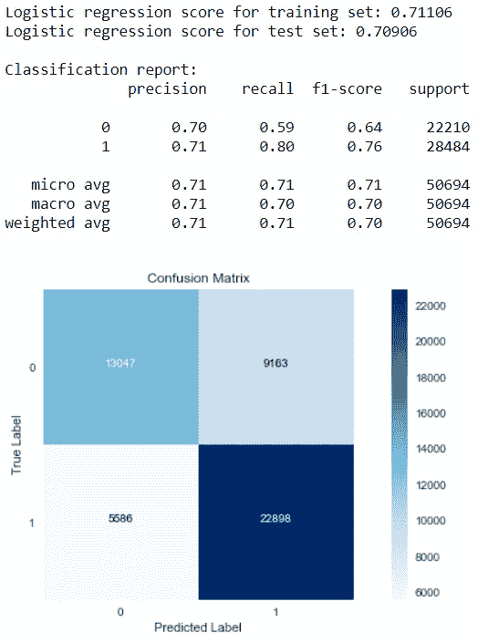

Results of the best logistic regression model

超参数调整后，模型的准确度得分与使用默认参数的逻辑回归模型相同(加权平均 F1 得分为 0.70)。令人失望。

# 模型 3:随机森林

接下来，使用随机森林分类器。随机森林算法是一种监督学习算法，可用于分类。它通过构建多个不同的决策树来预测数据点属于哪个类别。

同样，GridSearchCV 用于测试多个不同的超参数，以优化模型。

```
# Importing the required libraries
from sklearn.ensemble import RandomForestClassifier# Using GridSearchCV to test multiple different parameters
rf_start = time.time()pipe_rf = Pipeline([('pca', PCA(n_components=90)),
                    ('clf', RandomForestClassifier())])params_rf = [ 
  {'clf__n_estimators': [100],
   'clf__max_depth': [20, 30, 40],    
   'clf__min_samples_split':[0.001, 0.01]
  }
]grid_rf = GridSearchCV(estimator=pipe_rf,
                  param_grid=params_rf,
                  cv=5)grid_rf.fit(X_train, y_train)rf_end = time.time()rf_best_score = grid_rf.best_score_
rf_best_params = grid_rf.best_params_print(f"Time taken to run: {round((rf_end - rf_start)/60,1)} minutes")
print("Best accuracy:", round(rf_best_score,2))
print("Best parameters:", rf_best_params)
```

结果:

```
Time taken to run: 72.2 minutes
Best accuracy: 0.7
Best parameters: {'clf__max_depth': 30, 'clf__min_samples_split': 0.001, 'clf__n_estimators': 100}
```

最佳随机森林模型的完整结果如下:

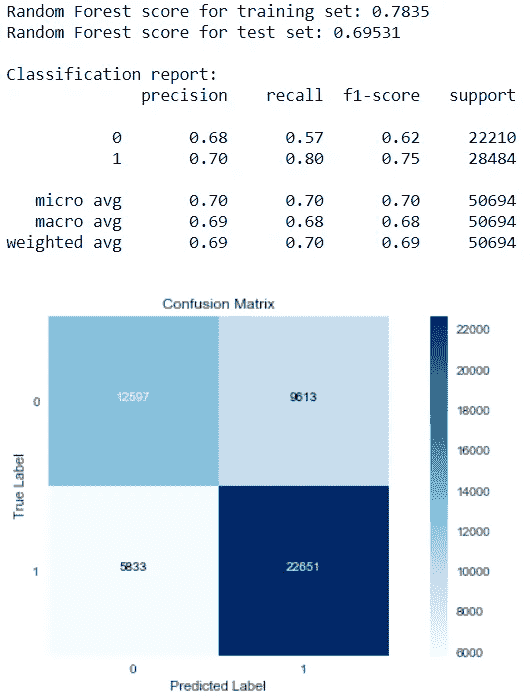

Results of the best Random Forest model

在超参数调整之后，模型的加权平均 F1 分数从具有默认设置的模型的 0.65 增加到 0.69。这类似于逻辑回归模型，尽管比它稍差。此外，训练集和测试集的得分之间的差异表明可能存在一些过度拟合。这里可能有更多的超参数调整空间来进一步改进模型，但是时间不允许。

# 模型 4: XGBoost

啊，卡格尔世界的宠儿。XGBoost 现在非常流行。这是一种梯度推进算法。与随机森林类似，它是一种生成多个决策树以改善数据点分类的集成方法，但它使用梯度下降来改善特别难以分类的数据点的模型性能。

返回用于超参数测试的 good ol' GridSearchCV:

```
# Importing the required libraries
from sklearn.model_selection import GridSearchCV# Using GridSearchCV to test multiple different parameters
xgb_start = time.time()pipe_xgb = Pipeline([('pca', PCA(n_components=90)),
                    ('clf', xgb.XGBClassifier())])params_xgb = [ 
  {'clf__n_estimators': [100],
   'clf__max_depth': [25, 35],
   'clf__learning_rate': [0.01, 0.1],
   'clf__subsample': [0.7, 1],
   'clf__min_child_weight': [20, 100]
  }
]grid_xgb = GridSearchCV(estimator=pipe_xgb,
                  param_grid=params_xgb,
                  cv=5)grid_xgb.fit(X_train, y_train)xgb_end = time.time()xgb_best_score = grid_xgb.best_score_
xgb_best_params = grid_xgb.best_params_print(f"Time taken to run: {round((xgb_end - xgb_start)/60,1)} minutes")
print("Best accuracy:", round(xgb_best_score,2))
print("Best parameters:", xgb_best_params)
```

结果:

```
Time taken to run: 865.4 minutes
Best accuracy: 0.7
Best parameters: {'clf__learning_rate': 0.1, 'clf__max_depth': 35, 'clf__min_child_weight': 100, 'clf__n_estimators': 100, 'clf__subsample': 0.7}
```

呀。14 个半小时，它仍然只能达到与初始回归模型相同的精度(这也仅比使用默认参数运行的 XGBoost 模型提高了 0.01 个精度)。

最佳 XGBoost 模型的完整结果如下:

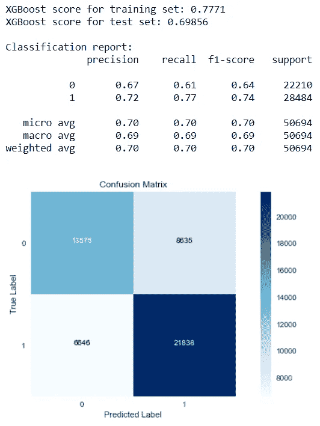

Results of the best XGBoost model

与随机森林模型一样，训练集和测试集的准确性得分之间的差异表明可能存在一些过度拟合。同样，这里可能有更多的超参数调整空间来进一步改进模型——但是我没有另外 14 个半小时的空闲时间。

# 模型评估

在参数调整之后，每个模型能够实现大约 **70%** 的精度。虽然达到这一精度水平相对容易，但参数调整只能少量提高精度水平。可能只有两类中的每一类都有相当大的数据量，这意味着即使是相对简单的模型(如具有默认设置的逻辑回归)也有足够的数据来达到良好的验证准确度。

创建的最佳随机森林和 XGBoost 模型仍然表现出一定程度的过度拟合。需要进一步调整参数来减少这种情况。

最终选择的模型是调整后的**逻辑回归模型**。这是因为，尽管每个模型都能够为测试集达到相似的精度水平，但这是唯一没有表现出过度拟合的模型。

有趣的是，**与成功相比，每个模型在预测失败方面表现更差**，真实的否定率低于真实的肯定率。也就是说，它将相当多的失败项目归类为成功，而将相对较少的成功项目归类为失败。可能导致项目失败的因素更有可能超出数据的范围，例如营销不善、更新不足或没有回复潜在支持者的消息。

假阳性和假阴性率意味着，如果一个新项目的数据通过模型来预测其成功或失败:

*   如果这个项目最终会成功，这个模型将会在大约 80%的情况下正确地预测它会成功
*   如果项目以失败告终，模型只会在大约 60%的时间里正确地将其预测为失败(而其余的时间会错误地将其预测为成功)

# 对考虑 Kickstarter 的项目创建者的建议

对成功率和/或收到的资金数量产生**积极影响**的一些因素有:

最重要的是:

*   较小的项目目标
*   被选为员工选择(质量的衡量标准)
*   漫画、舞蹈和游戏项目
*   来自香港的项目

不太重要:

*   较短的活动
*   从创建到发布需要更长时间
*   电影、视频和音乐项目(网站上的热门类别，相当成功)
*   周二发布(尽管这也是最常见的项目发布日，所以要小心竞争)
*   10 月发布
*   在 UTC 时间下午 12 点到下午 2 点之间发布(这当然与项目发布的国家有关，但请记住，支持者可能来自世界各地)

对成功率和/或收到的金额有**负面影响**的因素有:

最负面:

*   大目标
*   食品和新闻项目
*   来自意大利的项目

负面影响较小:

*   长期活动
*   在周末发布
*   7 月或 12 月发布
*   在世界协调时下午 6 点到凌晨 4 点之间发布

总体而言，Kickstarter 非常适合小型、高质量的项目，尤其是漫画、舞蹈和游戏。它不太适合大型项目，尤其是食品(如餐馆)和新闻项目。

感谢您读到这里！如果您有任何想法、意见或建议，请在下面添加。