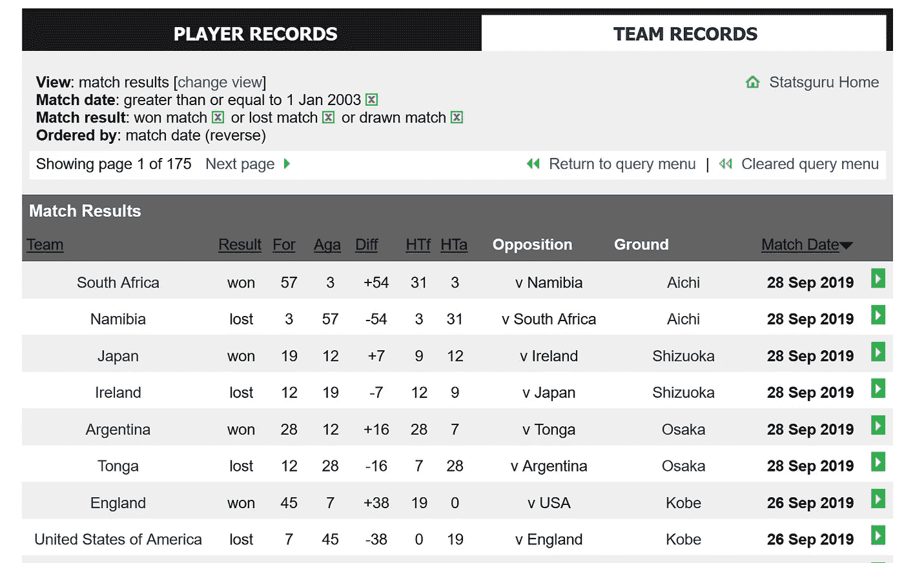
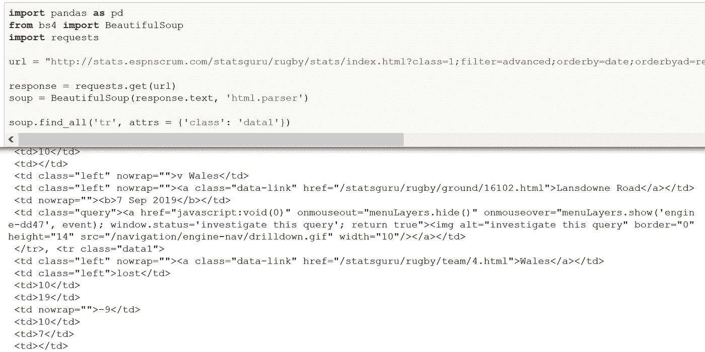
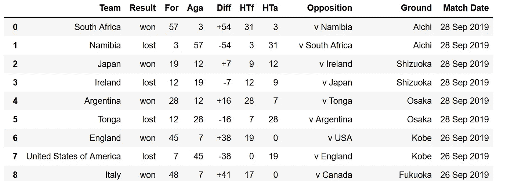
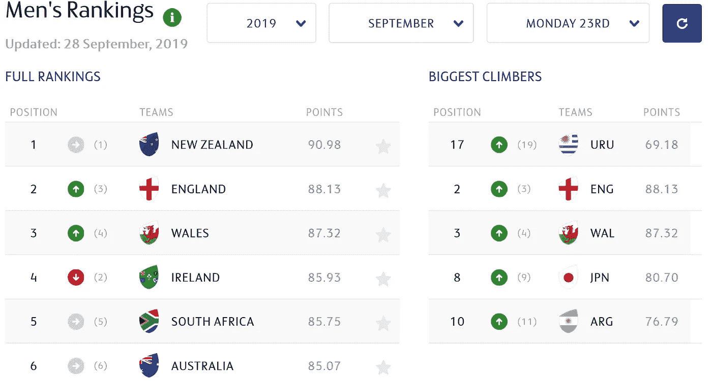
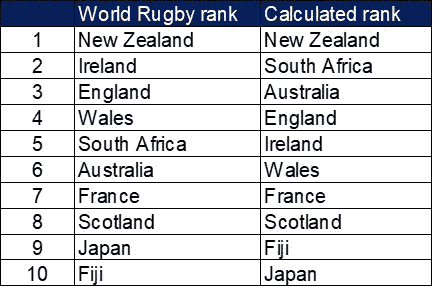
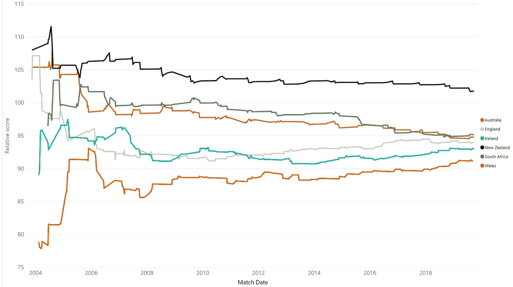
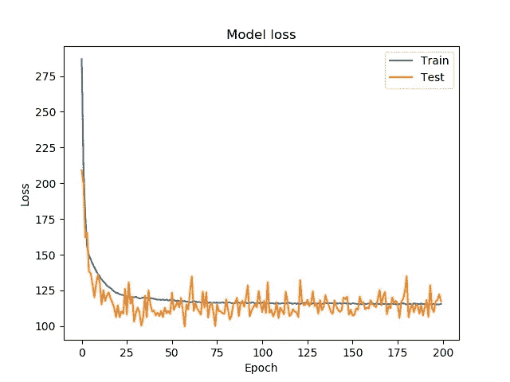
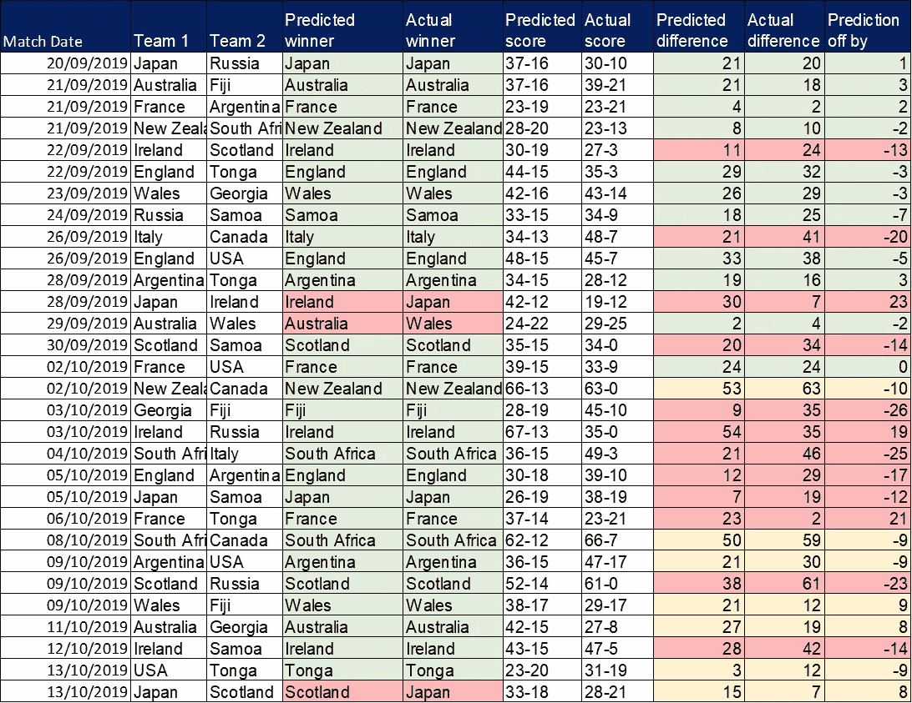

# 使用机器学习预测体育比分——以橄榄球世界杯为例

> 原文：<https://towardsdatascience.com/using-machine-learning-to-predict-sport-scores-a-rugby-world-cup-example-f699fd552673?source=collection_archive---------17----------------------->

Photo by [Thomas Serer](https://unsplash.com/@jesus?utm_source=unsplash&utm_medium=referral&utm_content=creditCopyText) on [Unsplash](https://unsplash.com/s/photos/rugby?utm_source=unsplash&utm_medium=referral&utm_content=creditCopyText)

扩展你的编码技能的最好方法之一是坚持做一个你感兴趣的项目。就在 9 月份 2019 年橄榄球世界杯开始之前，我决定尝试预测锦标赛的结果。

下面，我将介绍我尝试预测橄榄球世界杯小组赛的获胜者和分数的高级流程。希望它能鼓励你在你最喜欢的运动中尝试一下！

为了这个项目，我使用了 [Python](https://www.python.org/) 、 [Jupyter 笔记本](https://jupyter.org/)、 [PyCharm](https://www.jetbrains.com/pycharm/) 和 [Power BI](https://powerbi.microsoft.com/) (用于快速数据识别)。

# 第一步:获取数据

ESPN Scrum 有一个庞大的国际橄榄球比赛数据库。我想从 2003 年开始参加所有的国际橄榄球比赛。我选择这个日期是因为世界橄榄球排名是在 2003 年世界杯之前推出的(更多信息请见专题部分)。

ESPN Scrum match result database

*但是*这些数据被分割成 175 页——复制/粘贴不是一个实用的解决方案。[美丽之声](https://www.crummy.com/software/BeautifulSoup/bs4/doc/)来救援。BeautifulSoup 是一个从 HTML 和 XML 文件中提取数据的库。下面你可以看到包含 2019 年 9 月 7 日威尔士比赛信息的原始数据:

Result of BeautifulSoup scraping for match results

我注意到 ESPN 的 URL 引用了*页面和*页面，所以我遍历了每个页面并存储了结果。

DataFrame of match results

我还添加了世界橄榄球排名作为一个特色。

World Rugby Rankings

# 第二步:数据准备

显然，收集到的数据并没有达到机器学习的完美状态，所以我需要清理一些小问题，例如删除反对派名称字段中的*‘v’*,并确保团队和反对派字段中的国家名称相同(我注意到一个字段中的美国是*美国*,另一个字段中的美国是*美国*。Pandas 让这变得相对简单——例如，参见 [*应用*](https://pandas.pydata.org/pandas-docs/stable/reference/api/pandas.DataFrame.apply.html) 和 [*贴图*](https://pandas.pydata.org/pandas-docs/stable/reference/api/pandas.Series.map.html) 。我执行了一些其他的准备步骤，比如计算原始数据中的错误/空白，以及正确地格式化日期。

# 第三步:特征

世界橄榄球排名被合并到主数据集上，以便对每支球队应用最接近每场比赛日期的排名。

虽然我有世界橄榄球排名，但我仍然想为每支球队计算一个单独的、更简单的技能得分。我使用 [Elo 评级系统](https://en.wikipedia.org/wiki/Elo_rating_system)的概括来计算相对技能。在这个系统中，玩家的等级根据比赛结果和两个队之间的相对等级差异而变化。在一个简单的例子中，如果排名第 10 的球队击败排名第 2 的球队，排名第 10 的球队将比排名第 15(较弱)的球队获得更多的评分。类似地，输了的排名第二的队伍会因为输给一个弱对手而比输给排名第一的队伍失去更多的评分。因此，该算法可以自我修正，并随着时间的推移“学习”每个团队的技能。

世界橄榄球排名考虑了各种比赛特征，如比赛状态(世界杯决赛得分更多)、主场优势和比赛得分。计算出的技能分数忽略了所有这些，而只是简单地看比赛结果和比赛时两队之间的相对技能。

让我们来看看这些排名在一段时间内的对比情况:

Official World Rugby rankings (23rd September) versus the calculated rankings

这里有一些有趣的结果——澳大利亚的排名高于预期，而爱尔兰和威尔士低于真实排名。我怀疑澳大利亚的高排名很大程度上受到他们最初高起点的影响(他们在 2003 年是世界排名第三的球队)。下面你可以看到随着算法的学习，一些团队的技能分数是如何随着时间而变化的。请注意，大约从 2014 年开始，英格兰、爱尔兰和威尔士的排名稳步上升。

Relative team skill score over time

总之，每场历史比赛的数据包括:比赛日期、比赛结果、得分、比分、两队的世界橄榄球排名以及两队的相对技能得分。

# 第四步:培训和测试

对于分数预测，我使用了 [Keras，](https://keras.io/)一个高级神经网络 API。Keras 中最简单的模型是顺序模型。

我进行了超参数调整(点击这里查看杰森·布朗利的伟大教程，并对宽(一层有很多神经元)和深(更多层，但每层神经元更少)网络进行了实验。我最终使用了第一层的 15 个神经元和第二层的 8 个神经元，都带有整流线性激活单元(ReLU)。我们没有为输出层使用激活函数，因为我们不想转换输出值。

Neural network topology

下面你可以看到一个损失(均方误差)的曲线图。

Neural network model loss against number of epochs

我也尝试了粉丝最喜欢的 [XGBoost，](https://xgboost.readthedocs.io/en/latest/#)，但是用神经网络得到了稍微好一点的结果，代价是训练时间更长。

# 第五步:预测！

作为模型输入，我创建了一个即将到来的世界杯小组赛的数据集，并给每支球队分配了他们最新的技能得分和排名。

那么预测的表现如何呢？比我预想的好多了(至少前 15 场)！在它预测的 30 场比赛中，它正确预测了其中 27 场比赛的冠军(预测日本对爱尔兰的比赛会令人震惊)。

该模型在前 15 场比赛中表现特别好，其中 10 场比赛的实际得分差异不到 5 分。

Model prediction results versus actual results

请注意，我没有在小组赛阶段重新训练模型，上面的结果是在世界杯开始时获得的。有趣的是，一旦大多数球队至少打了一场比赛，预测似乎会变得更糟。这是有意义的，因为相对排名和技能分数会发生变化，所以人们可以假设，如果我在第一轮游戏后更新这些功能并重新训练模型，预测会有所改善(我没有这样做，因为我太专注于观看实际的游戏了！).

无论哪种方式，对于几个晚上的工作来说都是不错的结果！机器学习是一个迷人的领域，如果你决定亲自尝试，请告诉我，还有很多需要改进的地方和可以添加的有趣功能。希望你喜欢这个演示！

**这里有一些有用的资源可以帮助你开始:**

**用 BeautifulSoup 刮网**

 [## 网刮 MLB 统计与 Python 和美丽的汤

### Codecademy 练习已经很好地打包了数据供我们使用。然而，会有很多场合当我们…

news.codecademy.com](https://news.codecademy.com/web-scraping-python-beautiful-soup-mlb-stats/)  [## 如何用 Python 和 BeautifulSoup 刮网站

### 如何用 Python 和 BeautifulSoup 抓取网站互联网上的信息比任何…

www.freecodecamp.org](https://www.freecodecamp.org/news/how-to-scrape-websites-with-python-and-beautifulsoup-5946935d93fe/) 

**用熊猫操纵数据**

 [## 熊猫教程:Python 中的数据帧

### 使用 Python 探索数据分析。熊猫数据框使你的数据操作简单，从选择或替换…

www.datacamp.com](https://www.datacamp.com/community/tutorials/pandas-tutorial-dataframe-python) 

**数据科学**

我强烈推荐 Jake VanderPlas 的优秀 Python 数据科学手册(包括示例笔记本)

 [## Python 数据科学手册

### 该网站包含 Jake VanderPlas 的 Python 数据科学手册的全文；该内容可在…上获得

jakevdp.github.io](https://jakevdp.github.io/PythonDataScienceHandbook/) 

【Keras 和神经网络入门

 [## 你的第一个深度学习项目是用 Python 和 Keras 一步一步完成的

### Keras 上一次更新是一个强大且易于使用的免费开源 Python 库，用于开发和评估深度…

machinelearningmastery.com](https://machinelearningmastery.com/tutorial-first-neural-network-python-keras/)