# 使用机器学习来理解客户行为

> 原文：<https://towardsdatascience.com/using-machine-learning-to-understand-customers-behavior-f41b567d3a50?source=collection_archive---------2----------------------->

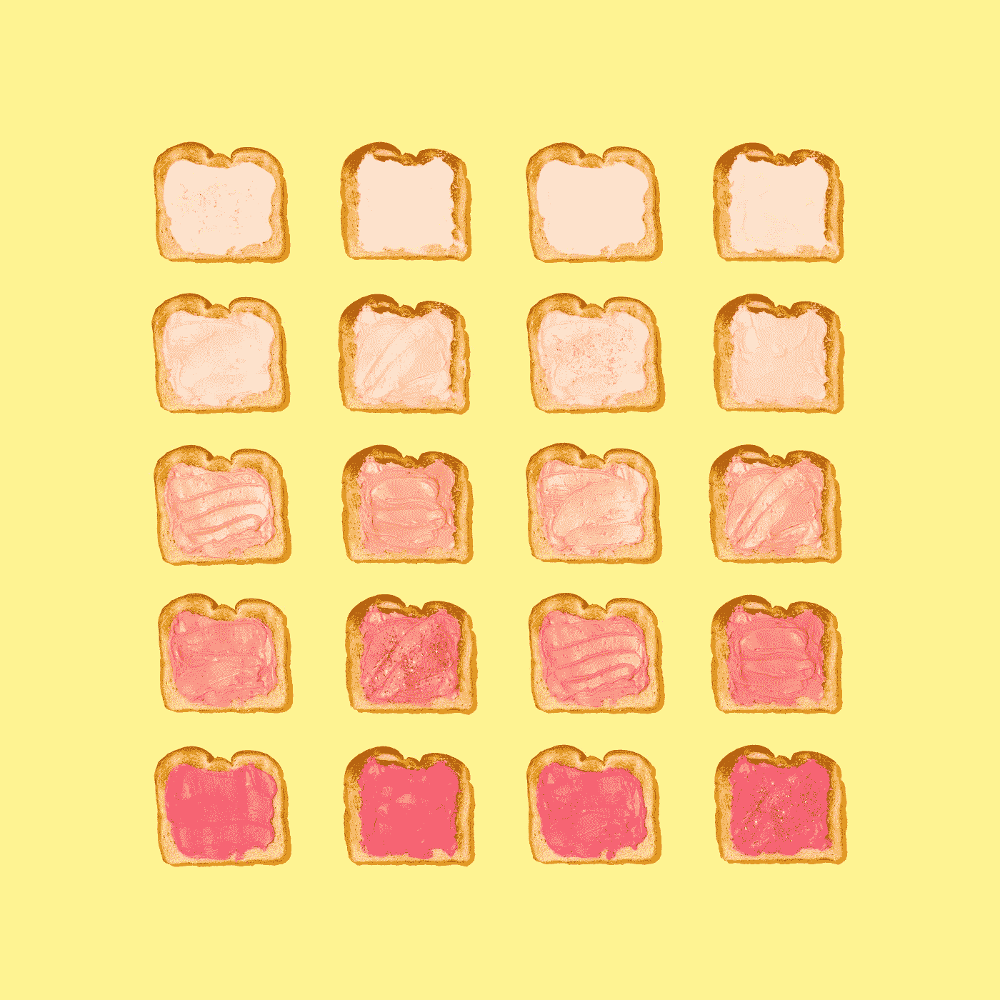

Photo by [Amy Shamblen](https://unsplash.com/photos/eT8vx7LLorY?utm_source=unsplash&utm_medium=referral&utm_content=creditCopyText) on [Unsplash](https://unsplash.com/?utm_source=unsplash&utm_medium=referral&utm_content=creditCopyText)

## 并非所有的客户都一样

请把我的毛衣给我。我快冻僵了”——我的一个朋友 Lara 说。

*“哇，那看起来像一件昂贵的毛衣”* —玛利亚惊叫道

*“是的，它花了我一大笔钱”*——劳拉回答

“*我永远不会买这么贵的东西”* — Maria 坚定地说— *“我是说……我买得起，但是……真的不值得”*

在我们的朋友群中，劳拉因为在衣服上过度消费而出名，仅仅因为这些衣服是由某个特定的品牌出售的。

另一个极端是玛丽亚。她赚了很多钱，但她不愿意在每件物品上花很多钱。

我们其余的人正好落在中间。

我喜欢买手表，我想一周的每一天都有一只。我愿意为它们付钱，但不是一个疯狂的数目。

我的一些朋友过去常常买许多便宜的东西。其他人只是喜欢把薪水花在外出就餐或美食活动上。

我有一个喜欢在网上订购东西的朋友。她讨厌去购物中心。所以每个月她都会少一百块钱，因为她点的东西太多了。

*“不适合我”* —我的另一个朋友过去常常自豪地说— *“我需要试穿这双鞋，或者感受一下它的质量，才能买下它。我喜欢以旧的时尚方式购买。”*

每个人都是不同的，他们作为顾客的行为也是不同的。

假设你是一家商店的老板。不管你是开电商还是开超市。不管是一家小商店还是亚马逊或网飞这样的大公司，[了解你的客户更好](/how-machine-learning-can-help-with-customer-retention-6b5bf654e822?source=friends_link&sk=ae71c8351d3028db1aedeb9c11feee12)。

机器学习对于这项任务来说很方便。特别地，聚类，最重要的无监督学习问题，能够创建将相似个体分组的类别。

这些类别被称为*集群*。聚类是数据集中的点的集合。这些点在它们之间比它们与属于其他聚类的点更相似。

*基于距离的聚类*将点分组为一些簇，使得簇内的距离应该小，而簇之间的距离应该大。

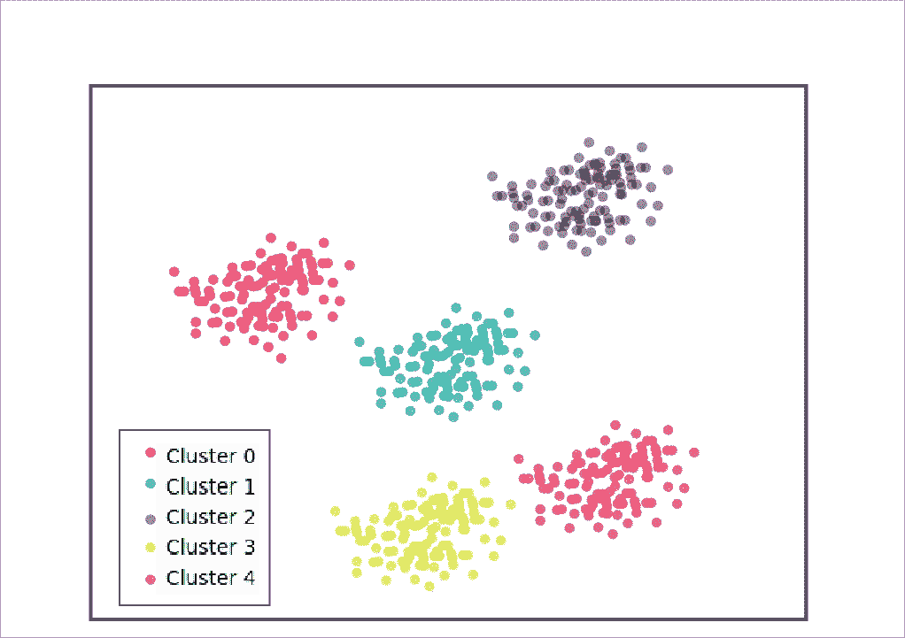

Clustering example: A cluster is a collection of points which are more similar to each other that they are to points in another cluster.

有几种方法可以计算这些距离。你可以阅读[我的帖子](https://medium.com/@meinzaugarat/how-to-measure-distances-in-machine-learning-13a396aa34ce?source=friends_link&sk=adb1f38fb6c7cb31b6f2f992ad7bddbf)了解更多详情。

假设现在您能够收集持有会员卡的客户的基本数据。

您设法获得了客户 ID、年龄、性别、年收入和支出分数。最后一个是基于客户行为和购买数据的分数。

市场上有一些你有兴趣销售的新产品。但是您希望针对每种产品的特定类型的客户。所以，你需要在你的顾客中找到模式。

嗯……我们可以开始了吗？我们将使用 Python 的几个库来完成整个过程。

在所有的聚类算法中，我们将选择 K-means。

在将收集的数据读入`pandas`数据帧后，任何涉及数据科学的项目的下一步都是探索数据。

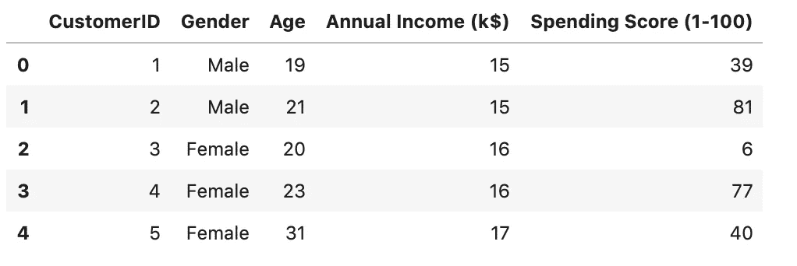

A quick overview of the first rows of the dataset.

这意味着探索数据的质量和变量的分布。有必要确定您是否有丢失的值。

K-means 算法不能够处理 ***缺失值*** 。处理缺失值总是很困难。如果只有少数观察值缺失，则可以将其从聚类中排除。

如果有大量的缺失值，有几个选项可用。

其中之一就是输入这些值。由于使用 K-means 进行聚类是基于距离计算的，因此应该仔细考虑输入它们的技术。

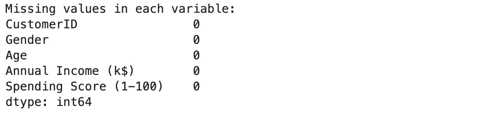

Missing values present in our dataset.

幸运的是，数据集不包含缺失值。

另一方面，我们还应该探索数据集中存在的变量类型。 ***分类变量*** 不能直接处理。

同样，K 均值是基于距离的。转换这些变量的方法取决于分类变量的类型。

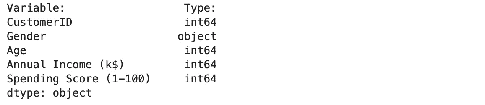

Type of variables in the dataset.

我们确认(正如我们在数据集概述中已经看到的)变量`Gender`是分类的。

因为它是一个基数变量(它没有任何固有的顺序)我们可以把它转换成两个二元变量:`Male`，取值 0 或 1。`Female`，取值 0 或 1。

此外，您应该获得描述性统计数据，并绘制每个感兴趣变量的分布图。

我们将定义两个函数。第一个返回一些统计数据:平均值、标准差、中值、方差。我们的另一个函数绘制了每个变量的分布(*你可以查看我放在文章最后的 GitHub repo 中的代码*)。

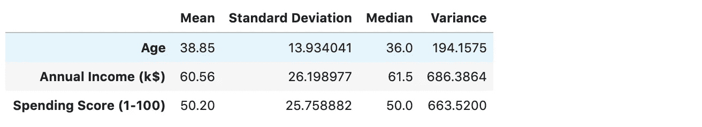

Descriptive statistics for numerical variables.

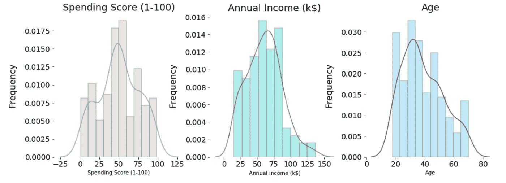

Distribution of numerical variables.

此外，我们将分析数字参数之间的相关性。为此，我们将使用`pairplot` seaborn 函数。

我们想知道性别之间是否存在差异。因此，我们将设置`hue`参数来为属于女性或客户的点获取不同的颜色。

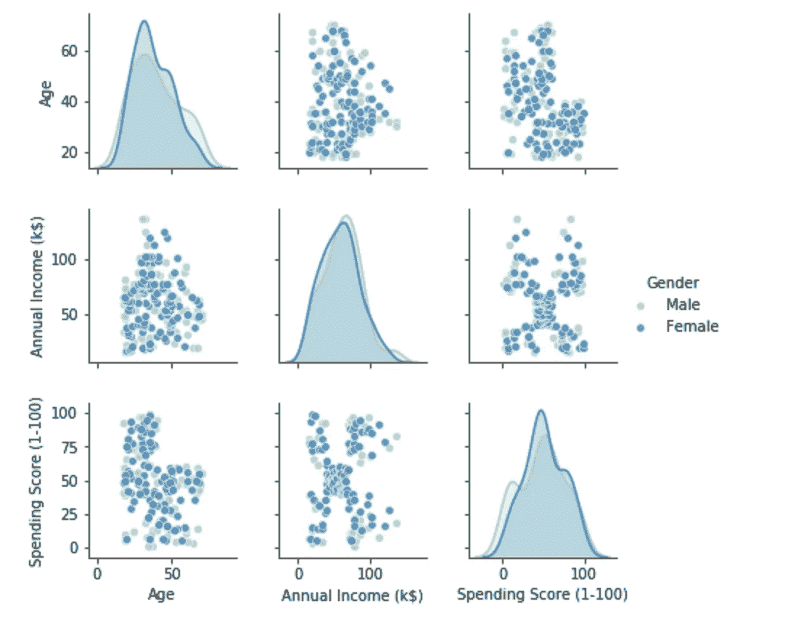

Pairplot showing the correlation between numerical variables. Also, it can be observed male customers in green and female customers in blue.

**为什么在使用 K-means 时研究这些参数很重要？**

因为我们需要满足算法假设。k 均值假设:

*   **簇的形状**:分布的方差是球形的，意味着簇具有球形形状。为了做到这一点，所有变量都应该是正态分布的，并且具有相同的方差。
*   **聚类的大小:**所有的聚类都有相同数量的观察值。
*   **变量之间的关系:**变量之间很少或没有相关性。

此外，查看分布和描述性统计数据允许我们确定是否需要执行特征缩放。

k-Means 中的距离计算给每个维度分配相等的权重。如果一个变量的范围与其他变量完全不同，那么绝对变化可能会更大。这可能导致模型更加重视该变量。

在我们的数据集中，变量是正态分布的。方差彼此非常接近。除了年龄比其他变量的方差小。

我们可以找到一个合适的转换来解决这个问题。我们可以应用对数或 Box-Cox 变换。

[*Box-Cox*](https://en.wikipedia.org/wiki/Power_transform#Box%E2%80%93Cox_transformation) 是一个变换家族，允许我们修正非正态分布变量或非等方差。它通过为所提供的特定数据选择最佳转换来实现这一点。调节这一点的主要参数由λ表示。

现在，我们将使用 [**主成分分析** (PCA)](https://jakevdp.github.io/PythonDataScienceHandbook/05.09-principal-component-analysis.html#Introducing-Principal-Component-Analysis) 来提取关于数据集的隐藏结构的信息。

PCA 是一种无监督学习算法。它基本上是一种降维算法。

它用于发现哪些维度最大化了数据集中存在的要素的方差。但它也可以用作可视化和特征提取等工具。

“降维”到底是什么意思？

我记得我在大学教数学的时候。最困难的部分是解释 n 维空间。更别说去想象 5 维、6 维或 90 维了。

为什么会这样？因为看二维或至多三维空间总是更容易将事物形象化。

假设我们想找出几个变量之间的关系。如果我们能够在二维空间中绘制这些变量，我们就能够马上描绘出它们之间的联系。

这是 PCA 进入的地方。在 PCA 中，这种关系通过找到数据中的主轴列表来量化。后来，它们被用来描述我们的数据集。

让我们来看看实际情况。我们有 5 个变量(`Age`、`Annual Income`、`Spending`、`Male`、`Female`)。所以如果我们想把它们都画出来，我们需要 5 个维度。

相反，我们将应用来自`sklearn`模块的`PCA`函数。然后，我们将模型与最终数据集相匹配。并转换数据。

在拟合过程中，模型从数据中学习一些量:`components` 和`explained variance`。

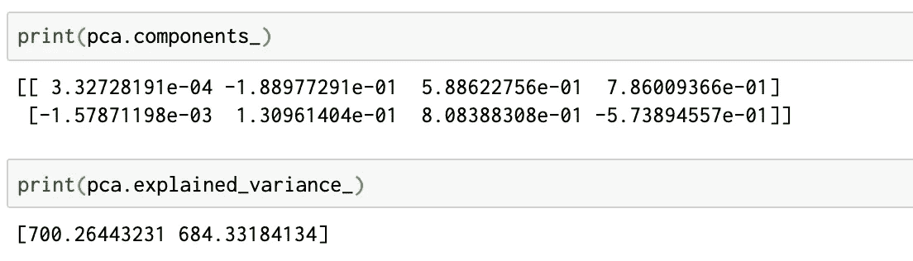

Components and explained variance learn during the fitting process.

这些看似抽象的数字定义了矢量。分量定义了向量的方向，而解释的方差定义了向量的平方长度。

向量代表数据的主轴。向量的长度表示该轴在描述数据分布时的重要性。每个数据点在主轴上的投影就是数据的 ***主成分*** 。

我们可以用一种叫做*双标图*的散点图来表示。每一个点都用它在主成分上的得分来表示。

理解数据的降维是有帮助的。它还帮助我们发现主成分和原始变量之间的关系。

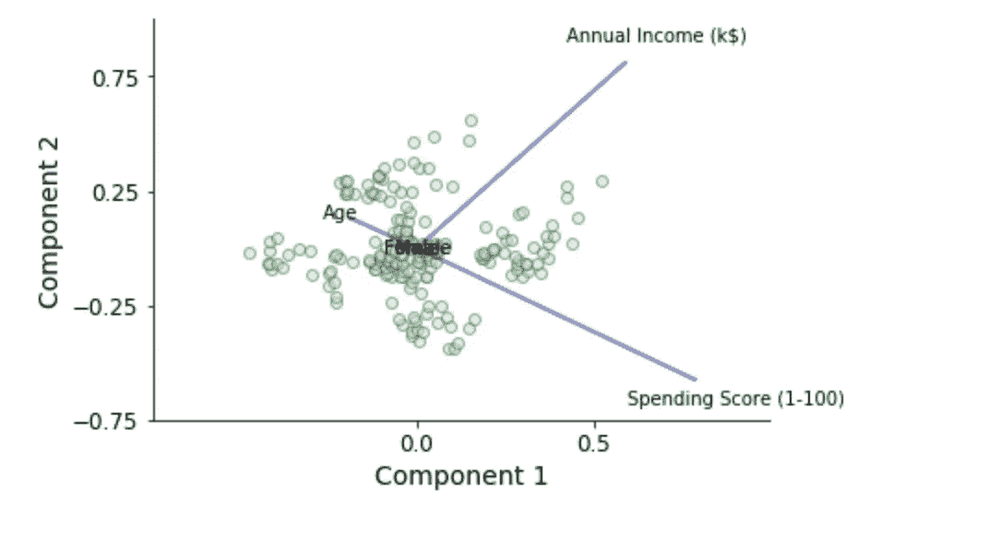

Biplot showing data scores regarding principal components.

我们可以观察到年收入和支出这两个最重要的组成部分。

*聚类时间到！*

为了对数据进行聚类，我们需要确定如何判断两个数据点是否相似。邻近性度量表征了对象之间存在的相似性或不相似性。

我们可以选择确定两个点是否相似。所以如果值大，点就很相似。

或者选择确定它们是否不同。值小的话，点也差不多。这就是我们所说的“距离”。

聚类算法可以使用各种距离:曼哈顿距离、闵可夫斯基距离、欧几里德距离等等。

还记得你在学校或者大学学的计算两点间的直线距离吗？你用的是欧几里德距离。

它是两个向量的相应元素之间的平方差之和的平方根。欧几里德距离的公式如下:

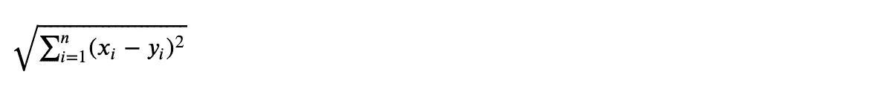

其中 x 和 y 是两个向量。或者用 Python 编码:

K-means 通常使用欧几里德距离来确定两个点的相似(或不相似)程度。

K-means 的过程简单明了。在开始模型之前，我们需要确定我们想要的集群数量。

不同数量的聚类会导致完全不同的结果。

有几种直接的方法可以实现这一点。其中，我们找到了*肘*和*剪影*的方法。

我们将使用肘法。

请记住，聚类的目的是定义这样的聚类，其中的点彼此之间的相似性大于与其他聚类中的点的相似性。

为此，我们将考虑总的类内变异(或总的类内平方和(WSS))。我们会尽量减少。

肘方法关注的是总 WSS 如何随着星团数量的变化而变化。

为此，我们将计算一系列不同 k 值的 k 均值。然后，我们计算总 WSS。我们绘制了 WSS 对集群数量的曲线。

最后，我们定位图的拐点。这个点被认为是适当的集群数量。

为什么？因为如果我们继续增加聚类，WSS 不会提高，但我们将点聚集在一起的能力会下降。

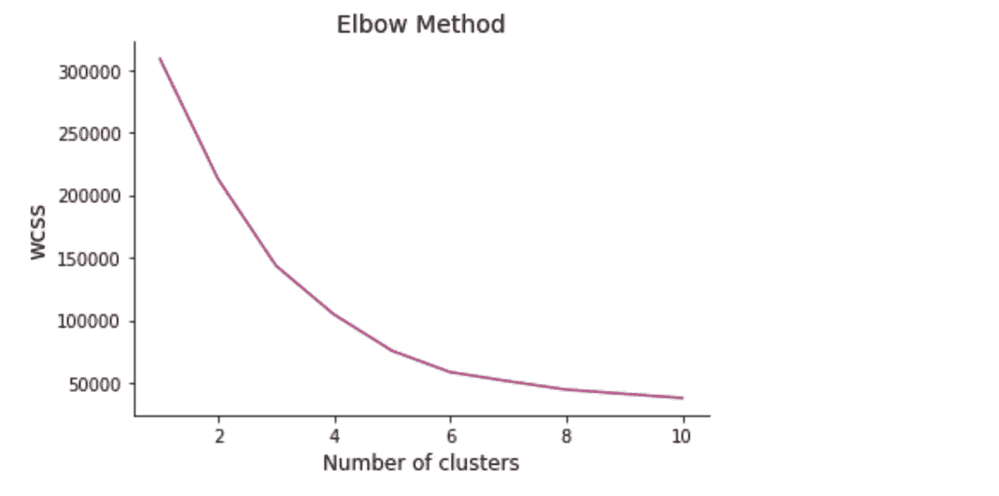

查看该图，我们将选择 5 个集群。

我们忘记说了！K-means 中的 *K* 是指聚类数。在我们的例子中，是 5。

[k-means 聚类](http://www.vlfeat.org/api/kmeans-fundamentals.html)是如何工作的？主要思想是选择 k 个中心，每个聚类一个。有几种方法可以初始化这些中心。我们可以随机进行，通过我们认为是中心的某些点，或者以一种巧妙的方式放置它们(例如，彼此尽可能远离)。

第一次放质心的位置很重要吗？是的，非常重要。不同的初始化质心会导致不同的结果。

然后，我们计算每个点和聚类中心之间的欧氏距离。我们将这些点分配到距离最小的聚类中心。

之后，我们重新计算新的聚类中心。我们选择位于每个聚类中间的点作为新的中心。

我们重新开始，计算距离，分配到集群，计算新的中心。我们什么时候停止？当中心不再移动时。

让我们看看 Python 的实现:

现在，让我们看看我们的集群是什么样子的:

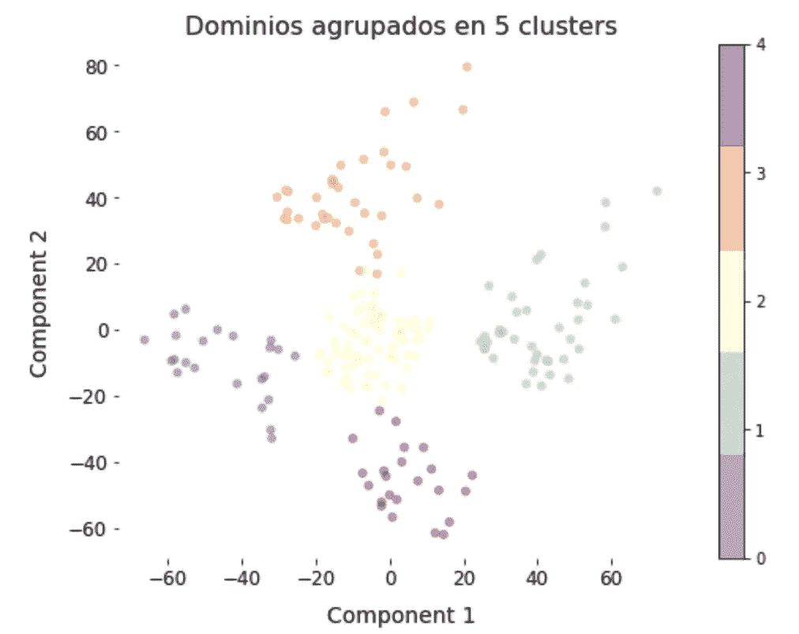

回到我们最初的情况。我们想了解我们的顾客。分割它们。所以我们可以为他们提供合适的产品。

每个聚类的中心点与该细分市场的平均客户*相匹配。*

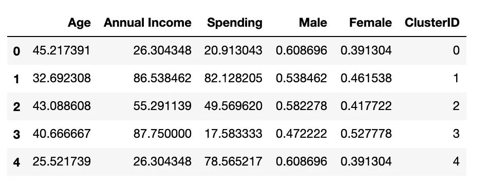

男性或女性似乎没有任何影响(他们在 0.5 左右。记住这是一个二进制变量)。

最重要的特征似乎是`Annual Income`和`Spending score`。

我们有收入较低但支出在同一范围内的人——第 0 部分。收入高且花钱多的人——第一部分。收入中等但消费水平相同的客户——细分市场 2。

然后，我们有收入很高的客户，但他们的支出最多，这就是细分市场 4。最后，收入少但消费高的人——第五部分。

最后一个音符。想象一下，明天我们有了一个新成员。我们想知道那个人属于哪一部分。

没问题！我们可以预测这一点:

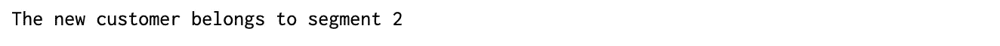

现在，您已经准备好开展营销活动了！

*→查看我的* [*GitHub 库*](https://github.com/ugis22/clustering_analysis) *观看完整代码。←*