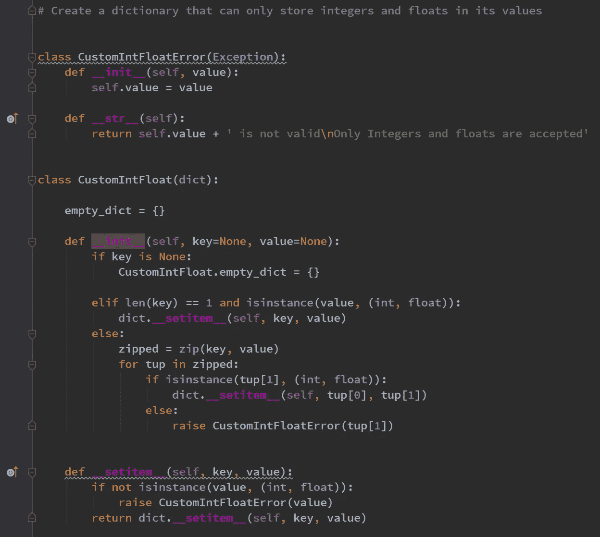
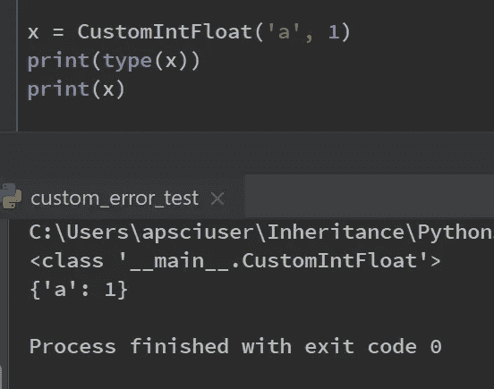
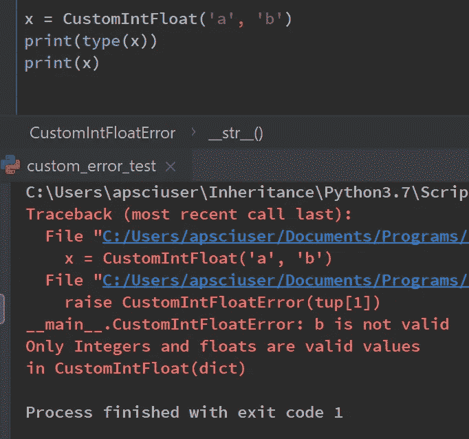
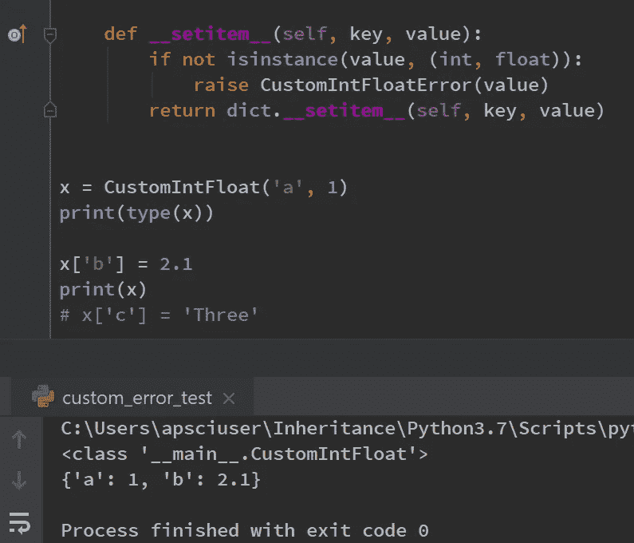
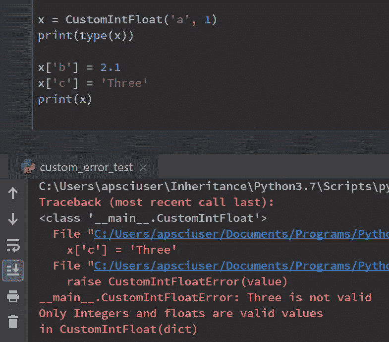
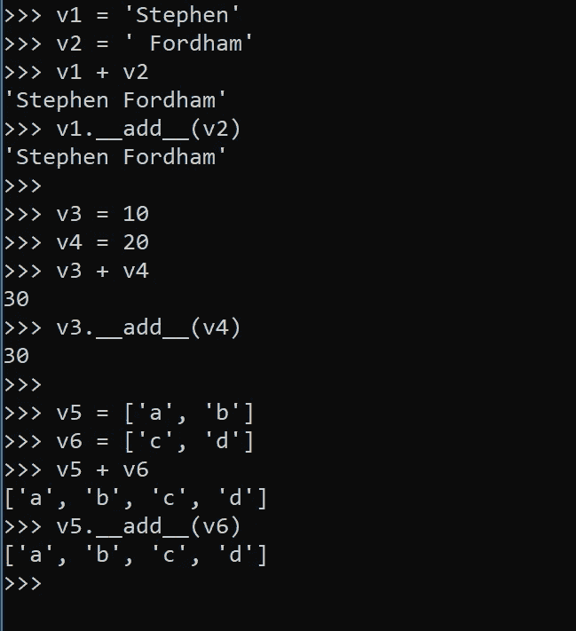
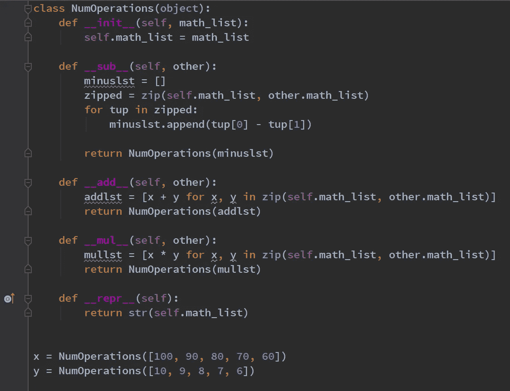
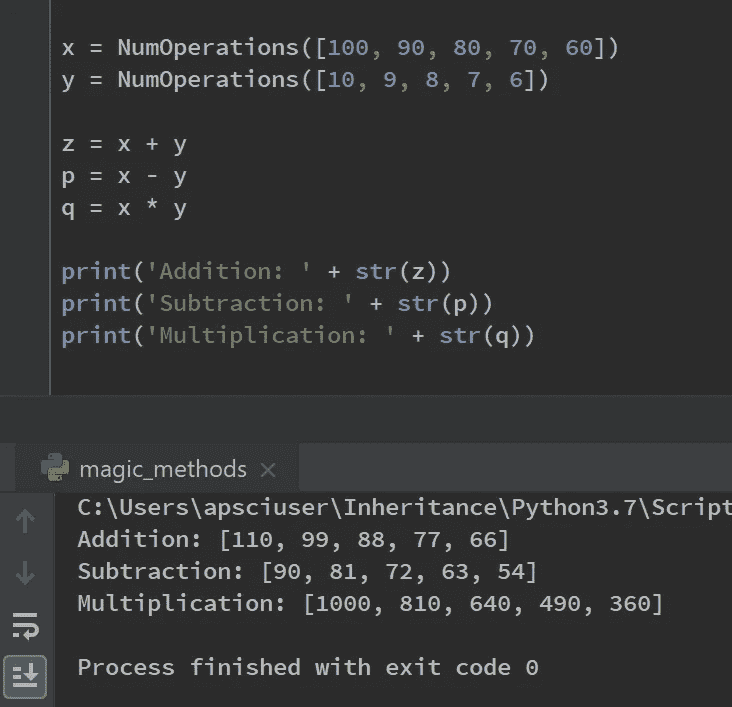

# 在 Python 中使用魔法方法

> 原文：<https://towardsdatascience.com/using-magic-methods-in-python-48f31685bc18?source=collection_archive---------11----------------------->

## 魔法方法如何增强我们的 Python 代码

Image Courtesy of [Ramón Salinero](https://unsplash.com/@donramxn) via [Unsplash](https://unsplash.com/photos/vEE00Hx5d0Q)

## **什么是魔术方法？**

它们是面向对象 Python 中的一切。它们是特殊的方法，你可以定义它们来给你的类增加“魔力”。它们总是被双下划线包围，例如`__init__`。它们也没有被很好地记录下来。Python 的所有神奇方法都出现在 Python 文档的同一部分，但它们分散在各处，组织松散。那一节几乎找不到例子。

为了纠正缺乏关于魔术方法的文档的感觉，我编写了一些如何使用 Python 魔术方法的简单英语示例。

## 创建一个只能接受整数和浮点数作为其值的 dict 对象

首先，让我们创建一个虚构的用例。在这个场景中，我想创建一个创建字典对象的类，该类只接受整数或浮点数作为它们的值。

如果任何其他数据类型，例如；字符串、列表、元组作为一个值添加到我们的自定义字典对象中，将引发一个异常，向用户指定这个自定义字典对象只能接受整数和浮点数作为它的值。

为了实现这一点，我们将利用以下神奇的方法:

## *__int__，__setitem__，和 __str__*

首先，我首先创建一个名为 CustomIntFloat 的自定义类，并将 dict 传递到参数继承列表中。这意味着，我们创建的对象将完全像一个字典，除了在我们选择有选择地修改这种行为的地方。

然后我创建一个 __init__ 方法来构造我的 CustomIntFloat dict 对象。这个对象在它的参数列表中接受一个键和值，默认情况下我将它设置为 None 类型。这样做的原因是，如果用户创建一个 CustomIntFloat 类的对象，而没有传递一个键或值，将会创建一个空的 dict。我创建了一个简单的条件语句:如果没有传递键，默认情况下，键参数被赋予参数 None，并且通过引用 CustomIntFloat 对象创建一个空 dict，其类属性为 empty_dict。

接下来，如果用户指定一个长度为 1 的键，以及一个对应的值，该值是 int 或 float 类的一个实例，那么该键和值将在对象中设置。

最后，在 else 语句中，如果用户将多个键和值指定为 iterable，那么这些 iterable 将被 zip 函数压缩，并被赋予 zipped 变量名。我在 zipped 上循环，检查值是 int 类型还是 float 类型。否则，将引发自定义的 CustomIntFloatError 异常。

## CustomIntFloatError 异常类和 __str__ magic 方法

当我们引发一个 CustomIntFloatError 异常时，我们实际上是在创建一个 CustomIntFloatError 类的实例并同时打印它。

因此，这个自定义错误类需要 __init__ 和 __str__ magic 方法。我们创建的实例接受传递的值，并将其设置为 CustomIntFloatError 类中的属性值。

这意味着，当出现错误消息时，传递给 CustomIntFloat 的 __init__ 的值可以设置为 CustomIntFloatError 类中的一个属性( *self.value* )并易于检查。

当指定无效输入时，将引发 CustomIntFloatError 异常，并且不构造该对象。一条有用的错误消息通知用户，只有整数和浮点数是有效值。

类似地，当您试图实例化具有多个键和值的对象 z(已被注释掉)时，将引发相同的异常，通知用户“三”不是有效的输入。

## __setitem__ 魔法方法

__setitem__ 是一个神奇的方法，当我们在字典中设置一个键和值时就会调用它。一旦构造了 CustomIntFloat 对象，如果用户试图添加一个非 int 或 Float 类型的值，将引发相同的 CustomIntFloatError 异常。我在下面提供了一个代码片段，展示了如何根据需要设置一个键和值。

无效输入导致引发 CustomIntFloatError 异常，如下所示。

对于感兴趣的人，可以在我的 GitHub 页面上找到这些代码的源代码:

## CustomIntFloat 类的摘要

通过继承像 dict 这样的内置类，我们可以通过魔术方法的重新实现来定制我们的行为。这有很多好处。

重要的是，用户不需要学习任何新的语法。当用户想要向 CustomIntFloat dict 对象添加一个键和值时，他们只需以通常的方式添加即可。唯一的区别是，我们有选择地只允许 int 和 float 类型的值。*如果*用户指定了任何其他类型，一个定制的错误消息会有效地告诉他们哪里出错了，以及需要什么类型的值。

# 快速发射魔法方法

## 使用数学运算符的示例

## **__sub__，__add__，和 __mul__(带有自定义 __repr__)**

我们还可以通过神奇的方法利用 Python 中的数学运算符。让我们看看如何在我们自己创建的自定义对象中使用神奇的方法，比如 __add__ 、__sub__、和 __mul__。

运算符，如+、-、/和*是多态方法。正如下面的 Python 提示所示，加号(+)是多态的，可用于连接字符串、对整数求和以及组合列表。这是可能的，因为所有这些类型 str、list 和 int 在它们各自的类中都有一个 add 方法。Python 只是将+号转换为调用它的对象上的 __add__ 方法调用(见下面的例子)。

这意味着如果我们在类中包含 __add__ 方法，我们就可以在自己的对象中利用+号。

## 我们类中的魔法方法运算符方法

在这里，我们创建了一个名为 NumOperations 的类。此类创建 NumOperations 对象。当该类的用户将列表传递给 __init__ 的参数列表时，该列表被设置为 NumOperations 对象中的一个属性，并命名为。math_list。

当构造了 NumOperations 对象后，我们可以方便地利用这些神奇的方法来处理这些自定义对象，并广播一个数学运算。

举例来说，神奇的方法 __sub__ 采用 2 个 NumOperations 对象，将它们的列表压缩在一起，并迭代它们对应的元组列表。从第一个元素中减去 tuple 中的第二个元素，然后将该值追加到一个名为 minuslst 的新列表中，并作为参数传递给 NumOperations 构造函数。

这会返回一个新的 NumOperations 对象。

此广播正在 __sub__ 方法下执行。这意味着我们可以利用减号(-)操作符。

神奇的方法 __repr__ 已被重新实现，以返回新对象中列表集的字符串表示形式。这一点已经过修改，因此当用户打印两个 NumOperations 对象的输出时，用户将会看到他们可能会看到的内容。

这里是一个列表，其中的元素已经彼此相减；

[90, 81, 72, 63, 54].

__add__ 和 __mul__ 都有类似于 __sub__ 的方法实现，但是使用列表理解来减少所需的代码行数。

The subtraction, addition and multiplication magic methods have been defined in order to work with the custom NumOperation objects.

这种广播行为类似于数据分析包中发现的行为，如 Pandas 和 Numpy。

__add__ 和 __mul__ 方法也可用于两个 NumOperations 对象。这意味着用户可以利用加号运算符+和乘法运算符*。可以看出，在下面的例子中，q 是 x * y 的结果，它返回一个新的 NumOperations 对象。当我们打印 q 时，我们得到了 boradcasting 操作的字符串表示，作为一个列表。

对感兴趣的人来说，可以通过链接到我的 GitHub [gist](https://gist.github.com/StephenFordham/d62b97ac0ffb5af552579391287e8570) 获得源代码。

# 摘要

我们可以让定制设计的对象与 Python 操作符一起工作，比如加号、减号和乘号。这是非常强大的功能，部分功能来自于能够非常容易地交流对象所做的事情。用户不需要学习任何新方法，他们可以简单地将 NumOperations 对象加、减或乘在一起，当他们打印结果对象时，他们将看到他们可能期望的输出。