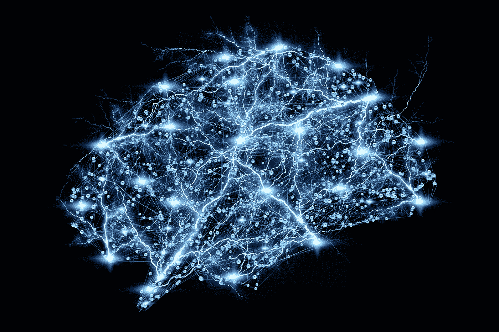
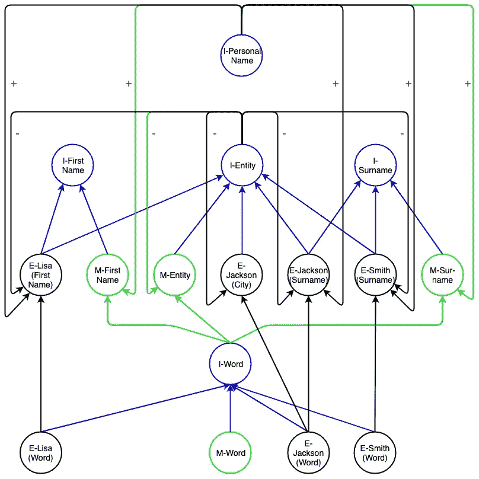
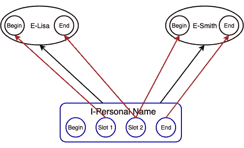
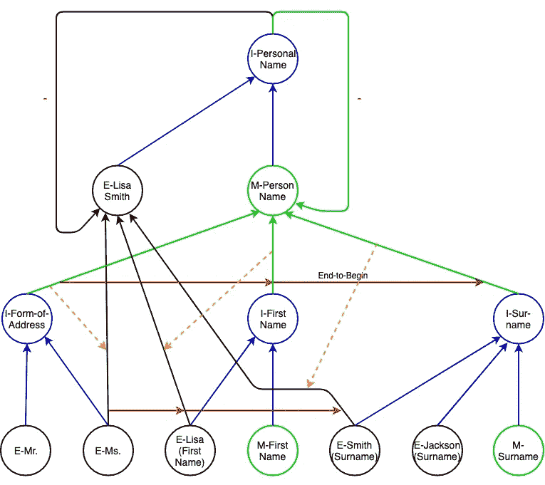
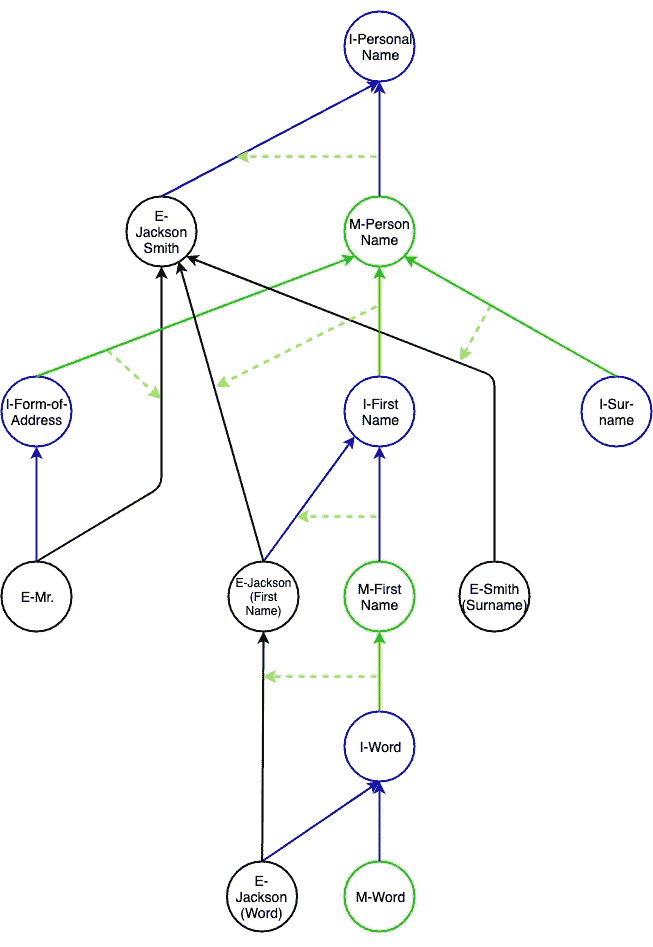

# 使用元神经元从单个训练示例中学习事实

> 原文：<https://towardsdatascience.com/using-meta-neurons-to-learn-facts-from-a-single-training-example-781ca0b7424d?source=collection_archive---------14----------------------->

## 当人们看到一种新的动物，遇到一个新的人或参观一个新的地方时，他们不需要重复数千次来记住它——那么为什么计算机必须要这样做呢？

人类的学习有两种形式，一种快，一种慢。慢的需要大量的重复，这似乎是征服一个新的认知领域所必需的，比如学习一门新的语言。但是一旦掌握了一个领域，在这个领域内学习新的事实只需要很少，甚至可能只需要一个例子。似乎参与处理这一领域的大脑区域已经被预先连接到它们所依赖的区域。因此，一旦需要学习一个新的事实，这种预连线就被用来加速参与处理这个新事实的神经元的训练。重要的是，在培训过程中，要区分新知识和现有知识。否则，所有基于已有知识的联系都会因为重复学习已知的东西而丢失。因此，参与处理已知事实的神经元必须能够抑制新知识的形成。

## 兴奋性神经元、抑制性神经元和元神经元

那么，反映这种学习过程的神经网络会是什么样的呢？它由哪些组件组成呢？首先，我们需要三种不同类型的神经元。兴奋性神经元，本质上是连接的。它们允许表示由许多单独特征组成的模式。另一方面，抑制性神经元本质上是分离的，并且能够将兴奋性神经元分组。从技术上讲，兴奋性神经元和抑制性神经元几乎是相同的。唯一的区别是，对于兴奋性神经元，从神经元偏差值中减去突触权重的总和。最后，元神经元实际上不是真正的神经元。相反，它们是一组兴奋性神经元的集体代表。它们的输入突触不一定与单个神经元相连，而是与神经元群相连。但是我们怎么能提到一组神经元呢？这可以通过使用元突触来实现。元突触是元神经元的输入突触。与常规突触相反，它们能够通过使用抑制性神经元作为网关来连接整组兴奋性输入神经元。因此，元突触可以被视为一种连接整个兴奋性神经元群的神经束。

由这三种类型的神经元组成的示例性网络看起来如下:

在这里，现有的知识由兴奋性神经元来表示。通过抑制性神经元(Inhib-1)的负反馈突触，它们能够相互抑制，或者抑制元神经元(Meta-1)。因为这种反馈回路在网络的激活中引入了几个稳定状态，所以需要优化过程来确定最相关的状态。这篇 [**文章**](/on-adding-negative-recurrent-synapses-to-a-neural-network-25a28409a6f2) 包含了这个优化过程更详细的描述。现在，如果在给定的数据集中，没有一个兴奋性神经元被激活得足够强，而是元神经元(Meta-1)通过其输入突触获得足够的支持而被激活，那么元神经元就会产生新的兴奋性。在这个创建过程中，只有那些在训练示例中被激活的输入元突触被复制。通过抑制性神经元(Inhib-2)连接到一组兴奋性神经元的元突触直接与输入兴奋性神经元而不是抑制性神经元建立突触。

## 关系

在我们继续更详细地举例说明如何应用元神经元之前，需要解释另一个概念。在自然语言文本中，不仅单词本身有意义，而且单词之间的相对位置也有意义。像单词袋这样简单的模型丢弃了这些信息，这大大减少了它们的使用。像 LSTMs(长短期记忆)这样的新模型使用非常复杂的循环网络拓扑来处理这些关系。但是，难道没有更简单的方法来表示这种关系吗？有可能明确描述神经元突触之间的关系吗？单个神经元的激活必须成为可以相互关联的对象。结果，例如，代表一个单词的神经元在文本处理期间，即在该单词在文本中每次出现时，可以被激活几次。我相信，人类大脑通过使用个体激活尖峰的精确相对时间并将它们相互联系起来，做了一些非常相似的事情。

为了给出如何使用这些关系的例子，考虑以下具有两个输入突触的兴奋性神经元(猫)，连接输入神经元“the”和“cat”。*结束-开始*关系确保了兴奋性输出神经元仅在单词‘the’的输入神经元激活的结束位置与单词‘cat’的激活的开始位置匹配时才触发。因此，只有当短语完全匹配时，输出神经元才会激活。*开始到开始*和*结束到结束*关系在这个例子中被用于将整个短语的开始和结束位置传播到输出兴奋神经元(cat)。

## 学习人名

为了给出元神经元如何应用的更详细的例子，我们现在将展示一个先前未知的人名是如何被训练并因此被翻译成新的兴奋性神经元的。我们假设，姓名的形式为 *<称谓形式> <名> <姓>* 。对于任何给定的示例名称，我们都需要考虑几种情况。首先，名字作为一个整体可能是已知的，在这种情况下，它不需要学习，或者是未知的。第二，给定的示例数据集实际上是个人姓名还是有完全不同的含义？第三，已经知道的词是潜在的名还是姓？第四，单词本身是已知的，还是之前从未见过的字母序列？

为了使神经网络模型能够回答所有这些问题，需要在模型中实现三个阶段。第一阶段将单个字母作为输入，并使用它们来表示模型的词汇。因此，如果我们遇到一个完全陌生的单词，并使用元神经元将其识别为一个单词，我们就能够诱导一个新的兴奋性神经元来代表这个确切的单词。

下一阶段代表这些单词的意思。模型的这一部分决定了一个给定的单词是否有名字、姓氏、城市名或其他完全不同的含义。在下图中，两个抑制性神经元*I-名字*和*I-姓氏*用于对名字和姓氏进行分组，抑制性神经元*I-实体*用于允许单词的不同含义相互抑制。注意，在这个例子中，一个兴奋性神经元，例如 *E-Lisa(名字)*，可以同时与几个元神经元相关联(*M-名字*，*M-实体*)。这意味着两个元神经元可能通常用于创建一个单一的兴奋性神经元。

例如，以一个还不知道其含义的词为例，比如一个名字。如果这个单词的上下文使得它很可能实际上是一个名字，那么这个阶段的元神经元可以用于诱导新的兴奋性实体神经元来将这个单词的意思表示为名字。请注意，这些实体神经元可能使用正反馈突触连接到代表完整个人姓名的下一个阶段。这是很有帮助的，因为如果我们知道某个单词被嵌入到一个完整的个人名字的特定位置，那么它更有可能实际上是一个名字。这仅在神经元 *I-Personal Name* 的激活传播名字和姓氏的开始和结束位置时有效。

最后阶段学习一个人的全名。这一阶段的每个兴奋性神经元指的是一个特定的人名，元神经元用于识别系统尚不知道的人名。

这个图中的黄色虚线箭头用来显示哪些元突触被用来创建哪些兴奋性突触。

这个模型的有趣之处在于，新的神经元在模型的不同阶段同时被诱导，并且仍然被正确地连接起来。因此，如果在未知的个人姓名中存在未知的名字，那么两个兴奋性神经元仍然可以被诱导，并且代表个人姓名的新的兴奋性神经元可以通过输入突触依赖于代表作为名字的单词的神经元。

让我们看看，如果将下面的训练示例输入到网络中，会发生什么。

杰克逊·史密斯先生

在这个例子中，单词“先生”已经被认为是可能的称呼形式，而“史密斯”被认为是可能的姓。到目前为止,“杰克逊”这个词只被认为是一个城市名或一个姓氏，而不是一个可能的名字。因此，元神经元必须诱导两个兴奋性神经元。第一个是实体神经元，表示单词 Jackson 作为名字的含义。这个神经元与单词“Jackson”的神经元相连，并通过一个正循环突触与全名的抑制性神经元相连。

第二个被诱导的兴奋性神经元是代表全名的神经元。这个神经元依赖于地址形式的神经元*E-Mr*，名字形式的神经元 *E-Jackson (First Name)* 和姓氏形式的神经元 *E-Smith (Surname)* 。在诱导过程中，元突触的权重和关系被简单地转移到新的兴奋性神经元的突触。元神经元还使用单独的训练偏差来确定何时应该诱导新的神经元。

## 开放式问题

[**爱歌项目**](http://aika.network/) ( [GitHub](https://github.com/aika-algorithm/aika) )的目标是为所有三种类型的神经元开发一个完全训练好的模型。此外，该训练过程应该在无人监督的情况下进行，并且应该能够从训练数据中创建网络拓扑。由于每种神经元类型在模型中具有非常不同的行为和目的，因此需要针对每种神经元类型的专门训练方法。在这一探索中出现的一些悬而未决的问题如下:

*   兴奋性神经元和兴奋性突触如何从零开始诱导？换句话说，如果两个或两个以上的随机神经元持续且频繁地一起放电，如何利用这个观察来创造一个新的兴奋性神经元？
*   在缓慢学习过程中，如何独立于元神经元训练兴奋性神经元？由于兴奋性神经元本质上是连接的，因此可以使用 Kullback-Leibler 散度(即信息增益)作为调整突触权重的目标函数来训练它们。这种想法是优化兴奋性神经元的突触权重，使其能够压缩表示神经元输入信号所需的信息量。因此，举例来说，如果有五个输入神经元，每个代表一个单词的字母，那么代表整个单词的兴奋性神经元需要明显更少的信息来传递相同的信息。关于突触权重的 KL-Divergence 的推导的一个很好的属性是，它优雅地捕捉了关于学习过程的一些直觉，例如 Hebb 规则:“什么将电线一起点燃”。或者说，如果一个突触不能与其他输入一起触发，它就会被削弱。我会在以后的 [**博文**](/using-information-gain-for-the-unsupervised-training-of-excitatory-neurons-e069eb90245b) 中更详细地解释这个想法。
*   抑制性和元神经元的训练是怎样的？与兴奋性神经元不同，抑制性和元神经元不能直接从数据中训练。由于抑制性神经元代表一类兴奋性神经元，显然在可用于训练的数据中没有发生同现。因此，为了训练抑制性和元神经元，我们需要从单个兴奋性神经元中抽象出来。换句话说，兴奋性神经元需要根据它们输入突触的一些共同特性来聚集。在某些情况下，需要创建新的输入抑制性神经元来分组一组输入神经元，这些输入神经元在分组的兴奋性神经元之间是不同的。
*   兴奋性突触的变化是如何传播到元突触的？
*   关系是如何培养的？
*   目前，将几个元神经元分配给单个兴奋性神经元的能力仍在研究中。