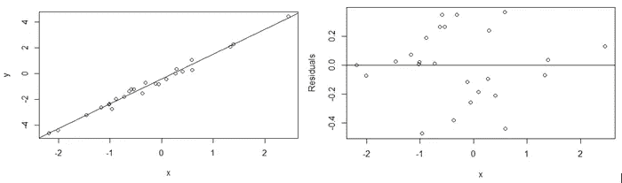

# 使用混合效应模型进行线性回归

> 原文：<https://towardsdatascience.com/using-mixed-effects-models-for-linear-regression-7b7941d249b?source=collection_archive---------4----------------------->

## 结合全球和集团层面的影响


当您的数据包含全局和组级别的趋势时，混合效应回归模型是线性回归模型的强大工具。本文通过一个使用虚拟数据将锻炼与情绪联系起来的例子来介绍这个概念。在最近的[新闻](https://www.zdnet.com/article/r-vs-python-rs-out-of-top-20-programming-languages-despite-boom-in-statistical-jobs/)中，R 经历了一段[不该经历的](/from-r-vs-python-to-r-and-python-aa25db33ce17)艰难时期，所以这篇文章将使用 R 作为对这种语言的小小慰问，尽管 Python 中也存在一个健壮的框架。

混合效应模型在政治投票分析中很常见，其中假设国家级特征发生在州级，而州级样本量可能太小，无法单独驱动这些特征。它们在科学实验中也很常见，在这些实验中，假设某一特定效应存在于所有研究个体中，需要从对治疗组的特定效应中梳理出来。同样，这一框架有助于干预措施的事前/事后研究。

**数据分析**

该数据模拟了对 4 个州的居民进行的调查，这些居民被问及他们的日常锻炼习惯和总体情绪，评分范围为 1-10。出于举例的目的，我们将假设情绪分数是线性的，但是在现实世界中，我们可能希望将它视为一个[序数](https://stats.idre.ucla.edu/other/mult-pkg/whatstat/what-is-the-difference-between-categorical-ordinal-and-interval-variables/)变量。我们将会看到(因为我编造了数据)锻炼改善了情绪，然而有很强的州级效应。

```
summary(data)
```


**初试:固定效应线性回归**

锻炼和情绪之间有明显的正相关，尽管模型拟合不是很好:锻炼是一个重要的预测因素，尽管调整后的 r 平方相当低。顺便说一下，我喜欢用 R 来解决快速回归问题:清晰、全面的输出通常很容易找到。

```
reg1 <- lm(Mood ~ Exercise, data = data) 
summary(reg1)

with(data, plot(Exercise, Mood))
abline(reg1)
```


我们可能会在这一点上得出结论，数据是有噪声的，但让我们再深入一点。回想一下，线性回归的假设之一是“同方差”，即所有自变量的方差都是常数。当存在异方差时(并且违反了同方差)，回归可能会对误差方差最大的数据子集赋予过多的权重。您可以通过查看残差图来验证这一假设。

作为参考，下面是一个不违反同质性的线性回归。

```
x <- rnorm(25, 0, 1)
y = 2*x - 0.5 + rnorm(25, 0, 0.25)reg.test <- lm(y ~ x) 
plot(x, y)
abline(reg.test)
plot(x, resid(reg.test), ylab="Residuals", xlab="x") 
abline(0, 0)
```



然后是我们的数据:

```
plot(data$Mood, resid(reg1), ylab="Residuals", xlab="Mood") 
abline(0, 0)
```


该图表明，简单的线性回归是不合适的——该模型始终为低情绪得分生成负残差，为高情绪得分生成正残差。在这一点上，我们可能会怀疑情绪和状态在某种程度上是相关的，或者模型没有合并，这是一个很好的猜测= >残差的方差因状态而异。

```
plot(data$State, resid(reg1), ylab="Residuals", xlab="Mood") 
abline(0, 0)
```


**第二次尝试:更稳健的线性回归**

但是等等——如果状态是一个预测因子，让我们把它包含在我们的回归中并修正一切。我们会看到这个*基本上是*正确的。

```
reg2 <- lm(Mood ~ Exercise + State, data = data) 
summary(reg1)

with(data, plot(Exercise, Mood))
abline(reg2)plot(data$State, resid(reg2), ylab="Residuals", xlab="State") 
abline(0, 0)
```


r 平方显著改善，但现在绘制的线看起来非常愚蠢——我们一直低于预期，运动的系数估计值接近于零(并且具有不显著的 p 值)。这是异方差效应的一个例子——方差较大的组(即州)会覆盖方差较小的组。

我们有进展了。如果我们对每个州做单独的线性回归会怎么样？那样的话，我们就不会有群体相互作用扭曲我们系数的问题了，对吧？

```
library(ggplot2)
ggplot(data, aes(x = Exercise, y = Mood, color = State)) +
  geom_point() +
  geom_smooth(method='lm',formula=y~x)
```


那么，我们现在有一个相反的问题——注意，在状态 C 中，锻炼正在降低情绪。而且其他状态下的斜率系数也远低于我们在心情~运动回归中看到的 0.42951。所以现在我们忽略了高层模型中的信息，因为我们关注的是州级模型。

**混合效果模型**

上面的最后一个例子直接导致了一个混合效果模型。在这个模型中，我们可以允许州级回归包含来自整体回归的一些信息，但也保留一些州级组件。我们可以使用 lme4 库来做到这一点。

该符号类似于 lm 回归，但有一个关键区别:( 1 + Exercise | State)符号允许模型对每个状态值的 Mood ~ Exercise 使用具有不同斜率和截距的项。见下面的系数值。

```
library(lme4)reg3 <- lmer(Mood ~ Exercise + (1 + Exercise | State), data = data, REML = FALSE)
summary(reg3)
coef(reg3)
```


我们现在已经运行了 3 个模型:

1.  心情~运动
2.  心情~运动+状态
3.  心情~运动+ (1 +运动|状态)

我们可以计算每个模型的 RMSE。

```
reg1_predict <- predict(reg1, data[1:2])
reg2_predict <- predict(reg2, data[1:2])
reg3_predict <- predict(reg3, data[1:2])sqrt(sum((data[3] - reg1_predict)**2))
sqrt(sum((data[3] - reg2_predict)**2))
sqrt(sum((data[3] - reg3_predict)**2))
```


从模型 2 到模型 3，RMSE 的进步显著——这表明状态和情绪之间的差异主要是由于每个状态的平均情绪。从模型 2 移动到模型 3 捕获了这个州级截距信息，但是也计算了每个州的 Mood ~ Exercise 的斜率系数，该斜率系数结合了来自总数据集和州级信息的信息(回想一下，仅使用州级斜率信息在州 C 中产生了负斜率)。

关于混合效应模型的最后几点说明。对于如何确定混合效应模型的 p 值，有多种方法和正在进行的研究。可以使用 anova 似然检验来确定添加的变量相对于没有添加该变量的模型是否显著。

**结论**

混合效应模型为平滑数据中的全局和组级别特征提供了一个框架。

我主要是从 Richard McElreath 和他的精彩文章[统计学再思考](https://xcelab.net/rm/statistical-rethinking/)中了解到这些模型的。我向所有读者强烈推荐这本书:这本书对重新思考许多在入门课上为我做的统计假设有很大帮助，我从来不知道要重新考虑这些假设。

OJ Watson 也有一个做得很好的 [Kaggle post](https://www.kaggle.com/ojwatson/mixed-models) ，它为混合效果模型提供了一个基于 python 的框架。