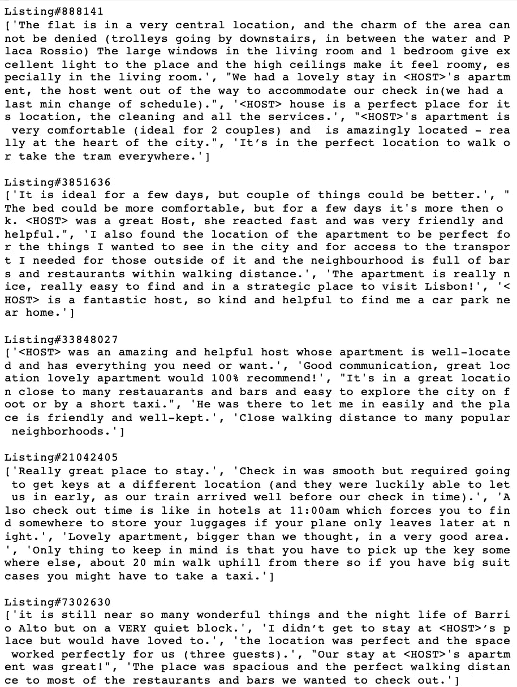
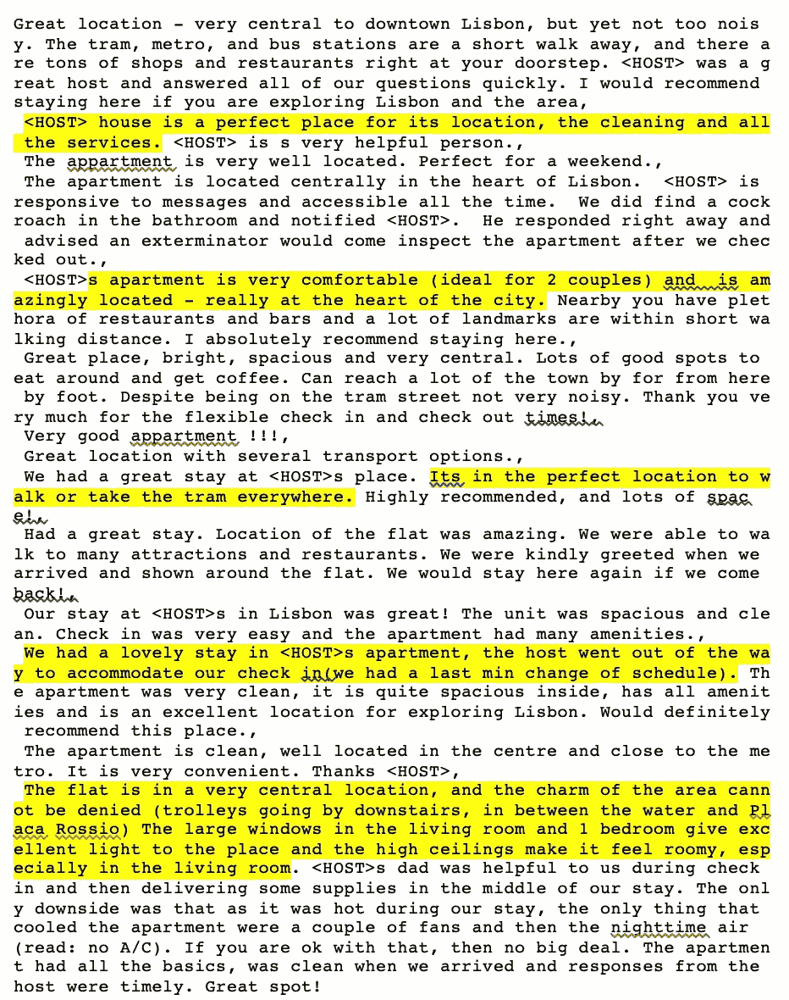

# 使用 ML 进行假期规划:总结 Airbnb 评论

> 原文：<https://towardsdatascience.com/using-ml-for-holiday-planning-summarising-airbnb-reviews-193abb002232?source=collection_archive---------29----------------------->


Photo by [Arno Smit](https://unsplash.com/@_entreprenerd?utm_source=unsplash&utm_medium=referral&utm_content=creditCopyText) on [Unsplash](https://unsplash.com/search/photos/beach?utm_source=unsplash&utm_medium=referral&utm_content=creditCopyText)

当谈到假日住宿时，Airbnb 是第一个立即想到的途径。

随着 Airbnb 的流行，世界上大多数主要城市都有成千上万的 Airbnb 住处。即使按照人数、Airbnb 房产类型以及入住和退房日期进行过滤，我们仍然有很多选择。

在选择 Airbnb 时，除了明显的要求——价格、位置和便利设施，我倾向于花时间阅读客人评论，以了解更多关于主人的信息以及我在那里住宿时可以期待的体验。唯一的问题是这种手工操作非常耗时！

# 一定有更好的方法！

> “我怎样才能在不通读一页页评论的情况下，对之前的顾客体验有一个简明的了解？”

我不仅想知道大多数评论是否是正面的。我也很想知道大多数客人对他们的经历都说了些什么。

有了我的问题框架，我决定用 3 种不同的方法来解决这个问题——主题建模，使用 TF-IDF ( **T** erm **F** 频率— **I** 反向 **D** 文档 **F** 频率)提取相关关键词，以及文本摘要。

# 目录

——[**数据**](/using-ml-for-holiday-planning-summarising-airbnb-reviews-193abb002232#9718)
——[**我们来讨论一下途径**](/using-ml-for-holiday-planning-summarising-airbnb-reviews-193abb002232#c417)
— — [1。主题造型](/using-ml-for-holiday-planning-summarising-airbnb-reviews-193abb002232#2ab3)
—[2。TF-IDF](/using-ml-for-holiday-planning-summarising-airbnb-reviews-193abb002232#76a5)
—[3。文字总结](/using-ml-for-holiday-planning-summarising-airbnb-reviews-193abb002232#af4f)
— [**行动中的提取(我是如何利用它来度假的？)**](/using-ml-for-holiday-planning-summarising-airbnb-reviews-193abb002232#3103)
——[**结尾**](/using-ml-for-holiday-planning-summarising-airbnb-reviews-193abb002232#4093)

# 数据

我使用过来自 InsideAirbnb 的阿姆斯特丹 Airbnb 评论。在过去 10 年中，客人在阿姆斯特丹逗留期间对 15，000 个房源提交了 450，000 条评论。

**预处理 **

[平均每年有 440 万外国游客到访阿姆斯特丹。因此，我们可以预期一部分评论会用英语以外的语言撰写。在探索数据集时，这一点很快得到了验证。](https://amsterdam.org/en/facts-and-figures.php)

由于数据集不包含语言字段，我不得不使用 [FastText 的语言识别模型](https://fasttext.cc/docs/en/language-identification.html)来预测文档的语言，并使用该信息过滤掉非英语评论。该模型对我的用例来说非常棒，因为它快速而准确，在包含许多不同欧洲语言的 EuroGov 数据集上[达到了 98%以上的准确率。](https://fasttext.cc/blog/2017/10/02/blog-post.html)

除了语言之外，相同的`reviews.csv`数据集对于每种方法的处理略有不同。这将在下面简要介绍。

对于每种方法，我都使用了来自同一个清单#2818 的 211 篇评论进行比较。

# 让我们讨论方法

## 1.主题建模

主题建模是一种无监督的机器学习方法，通常用于在文档集合中发现抽象主题。它认为每个文档都由主题的混合来表示，每个主题都由一组频繁出现的单词来表示。

主题建模将文档中发现的单词聚类成`n`个主题。每一串单词代表一个抽象的主题。例如，通过一串单词`badminton, taekwondo, football`，我们可以确定相关的抽象主题与`sports`相关。

我将使用[潜在狄利克雷分配](https://en.wikipedia.org/wiki/Latent_Dirichlet_allocation) (LDA)，主题建模最流行的例子之一。

***实现***

*   *资料准备*

1.  符号和停用词已被删除
2.  使用雪球算法(改进自 Porter)对令牌进行词干提取
3.  使用 unigrams 为每次审查创建的 TF-IDF 向量

*   *代码*

*   *示例输出*

```
Topic #1:
['<host>', 'provid', 'map', 'came', 'stay', 'amsterdam', 'travel', 'took', 'late', 'would']

Topic #2:
['<host>', 'everyth', 'good', 'kind', 'well', 'part', 'clean', 'comfort', 'also', 'guest']

Topic #3:
['<host>', 'host', 'stay', 'room', 'clean', 'place', 'great', 'help', 'amsterdam', 'map']

Topic #4:
['<host>', 'jouri', 'worthi', 'chang', 'session', 'vacat', 'overal', 'weed', 'scare', 'classi']

Topic #5:
['<host>', 'stay', 'get', 'room', 'host', 'amsterdam', 'provid', 'apart', 'also', 'come']
```

我们来分解一下发现的话题:

1.  主题 1 相当模糊。很难解释它的意思。“迟到”是对主持人的负面评价吗？还是客人们在谈论主人如何因为他们迟到而等待他们？或者主人会如何回应他们迟到的回复？
2.  第二个话题暗示主人很好，很亲切，这个地方很舒适，很干净。
3.  话题 3 表明主人帮了很大的忙，这个地方也很棒很干净。
4.  主题#4 暗示客人们享受他们的旅程..也许包括大麻？
5.  第五个话题也相当模糊。

*   *好与坏*

***好的*** *:* 主题是从数据本身自动发现的，不需要任何标注数据。

***坏处:*** 除非你有先验知识，否则没有正确的方法来预先决定主题的数量。这需要反复试验。在最好的情况下，LDA 只能提供数据中存在的主题的粗略概念。将一组单词解释成一个抽象的话题是一种主观的猜谜游戏。

## **2。TF-IDF**

[TF-IDF](https://en.wikipedia.org/wiki/Tf%E2%80%93idf) 是**T**erm**F**frequency-**I**n reverse**D**document**F**frequency。这种评分机制通常用于信息检索和文本挖掘，以反映文档中单词的相关性。

这个分数有两个部分:

*   **词频**—word 在文档中出现的次数
*   **逆文档频率**—word 在文档集合中出现的次数的倒数。术语 ***逆*** 值得注意，因为我们对在所有文档中频繁出现的单词不感兴趣。

在文档中频繁出现但在集合中不频繁出现的单词将具有高 TF-IDF 分数，因为该单词与文档相关。例如，在一篇讨论“8 小时睡眠的好处”的文章中，我们可以预计`sleep`会有较高的 TF-IDF 得分，因为该词在文章中会被频繁提及，但在其他文章中可能不会被频繁使用。

相比之下，`the, good, how`这样的词是常用词，可以用在各种文章中。这些词的 TF-IDF 得分较低。

同样值得一提的是，不同文档中的同一个单词会有不同的 TF-IDF 得分。

***实现***

*   *数据准备*

1.  符号和停用词已被删除
2.  使用雪球算法(改进自 Porter)对令牌进行词干提取
3.  使用二元模型为每次审查创建的 TF-IDF 向量

*   *代码*

*   *示例输出*

```
['great host', 'perfect host', 'public transport', 'high recommend', 'place clean', 'get around', 'make sure', 'stay amsterdam', 'recommend stay', 'host place']
```

所有客人评论的前 10 个相关关键词表明主人很棒，这个地方很干净，他们强烈推荐这个地方。还经常提到公共交通。

与 LDA 相比，从 TF-IDF 中提取的关键字不那么模糊。但是还是有像`make sure`和`get around`这样的关键词有点太模糊，无法解读。

*   *好与坏*

***好:*** 使用统计方法提取相关关键词。实现简单。

***不好:*** *s* 不考虑不同单词的语义。像`clean apartment`和`clean flat`这样的术语语义相同，但是在 TF-IDF 中，它们被当作两个不同的字符串。

## 3.文本摘要

文本摘要用于在一个文档或一组文档中找到信息最丰富的句子。摘录摘要是最流行的方法，它涉及选择最能代表文档或文档集合中的信息的句子。

一种常用的提取汇总技术是一种基于图的技术，称为 TextRank 算法。这个算法是从 [PageRank](https://en.wikipedia.org/wiki/PageRank) (想想谷歌！).根据句子与另一个句子的相似性，句子按重要性排序。

***实现***

*   *数据准备*

1.  符号和停用词已被删除。
2.  下载并提取在 [Wikipedia+Gigaword 5](https://nlp.stanford.edu/projects/glove/) 上预先训练的 100 个维度的手套嵌入
3.  通过将手套嵌入应用于评论中的每个句子并使用余弦距离计算每个句子之间的相似性来构建相似性矩阵
4.  应用文本排名算法获得句子排名

*   *代码*

*   *示例输出*

```
['HOST: <HOST> was very accomodating, has prepared everything you will need for your stay in the city, you get to have great and fun conversations with him, you will be for sure well taken care of!','Not only was the room comfortable, colourful, light, quiet, and equipped with everything we could possibly need - and <HOST>'s flat spotless and beautifully furnished and in a great location - but <HOST> himself is the perfect host, spending the first hour of our arrival talking to us about Amsterdam, answering our many questions, showing us how to get around.','He was friendly, extremely helpful & went the extra mile to make sure my friend and I were at home at his place.','His attention to details and kindness make his place an excellent alternative for those considering a bed and breakfast in Amsterdam\r\nI strongly advise to consider his place: Great location, an affordable price, a clean and organized room and a great host.','I traveled first time to Amsterdam with a friend and we stayed at <HOST>´s.He was an excelent host with helping to find out routes and gave lots of tips how to handle things in Amsterdam.The place was very clean and quiet.We recomment <HOST>´s room.']
```

我立即发现了 TF-IDF 的前 5 个最具信息量的句子和前 10 个相关关键词之间的一些相似之处:

1.  伟大的主持人/完美的主持人

```
- <HOST> was very accomodating, has prepared everything you will need for your stay in the city, you get to have great and fun conversations with him, you will be for sure well taken care of- He was an excelent host with helping to find out routes and gave lots of tips how to handle things in Amsterdam- His attention to details and kindness make his place an excellent alternative for those considering a bed and breakfast in Amsterdam- He was friendly, extremely helpful & went the extra mile to make sure my friend and I were at home at his place.
```

2.放置干净

```
- <HOST>'s flat spotless and beautifully furnished and in a great location- a clean and organized room- The place was very clean and quiet
```

3.高度推荐

```
- We recomment <HOST>´s room.- I strongly advise to consider his place
```

*   *好与坏*

***好:*** 方法是无监督的，意味着不需要带标签的训练数据。

# 行动中的提取(我如何在假期中使用它？)

在尝试了上面的三种方法后，我发现文本摘要法是最有洞察力的，可读性和可解释性最强的，而且歧义最少。

下面的部分将展示我是如何把它应用到我最近去美丽的里斯本的旅行计划中的。

在列出了我想入住的 5 家酒店后，我把它们的网址复制到我的 Jupyter 笔记本上进行提取。

工作流程包括:

1.  提取过去 12 个月提交的每个列表的评论
2.  执行与上述相同的文本清理过程
3.  使用如上所述的 TextRank 算法应用文本摘要
4.  想象每个列表中前 5 个信息最丰富的句子



Top 5 most informative review sentences from Airbnb listings



14 reviews written in the last 12 months for Listing#888141 with summarised text highlighted

瞧啊。如果不总结评论，我将不得不通读这 5 个列表的 64 篇评论。

***点击率:*** 所有 5 个总结都涵盖了主人关心的要点，地点，地方的清洁度和舒适度。尤其是清单#21042405 的摘要很有见地，因为它指出必须从不同的位置收集密钥。

***错过:*** 一位来自#888141 号房源的客人抱怨这个地方没有空调，而且在他们参观期间天气非常热。总结中未提及该意见，主要原因可能是因为客人是唯一提出此类投诉的人，因此与其他意见相比，该意见并不重要。

# 结束了

感谢阅读！我很喜欢这个结合了我最喜欢的两件事——旅行和数据科学的小项目。希望你喜欢这篇文章，并发现这个应用程序有趣且实用。

使用的 Jupyter 笔记本可以在 Github 上的[这里](https://github.com/fifionachow/airbnb-reviews-analysis)找到。

# 参考

[https://www . analyticsvidhya . com/blog/2018/11/introduction-text-summary-text rank-python/](https://www.analyticsvidhya.com/blog/2018/11/introduction-text-summarization-textrank-python/)