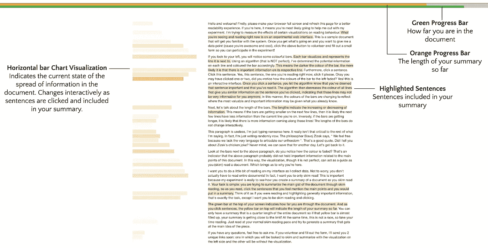

# 用自然语言处理(NLP)和信息可视化(InfoVis)支持略读

> 原文：<https://towardsdatascience.com/using-natural-language-processing-nlp-and-information-visualization-infovis-to-enhance-skim-e614b3f8b4a?source=collection_archive---------26----------------------->

## skimfo——一个交互式界面，可视化文档旁边的“信息”(仅桌面演示@[https://demo-dot-skimfo.appspot.com/](https://demo-dot-skimfo.appspot.com/))

# 概观

交互式可视化可以为文本分析任务提供有价值的支持。然而，这种类型的大多数可视化要么是抽象的，需要仔细检查，要么扰乱散文阅读过程。出于这些原因，在略读策略下，它们并不总是有效的——这仍然是策略性阅读散文的首选方法。略读被普遍认为是在最少的时间内获得最多信息的优化——一种信息增益模型。

使用 ***Skimfo*** ，我设计了一个界面，作为一个研究项目的一部分，以探索可视化文本旁边的信息度量是否可以通过支持我们阅读时对文本的快速判断来支持略读的任务，例如:

*   文档中的信息在哪里？
*   *有多少信息量？*
*   *我读的时候是增加还是减少？*

> **Skimfo** 仅限桌面**演示@**https://demo-dot-skimfo.appspot.com/

# 动机

对网络浏览行为的研究表明，读者通常会略读文本(略读)来有效地找到有价值的信息。略读策略概念化的一个突出而模糊的框架是在特定时间内“信息增益”的最大化(见*图 1* )。虽然研究还不清楚这是如何做到的，但在这种策略下，人们认为读者在阅读过程中会对信息的价值做出判断。当一段文字的信息增益低于特定于读者的阈值(取决于上下文)时，她会放弃这段文字，跳到文档中的另一个位置。

**Figure 1:** The dotted line on the chart (right) is a **threshold**, if a reader feels the information gain from a passage of text is falling below their unique threshold, they abandon the passage, skim some text, and re-start reading at another point in the text where they judge information gain to be above the threshold.

> **【1】将略读概念化为信息获取模式的参考:** [达根、杰佛瑞·b .等人《文本略读:在时间压力下通过文本觅食的过程和有效性》实验心理学杂志:应用 15.3(2009):228–42。](https://www.ncbi.nlm.nih.gov/pubmed/19751073)

学术读者经常试图避免不必要的阅读，并将利用新技术——特别是“数字索引、检索和导航资源的广泛使用”——进行战略性阅读。然而，尽管存在提取信息的工具，阅读叙事散文仍然是阅读文本的首选方法。

这个交互界面 ***Skimfo*** ，可视化了相对于文档的重要性以及信息量，以帮助读者在略读文档时做出判断。通过从信息论的角度构建对文档的阅读，我们获得了“概率加权信息”[2]的概念基础，这是一种与文档中使用的词及其频率相关的度量，作为每个词附带的信息量(见*图 2* )。有了这个量，我们就可以通过基本的计算来可视化文档中信息的传播。

**Figure 2:** It involves some mathematics (see [2]), but in conclusion, we arrive at a modified version of the TF-IDF score as the information (entropy) provided by each word in the document. Intuitively, the PWI of any given word **w_i** quantifies: *How much “uncertainty/entropy” in the Document is reduced by “knowing” a word?*

> **【2】引用‘概率加权信息’作为每个词的信息度量:** [会泽，明子。“tf-idf 测量的信息论观点”Inf。过程。管理。39 (2003): 45–65.](http://An information-theoretic perspective of tf-idf measures)

# 交互界面设计

***Skimfo*** 是一个交互式的基于 web 的界面，它作为一个平台，在文本旁边提供所提议的可视化。*图 3* 突出显示了视图中的各种特征。

**Figure 3:** A screenshot of the Skimfo interface from skimfo.appspot.com depicting the main features

## 用例

这个界面是作为一个研究项目的一部分而设计的，该项目测量左侧视觉化(水平条形图)对略读的影响。**本质上，该界面被设计用于通过略读来总结文档的主要要旨。所以，当你阅读的时候，你可以点击那些你认为能提到要点的句子，然后你可以把它们总结起来。把它想象成你在阅读和强调一般重要的信息，除了视觉化是作为一种定量的辅助。**

然而，关键是文档旁边的信息度量的可视化——这可以用于各种目的，包括:可视化书面草稿中的冗余信息，确定文档的范围以查看它是否有趣，快速浏览文档中的主要主题，等等。

## 条形的颜色/不透明度

该界面提供了每行“信息”的可视化，您可以使用它作为阅读的指南。每个条形可视化并表示其旁边的线条。使用一种算法(即**不**完美)，我已经确定了每条线上的潜在信息，并相应地给条形着色。这意味着条形的颜色越深，越有可能在相应的线上有重要的信息。

## 交互性

此外，它是一个交互界面——一旦你点击了一个句子，你就让算法知道你已经阅读了它。然后，该算法会降低所有与你点击的句子信息相似的线条的颜色，表明这些线条可能不再对你有很大帮助。通过这种方式，条形的颜色会发生变化，以反映最有价值和最重要的信息可能会在哪里提供给你已经知道的信息。

## 条的长度

条形的长度表示信息的增加或减少。这意味着如果下几行的条形越来越小，那么很可能下几行比当前行包含的信息更少。相反，如果条形越来越长，很可能会有更多的信息沿着这些线条出现。条形的长度不会交互改变。

## 其他功能

其他有用的功能包括页面顶部的进度条。绿色条表示您对文档的了解程度。当你点击句子时，顶部的黄色条会变满，表示到目前为止你的总结的长度。完全填满的黄色条表示您的摘要是整个文档的四分之一长。

最后，靠近页面底部的一个按钮允许你查看你的最终总结。

# 演示—【https://demo-dot-skimfo.appspot.com/ (仅限桌面)

为了推出一个 ***Skimfo*** 的演示，并保持其廉价，算法和处理都比最初的设计有所简化。由于使用了有限的文本处理技术，有时可能会有小的文本格式错误。目前，由于可视化的性质和大小，*不支持移动视图。*

> ***使用的 Tech:***
> *-Python(*库 *: flask、nltk、scikit、pandas)
> - D3(用于可视化)*

我提供了复制粘贴文本块(500-5000 字以内)的选项，然后我对其进行处理以提供可视化和交互性。还有一个直接进入网页的选项，但是，由于网络抓取的“精细性”,这是一个有限的、错误的选项。(此外，有时网页有安全措施，以防止机器人代理抓取。)

一般来说，这种可视化最适用于非创造性的文本(短文、文章、新闻、文档等)。)以向读者提供信息为目的而写的。 **用自己的文字试试吧！你可能会发现它减少了你的阅读时间，或者帮助你导航到重要的信息——支持你在略读文本时做出的快速判断。**