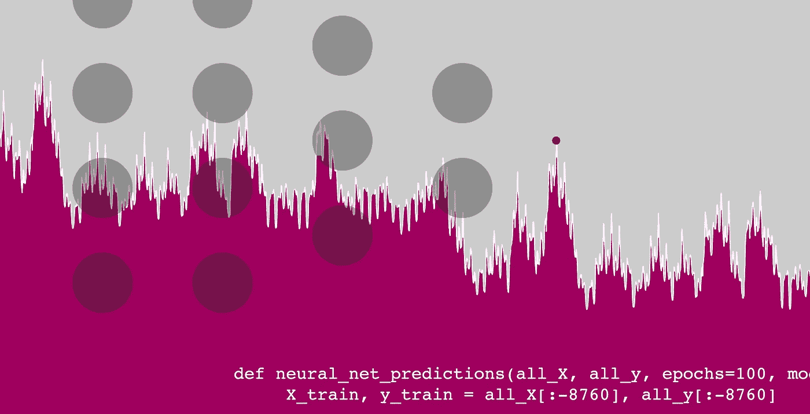
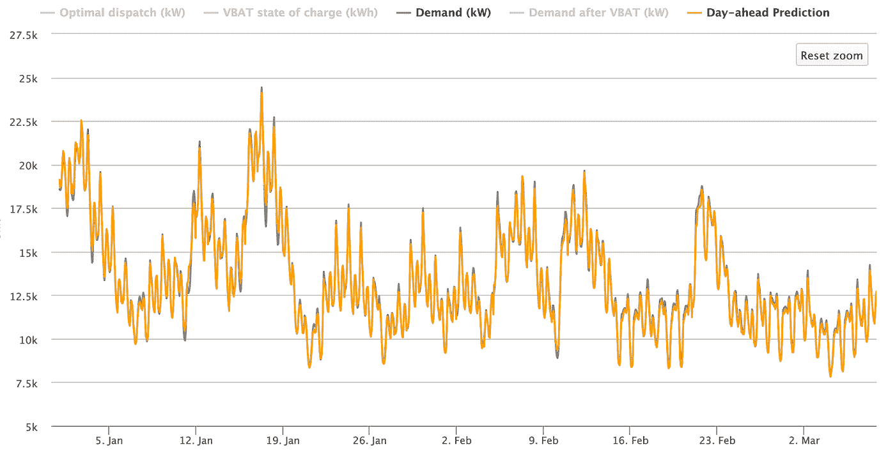

# 用神经网络预测明天的用电量

> 原文：<https://towardsdatascience.com/using-neural-nets-to-predict-tomorrows-electric-consumption-cc1ae3ae7cc2?source=collection_archive---------9----------------------->



## 神经网络调峰:第一部分

## 最小的错误都会在一天内造成数千美元的损失。神经网络可以帮助确保这种情况不会发生。

*研究会同* [*开放建模框架*](http://omf.coop)*【OMF】*

*这是关于神经网络调峰的三部分系列文章的第一部分。考虑一下另外两个:*

 [## 基于神经网络的⚡️负荷预测和调峰

### 提高日前负荷预测的准确性可以为电力公司节省数万美元。下面，我已经…

www.kmcelwee.com](https://www.kmcelwee.com/load-forecasting/) 

电力分销商可以通过降低高峰需求费用来节省数十万美元。一些人试图在高峰时段将电池放电或关闭客户的热水器或空调，以减少他们的需求。但是，这些努力的有效性取决于公用事业公司预测当天能源消耗的能力。

最小的误差可能意味着数万美元之间的差异——在不正确的负荷预测下实施调峰策略甚至会*增加*需求成本。谢天谢地，深度学习和神经网络的进步可以为公用事业公司提供第二天能源消耗的令人难以置信的准确图片。开放建模框架(OMF)和我已经使用神经网络创建了一个日前负荷预测模型，可以很容易地实施，以通知调度决策。

# 为什么不简单点呢？

我们最初用 python 包 sci-kit learn 创建了一个线性回归模型。尽管这个更简单的模型达到了 10%的平均绝对误差(MAPE)，但它还不足以准确可靠地降低峰值。

最大的障碍是冬季和夏季的日峰值不同。冬季月份每天出现两次高峰，夏季月份在中午出现高峰。线性模型不能同时创建这两种每日负荷形状。虽然线性回归可以找到简单的关系(因为是星期一，所以+500 千瓦，-100 千瓦，因为是三月)，但神经网络可以计算更复杂的关系(因为是四月的星期一下午 3 点，所以+5100 千瓦，-1500 千瓦，因为是感恩节的凌晨 5 点)。这将我们的训练误差减少到大约 3.5 MAPE，这相当于节省了数万美元。



Load prediction captures both single and double peak behavior (from OMF’s “Virtual Battery Dispatch” model)

# 软件详情

为了将负荷预测软件整合到 OMF 数据库中，我们的模型是用 Python 编写的。我们使用 pandas 包来操作数据，我们已经实现了 Tensorflow 的 Keras(谷歌的机器学习软件)来创建神经网络。[这里有一个到存储库的链接](https://github.com/kmcelwee/load-forecasting/)。该代码易于使用:

```
import loadForecast as fc
import pandas as pddf = pd.read_csv('test.csv')
all_X = fc.makeUsefulDf(df)
all_y = df[‘load’]
predictions, accuracy = fc.neural_net_predictions(all_X, all_y)
```

为了我们最初的测试目的，`neural_net_predictions`简单地返回最后一年的预测；但是，它可以快速更新，以便实时为公用事业服务。

# 结构

当我们寻找更准确和有效的方法时，神经网络的结构在不断更新；然而，我们目前已经选定了一个五层全连接网络，其中每层包含 71 个节点。我们在每一层使用一个 ReLU 函数，并最小化均方误差。

# 输入

我们建议模型至少训练三年的数据。该模型将 CSV 作为输入，其中每一行列出给定年、月、日和小时的负载和天气。如果公用事业公司没有可用的温度数据，OMF 还提供了“天气预报”，这是一个可以很容易地收集并返回给定邮政编码的每小时天气的程序。如果有任何空的温度值，负荷预测函数使用“向前填充”方法，其中空值被最后一个非空值替换。例如，“38，39，41，NaN，NaN，38，NaN，32”将读作“38，39，41，41，41，38，38，32”

# 特征

虽然每个训练示例都包含日期、温度和天气数据，但我们将这三列扩展为 72 个对机器学习模型有用的功能。以下是所有功能的列表:

*   自 2000 年以来的年份*
*   从 24 小时前加载*
*   一天中的小时(凌晨 12 点，凌晨 1 点，…晚上 11 点)
*   一周中的某一天(是星期日，是星期一，…是星期六)
*   一年中的月份(一月，二月，…十二月)
*   温度* **
*   温度***
*   前一天的负载*(前一天的 12 点，前一天的 1 点，…前一天的 11 点)
*   节假日(NERC6 节假日)**** (isNewYears，isMemorialDay…isChristmas)

*这些特征通过减去平均值并除以标准偏差进行归一化，这有助于收集接近零的所有数据点。通过除以标准差而不是范围(正如一些数据科学家所建议的)，我们将准确度提高了 1%。

**国家气象局估计他们的前一天每小时天气预报通常在 2.5 度以内。为了复制这一点，我们在训练和测试温度数据中创建噪声，方法是添加一个以零为中心的标准偏差为 2.5 的高斯分布。当这个噪音被加入时，模型的准确性下降了百分之一。

***如果您绘制负荷与温度的关系图，您会发现负荷与温度成正比——加热器用于最冷的温度，空调用于最热的温度。通过添加温度特征，我们可以使这种关系对模型更加明显。

****观察到的节假日也是“1”(或“真”)。例如，2015 年的独立日是星期六，所以它是在 7 月 3 日星期五庆祝的。对于“isIndependenceDay”功能，2015 年的 7 月 3 日和 7 月 4 日都标记为“1”。

# 结果

我们根据 from 2002 年至 2017 年的休斯顿数据训练了这个神经网络，并针对 2018 年的负载测试了该模型。我们达到了大约 96.5%的准确率(3.5 MAPE)。整个程序通常在 10 分钟内运行。我们在一个需求减少模型上部署了这个神经网络，其中一个公用事业公司使用电池转移负载来减少需求，并发现我们节省了 40%的最佳解决方案(例如，如果一切运行完美，公用事业公司将在按需充电方面节省 95，000 美元，但由于预测不完美，它节省了大约 40，000 美元。这假设了典型的 20 美元/千瓦的需求费用。在其他值中，需求费用是我们成本效益模型的一个输入，我们正在将这些结果扩展到其他公用事业。)

鉴于最小的改进可能对公共事业的底线产生如此深远的影响，我们目前正在追求更复杂的机器学习结构。

此外，对这些大型电池进行充电和放电需要成本，一些公用事业公司可以在有限的天数内控制客户的空调。我们研究的下一步是最好地预测一个月中的哪一天调度这些方法(假设需求费用是每月的)，以便公用事业公司可以尽可能保守。

你发现错误了吗？你有什么问题吗？联系我，查看更多项目在 [*我的网站*](http://www.kmcelwee.com) *。*