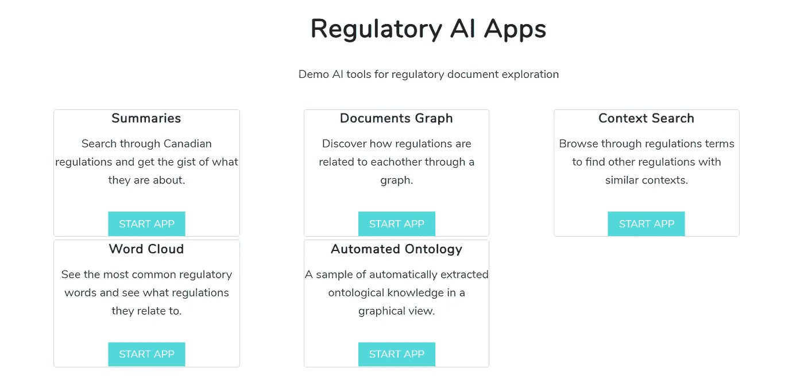
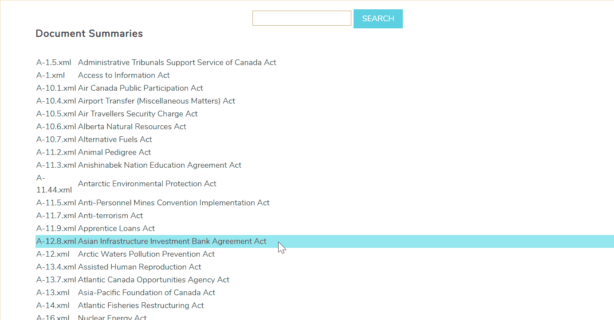
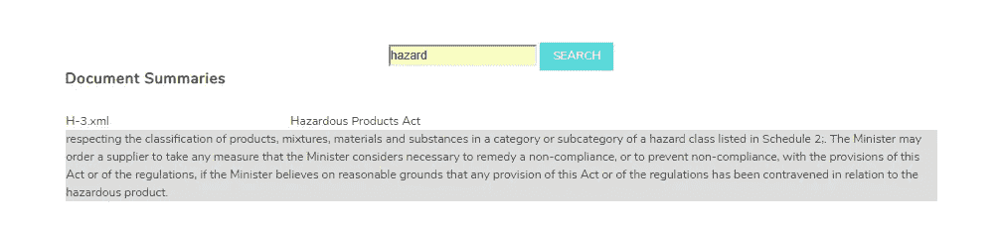
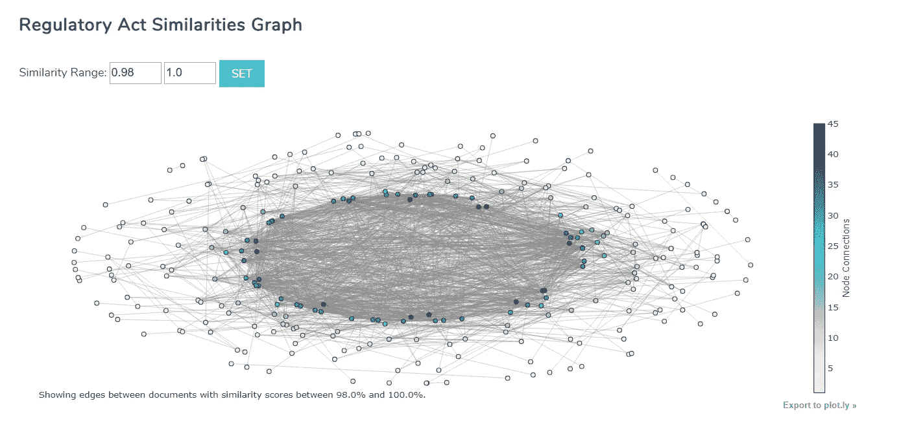
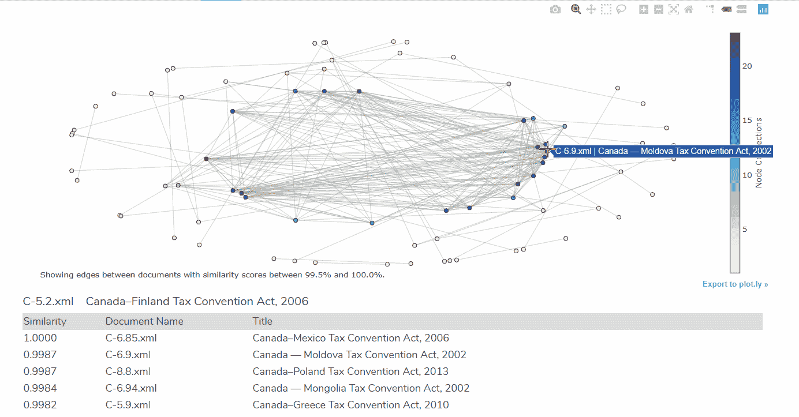
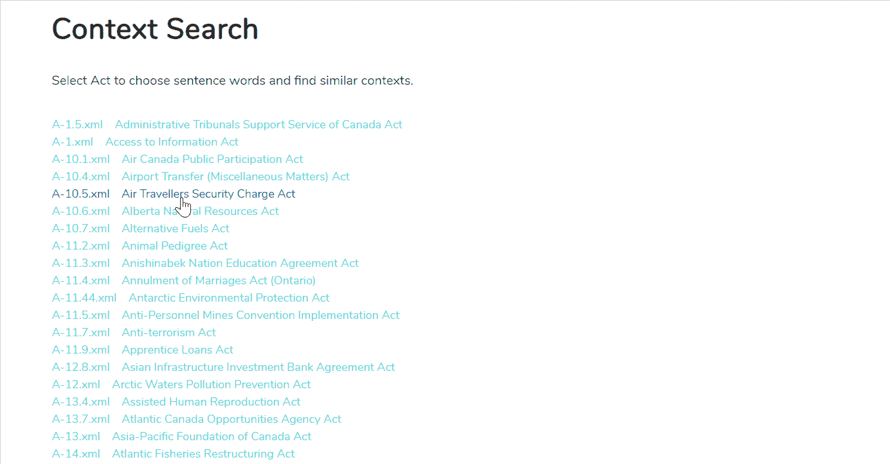
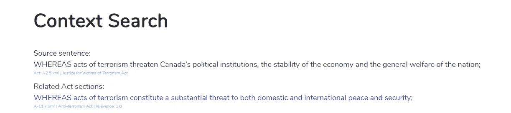
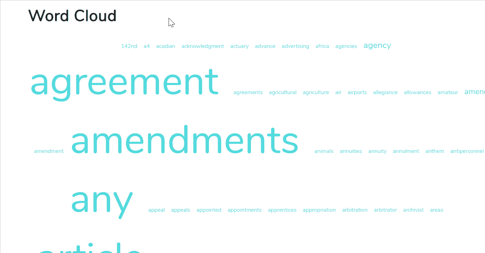

# 使用 NLP 为监管机构构建搜索和发现应用程序

> 原文：<https://towardsdatascience.com/using-nlp-to-build-a-search-discovery-app-for-regulators-e674baae2288?source=collection_archive---------20----------------------->

在这个社会经济和技术快速变化的时代，法规需要不断更新。监管机构花费大量时间评估现有法案，以确定不支持创新并给企业造成负担的语言或标记的不一致使用。鉴于法案数量众多且性质复杂，能够使监管机构轻松搜索和比较法案并发现见解和模式的工具有助于加快这一过程。在我的上一篇文章中，我写了更多关于自然语言处理等技术可以帮助监管者的一些方式。

 [## 论技术在监管现代化中的作用

### 我们需要更灵活的立法，因为监管者很难应对快速的技术变化。

towardsdatascience.com](/on-the-role-of-technology-in-regulatory-modernization-f90a8babbc05) 

为了展示这些工具的样子，我与 Datadex 的团队合作，为加拿大监管机构开发了一个使用 NLP 的演示应用。该应用程序存储和分析 850 项加拿大法案，旨在使监管机构能够轻松发现相关法案，通过语义相似性链接法案，并识别冲突或不一致的语言和重叠的规则。在本文中，我将向您展示这些工具如何对监管机构有用，并解释如何轻松构建它们的简单版本。

## 应用程序

The Home Page

该应用程序包含 4 个主要工具:第一个是摘要工具，包含自动生成的 850 个行为的摘要。第二个是文档图形工具，它是一个交互式图形，显示行为之间的关系。第三个是一个上下文搜索工具，监管者可以在任何上下文中挑选感兴趣的词，并找到具有类似上下文的其他法案的参考文献。第四个是一个词云工具，其中包含许多来自法案语料库的重要词，使监管机构能够检索所选词重要的法案。

## 汇总工具

How the summaries tool works

创建摘要工具是为了方便浏览一组行为并快速评估主题。监管者可以通过输入一个与他们感兴趣的主题相关的关键词来缩小他们想要看到的行为列表。下面我们以“危险”为例，发现“危险产品法案”是一个相关的法案。该法案的摘要指出，部长可以命令供应商采取任何必要措施来补救与危险产品相关的不符合项。现在，监管机构可以决定这是否是他们想要进一步分析的行为。

Using summaries tool

使用 NLP 生成摘要的一个简单方法是对文档中的文本进行矢量化处理。文本矢量化有多种方法，其中之一是 Tf-idf 矢量化。这是一种将文本转换为向量的方法，其中文档中的每个单词都有一个分数，该分数反映了该单词在所有文档集合中对该文档的重要性。文档中一个单词的 Tf-idf 分数与该单词在该文档中出现的次数成比例地增加，并且被包含该单词的语料库中的文档数量抵消。一旦我们获得了文档中每个单词的 Tf-idf 分数，我们就可以为每个句子生成一个分数，这个分数将表明每个句子对该行为的重要性。

## 文档图形工具

Interactive Node-Edge graph of Acts

文档图是一个交互式节点-边图，它显示了动作之间的相互关系。通常，文档之间的关系是基于句法上的相似性，例如语法结构，或者基于它们文本中的引用。然而，使用自然语言处理，我们可以计算两个文档之间的语义相似度，使得两个文档之间的关系基于它们的含义和上下文的相似性。在上图中，高度连接的行为更靠近图的中心，而具有较少相关行为的行为更靠近图的边缘。相似性范围过滤器可用于设置图表上显示的节点的相似性阈值。

这一工具的主要目的是使监管者能够容易地发现行为之间的关系，否则很难识别。使用语义比较，我们可以发现上下文、语言选择或主题的相似性，这在整个行为语料库中很难手工完成。一旦确定了这种关系，监管者在从行为中获得洞察力或制定如何调查行为的计划方面就获得了巨大的优势。例如，监管者可以决定如何对行为进行分组，以评估其文本内容和特征。他们还可以使用链接来确认应该存在的行为之间的关系，并发现不相关的行为之间的链接。

How the document graph tool works

在上图中，我们注意到高度相互关联的法案形成集群，例如法案“加拿大-芬兰税务协定法案，2006”与加拿大和其他国家的税务协定法案形成集群，而边缘法案与许多法案几乎没有联系，但仅与一个其他法案密切相关，表明其中可能存在独特的文本特征。

前面我们讨论了将文本转换成矢量表示。我们可以使用这些向量，通过比较它们在向量空间中的接近程度来决定两个文档是否相关。当使用向量比较文本时，重要的是确定向量中存储的文本特征信息。我们上面使用的 Tf-IDF 擅长存储关于每个单词重要性的信息，但是不告诉我们单词使用的上下文。Word2Vec 是另一种有用的矢量化方法，因为它使我们能够根据单词或句子的上下文来比较它们。Word2Vec 模型接受目标单词和上下文单词的输入，其中目标单词表示主题的焦点，上下文单词是在目标单词周围(在上下文中)找到的单词。该模型在行为语料库上被训练，并且每个唯一的单词被分配一个向量。在向量空间上，共享共同上下文的单词将彼此靠近，因此计算向量空间内行为的向量表示之间的距离可以给我们一个概念，即两个行为的联系有多紧密。

## 上下文搜索工具

How context search tool works

上下文搜索工具被设计成从与在任何特定动作中选择的部分语义相似的文本部分中找到引用。监管者只需点击法案文本中任何带下划线的单词，即可获得同一法案或其他法案中在相同上下文中使用相同、相似或不同单词的参考章节列表。在上面的例子中，我们查看了“航空旅客安全收费法案”,并在收费航空旅行的上下文中选择了单词“transportation”。该工具检索在相同上下文中使用单词“transportation”或任何其他单词的引用列表，例如，从相同 Act 检索的第二个引用在航空旅行在设定日期后变得可收费的上下文中使用“transportation”。

在上述案例中，监管者可以通过调查“运输”一词是否在其他法案的类似上下文中使用，来确认该词在其上下文中的使用是否恰当。如果这个词出现在类似的语境中，监管者可以评估它是否是正确的用词，是否产生了正确的效果，是否有正确的解释。如果同一个词没有被一致地用来描述相似的上下文，那么就会出现语言使用不一致的问题。法案中语言使用的误解和不一致可能会对企业产生重大影响，因为这可能会导致无法理解法律和采取正确的行动。

Here’s another example of context search

上面是使用上下文搜索工具的另一个例子，在“为恐怖主义受害者伸张正义法案”中选择“恐怖主义”一词，返回“反恐怖主义法案”中在同一上下文中使用“恐怖主义”的参考。

## 单词云工具

How the word cloud tool works

创造“云”这个词是为了让监管者更容易找到与主题词相关的行为。在上面的例子中，我们选择“修正”并得到与该主题相关的所有行为的列表。主题词从整个行为语料库中生成，并反映文本中使用的最重要或最相关的词。每个主题词然后被链接到语料库中的每个动作，在那里它是重要的并且与主题相关。监管者以这种方式发现行为的优势在于，他们不需要事先知道与某个主题相关的所有行为的名称。此外，如果他们心中没有一个主题，他们可以在词云中探索主题的范围，并根据主题词选择行为。此外，主题词的大小取决于它们的重要性或它们在其中重要的行为的数量。这可以帮助监管机构分析不同的词在法案中是如何使用的，并回答一些问题，如为什么有些词在相关法案中被过度使用、使用不足或使用不当。

来自早期的 Tf-idf 转换可以用于识别行为中最重要的主题词。回想一下，Tf-idf 对每个单词的评分表明了该单词在行为中的重要性。我们可以为分数设置一个阈值，然后选择分数大于该阈值的任何单词作为主题单词。一旦在一个动作中识别出一个主题词，我们就可以搜索所有其他动作来查看该词是否是其他动作中的重要词，并将这些动作链接到所选的主题词。

上述应用程序显示了工具的优势，这些工具可以在语义级别上理解和比较文本，使监管机构能够更有效地搜索和分析行为。这些工具只是 NLP 这样的技术所能实现的一瞥。很快，使监管者能够做其他事情的高级工具将在监管者工具包中占据常见位置，如检测监管合规性的未来趋势，将法案文本与外部来源的数据(如公众对法案的评论)进行汇总和分析，或为需要修改的法案提供建议。

需要帮助使用 NLP 构建文档浏览工具吗？通过 [Waterfront Analytics](http://www.waterfrontanalytics.com) 联系我们，或者通过 [LinkedIn](https://www.linkedin.com/in/abizer-jafferjee-5ab528a9/) 直接联系我。