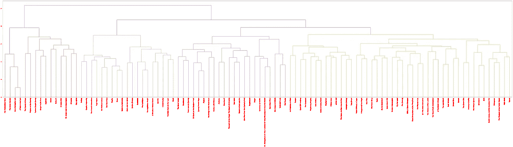

# 基于情节摘要使用 NLP 查找相似的电影

> 原文：<https://towardsdatascience.com/using-nlp-to-find-similar-movies-based-on-plot-summaries-b1481a2ba49b?source=collection_archive---------14----------------------->

人人都爱电影，对吧？本文将介绍 NLP 中的一些基本概念，并展示如何使用 scikit-learn 和 NLTK 库实现一个简单的模型来比较电影摘要之间的相似性。

这篇文章的内容基于这个 [DataCamp 项目](https://www.datacamp.com/projects/648)，并且这篇文章中使用的数据由来自维基百科和 IMDb 的 100 部电影的情节摘要组成。

# 准备数据

在处理文本数据时，我们需要对数据集进行一些特殊的调整，比如标记化、词干化和矢量化。我们将会看到这些步骤的作用。

## 标记化

给定一个字符序列，标记化是将它分解成具有有用和基本意义的基本语义单元的过程。这些碎片被称为代币。比如:句子“你今天过得怎么样？”可以拆分为“如何”、“s”、“你的”、“日”和“日”等标记。".每一个都有特定的含义。

## 堵塞物

想想这些句子:“我们需要更多的计算能力”和“我们需要计算机更强大”。两者意思都差不多，只是主词的写法不同(computational/计算机，power/强大)。我们可以将这些词的屈折形式简化为词根或基本形式，例如“comput”和“power”具有相同的意思。这样，词汇表的大小就减少了，使模型更容易在有限的数据集上进行训练。

## …向量化…

除了数字，计算机不能处理任何东西。为了实现对文本的任何操作，我们首先需要将文本转换成数字。这个过程被称为矢量化，顾名思义，它们被组织成向量。有多种向量化文本的方法。这里我们将使用单词袋和 TF-IDF。

*   **单词包(BoW)** :每个句子被表示为一个固定大小的向量，其大小等于词汇表中的单词数，每个位置表示一个特定的单词。这个位置的值是该特定单词在句子中出现的次数。
*   **词频-逆文档频率(TF-IDF)** :当我们需要比较两个文档之间的相似性时，为文档中的每个单词指定一个重要性度量是很有帮助的，这样我们就可以专注于特定的部分。TF-IDF 在于通过两个术语的乘积来发现这种“重要性”: TF 术语表示该单词在文档中的出现频率，而 IDF 术语表示文档中出现该特定单词的频率。基本思想是:如果这个词在很少的文档中出现很多，那么它一定很重要。如果在很多文档中出现很多，那一定不重要(比如“the”、“of”、“a”)。

# 代码

我们现在准备实施这些概念。首先，我们将导入一些库，如 **Pandas** 来操作我们的数据， **scikit-learn** 来创建我们的管道并训练我们的模型，以及 **NLTK** 用于自然语言的分词器、停用词和词干。

CSV 文件被加载到熊猫数据帧中。电影数据集有两列用于绘图:`wiki_plot`和`imdb_plot`。我们将它们连接成一个名为`plot`的新列，这样我们就可以有一个包含更多信息的单列。

```
import numpy as np
import pandas as pd
import re
import nltkmovies_df = pd.read_csv('datasets/movies.csv')movies_df['plot'] = movies_df['wiki_plot'].astype(str) + "\n" + movies_df['imdb_plot'].astype(str)
```

然后定义函数`normalize`，它将对数据集的每个文档的每个单词中的特殊字符进行分词、词干提取和过滤。

```
from nltk.stem.snowball import SnowballStemmer
stemmer = SnowballStemmer("english", ignore_stopwords=False)def normalize(X): 
  normalized = []
  for x in X:
    words = nltk.word_tokenize(x)
    normalized.append(' '.join([stemmer.stem(word) for word in words if re.match('[a-zA-Z]+', word)]))
  return normalized
```

被定义为具有三个步骤的管道:

*   应用`normalize`功能
*   使用单词包对所有文档进行矢量化处理(这一步还会删除停用词)
*   将单词包转换成 TF-IDF 矩阵

然后，我们在管道上调用`fit_transform`，并将所有电影的情节列作为参数传递。该方法将按顺序运行每个步骤，沿途转换数据并返回上一步的结果，这是一个(n_movies，n_words)矩阵，其中包含每个电影的相应 TF-IDF 向量。

```
from sklearn.pipeline import Pipeline
from sklearn.feature_extraction.text import CountVectorizer, TfidfTransformer
from sklearn.preprocessing import FunctionTransformer

pipe = Pipeline([
  ('normalize', FunctionTransformer(normalize, validate=False)),
  ('counter_vectorizer', CountVectorizer(
    max_df=0.8, max_features=200000,
    min_df=0.2, stop_words='english',
    ngram_range=(1,3)
  )),
  ('tfidf_transform', TfidfTransformer())
])

tfidf_matrix = pipe.fit_transform([x for x in movies_df['plot']])
```

由于句子被转换成向量，我们可以计算它们之间的余弦相似度，并表示这些向量之间的“距离”。使用`tfidf_matrix`计算余弦相似度，并返回一个具有维数(n_movies，n_movies)的矩阵，其中包含它们之间的相似度。

```
from sklearn.metrics.pairwise import cosine_similarity similarity_distance = 1 - cosine_similarity(tfidf_matrix)
```

使用相似性距离，可以创建一个树状图:

```
import matplotlib.pyplot as plt
from scipy.cluster.hierarchy import linkage, dendrogram

mergings = linkage(similarity_distance, method='complete')
dendrogram_ = dendrogram(mergings,
               labels=[x for x in movies_df["title"]],
               leaf_rotation=90,
               leaf_font_size=16,
              )

fig = plt.gcf()
_ = [lbl.set_color('r') for lbl in plt.gca().get_xmajorticklabels()]
fig.set_size_inches(108, 21)

plt.show()
```



Dendrogram of similar movies

我们甚至可以创建一个功能来搜索与另一部电影最相似的电影。这里我们使用一个 numpy 方法`argsoft`来寻找矩阵中第二相似的电影。这是因为一部电影的最小距离是和自己。这可以在主对角线的`similarity_distance`中看到(所有值都为零)。

```
def find_similar(title):
  index = movies_df[movies_df['title'] == title].index[0]
  vector = similarity_distance[index, :]
  most_similar = movies_df.iloc[np.argsort(vector)[1], 1]
  return most_similarprint(find_similar('Good Will Hunting')) # prints "The Graduate"
```

# 结论

为 NLP 中基本任务训练机器学习模型是简单的。首先，对数据进行令牌化和过滤，以便可以用称为令牌的单元来表示。我们还可以将单词表示为它们的词根形式，因此词汇量也可以减少，然后我们使用一种算法对数据集进行矢量化，这种算法取决于我们试图解决的问题。之后，我们可以训练一些机器学习模型，生成更多的文本，可视化我们的数据，等等。

下次见！