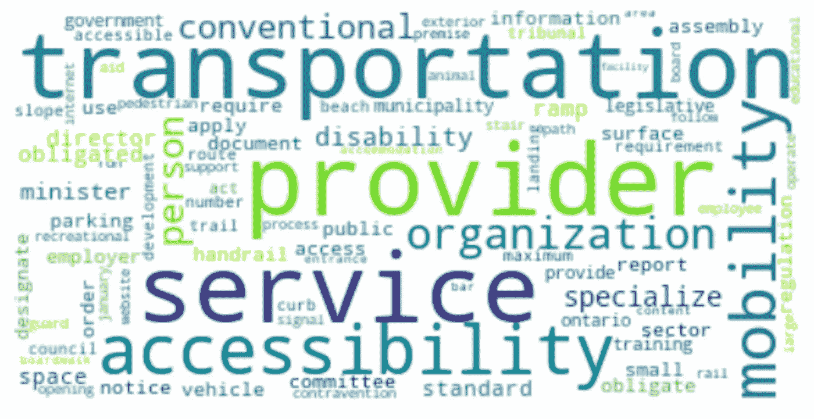
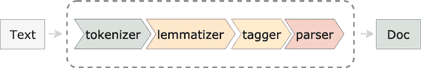
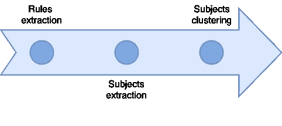
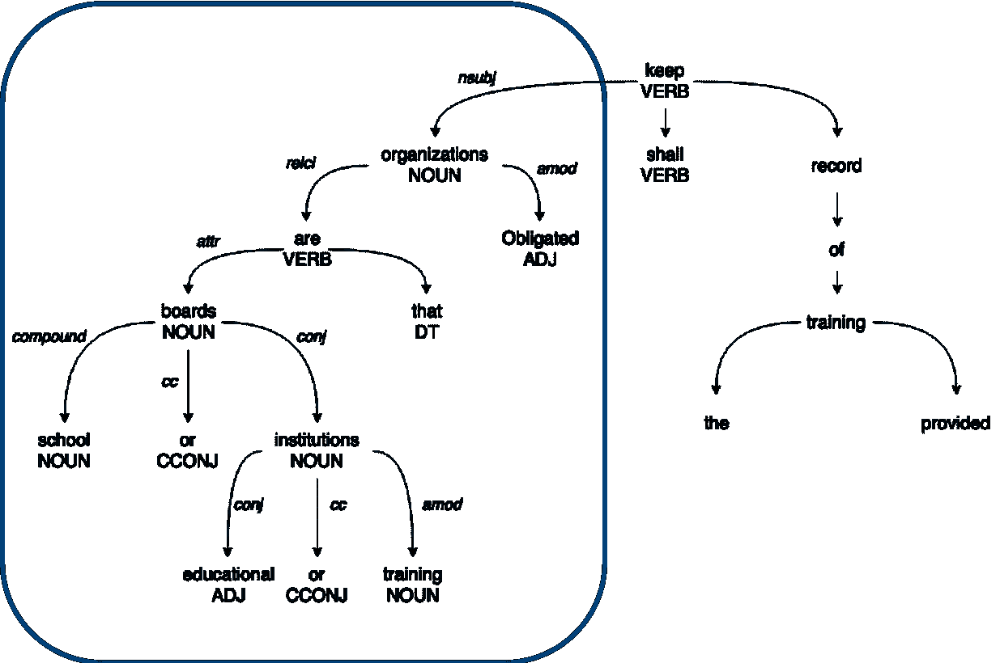
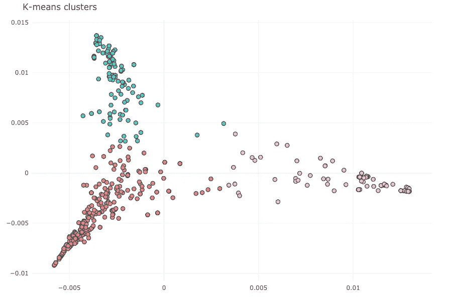
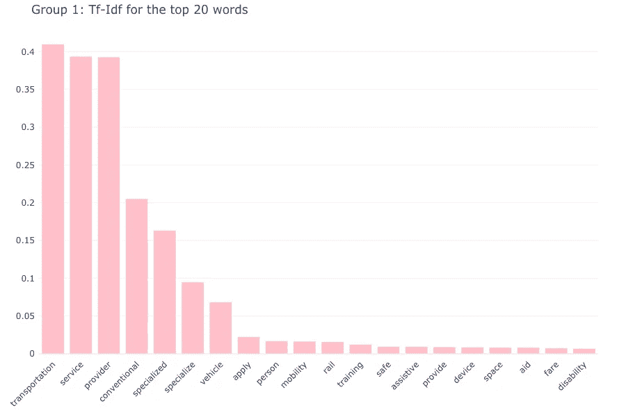
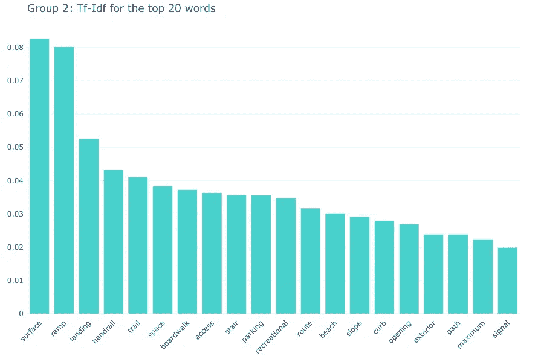
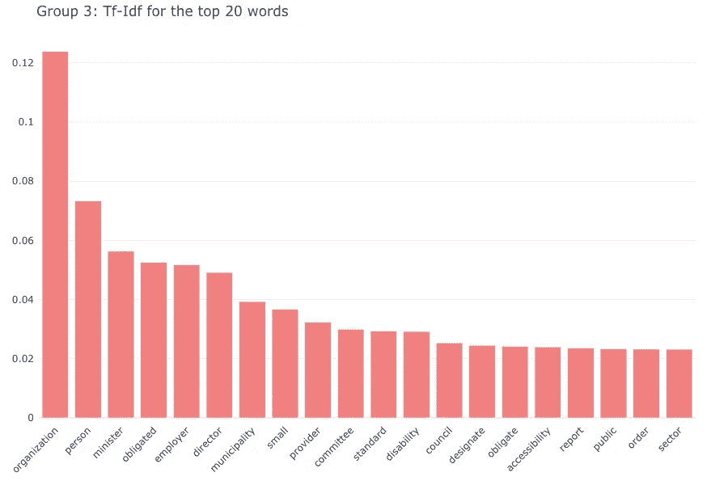

# 利用自然语言处理理解法律

> 原文：<https://towardsdatascience.com/using-nlp-to-understand-laws-95278624ae5?source=collection_archive---------13----------------------->

## *对《安大略省残疾人无障碍法》的非监督分析*

法律推理和决策过程严重依赖于文本中存储的信息。像尽职调查、合同审查和法律发现等传统上非常耗时的任务可以从 NLP 模型中受益并实现自动化，从而节省大量时间。但是 NLP 能被用来提高公众对法律的理解吗？

其想法是获得法律的抽象表示，这将更容易提取文本中定义的规则和义务，并理解哪些实体负责合规，突出各行业的相似模式，公共和私人责任之间的差异，甚至识别不清楚的部分。

# 挑战

处理法律法规给分析增加了一些难度:

*   由于使用了特定于法律文档的格式、缩写和引用，语言解析和标记化变得更加困难。
*   词汇表相对有限且非常专业，但解释对上下文高度敏感，并且没有包含语义分析的行业特定的预训练模型。
*   句子的句法通常是复杂的和非线性的，使得信息提取更加困难。

Extract from the Accessibility for Ontarians with Disabilities Act (AODA) — bullet points, references and general formatting break out-of-the=box tokenizations algorithms.

# 结构

为了克服这些挑战，在缺乏标记集的情况下，我们开发了一种方法，将基于规则的系统与标准 NLP 管道和无监督 ML 的元素相结合，以定义一个可以推广到各个领域的分析框架，而不是训练单个模型。

NLP 管道中与框架相关的模块有:

*   Tokenizer:将文档分割成称为记号的单元，同时丢弃不含信息的字符，如空格和标点。
*   [Lemmatizer](https://en.wikipedia.org/wiki/Lemmatisation) :减少屈折形式并将单词映射到它们的字典形式。
*   [词性标注器](https://en.wikipedia.org/wiki/Part-of-speech_tagging):将每个标记分配给一组具有相似语法属性(词性)的单词
*   [依存解析器](https://en.wikipedia.org/wiki/Dependency_grammar):通过识别*中心词*和修饰这些中心词的词来识别句子的语法结构，建立语法依存关系树。

source:[spacy](https://spacy.io/usage/processing-pipelines)

在此框架内，我们的目标是根据法规中定义的规则、负责合规的实体提取信息，并将规则组织到同类组中。

The three stages of the analysis

为了测试这种方法，我们根据[安大略省残疾人无障碍法案(AODA)](https://www.aoda.ca/) 制作了一份概念证明，该法案于 2005 年通过，定义了无障碍规则和要求，并规定了消除安大略省残疾人障碍的流程。

# 规则提取

我们的第一个目标是使扫描法律文本和提取定义规则的句子的过程自动化。在 AODA 的环境中，我们对负担特别感兴趣，即组织必须遵守的要求或义务。

为了解决没有标签集进行训练的问题，我们构建了一个轻量级的[本体](https://en.wikipedia.org/wiki/Ontology_(information_science))，并识别表达规则或义务的动词。这可以通过在 [WordNet](https://wordnet.princeton.edu/) 中查询表示义务的动词的同义词来实现，例如*应该*、*必须*、*责成*等。包含这些动词之一的句子被标为负担。

这是一个粗略的分类规则，但在这种情况下，句子遵循一个定义良好的模板，并且词汇有限，这对我们有利。在 AODA 上，它达到了 0.89 的整体准确率和 0.97 的负担召回率。

# 主题提取

下一步是确定负责遵守提取的负担的实体。这相当于识别句子的语法主语，其中主语是表示谁或什么执行动词动作的单词或短语。

依存解析器可以用来识别充当动词主语的标记。然而，当主题是一个短语时，仅靠解析器不足以识别主题。这里有一个例子:

> 作为学校董事会或教育或培训机构的负责组织应保留所提供培训的记录。

在这个句子中，主语是短语*义务组织，即学校董事会或教育或培训机构，*但是依存解析器只将*组织*标记为名词主语( *nsubj* )。

The subject of the sentence includes, in practice, all the dependencies of the nsubj “*organization”*

这里一个可能的解决方案，就是用依存树找到句子的主语，然后用[广度优先搜索](https://en.wikipedia.org/wiki/Breadth-first_search)导航树，找到所有和主语有父子关系的标记。这为我们提供了定义负责遵守上一步提取的规则的实体所涉及的所有单词。

# 主题聚类

一旦确定了负责的实体，我们希望将它们分成同类的组。这是通过将主题作为输入传递给 [k-means 聚类](https://en.wikipedia.org/wiki/K-means_clustering)来完成的，但是在我们继续进行聚类之前，需要将主题投影到一个向量空间中。这种预处理包括:

*   规范化:标记被词汇化，停用词被删除。
*   向量表示:单词嵌入([手套](https://en.wikipedia.org/wiki/GloVe_(machine_learning)))用于将标准化的单词投影到语义空间，然后对每个主题的单词向量进行平均，以便我们可以对每个主题进行单向量表示。
*   降维:[谱分解](https://en.wikipedia.org/wiki/Spectral_theorem)用于降维，只保留前两个分量。

最后，我们通过 k-means 运行主题向量并提取三个组。

# 结果

K-means 对数据进行分组，以便将每个数据点分配给具有最近平均值的聚类，这意味着聚类的平均值(它们的质心)可以用作这些组的原型。

我们正在寻找一种表述方式，使我们能够简化对我们提取的规则的解释和理解，我们特别感兴趣的是区分私人和公共责任，即落在私人企业身上的负担和政府机构的责任。

主题向量的 2d 图表明这些组被很好地分开，但是为了真正理解这些组代表什么，我们看一下质心的 [tf-idf](https://en.wikipedia.org/wiki/Tf%E2%80%93idf) 。这表示一个词/词在一个主题中的平均频率，用一个与该词在所有主题中的使用频率成比例的数量进行加权。

组#1 中质心的前 20 个单词的 tf-idf 分布非常向右倾斜，并且由单词*运输*、*服务*和*提供者*支配，因此这些负担的大约 90%来自运输标准部分就不足为奇了。这大约是我们提取的所有负担的 20%,很有意义，因为我们在谈论可访问性。

第二组中前 20 个单词的偏斜较小，分布更接近均匀。这一组中的大多数单词都是指得分最高的实物*、表面*和*坡道*，以及许多其他单词，如*步道*、*楼梯等。我们在第一阶段分析中提取的总负担中，有 25%属于这一组，其中 80%来自公共空间设计部分。同样，没有迹象表明公共或私营实体的要求之间存在区别。*

在最后一组中，tf-idf 的最高分遥遥领先于*组织*，而其他所有组织之间的差距要小得多。这些词是政府和非政府实体的混合指针——我们有*部长*和*市政*以及*雇主*和*个人*。这些负担占总负担的 50%，来自各种部门，主要指向管理、合规和标准，但不清楚公共义务和私人义务之间是否有区别。

# 摘要

我们开始时没有一个带标签的集合，但仍然能够建立一个通用的方法，允许我们自动提取规则，并以良好的准确性找到由立法定义的负担。通过提取句子的语法主题，我们能够识别受立法影响的实体，最终我们能够将规则组织成同类的组，这有助于我们理解这项立法的重点，甚至找到文本中模糊不清、需要澄清的部分。

这是走向法律抽象表述的第一步，至少在几个方面可以达到提高法律可解释性的目的。

一方面，它有助于提取信息并进行汇总，以便需要遵守规则和要求的任何人都可以更容易地了解这些规则和要求，无论他们是有法律部门的组织还是普通人。另一方面，它可以通过突出立法中模糊不清的部分来帮助立法者，这些部分可以重写或修改，以使其更加清晰易懂。

最终，这一框架可以成为一种工具，既有助于理解现有的立法，也有助于改进法律的编写方式，以便今后我们的立法者能够编写更容易理解和解释的法律，从而使每个人都更容易理解。