# 将对象检测用于复杂的图像分类场景第 3 部分:

> 原文：<https://towardsdatascience.com/using-object-detection-for-complex-image-classification-scenarios-part-3-770d3fc5e3f7?source=collection_archive---------8----------------------->

## 利用 MobileNet 和迁移学习进行策略识别

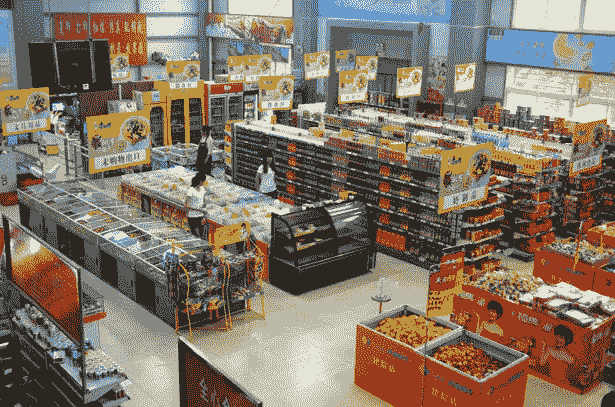

TLDR；本系列基于在下面的[现实生活代码故事](https://www.microsoft.com/developerblog/2017/07/31/using-object-detection-complex-image-classification-scenarios/)中检测复杂策略的工作。该系列的代码可以在[这里](https://github.com/aribornstein/cvworkshop)找到。

# 第 3 部分:使用 MobileNet 和迁移学习进行策略识别

在之前的教程中，我们概述了我们的[策略分类挑战](/using-object-detection-for-complex-image-classification-scenarios-part-1-779c87d1eecb)，并展示了我们如何使用[定制视觉认知服务](/using-object-detection-for-complex-image-classification-scenarios-part-2-54a3a7c60a63)来应对它。本教程介绍深度迁移学习作为一种手段，利用多个数据源来克服数据稀缺问题。

# 处理图像

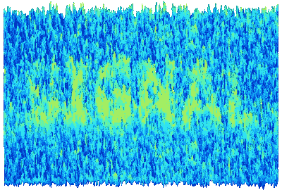

Our goal is to extract the differential signal from our training images

在我们尝试为我们的复杂策略构建分类器之前，让我们先来看看 [MNIST 数据集](http://yann.lecun.com/exdb/mnist/)，以便更好地理解关键的图像分类概念，如一个热编码、线性建模、多层感知、掩蔽和卷积，然后我们将把这些概念放在一起，并将其应用到我们自己的数据集。

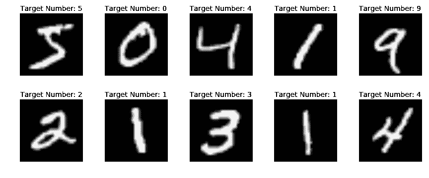

A sample of the images in the MNIST Dataset

为了在 MNIST 上训练一个分类模型，我们首先需要一种方法来**表示我们的图像和标签**。有许多方法可以将图像表示为张量(T12)、矩阵(T14)、向量(T15)或向量(T17)。

对于我们的第一个模型，我们将使用矢量表示。为了做到这一点，我们首先将图像展平成一个长矢量，就像解开一根布的线一样。


Unraveling a cloth to a thread [source](https://makeit-loveit.com/sew-shirring-smocking-elastic-thread)

当我们将此过程应用于下面的尺寸为 28 x 28 图像像素的“3”的图像时，它将产生长度为 784 像素的展平数组。

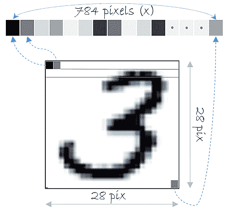

The MNIST image 28 x 28 image pixels, it will result in a flattened array of length 784.

现在，尽管我们很容易看到这个图像并知道它是一个“3”，但计算机天生不知道这一点，我们需要训练一个模型来学习如何识别图像中有一个“3”。要做到这一点，我们首先需要一种方法来表示上面的图片包含一个“3”的图像这一事实。

# 编码图像标签

为此，我们将我们的每个图像与一个 [1-hot](https://en.wikipedia.org/wiki/One-hot) 编码标签相关联，其中第一个索引对应于数字`0`，最后一个索引对应于数字`9`。


A one hot encoded vector representation of an MNIST 3

当我们训练一个模型时，我们使用这个值作为我们的目标。下面的 [Keras](http://test) 代码加载 MNIST 数据

```
**from** **keras.datasets** **import** mnist 
**from** **keras.utils** **import** np_utils output_dim = nb_classes = 10 
batch_size = 128 
nb_epoch = 5*# the data, shuffled and split between train and test sets* 
(x_train, y_train), (x_test, y_test) = mnist.load_data()input_dim = 784 *#28*28* 
X_train = x_train.reshape(60000, input_dim) 
X_test = x_test.reshape(10000, input_dim) 
X_train = X_train.astype('float32') 
X_test = X_test.astype('float32') 
X_train /= 255 
X_test /= 255Y_train = np_utils.to_categorical(y_train, nb_classes) 
Y_test = np_utils.to_categorical(y_test, nb_classes)
```

现在，我们已经处理了 MNIST 图像及其标签，让我们使用 Keras 训练我们的第一个图像分类模型。

# 线性模型

[逻辑回归](https://en.wikipedia.org/wiki/Logistic_regression) (LR)是一种基本的机器学习技术，它使用特征的线性加权组合，并生成不同类别的基于概率的预测。

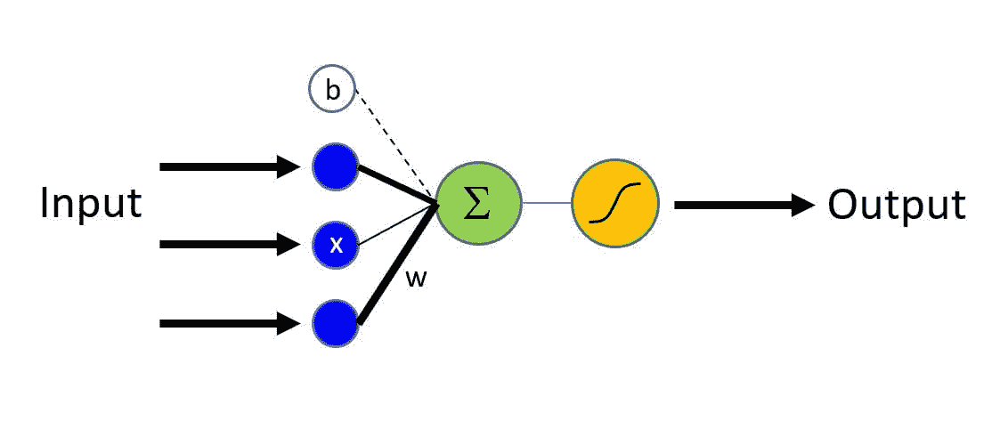

为了在 MNIST 上训练上面的 LR 模型，我们应用以下步骤:

1.  初始化 784 个值的随机权重向量
2.  取第一个 784 位 MNIST 训练图像向量，如上面的“3 ”,并将其乘以我们的权重向量。
3.  取我们相乘的结果，对 784 个值求和，直到得到一个数
4.  将数字传递到一个函数中，该函数取我们的总和，并将其拟合为 0-9 之间的分布，然后对输出进行热编码。对于第一个例子，这个数字很可能是不正确的，因为我们乘以了随机值
5.  将输出向量与图像标签向量进行比较，并使用*损失函数计算我们的预测有多接近。*损失函数的输出被称为*损失*。
6.  针对损失值应用诸如 SGD 的优化，以更新权重向量中的每个值。

[](https://medium.com/data-science-group-iitr/loss-functions-and-optimization-algorithms-demystified-bb92daff331c) [## 损失函数和优化算法。去神秘化。

### 深度学习模型的优化算法和损失函数的选择可以在生产过程中发挥重要作用

medium.com](https://medium.com/data-science-group-iitr/loss-functions-and-optimization-algorithms-demystified-bb92daff331c) 

然后，我们对 MNIST 训练集中的每个图像重复这个过程。对于每个图像，权重值被更新，以便它们可以更好地将我们的输入 MNIST 向量转换为与其标签相匹配的值。


The machine learning process [Source](https://www.improgrammer.net/wp-content/uploads/2018/10/Machine-learning-min.jpg)

当我们在称为 [**时期**](https://www.quora.com/What-is-epochs-in-machine-learning) 的训练集上完成上述步骤时。在第一个时期之后，值仍然可能是差的，但是在改组数据集并重复该过程几个更多的**时期**之后，线性模型学习线性权重，它们**收敛**在我们的数据的体面表示上。

下面的 Keras 代码显示了这个过程的结果。

```
**from** **keras.models** **import** Sequential 
**from** **keras.layers** **import** Dense, Activation model = Sequential() 
model.add(Dense(output_dim, input_dim=input_dim, activation='softmax')) 
model.compile(optimizer='sgd', loss='categorical_crossentropy', metrics=['accuracy']) 
history = model.fit(X_train, Y_train, batch_size=batch_size, nb_epoch=nb_epoch,verbose=1, validation_data=(X_test, Y_test)) 
score = model.evaluate(X_test, Y_test, verbose=0) 
print('Test Loss:', score[0]) 
print('Test accuracy:', score[1]) 
```

```
Train on 60000 samples, validate on 10000 samples
Epoch 1/5
60000/60000 [==============================] - 1s 16us/step - loss: 1.2899 - acc: 0.6898 - val_loss: 0.8185 - val_acc: 0.8255
Epoch 2/5
60000/60000 [==============================] - 1s 17us/step - loss: 0.7228 - acc: 0.8374 - val_loss: 0.6113 - val_acc: 0.8588
Epoch 3/5
60000/60000 [==============================] - 1s 11us/step - loss: 0.5912 - acc: 0.8575 - val_loss: 0.5281 - val_acc: 0.8724
Epoch 4/5
60000/60000 [==============================] - 1s 11us/step - loss: 0.5280 - acc: 0.8681 - val_loss: 0.4821 - val_acc: 0.8800
Epoch 5/5
60000/60000 [==============================] - 1s 13us/step - loss: 0.4897 - acc: 0.8749 - val_loss: 0.4514 - val_acc: 0.8858
Test Loss: 0.4514175675392151
Test accuracy: 0.8858
```

# 非线性模型(MLP)

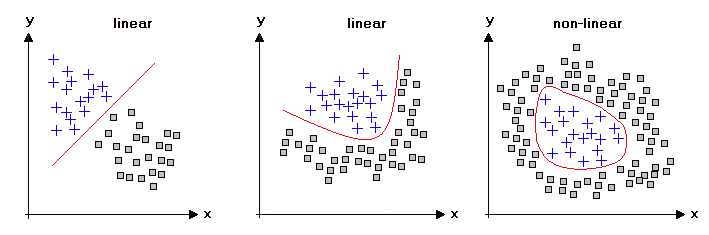

可以想象，仅仅基于一个输出增加和求和权重向量值是次优的，并且在某些情况下是无效的。

毕竟不是所有的数据都是线性的。

以垃圾邮件和非垃圾邮件这两个图像类别为例。无论我们如何更新我们的权重，没有线性权重，我们可以学习区分这些类。

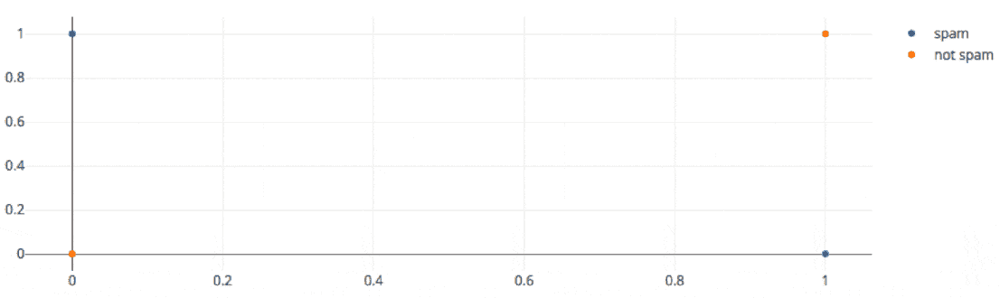

但是，如果我们有一种方法来组合多个线性模型以获得更好的表示能力呢？然后我们可以训练一个模型来区分这两种图像类别。

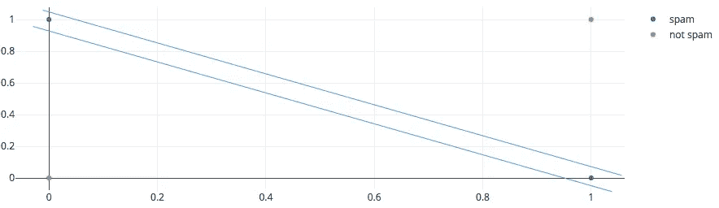

我们可以通过前馈神经网络来实现这一点，例如[多层感知](https://en.wikipedia.org/wiki/Multilayer_perceptron)。

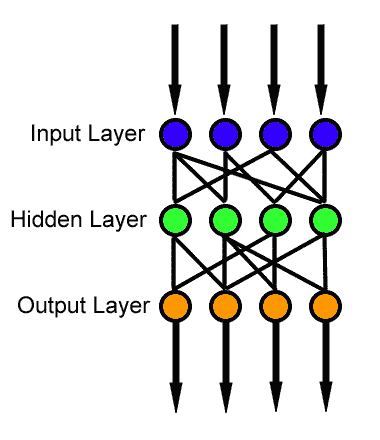

Multi Layer Perception

对于 MLPs 的工作，我们需要一个非线性的激活函数，如 RELU。为了简洁起见，我们将把它作为一个黑盒。更多关于这个主题的内容，请见下面的帖子。

[](https://medium.com/the-theory-of-everything/understanding-activation-functions-in-neural-networks-9491262884e0) [## 理解神经网络中的激活函数

### 最近，我的一个同事问了我几个类似“为什么我们有这么多激活功能？”，“为什么是…

medium.com](https://medium.com/the-theory-of-everything/understanding-activation-functions-in-neural-networks-9491262884e0) 

下面的 keras 代码显示了如何在 MNIST 上训练一个多层感知器，以获得比我们的线性模型更好的结果。

```
**from** **keras.models** **import** Sequential 
**from** **keras.layers** **import** Dense, Activation 
output_dim = nb_classes = 10 
batch_size = 128 
nb_epoch = 5model = Sequential() 
model.add(Dense(input_dim, input_dim=input_dim, activation='relu')) 
model.add(Dense(input_dim, input_dim=input_dim, activation='relu'))
model.add(Dense(output_dim, input_dim=input_dim, activation='softmax')) model.compile(optimizer='sgd', loss='categorical_crossentropy', metrics=['accuracy']) 
history = model.fit(X_train, Y_train, batch_size=batch_size, nb_epoch=nb_epoch,verbose=1, validation_data=(X_test, Y_test)) 
score = model.evaluate(X_test, Y_test, verbose=0) 
print('Test Loss:', score[0]) 
print('Test accuracy:', score[1])
```

```
Train on 60000 samples, validate on 10000 samples
Epoch 1/5
60000/60000 [==============================] - 9s 150us/step - loss: 1.0790 - acc: 0.7676 - val_loss: 0.5100 - val_acc: 0.8773
Epoch 2/5
60000/60000 [==============================] - 9s 143us/step - loss: 0.4401 - acc: 0.8866 - val_loss: 0.3650 - val_acc: 0.9011
Epoch 3/5
60000/60000 [==============================] - 12s 194us/step - loss: 0.3530 - acc: 0.9032 - val_loss: 0.3136 - val_acc: 0.9127
Epoch 4/5
60000/60000 [==============================] - 16s 272us/step - loss: 0.3129 - acc: 0.9124 - val_loss: 0.2868 - val_acc: 0.9188
Epoch 5/5
60000/60000 [==============================] - 12s 203us/step - loss: 0.2875 - acc: 0.9194 - val_loss: 0.2659 - val_acc: 0.9246
Test Loss: 0.2659078140795231
Test accuracy: 0.9246
```

# 当我们有很多非常大的图像时会发生什么？

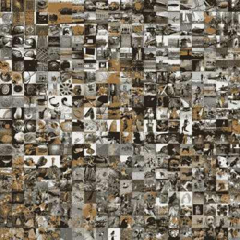

请注意，MLP 模型比我们简单的线性模型要精确得多，但也慢得多。当我们有大于 500Kb 到 1Mb 的图像时，将我们的图像作为一个序列进行处理的计算成本越来越高。此外，在我们的序列数据中检测复杂的自参照和层次模式也变得更具挑战性。

这种维数灾难是计算机视觉领域停滞不前的关键原因之一，直到 2012 年 AlexNet 的出现。

如果不是将我们的完整图像作为向量表示来传递，而是将我们的图像表示为矩阵(28×28 ),而是提取代表性特征来做出分类决策，会怎么样？这就是计算机视觉直到最近的工作方式。让我们通过尝试使用边缘作为模型的特征来更深入地了解传统的图像特征提取。

为了做到这一点，我们首先采取如下图所示的图像。

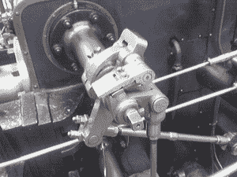

Src [Wikimedia Commons](https://upload.wikimedia.org/wikipedia/commons/thumb/f/f0/Valve_original_%281%29.PNG/300px-Valve_original_%281%29.PNG)

然后我们使用一个预定义的[图像遮罩](https://en.wikipedia.org/wiki/Mask_(computing)#Image_masks)，在这种情况下是一个用于提取边缘的[索贝尔矩阵](https://en.wikipedia.org/wiki/Sobel_operator)

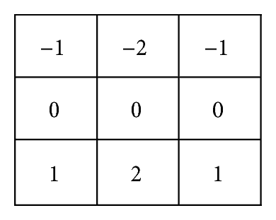

src [researchgate publication #275073476](https://www.researchgate.net/publication/275073476/figure/fig6/AS:340842360393754@1458274560103/Sobel-masks-a-horizontal-mask-and-b-vertical-mask.png)

我们应用索贝尔矩阵掩模像过滤器一样大步前进到我们的图像


当我们可视化生成的图像时，我们得到下面的边缘，这些边缘可以用作特征

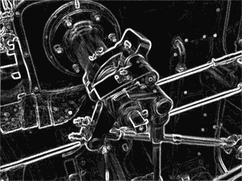

Src [Wikimedia Commons](https://upload.wikimedia.org/wikipedia/commons/thumb/d/d4/Valve_sobel_%283%29.PNG/300px-Valve_sobel_%283%29.PNG)

手工制作像 Sobel 面具这样的面具是一项艰苦而脆弱的工作，如果我们能学会面具会怎么样呢？这是卷积神经网络或 CNN 背后的关键见解。

# 卷积神经网络介绍(CNN 101)

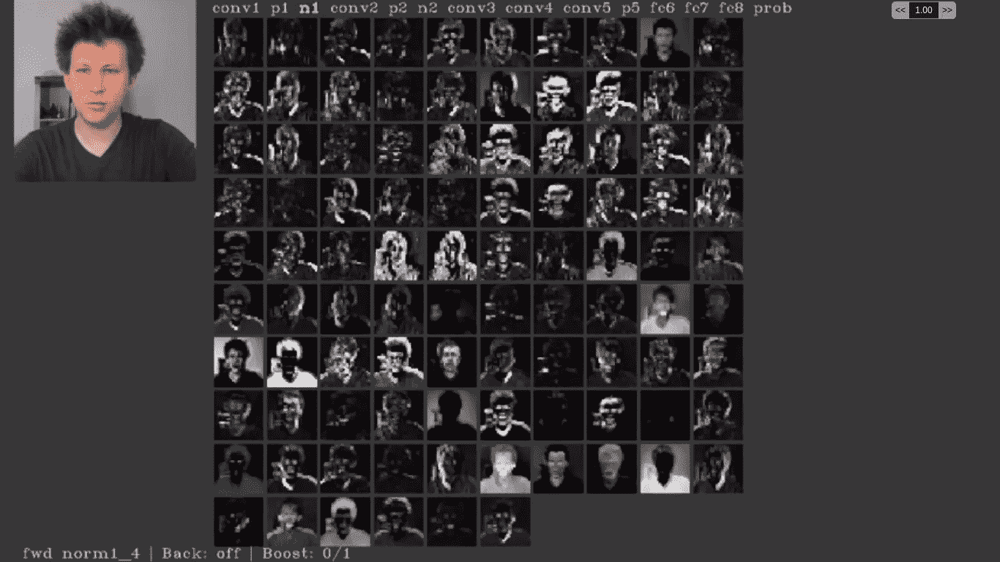

The result of applied different learned conventional filters on a source imageSource: [video](https://bit.ly/2PlxOFC)

CNN 是一个深度神经网络，由一系列层组成，其中一层的输出被馈送到下一层(有更复杂的架构，可以跳过具有 dropout 的层，我们现在将把这视为给定的)。通常，CNN 从卷积层和汇集层(向下采样)之间的交替开始，然后以分类部分的全连接层结束。

# 盘旋

卷积层是一组过滤器。每个滤波器由权重( **W** )矩阵和偏差( **b** )定义。

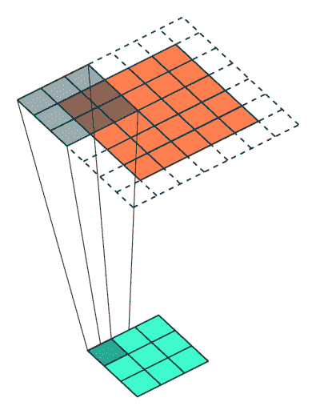

# 联营

一旦我们应用我们的面具，我们使用池来减少前一层的维度，这加快了网络。

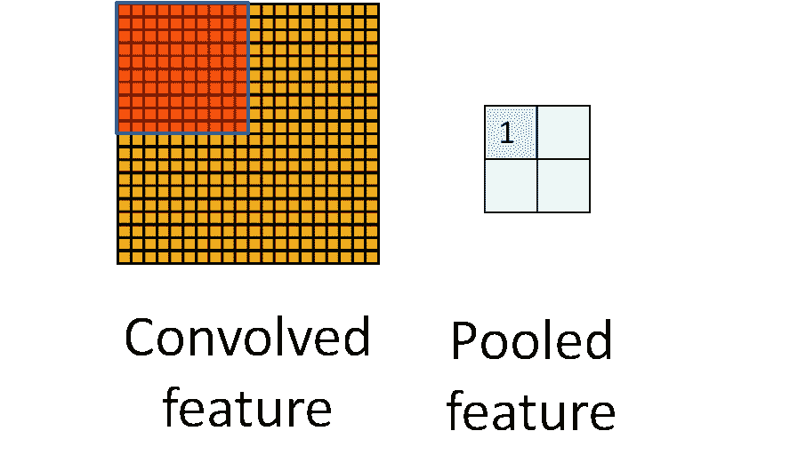

Source: stanford.io/2Td4J2d

有许多不同的汇集方法**最大**和**平均**汇集是最常见的。

这是一个步长为 2 的最大和平均池的示例:

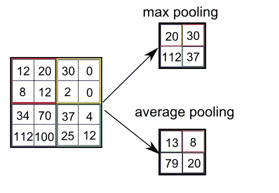

Various Pooling operations | Source: bit.ly/2K5zlP2

## 将所有这些放在一起:

在大多数 CNN 中，我们堆叠一组卷积层和池层，直到我们有一组代表性的特征，我们可以将其展平并用于类预测。

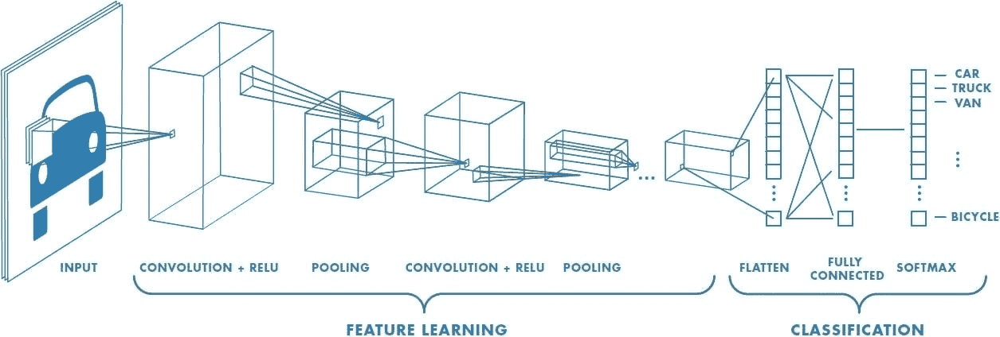

src [mathworks.com](https://www.mathworks.com/content/mathworks/www/en/discovery/convolutional-neural-network/jcr:content/mainParsys/image_copy.adapt.full.high.jpg/1508999490138.jpg)

下面的代码显示了如何从上面的 MNIST 图像训练 CNN。

```
**from** **keras.layers** **import** Dropout, Flatten
**from** **keras.layers** **import** Conv2D, MaxPooling2Dmodel = Sequential()
model.add(Conv2D(32, kernel_size=(3, 3),
                 activation='relu',
                 input_shape=input_shape))
model.add(Conv2D(64, (3, 3), activation='relu'))
model.add(MaxPooling2D(pool_size=(2, 2)))
model.add(Dropout(0.25))
model.add(Flatten())
model.add(Dense(128, activation='relu'))
model.add(Dropout(0.5))
model.add(Dense(nb_classes, activation='softmax'))model.compile(loss=keras.losses.categorical_crossentropy,
              optimizer=keras.optimizers.Adadelta(),
              metrics=['accuracy'])model.fit(x_train, y_train,
          batch_size=batch_size,
          epochs=nb_epoch,
          verbose=1,
          validation_data=(x_test, y_test))
score = model.evaluate(x_test, y_test, verbose=0)
print('Test loss:', score[0])
print('Test accuracy:', score[1]) 
```

```
Train on 60000 samples, validate on 10000 samples
Epoch 1/5
60000/60000 [==============================] - 177s 3ms/step - loss: 0.2638 - acc: 0.9204 - val_loss: 0.0662 - val_acc: 0.9790
Epoch 2/5
60000/60000 [==============================] - 173s 3ms/step - loss: 0.0882 - acc: 0.9732 - val_loss: 0.0404 - val_acc: 0.9865
Epoch 3/5
60000/60000 [==============================] - 166s 3ms/step - loss: 0.0651 - acc: 0.9806 - val_loss: 0.0350 - val_acc: 0.9883
Epoch 4/5
60000/60000 [==============================] - 163s 3ms/step - loss: 0.0549 - acc: 0.9836 - val_loss: 0.0334 - val_acc: 0.9887
Epoch 5/5
60000/60000 [==============================] - 159s 3ms/step - loss: 0.0472 - acc: 0.9859 - val_loss: 0.0322 - val_acc: 0.9899
Test loss: 0.03221080291894468
Test accuracy: 0.9899
```

在 MNIST 数据集中，我们有成千上万的训练样本，如果我们的策略任务中的数据更少会怎样？这就是我们可以使用**迁移学习**的地方。从头开始训练一个深度神经网络需要成千上万的图像，但训练一个已经学习了你正在适应的领域的特征的网络需要的图像要少得多。

# 第四部分迁移学习简介


# 什么是迁移学习？

迁移学习，使用预先训练好的模型，并使其适应我们自己的问题。在迁移学习中，我们利用在基本模型的培训过程中学习到的功能和概念。旧的和新的预测层的输入与基础模型相同，我们只是重复使用训练过的特征。然后，我们训练这个修改后的网络，或者只训练新预测层的新权重，或者训练整个网络的所有权重。

例如，当我们有一小组与现有训练模型处于相似领域的图像时，可以使用这种方法。在我们的例子中，这意味着使在 ImageNet 图像上训练的网络适应策略分类的任务。

# 预训练模型(MobileNet)

Aditya Ananthram 的 [repo](https://github.com/aditya9898/transfer-learning) 和 [post](/keras-transfer-learning-for-beginners-6c9b8b7143e) 是本节的灵感来源，我强烈建议您查看一下。

对于这个任务，我们选择使用预训练的 MobileNet 模型作为我们的基础模型。虽然有许多分类体系结构，但我们将使用 MobileNet，因为它在 CPU 上运行速度很快，并提供强大的结果。

```
**from** **keras.layers** **import** Dense,GlobalAveragePooling2D
**from** **keras.applications** **import** MobileNet
**from** **keras.preprocessing** **import** image
**from** **keras.applications.mobilenet** **import** preprocess_input
**from** **keras.preprocessing.image** **import** ImageDataGenerator
**from** **keras.models** **import** Model
**from** **keras.optimizers** **import** Adambase_model=MobileNet(weights='imagenet',include_top=**False**) *#imports the mobilenet model and discards the last 1000 neuron layer.*x=base_model.output
x=GlobalAveragePooling2D()(x)
x=Dense(1024,activation='relu')(x) *#we add dense layers so that the model can learn more complex functions and classify for better results.*
x=Dense(1024,activation='relu')(x) *#dense layer 2*
x=Dense(512,activation='relu')(x) *#dense layer 3*
preds=Dense(2,activation='softmax')(x) *#final layer with softmax activation*model=Model(inputs=base_model.input,outputs=preds)
```

```
**for** layer **in** model.layers[:20]:
    layer.trainable=**False**
**for** layer **in** model.layers[20:]:
    layer.trainable=**True** Downloading data from [https://github.com/fchollet/deep-learning-models/releases/download/v0.6/mobilenet_1_0_224_tf_no_top.h5](https://github.com/fchollet/deep-learning-models/releases/download/v0.6/mobilenet_1_0_224_tf_no_top.h5)
17227776/17225924 [==============================] - 13s 1us/step
```

## 让我们来看看这个 MobileNet 模型

```
model.summary()_________________________________________________________________
Layer (type)                 Output Shape              Param #   
=================================================================
input_1 (InputLayer)         (None, None, None, 3)     0         
_________________________________________________________________
conv1_pad (ZeroPadding2D)    (None, None, None, 3)     0         
_________________________________________________________________
conv1 (Conv2D)               (None, None, None, 32)    864       
_________________________________________________________________
conv1_bn (BatchNormalization (None, None, None, 32)    128       
_________________________________________________________________
conv1_relu (ReLU)            (None, None, None, 32)    0         
_________________________________________________________________
conv_dw_1 (DepthwiseConv2D)  (None, None, None, 32)    288       
_________________________________________________________________
conv_dw_1_bn (BatchNormaliza (None, None, None, 32)    128       
_________________________________________________________________
conv_dw_1_relu (ReLU)        (None, None, None, 32)    0         
_________________________________________________________________
conv_pw_1 (Conv2D)           (None, None, None, 64)    2048      
_________________________________________________________________
conv_pw_1_bn (BatchNormaliza (None, None, None, 64)    256       
_________________________________________________________________
conv_pw_1_relu (ReLU)        (None, None, None, 64)    0         
_________________________________________________________________
conv_pad_2 (ZeroPadding2D)   (None, None, None, 64)    0         
_________________________________________________________________
conv_dw_2 (DepthwiseConv2D)  (None, None, None, 64)    576       
_________________________________________________________________
conv_dw_2_bn (BatchNormaliza (None, None, None, 64)    256       
_________________________________________________________________
conv_dw_2_relu (ReLU)        (None, None, None, 64)    0         
_________________________________________________________________
conv_pw_2 (Conv2D)           (None, None, None, 128)   8192      
_________________________________________________________________
conv_pw_2_bn (BatchNormaliza (None, None, None, 128)   512       
_________________________________________________________________
conv_pw_2_relu (ReLU)        (None, None, None, 128)   0         
_________________________________________________________________
conv_dw_3 (DepthwiseConv2D)  (None, None, None, 128)   1152      
_________________________________________________________________
conv_dw_3_bn (BatchNormaliza (None, None, None, 128)   512       
_________________________________________________________________
conv_dw_3_relu (ReLU)        (None, None, None, 128)   0         
_________________________________________________________________
conv_pw_3 (Conv2D)           (None, None, None, 128)   16384     
_________________________________________________________________
conv_pw_3_bn (BatchNormaliza (None, None, None, 128)   512       
_________________________________________________________________
conv_pw_3_relu (ReLU)        (None, None, None, 128)   0         
_________________________________________________________________
conv_pad_4 (ZeroPadding2D)   (None, None, None, 128)   0         
_________________________________________________________________
conv_dw_4 (DepthwiseConv2D)  (None, None, None, 128)   1152      
_________________________________________________________________
conv_dw_4_bn (BatchNormaliza (None, None, None, 128)   512       
_________________________________________________________________
conv_dw_4_relu (ReLU)        (None, None, None, 128)   0         
_________________________________________________________________
conv_pw_4 (Conv2D)           (None, None, None, 256)   32768     
_________________________________________________________________
conv_pw_4_bn (BatchNormaliza (None, None, None, 256)   1024      
_________________________________________________________________
conv_pw_4_relu (ReLU)        (None, None, None, 256)   0         
_________________________________________________________________
conv_dw_5 (DepthwiseConv2D)  (None, None, None, 256)   2304      
_________________________________________________________________
conv_dw_5_bn (BatchNormaliza (None, None, None, 256)   1024      
_________________________________________________________________
conv_dw_5_relu (ReLU)        (None, None, None, 256)   0         
_________________________________________________________________
conv_pw_5 (Conv2D)           (None, None, None, 256)   65536     
_________________________________________________________________
conv_pw_5_bn (BatchNormaliza (None, None, None, 256)   1024      
_________________________________________________________________
conv_pw_5_relu (ReLU)        (None, None, None, 256)   0         
_________________________________________________________________
conv_pad_6 (ZeroPadding2D)   (None, None, None, 256)   0         
_________________________________________________________________
conv_dw_6 (DepthwiseConv2D)  (None, None, None, 256)   2304      
_________________________________________________________________
conv_dw_6_bn (BatchNormaliza (None, None, None, 256)   1024      
_________________________________________________________________
conv_dw_6_relu (ReLU)        (None, None, None, 256)   0         
_________________________________________________________________
conv_pw_6 (Conv2D)           (None, None, None, 512)   131072    
_________________________________________________________________
conv_pw_6_bn (BatchNormaliza (None, None, None, 512)   2048      
_________________________________________________________________
conv_pw_6_relu (ReLU)        (None, None, None, 512)   0         
_________________________________________________________________
conv_dw_7 (DepthwiseConv2D)  (None, None, None, 512)   4608      
_________________________________________________________________
conv_dw_7_bn (BatchNormaliza (None, None, None, 512)   2048      
_________________________________________________________________
conv_dw_7_relu (ReLU)        (None, None, None, 512)   0         
_________________________________________________________________
conv_pw_7 (Conv2D)           (None, None, None, 512)   262144    
_________________________________________________________________
conv_pw_7_bn (BatchNormaliza (None, None, None, 512)   2048      
_________________________________________________________________
conv_pw_7_relu (ReLU)        (None, None, None, 512)   0         
_________________________________________________________________
conv_dw_8 (DepthwiseConv2D)  (None, None, None, 512)   4608      
_________________________________________________________________
conv_dw_8_bn (BatchNormaliza (None, None, None, 512)   2048      
_________________________________________________________________
conv_dw_8_relu (ReLU)        (None, None, None, 512)   0         
_________________________________________________________________
conv_pw_8 (Conv2D)           (None, None, None, 512)   262144    
_________________________________________________________________
conv_pw_8_bn (BatchNormaliza (None, None, None, 512)   2048      
_________________________________________________________________
conv_pw_8_relu (ReLU)        (None, None, None, 512)   0         
_________________________________________________________________
conv_dw_9 (DepthwiseConv2D)  (None, None, None, 512)   4608      
_________________________________________________________________
conv_dw_9_bn (BatchNormaliza (None, None, None, 512)   2048      
_________________________________________________________________
conv_dw_9_relu (ReLU)        (None, None, None, 512)   0         
_________________________________________________________________
conv_pw_9 (Conv2D)           (None, None, None, 512)   262144    
_________________________________________________________________
conv_pw_9_bn (BatchNormaliza (None, None, None, 512)   2048      
_________________________________________________________________
conv_pw_9_relu (ReLU)        (None, None, None, 512)   0         
_________________________________________________________________
conv_dw_10 (DepthwiseConv2D) (None, None, None, 512)   4608      
_________________________________________________________________
conv_dw_10_bn (BatchNormaliz (None, None, None, 512)   2048      
_________________________________________________________________
conv_dw_10_relu (ReLU)       (None, None, None, 512)   0         
_________________________________________________________________
conv_pw_10 (Conv2D)          (None, None, None, 512)   262144    
_________________________________________________________________
conv_pw_10_bn (BatchNormaliz (None, None, None, 512)   2048      
_________________________________________________________________
conv_pw_10_relu (ReLU)       (None, None, None, 512)   0         
_________________________________________________________________
conv_dw_11 (DepthwiseConv2D) (None, None, None, 512)   4608      
_________________________________________________________________
conv_dw_11_bn (BatchNormaliz (None, None, None, 512)   2048      
_________________________________________________________________
conv_dw_11_relu (ReLU)       (None, None, None, 512)   0         
_________________________________________________________________
conv_pw_11 (Conv2D)          (None, None, None, 512)   262144    
_________________________________________________________________
conv_pw_11_bn (BatchNormaliz (None, None, None, 512)   2048      
_________________________________________________________________
conv_pw_11_relu (ReLU)       (None, None, None, 512)   0         
_________________________________________________________________
conv_pad_12 (ZeroPadding2D)  (None, None, None, 512)   0         
_________________________________________________________________
conv_dw_12 (DepthwiseConv2D) (None, None, None, 512)   4608      
_________________________________________________________________
conv_dw_12_bn (BatchNormaliz (None, None, None, 512)   2048      
_________________________________________________________________
conv_dw_12_relu (ReLU)       (None, None, None, 512)   0         
_________________________________________________________________
conv_pw_12 (Conv2D)          (None, None, None, 1024)  524288    
_________________________________________________________________
conv_pw_12_bn (BatchNormaliz (None, None, None, 1024)  4096      
_________________________________________________________________
conv_pw_12_relu (ReLU)       (None, None, None, 1024)  0         
_________________________________________________________________
conv_dw_13 (DepthwiseConv2D) (None, None, None, 1024)  9216      
_________________________________________________________________
conv_dw_13_bn (BatchNormaliz (None, None, None, 1024)  4096      
_________________________________________________________________
conv_dw_13_relu (ReLU)       (None, None, None, 1024)  0         
_________________________________________________________________
conv_pw_13 (Conv2D)          (None, None, None, 1024)  1048576   
_________________________________________________________________
conv_pw_13_bn (BatchNormaliz (None, None, None, 1024)  4096      
_________________________________________________________________
conv_pw_13_relu (ReLU)       (None, None, None, 1024)  0         
_________________________________________________________________
global_average_pooling2d_1 ( (None, 1024)              0         
_________________________________________________________________
dense_7 (Dense)              (None, 1024)              1049600   
_________________________________________________________________
dense_8 (Dense)              (None, 1024)              1049600   
_________________________________________________________________
dense_9 (Dense)              (None, 512)               524800    
_________________________________________________________________
dense_10 (Dense)             (None, 2)                 1026      
=================================================================
Total params: 5,853,890
Trainable params: 5,817,986
Non-trainable params: 35,904
_________________________________________________________________
```

# 让我们处理我们的数据

下面的代码展示了如何使用 Keras 在我们的定制策略上训练一个定制的 MobileNet 模型。

## 训练数据/测试数据

```
train_datagen=ImageDataGenerator(preprocessing_function=preprocess_input) *#included in our dependencies*train_generator=train_datagen.flow_from_directory(
'/data/dataset/Beverages/Train/',
target_size=(224,224),
color_mode='rgb',
batch_size=32,
class_mode='categorical',
shuffle=**True**)test_datagen = ImageDataGenerator(preprocessing_function=preprocess_input)
test_generator = test_datagen.flow_from_directory(
    directory=r"/data/dataset/Beverages/Test/",
    target_size=(224, 224),
    color_mode="rgb",
    batch_size=1,
    class_mode='categorical',
    shuffle=**False**,
    seed=42
)
```

```
Found 180 images belonging to 2 classes.Found 60 images belonging to 2 classes.
```

## 查看图像数据样本

```
i = 0
**for** data **in** test_generator:
    **if** i > 3: **break** 
    **else**: i+=1
    img, cls = data
    print(np.argmax(cls))
    plt.imshow(img[0])
    plt.show()
```

```
Clipping input data to the valid range for imshow with RGB data ([0..1] for floats or [0..255] for integers).0
```

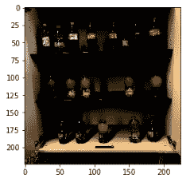

```
Clipping input data to the valid range for imshow with RGB data ([0..1] for floats or [0..255] for integers).0
```

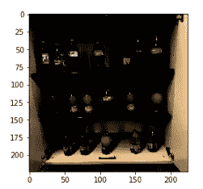

```
Clipping input data to the valid range for imshow with RGB data ([0..1] for floats or [0..255] for integers).0
```

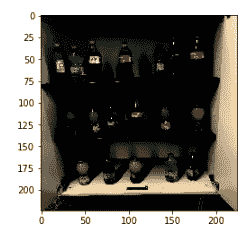

```
Clipping input data to the valid range for imshow with RGB data ([0..1] for floats or [0..255] for integers).0
```

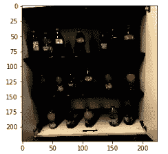

# 火车模型

```
model.compile(optimizer='Adam',loss='categorical_crossentropy',metrics=['accuracy'])
*# Adam optimizer*
*# loss function will be categorical cross entropy*
*# evaluation metric will be accuracy*step_size_train=train_generator.n//train_generator.batch_size
model.fit_generator(generator=train_generator,
                   steps_per_epoch=step_size_train,
                   epochs=5)
```

```
Epoch 1/5
5/5 [==============================] - 96s 19s/step - loss: 0.8017 - acc: 0.7313
Epoch 2/5
5/5 [==============================] - 77s 15s/step - loss: 0.0101 - acc: 1.0000
Epoch 3/5
5/5 [==============================] - 79s 16s/step - loss: 0.0289 - acc: 0.9937
Epoch 4/5
5/5 [==============================] - 111s 22s/step - loss: 0.0023 - acc: 1.0000
Epoch 5/5
5/5 [==============================] - 87s 17s/step - loss: 0.0025 - acc: 1.0000
```

# 基准模型

正如我们在下面看到的，MobileNet 是一个学习和展示我们玩具政策的强大模型。

```
**from** **utils** **import** classification_report
y_true = np.concatenate([np.argmax(test_generator[i][1], axis=1) **for** i **in** range(test_generator.n)])
y_pred =  np.argmax(model.predict_generator(test_generator, steps=test_generator.n), axis=1)
classification_report(y_true, y_pred)
```

```
precision    recall  f1-score   support 0       1.00      1.00      1.00        30
           1       1.00      1.00      1.00        30 micro avg       1.00      1.00      1.00        60
   macro avg       1.00      1.00      1.00        60
weighted avg       1.00      1.00      1.00        60Confusion matrix, without normalization
[[30  0]
 [ 0 30]]
Normalized confusion matrix
[[1\. 0.]
 [0\. 1.]]
```

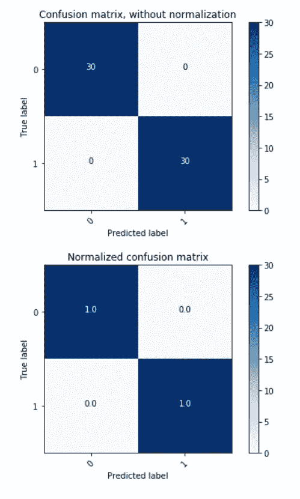

然而，如果我们的政策更复杂，我们可能很难以这种方式建模。在下一篇文章中，我们将深入探讨如何在复杂的图像分类场景中使用对象检测。

# 资源

[](https://medium.com/microsoftazure/the-pythic-coders-recommended-content-for-getting-started-with-machine-learning-on-azure-fcd1c5a8dbb4) [## Pythic Coder 推荐的 Azure 机器学习入门内容

### Tldr 由于 DevOps 资源上的帖子很受欢迎，而且很难找到文档，所以我…

medium.com](https://medium.com/microsoftazure/the-pythic-coders-recommended-content-for-getting-started-with-machine-learning-on-azure-fcd1c5a8dbb4) [](https://github.com/aribornstein) [## aribornstein —概述

### @ pythiccoder。aribornstein 有 68 个存储库。在 GitHub 上关注他们的代码。

github.com](https://github.com/aribornstein) [](https://azure.microsoft.com/services/cognitive-services/?v=18.44a&v=18.44a&v=18.44a&WT.mc_id=medium-blog-abornst) [## 认知服务|微软 Azure

### 微软 Azure Stack 是 Azure 的扩展——将云计算的灵活性和创新性带到您的…

azure.microsoft.com](https://azure.microsoft.com/services/cognitive-services/?v=18.44a&v=18.44a&v=18.44a&WT.mc_id=medium-blog-abornst) [](/a-big-of-tricks-for-image-classification-fec41eb28e01) [## 图像分类的一大妙招

### 来拿你的深度学习好东西吧

towardsdatascience.com](/a-big-of-tricks-for-image-classification-fec41eb28e01) [](/https-medium-com-rishabh-grg-the-ultimate-nanobook-to-understand-deep-learning-based-image-classifier-33f43fea8327) [## 理解基于深度学习的图像分类器的终极纳米书

### 在当今世界，我们广泛使用图像。不是吗？你有没有想过脸书是如何自动…

towardsdatascience.com](/https-medium-com-rishabh-grg-the-ultimate-nanobook-to-understand-deep-learning-based-image-classifier-33f43fea8327) 

# 下一篇文章

在下一篇文章[中，我们将深入探讨如何将物体检测用于复杂的图像分类场景](/using-object-detection-for-complex-image-classification-scenarios-part-4-3e5da160d272)。未来的职位将涵盖。

*   使用 Azure ML 服务在云上训练和计算机视觉模型
*   使用 Azure 机器学习在远程集群上训练计算机视觉模型

如果您有任何问题、评论或希望我讨论的话题，请随时在 [Twitter](https://twitter.com/pythiccoder) 上关注我。如果您认为我错过了某个里程碑，请告诉我。

## 关于作者

[**亚伦(阿里)**](https://www.linkedin.com/in/aaron-ari-bornstein-22aa7a77/) 是一个狂热的人工智能爱好者，对历史充满热情，致力于新技术和计算医学。作为微软云开发倡导团队的开源工程师，他与以色列高科技社区合作，用改变游戏规则的技术解决现实世界的问题，然后将这些技术记录在案、开源并与世界其他地方共享。