# 将对象检测用于复杂的图像分类场景第 4 部分:

> 原文：<https://towardsdatascience.com/using-object-detection-for-complex-image-classification-scenarios-part-4-3e5da160d272?source=collection_archive---------14----------------------->

## 使用 Keras RetinaNet 进行策略检测


TLDR；本系列基于在下面的[现实生活代码故事](https://www.microsoft.com/developerblog/2017/07/31/using-object-detection-complex-image-classification-scenarios/)中检测复杂策略的工作。该系列的代码可以在[这里](https://github.com/aribornstein/cvworkshop)找到。

# 对象检测简介

[到目前为止，我们一直在对原始图像进行分类](/using-object-detection-for-complex-image-classification-scenarios-part-3-770d3fc5e3f7)如果我们可以使用这些图像来生成有针对性的特征，以帮助我们应对高级分类挑战，那会怎么样。

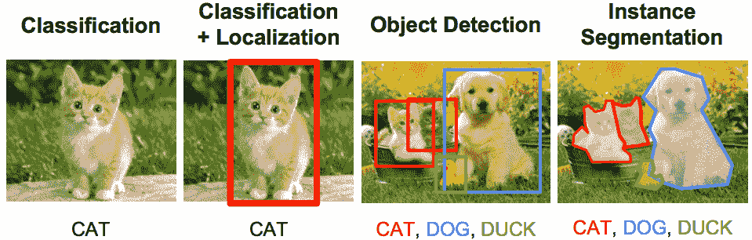

We will use object detection to extract features for more complex classification [Src](https://mathematica.stackexchange.com/questions/141598/object-detection-and-localization-using-neural-network)

# 端到端对象检测管道:

对象检测需要大量带注释的数据。传统上，这是一项非常手动密集型的任务，理想的管道将标记与模型训练相结合，以实现主动学习。

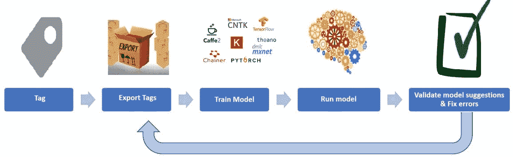

# 视觉对象标记工具(VoTT)

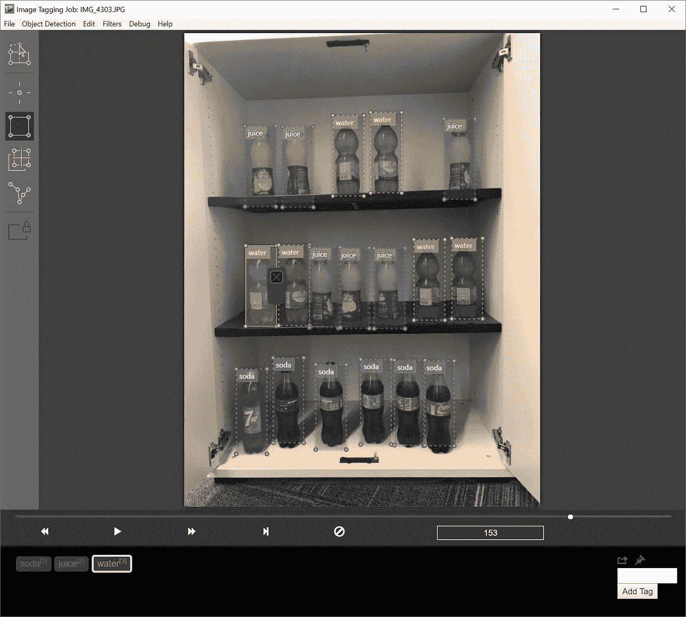

视觉对象标记工具 VoTT 为从视频和图像资产生成数据集和验证对象检测模型提供端到端支持。

VoTT 支持以下**功能**:

*   标记和注释图像目录或独立视频的能力。
*   使用 [Camshift 跟踪算法](http://opencv.jp/opencv-1.0.0_org/docs/papers/camshift.pdf)对视频中的对象进行计算机辅助标记和跟踪。
*   将标签和资源导出为 Tensorflow (PascalVOC)或 YOLO 格式，用于训练对象检测模型。
*   在新视频上运行和验证经过训练的对象检测模型，以利用 docker 端点生成更强的模型。

# 区域提议目标检测算法的基本进展

以下部分将简要强调将用于该任务的区域提议对象检测的进展。对于更深入的教程，我强烈推荐乔纳森·惠的《中级系列》

[](https://medium.com/@jonathan_hui/object-detection-series-24d03a12f904) [## 物体探测系列

### 概观

medium.com](https://medium.com/@jonathan_hui/object-detection-series-24d03a12f904) 

# 滑动窗接近和后退

本系列的最后两篇文章是关于图像分类的。将图像分类器转换成对象检测器的最简单方法是在给定图像上使用一系列不同维度的滑动窗口。

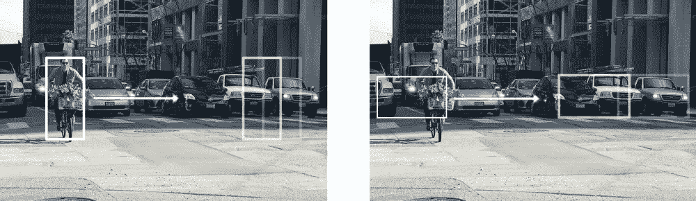

[Sliding Window Source](https://medium.com/@jonathan_hui/object-detection-series-24d03a12f904)

如果我们认为在给定的窗口中有一个我们正在寻找的对象，那么我们可以返回被捕获对象的尺寸。

# 地区有线电视新闻网

不幸的是，滑动窗口方法虽然简单，但也有一些缺点。评估多个窗口大小很慢，而且不精确，因为我们事先不知道图像中每个对象的正确窗口大小。

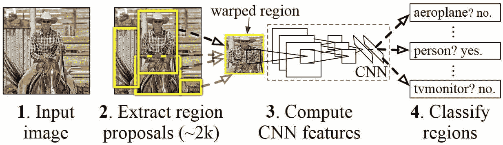

如果我们可以只对可能包含对象的感兴趣区域执行分类，而不是在整个图像上使用滑动窗口，会怎么样？这是区域提议对象检测器背后的主要直觉。传统上，我们使用一种叫做选择性搜索的算法来提出感兴趣的区域。

# 快速 RCNN

虽然传统的 RCNN 方法在准确性方面工作良好，但是它的计算成本非常高，因为必须对每个感兴趣的区域评估神经网络。

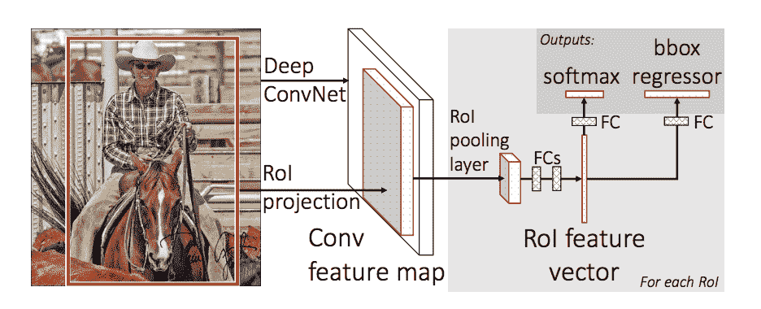

快速 R-CNN 通过对每个图像只评估网络的大部分(具体来说:卷积层)一次来解决这个缺点。根据作者的说法，这导致测试期间的速度提高了 213 倍，训练期间的速度提高了 9 倍，而没有损失准确性。

# 更快的 RCNN

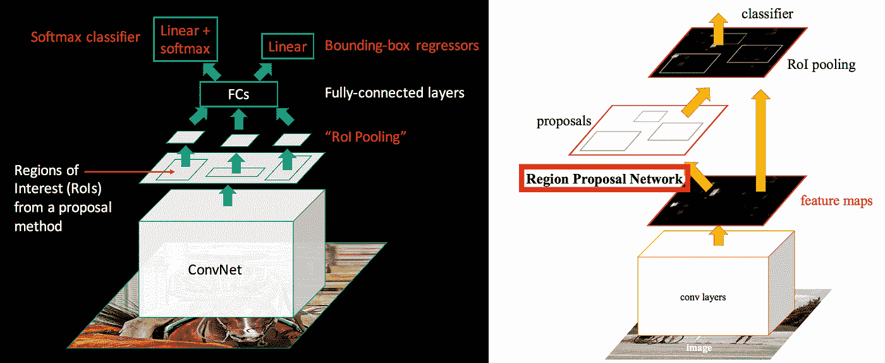

Faster RCNN architecture [src](https://jhui.github.io/assets/rcnn/st8.png)

更快的 R-CNN 建立在以前的工作基础上，使用深度卷积网络有效地对对象提议进行分类。与以前的工作相比，更快的 R-CNN 采用了一个区域建议网络，它不需要对候选区域建议进行选择性搜索。

# RetinaNet

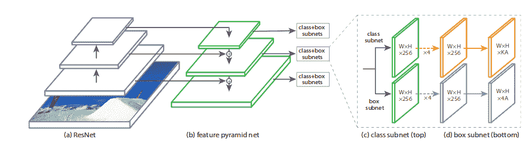

RetinaNet 是一个对象检测器，它建立在更快的 RCNN 的直觉基础上，提供了特征金字塔和优化的焦损失，实现了比 Faster RCNN 更快的评估时间，并提供了[焦损失](https://arxiv.org/abs/1708.02002)，有助于防止过度拟合背景类。在撰写本文时，RetinaNet 是当前最先进的区域求婚网络。

更多信息请参见:

[](https://medium.com/@14prakash/the-intuition-behind-retinanet-eb636755607d) [## RetinaNet 背后的直觉

### 这篇博文的最终目的是让读者直观地了解 RetinaNet 的深层工作原理。

medium.com](https://medium.com/@14prakash/the-intuition-behind-retinanet-eb636755607d) 

# 让我们用视网膜网络来解决我们的挑战

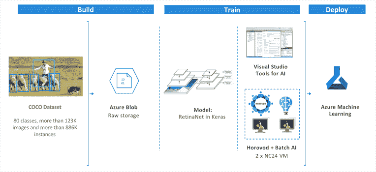

VoTT 可用于生成直接数据集，这些数据集可与 Azure 机器学习一起使用，以训练自定义对象检测模型。

[](https://docs.microsoft.com/en-us/azure/machine-learning/service/quickstart-create-workspace-with-python?WT.mc_id=blog-medium-abornst) [## 快速入门:Python - Azure 机器学习服务入门

### Python 中的 Azure 机器学习服务入门。使用 Python SDK 创建一个工作空间，它是…

docs.microsoft.com](https://docs.microsoft.com/en-us/azure/machine-learning/service/quickstart-create-workspace-with-python?WT.mc_id=blog-medium-abornst) 

然而，由于培训 RetinaNet 需要访问 N 系列 GPU 机器，出于时间的考虑，并确保本教程仅针对 CPU，我冒昧地对模型进行了预培训。在下一篇文章中，我们将讨论如何用 [Azure 机器学习服务](https://docs.microsoft.com/azure/machine-learning/service/quickstart-create-workspace-with-python?WT.mc_id=cvworkshop-github-abornst)来训练这些模型。

# 让我们看看如何使用我们定制的预训练对象检测模型

```
*# import keras_retinanet*
**import** **keras**
**from** **keras_retinanet** **import** models
**from** **keras_retinanet.utils.image** **import** read_image_bgr, preprocess_image, resize_image
**from** **keras_retinanet.utils.visualization** **import** draw_box, draw_caption
**from** **keras_retinanet.utils.colors** **import** label_color*# load image*
**def** evaluate_single_image(model, img_path):
    image = read_image_bgr(img_path) *# preprocess image for network*
    image = preprocess_image(image)
    image, scale = resize_image(image) *# process image*
    start = time.time()
    boxes, scores, labels = model.predict_on_batch(np.expand_dims(image, axis=0))
    print("processing time: ", time.time() - start) *# correct for image scale*
    boxes /= scale

    **return** (boxes[0], scores[0], labels[0])**def** visualize_detection(img_path, model_results):
    image = read_image_bgr(img_path)
    boxes, scores, labels = model_results *# visualize detections*
    draw = image.copy()
    draw = cv2.cvtColor(draw, cv2.COLOR_BGR2RGB) **for** box, score, label **in** zip(boxes, scores, labels):
        *# scores are sorted so we can break*
        **if** score < 0.5:
            **break** color = label_color(label)
        b = box.astype(int)
        draw_box(draw, b, color=color) caption = "**{}** **{:.3f}**".format(labels_to_names[label], score)
        draw_caption(draw, b, caption) plt.figure(figsize=(15, 15))
    plt.axis('off')
    plt.imshow(draw)
    plt.show()*# load retinanet model*
soda_model = models.load_model('models/retina_net_soda.h5', backbone_name='resnet50')
labels_to_names = {0: 'shelf1', 1: 'shelf2', 2: 'shelf3'}valid_example_path = 'dataset/Beverages/Test/Valid/IMG_4187.JPG'
detection_results = evaluate_single_image(soda_model, valid_example_path)
visualize_detection(valid_example_path, detection_results)
```

```
processing time:  10.065604209899902
```

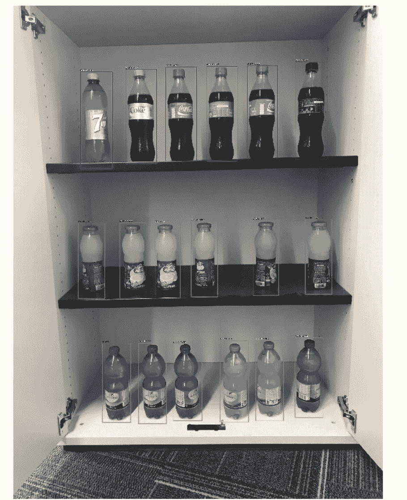

挑战:你能想出我们可以用这些盒子来表明政策无效的方法吗？

# 用瓶子启发式预测

现在，我们有了一个用于寻找瓶子的对象检测模型，让我们开发一个启发式方法来确定货架是否正确存储，并在两个样本图像上测试它。

我们的试探法将按如下方式工作:

*   我们将找到每个架类的最小 y1 和最大 y2 的用法
*   我们将确认汽水架在果汁架之上，果汁架在水架之上
*   对于每个最大值，我们将确保在它们之间没有其他类

```
**def** predict_bottles(model_results):
    bounds = {}
    beverages = {0: [], 1: [], 2: []}
    boxes, scores, labels = model_results **for** box, score, label **in** zip(boxes, scores, labels):
        *# scores are sorted so we can break*
        **if** score < 0.5:
            **break**
        beverages[label].append(box)

    *# Find the use the min y1 and max y2 of each of the tag classes*
    **for** bev **in** beverages:
        **if** len(beverages[bev]) == 0:
            **return** **False**
        y1 = min(beverages[bev], key=**lambda** b: b[1])[1]
        y2 = max(beverages[bev], key=**lambda** b: b[3])[3]
        bounds[bev] = {"y1":y1, "y2":y2} 
    *# Confirm that soda is above juice which is above water*
    **if** (bounds[0]["y1"] < bounds[1]["y1"]) **and** (bounds[1]["y1"] < bounds[2]["y1"]):
        *# For each of the max's we will ensure that there are no other clases that are in between them*
        **for** b **in** bounds.keys():
            **for** bev_type **in** (set(bounds.keys()) - set([b])):
                **for** bev **in** beverages[bev_type]:
                    **if** bev[1] > bounds[b]["y1"] **and** bev[3] < bounds[b]["y2"]:
                        **return** **False** 
        **return** **True**
    **else**:
        **return** **False**visualize_detection(valid_example_path, detection_results)
predict_bottles(detection_results)
```


```
Trueinvalid_example_path = 'dataset/Beverages/Test/Invalid/IMG_4202.JPG'
detection_results = evaluate_single_image(soda_model, invalid_example_path)
visualize_detection(invalid_example_path, detection_results)
predict_bottles(detection_results)
```

```
processing time:  8.053469896316528
```

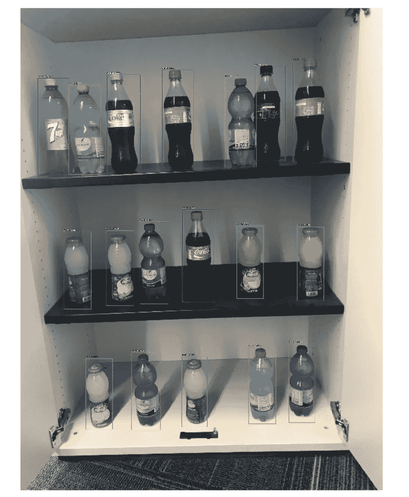

```
False
```

# 基准瓶启发式

通常，为了将此应用于我们的整个数据集，我们将使用批处理，因为我们试图节省内存，我们将一次评估一个图像。

```
**from** **tqdm** **import** tqdm_notebook
**from** **utils** **import** classification_report
**from** **keras.preprocessing.image** **import** ImageDataGeneratory_pred = []
y_true = []print("Testing Invalid Cases")img_dir = 'dataset/Beverages/Test/Invalid/'
**for** img_path **in** tqdm_notebook(os.listdir(img_dir)):
    detection_results = evaluate_single_image(soda_model, os.path.join(img_dir, img_path))
    y_pred.append(predict_bottles(detection_results))
    y_true.append(**False**)print("Testing Valid Cases")
img_dir = 'dataset/Beverages/Test/Valid/'
**for** img_path **in** tqdm_notebook(os.listdir(img_dir)):
    detection_results = evaluate_single_image(soda_model, os.path.join(img_dir, img_path))
    y_pred.append(predict_bottles(detection_results))
    y_true.append(**True**)
```

## 分类报告

```
classification_report(y_true, y_pred)
```

```
precision    recall  f1-score   support False       1.00      1.00      1.00        30
        True       1.00      1.00      1.00        30 micro avg       1.00      1.00      1.00        60
   macro avg       1.00      1.00      1.00        60
weighted avg       1.00      1.00      1.00        60Confusion matrix, without normalization
[[30  0]
 [ 0 30]]
Normalized confusion matrix
[[1\. 0.]
 [0\. 1.]]
```

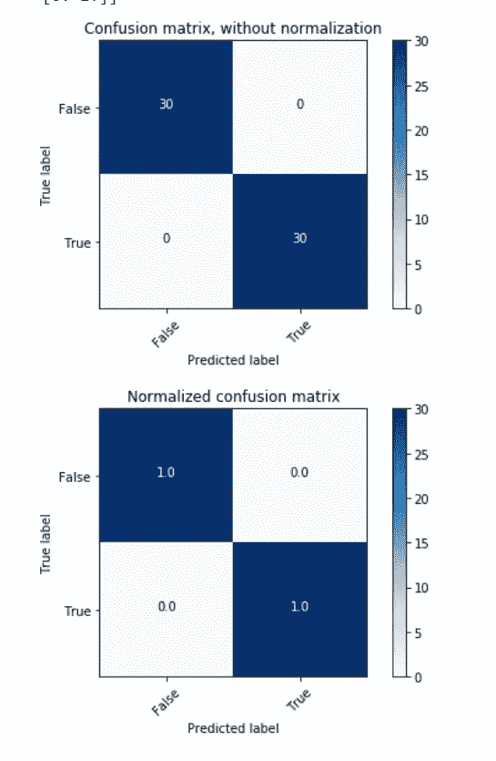

# 结论

我们可以看到，对于某些任务，使用具有良好启发性的对象检测可以优于定制视觉服务。然而，重要的是要考虑注释我们的数据和构建对象检测模型所需的权衡和工作。

# 资源

[](https://medium.com/microsoftazure/the-pythic-coders-recommended-content-for-getting-started-with-machine-learning-on-azure-fcd1c5a8dbb4) [## Pythic Coder 推荐的 Azure 机器学习入门内容

### Tldr 由于 DevOps 资源上的帖子很受欢迎，而且很难找到文档，所以我…

medium.com](https://medium.com/microsoftazure/the-pythic-coders-recommended-content-for-getting-started-with-machine-learning-on-azure-fcd1c5a8dbb4) [](https://github.com/aribornstein) [## aribornstein —概述

### @ pythiccoder。aribornstein 有 68 个存储库。在 GitHub 上关注他们的代码。

github.com](https://github.com/aribornstein) [](https://azure.microsoft.com/en-us/services/cognitive-services/?v=18.44a) [## 认知服务|微软 Azure

### 微软 Azure Stack 是 Azure 的扩展——将云计算的灵活性和创新性带到您的…

azure.microsoft.com](https://azure.microsoft.com/en-us/services/cognitive-services/?v=18.44a) [](https://medium.com/@jonathan_hui/object-detection-series-24d03a12f904) [## 物体探测系列

### 概观

medium.com](https://medium.com/@jonathan_hui/object-detection-series-24d03a12f904) 

# 以前的帖子:

[](/using-object-detection-for-complex-image-classification-scenarios-part-1-779c87d1eecb) [## 在复杂图像分类场景中使用对象检测第 1 部分:

### 人工智能计算机视觉革命

towardsdatascience.com](/using-object-detection-for-complex-image-classification-scenarios-part-1-779c87d1eecb) [](/using-object-detection-for-complex-image-classification-scenarios-part-2-54a3a7c60a63) [## 将对象检测用于复杂的图像分类场景第 2 部分:

### 定制视觉服务

towardsdatascience.com](/using-object-detection-for-complex-image-classification-scenarios-part-2-54a3a7c60a63) [](/using-object-detection-for-complex-image-classification-scenarios-part-3-770d3fc5e3f7) [## 将对象检测用于复杂的图像分类场景第 3 部分:

### 利用 MobileNet 和迁移学习进行策略识别

towardsdatascience.com](/using-object-detection-for-complex-image-classification-scenarios-part-3-770d3fc5e3f7) 

# 下一篇文章

本系列的下一篇文章将回顾如何训练你自己的对象检测模型使用 Azure ML 服务的云，后续文章将讨论部署。

如果您有任何问题、评论或希望我讨论的话题，请随时在 [Twitter](https://twitter.com/pythiccoder) 上关注我。如果您认为我错过了某个里程碑，请告诉我。

## 关于作者

亚伦(阿里) 是一个狂热的人工智能爱好者，对历史充满热情，致力于新技术和计算医学。作为微软云开发倡导团队的开源工程师，他与以色列高科技社区合作，用改变游戏规则的技术解决现实世界的问题，然后将这些技术记录在案、开源并与世界其他地方共享。