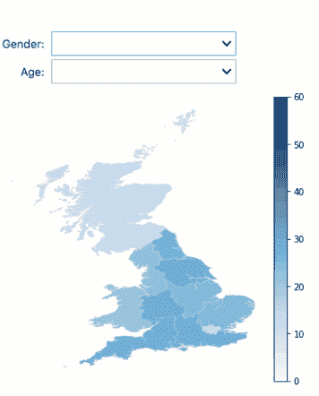

# 使用开源工具创建交互式政治调查地图

> 原文：<https://towardsdatascience.com/using-open-source-tools-to-create-interactive-maps-of-political-surveys-f10ee0195984?source=collection_archive---------31----------------------->

## 设想英国地区对硬英国退出欧盟的支持


这个星期谁说了谁的坏话？谁将被投票淘汰出局？谁去勾搭这一季的人气先生？不，我们不是在谈论爱情岛或单身汉，而是另一个越来越受欢迎的真人秀节目:BBC 的议会频道。英国退出欧盟可能有点像一辆破车，但它确实提供了一些有趣的民意调查。

我们将使用今年 3 月的民意调查数据(以 SPSS 文件的形式)来查看对无交易英国退出欧盟的支持，并将结果显示为交互式地图。最终结果将如下图所示:



Support for a no-deal Brexit across regions shortly after Theresa May announced that she’d reached a deal with the EU.

# 轮询数据

为了读取 SPSS 文件并计算我们的结果，我们将使用开源软件库 [Quantipy](https://www.github.com/quantipy/quantipy3) ，这是一个专门为处理调查数据而设计的库。我们以前写过 Jupyter 笔记本环境对于处理调查数据有多好，我们在这里再次使用它。

```
import quantipy as qp
dataset = qp.DataSet(“Political survey”)
dataset.read_spss(“results.sav”)
```

现在我们已经导入了数据集，让我们来看看我们想要可视化的问题，`Deal_or_no_deal`:

```
dataset.crosstab(“Deal_or_no_deal”, “Regions”, pct=True)
```


我们还清理空列(“Northern Ireland”和“Other”)的输出，并删除“All”列，以使结果更容易阅读。然后，我们将只提取结果数据行“不再向欧盟让步，必要时不达成协议就离开”，并给它一个漂亮的简短报告标签:“不达成协议”。

```
vote = dataset.crosstab(‘Deal_or_no_deal’, 
                        “Regions”, pct=True, f=filter)
vote = vote.droplevel(level=0,axis=1)
vote = vote.droplevel(level=0,axis=0)
vote = vote.drop([‘Other’,‘Northern Ireland’,“All”],axis=1)
vote.index.name = ‘No deal’
poll_result = vote.iloc[5,:]
```


这是我们的数据，但是在地图上看起来像什么呢？

# 使用 geopandas 通过 python 映射数据

为了绘制我们的结果，我们使用 geopandas python 库，这是一个非常强大但易于使用的库，它可以将地理空间数据转换为 pandas 数据框架。方便的是，有人已经在 GitHub 上收集了英国大部分主要的[地理空间数据(这就是使用开源解决方案的好处，通常有人会为你做大部分艰苦的工作)，我们使用 UK-geo JSON/JSON/electronic/GB/文件夹中的 eer.json 文件。将其保存到文件后，我们将其导入到 geopandas:](https://github.com/martinjc/UK-GeoJSON)

```
import geopandas
gdata = gpd.read_file(‘eer.json’)
gdaga.head()
```


请注意，这些区域存储在列“EER13NM”中。我们将这个数据框的结果与我们之前计算的数据合并。

```
gdata = gdata.join(poll_result, on=”EER13NM”)
gdata.plot(columns=”No more concessions to the EU, leave without a deal if necessary”)
```


现在我们有进展了。但是我们想知道不同性别和不同地区的投票结果有什么不同。所以我们给 DataSet.crosstab()方法发送了一个过滤器。

```
dataset.crosstab("Deal_or_no_deal", 
                 "Regions", pct=True,
                 f={"Gender":[1]})
```

# 交互式 Jupyter 小工具

接下来，我们需要一个交互式小部件，允许我们选择要查看的过滤器。我们使用 Jupyter 的 ipywidgets，它允许我们在笔记本中注入交互性。我们使用 dropdown 小部件，并使用 dataset.value_texts()和 dataset.codes()来填充它们。

```
gender = widgets.Dropdown(
   options=[(“All”, None)] + 
      list(zip(dataset.value_texts(‘Gender’), 
      dataset.codes(‘Gender’)))[:2],value=None,  
      description=’Gender:’,
      disabled=False
)age = widgets.Dropdown(
    options=[(“All”, None)] +    
    list(zip(dataset.value_texts(‘grouped_age’),
    dataset.codes(‘grouped_age’))),
    value=None,
    description=’Age:’,
    disabled=False
)
```

最后，将 Jupyter 的交互式 dropdown 小部件连接到我们的地图，这样我们就可以使用名为 interactive 的 ipywidgets 库的一部分来控制它所显示的内容(这是一种在笔记本中连接 Jupyter 前端和 python 后端的简单方法)。

```
interactive(update_map, gender=gender, age=age)
```

我们的 update_map 方法封装了过滤器的计算和地图的绘制。

```
def update_map(gender, age): filter = []
    if gender:
        filter.append( {‘Gender’: [gender]})
    if age:
        filter.append({‘grouped_age’: [age]}) vote_data = get_vote_data(filter).to_dict() map = gdata.join(get_vote_data(filter),
               on=”EER13NM”).plot(vmin=0, vmax=60,
               column=”No more consessions to the EU,
               leave without a deal if necessary”)

    out.clear_output()
    # out is a Jupyter Widget that captures output
    with out:
        display(map.figure)
```

为了简洁起见，我们省略了图的一些格式(改变颜色图、边框、图例格式)和一个我们调用的方法，以便用不同的过滤器检索数据。但我们现在已经准备好了，有了一张互动地图，可以显示不同地区的人们的观点是如何不同的。


现在你知道了，使用开源解决方案不仅可以计算公众对“不交易英国退出欧盟”意见的地区差异，还可以使这些差异对消费信息的人有意义。

盖尔·弗雷松是 [Datasmoothie](https://www.datasmoothie.com/) 的联合创始人，这是一个专门从事调查数据分析和可视化的平台。如果你对使用开源软件进行调查数据分析感兴趣，注册我们的时事通讯，名为[自发认知](https://confirmsubscription.com/h/r/123C34C5066BF0AD2540EF23F30FEDED)。