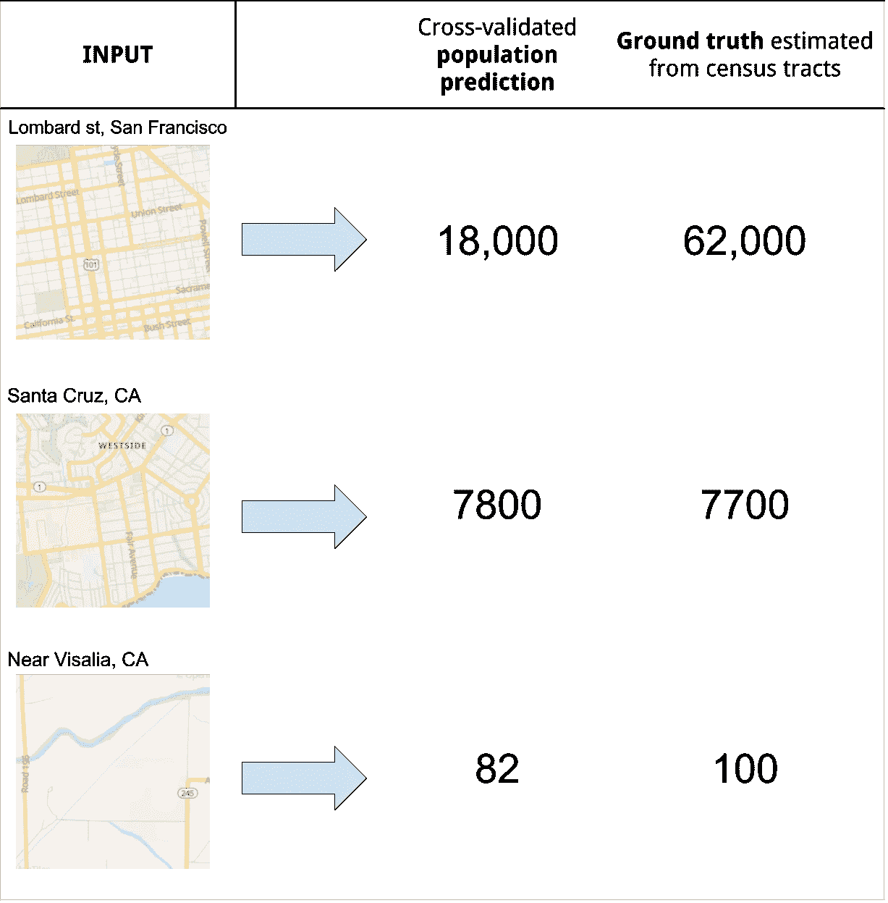
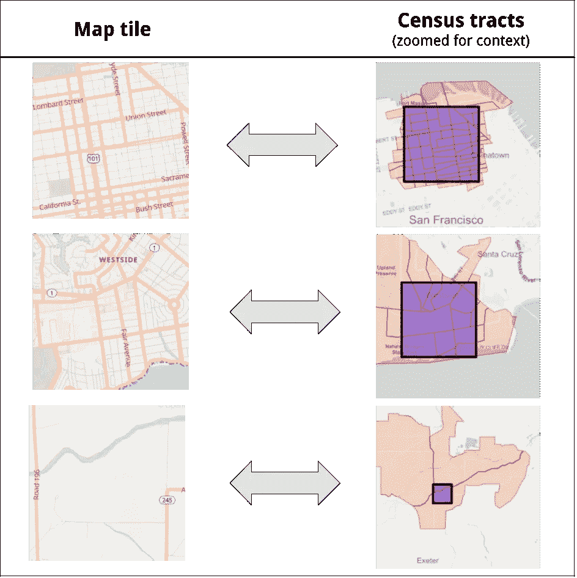
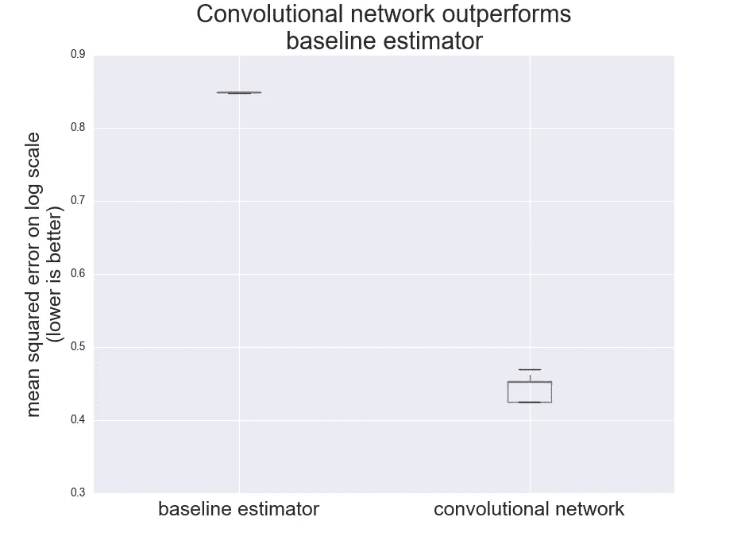

# 使用 OpenStreetMap 切片进行机器学习

> 原文：<https://towardsdatascience.com/using-openstreetmap-tiles-for-machine-learning-4a3e41bb3ea6?source=collection_archive---------18----------------------->

## 使用卷积网络自动提取特征

Performance of the network when predicting the population of a given tile

[OpenStreetMap](https://www.openstreetmap.org/) 是一个不可思议的数据源。1000 名志愿者的集体努力创造了一套丰富的信息，几乎覆盖了地球上的每个地方。

在许多问题中，地图信息可能会有所帮助:

*   城市规划，描述街区的特征
*   研究土地使用、公共交通基础设施
*   确定营销活动的合适地点
*   识别犯罪和交通热点

然而，对于每个单独的问题，都需要进行大量的思考，以决定如何将用于制作地图的数据转换为对当前任务有用的要素。对于每项任务，您需要了解可用的功能，并编写代码从 OpenStreetMap 数据库中提取这些功能。

这种手动特征工程方法的替代方法是**在渲染的地图块上使用卷积网络**。

# 如何使用卷积网络？

如果地图切片图像和响应变量之间存在足够强的关系，则卷积网络可能能够学习对每个问题都有帮助的地图切片的视觉组件。OpenStreetMap 的设计者已经做了大量的工作来确保地图渲染尽可能多地展示我们的视觉系统所能理解的信息。卷积网络已经被证明非常能够模仿视觉系统的性能，因此卷积网络可以学习从图像中提取哪些特征是可行的，这对于每个特定的问题领域来说都是耗时的编程工作。

# 检验假设

为了测试卷积网络是否可以从地图切片中学习有用的特征，我选择了简单的测试问题:**估计给定地图切片的人口**。美国人口普查提供了人口普查区域级别的人口数量数据，我们可以**使用区域的人口来近似地图区块的人口**。

涉及的步骤:

1.  从[人口普查局](https://www.census.gov/geo/reference/centersofpop.html)下载人口普查区域级别的人口数据。
2.  对于给定的缩放级别，识别与一个或多个人口普查区域相交的 OpenStreetMap 切片。
3.  从 [MapTiler](https://medium.com/u/874bd211e8b4?source=post_page-----4a3e41bb3ea6--------------------------------) 下载 [OpenMapTiles](https://openmaptiles.org/) 的本地实例中的图块。
4.  对每个分块内的区域人口进行求和，并添加与分块相交的区域的分数人口

Visualizing the census tracts which overlap with the 3 example tiles

这给了我们:

*   **输入 X**:OpenStreetMap 图块的 RGB 位图表示
*   **目标 Y** :瓦片的估计人口

**再重复一遍，网络用来预测人口的唯一信息是 OpenStreetMap 图块的 RGB 值**。

在这个实验中，我为加利福尼亚的瓦片和土地生成了一个数据集，但是同样的过程可以在美国的每个州进行。

# 模特培训和表演

通过使用简化的 [Densenet 架构](https://arxiv.org/abs/1608.06993)，并最小化对数标度的均方误差，网络在几个时期后实现了以下交叉验证性能:

0.45 的平方误差是对 0.85 的改进，如果你每次只是猜测平均人口，你会得到 0.85。这相当于每个瓦片的对数标度的平均绝对误差为 0.51。因此**预测往往是正确的数量级，但是相差 3 倍**(我们没有做任何事情来优化性能，所以这是一个不错的开始)。

# 摘要

*   在估计人口的示例中，OpenStreetMap 切片中有足够的信息，显著优于人口的简单估计。
*   对于信号足够强的问题，OpenStreetMap 切片可用作数据源，无需手动进行要素工程

学分:

*   非常感谢所有支持 [OpenStreetMap](https://www.openstreetmap.org/) 的志愿者
*   免费提供人口普查数据的美国政府
*   [OpenMapTiles](https://openmaptiles.org/) 为研究目的提供地图渲染服务

*最初发布于*[*shuggiefisher . github . io*](https://shuggiefisher.github.io/machine-learning-with-openstreetmap-tiles.md/)*。*