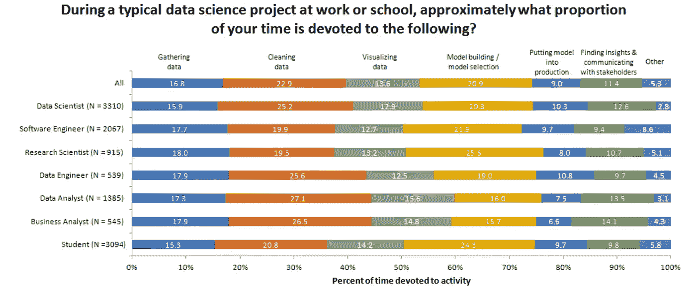
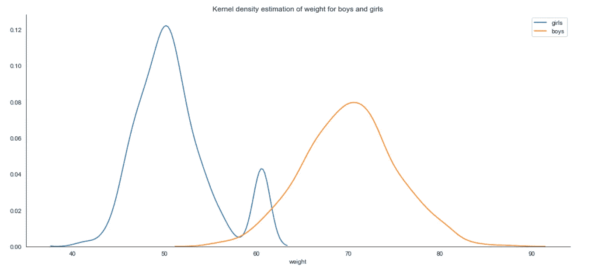
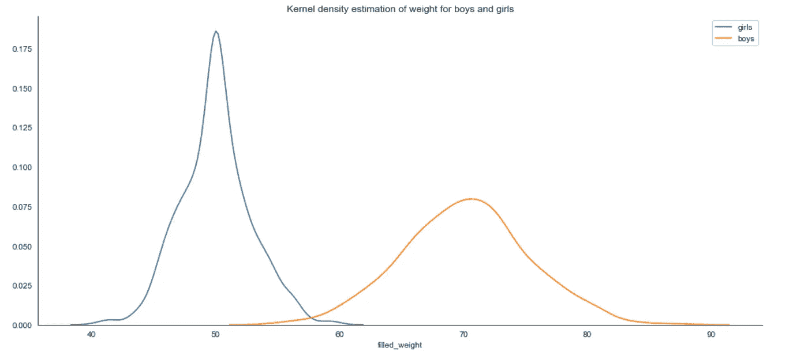
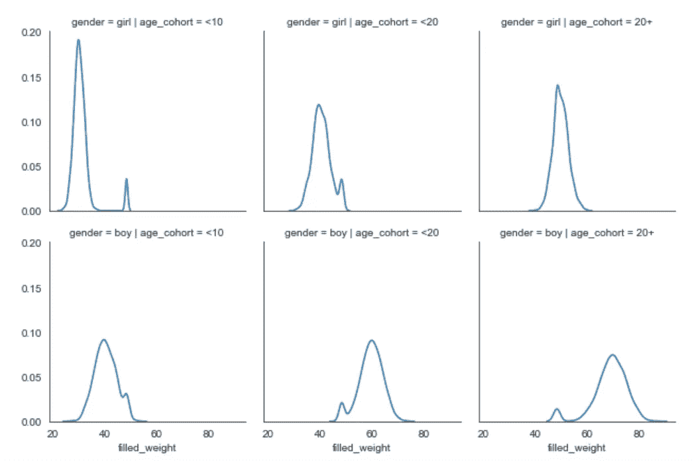
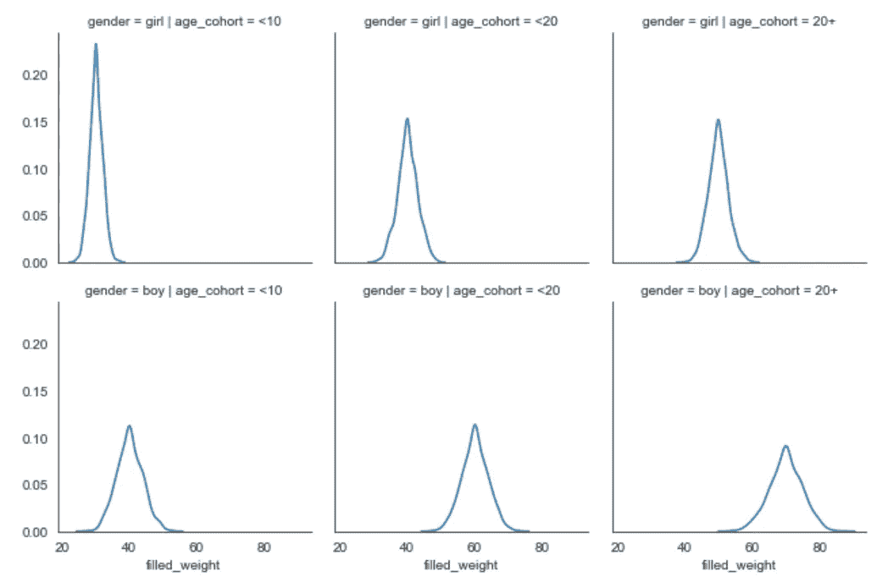
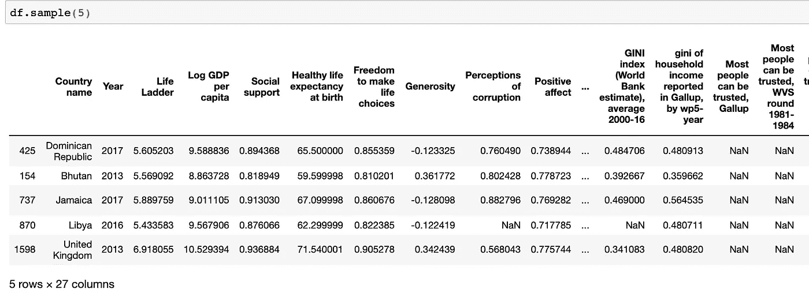
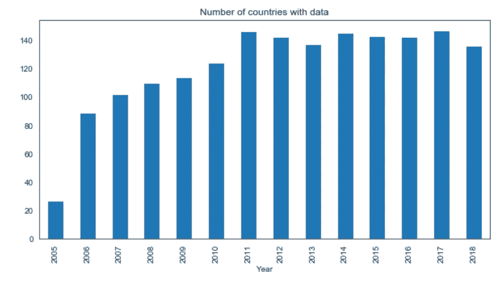
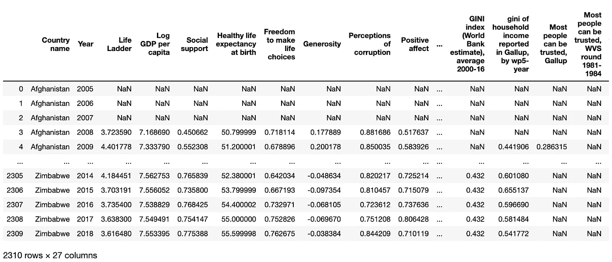
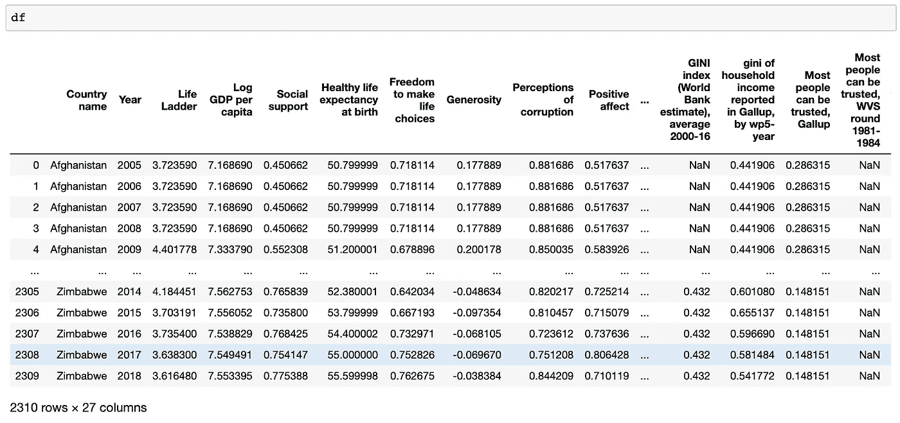

# 使用 Panda 的“转换”和“应用”在组级别处理缺失数据

> 原文：<https://towardsdatascience.com/using-pandas-transform-and-apply-to-deal-with-missing-data-on-a-group-level-cb6ccf060531?source=collection_archive---------1----------------------->


Image by [Brett Hondow](https://pixabay.com/users/Brett_Hondow-49958/?utm_source=link-attribution&utm_medium=referral&utm_campaign=image&utm_content=1378806) from [Pixabay](https://pixabay.com/?utm_source=link-attribution&utm_medium=referral&utm_campaign=image&utm_content=1378806)

## 了解当您不想简单地丢弃丢失的数据时应该怎么做。

根据 Businessbroadway 进行的一项分析，数据专业人员花费高达 60%的时间来收集、清理数据和可视化数据。



Source: [Businessbroadway](https://businessoverbroadway.com/2019/02/19/how-do-data-professionals-spend-their-time-on-data-science-projects/)

清理和可视化数据的一个关键方面是如何处理丢失的数据。 **Pandas 以** `**fillna**` **方法**的形式提供了一些基本功能。虽然`fillna`在最简单的情况下工作得很好，但是一旦数据中的组或数据的顺序变得相关时，它就不够用了。本文将讨论解决这些更复杂情况的技术。

这些案例通常是由不同制度(时间序列)、组甚至子组组成的数据集。不同情况的例子有几个月、几个季度(一般时间范围)或一段暴雨期。数据中的组的一个例子是性别。亚组的例子有年龄组和种族。

本文旨在作为一篇代码文章。因此，请随意启动笔记本电脑，开始工作。

# 文章的结构:

1.  熊猫的 fillna
2.  当订单**与**不相关时，处理缺失数据
3.  当订单**与**相关时，处理缺失数据

# 熊猫概述`fillna`


Image by [skeeze](https://pixabay.com/users/skeeze-272447/?utm_source=link-attribution&utm_medium=referral&utm_campaign=image&utm_content=903044) from [Pixabay](https://pixabay.com/?utm_source=link-attribution&utm_medium=referral&utm_campaign=image&utm_content=903044)

Pandas 通过调用`fillna()`有三种处理丢失数据的模式:

*   `**method='ffill':**` Ffill 或 forward-fill 将**最后一个**观察到的非空值向前传播，直到遇到另一个非空值
*   `**method='bfill':**` Bfill 或 backward-fill 将**第一个**观察到的非空值向后传播，直到遇到另一个非空值
*   `**explicit value:**` 也可以设置一个精确值来替换所有缺失。例如，这种替换可以是-999，表示缺少该值。

**例如:**

```
**IN:** demo = pd.Series(range(6))
demo.loc[2:4] = np.nan
demo**OUT:** 0    0.0
1    1.0
*2    NaN
3    NaN
4    NaN*
5    5.0
dtype: float64**# Forward-Fill
IN:** demo.fillna(method='ffill')**OUT:** 0    0.0
1    1.0
*2    1.0
3    1.0
4    1.0*
5    5.0
dtype: float64**# Backward-Fill**
**IN:** demo.fillna(method='bfill')**OUT:** 0    0.0
1    1.0
*2    5.0
3    5.0
4    5.0*
5    5.0
dtype: float64**# Explicit value**
**IN:** demo.fillna(-999)**OUT:** 0      0.0
1      1.0
*2   -999.0
3   -999.0
4   -999.0*
5      5.0
dtype: float64
```

# 当订单**与**不相关时，处理缺失数据


Image by [PublicDomainPictures](https://pixabay.com/users/PublicDomainPictures-14/?utm_source=link-attribution&utm_medium=referral&utm_campaign=image&utm_content=315510) from [Pixabay](https://pixabay.com/?utm_source=link-attribution&utm_medium=referral&utm_campaign=image&utm_content=315510)

通常，在处理缺失数据时，排序并不重要，因此，用于替换缺失值的值可以基于全部可用数据。在这种情况下，您通常会用自己的最佳猜测(即，可用数据的平均值或中间值)替换缺失值

让我们快速回顾一下为什么应该小心使用这个选项。让我们假设你调查了 1000 个男孩和 1000 个女孩的体重。不幸的是，在收集数据的过程中，一些数据丢失了。

```
**# imports**
import numpy as np**# sample 1000 boys and 1000 girls**
boys = np.random.normal(70,5,1000)
girls = np.random.normal(50,3,1000)**# unfortunately, the intern running the survey on the girls got distracted and lost 100 samples** for i in range(100):
    girls[np.random.randint(0,1000)] = np.nan**# build DataFrame**
boys = pd.DataFrame(boys, columns=['weight'])
boys['gender'] = 'boy'girls = pd.DataFrame(girls, columns=['weight'])
girls['gender'] = 'girl'df = pd.concat([girls,boys],axis=0)
df['weight'] = df['weight'].astype(float)
```

## 一个分组

不用多想，我们可能会用整个样本的平均值来填充缺失值。不过，结果看起来有些奇怪。女孩的 KDE 有两个驼峰。有人可能会得出结论，在我们的样本中有一个较重的女孩子群。因为我们预先构建了发行版，所以我们知道情况并非如此。但是如果这是真实的数据，我们可能会从这些数据中得出错误的结论。



KDE of weights for boys and girls where we replaced missing data with the sample mean (code below the chart)

```
**# PLOT CODE:**
sns.set_style('white')
fig, ax = plt.subplots(figsize=(16, 7))**mean = df['weight'].mean()**sns.distplot(
 **df[df['gender'] == 'girl']['weight'].fillna(mean),**
    kde=True,
    hist=False,
    ax=ax,
    label='girls'
)sns.distplot(
    df[df['gender'] == 'boy']['weight'],
    kde=True,
    hist=False,
    ax=ax,
    label='boys'
)plt.title('Kernel density estimation of weight for boys and girls')sns.despine()
```

## 用组的平均值填充缺失值

在这种情况下，Panda 的转换功能就派上了用场。使用 transform 提供了一种在组级别解决问题的便捷方法，如下所示:

```
df['filled_weight'] = df.groupby('gender')['weight'].transform(
    lambda grp: grp.fillna(np.mean(grp))
)
```

运行上述命令并绘制`filled_weight`值的 KDE，结果如下:



KDE of weights for boys and girls where we replaced missing values with the group mean (code below the chart)

```
**# PLOT CODE:**
sns.set_style('white')
fig, ax = plt.subplots(figsize=(16, 7))sns.distplot(
    df[df['gender'] == 'girl']['filled_weight'],
    kde=True,
    hist=False,
    ax=ax,
    label='girls')
sns.distplot(
    df[df['gender'] == 'boy']['filled_weight'],
    kde=True,
    hist=False,
    ax=ax,
    label='boys'
)plt.title('Kernel density estimation of weight for boys and girls')sns.despine()
```

## 多个子组

让我们使用前面的例子，但这一次，我们走得更远一点，另外将我们的数据分成年龄组。让我们创建一些模拟数据:

```
**# paramter for the weight distribution (mean, std)**
param_map = {
    'boy':{
        '<10':(40,4),
        '<20':(60,4),
        '20+':(70,5),
    },
    'girl':{
        '<10':(30,2),
        '<20':(40,3),
        '20+':(50,3),
    }
}**# generate 10k records**
df = pd.DataFrame({
    'gender':np.random.choice(['girl','boy'],10000),
    'age_cohort':np.random.choice(['<10','<20','20+'],10000)
})**# set random weight based on parameters**
df['weight'] = df.apply(
    lambda x: np.random.normal(
        loc=param_map[x['gender']][x['age_cohort']][0],
        scale=param_map[x['gender']][x['age_cohort']][1]
    ),axis=1
)**# set 500 values missing**
for i in range(500):
    df.loc[np.random.randint(0,len(df)),'weight'] = np.nan
```

绘制数据揭示了有点奇怪的双峰分布(代码如下)。



KDE of weight by age_cohort and gender were we replaced missing values with the sample mean

```
**# PLOT CODE**
df['filled_weight'] = df['weight'].fillna(
    df['weight'].mean()
)g = sns.FacetGrid(
    df,
    col='age_cohort',
    row='gender',
    col_order=['<10','<20','20+']
)g.map(sns.kdeplot,'filled_weight')
```

现在，如果我们只是用各自性别的平均值来代替缺失值，这还不够，因为不仅男孩和女孩的体重不同，而且不同年龄组的体重也有很大差异。

幸运的是，`transform`可以像以前一样应用。我们将在两列上分组，而不是像这样只在一列上分组:

```
df['filled_weight'] = df.groupby(['gender','age_cohort'])['weight'].transform(
    lambda grp: grp.fillna(np.mean(grp))
)
```

运行上面的代码片段将生成这个更加清晰的图:



KDE of weight by age_cohort and gender were we replaced missing values with each group’s mean

# 当订单**与**相关时，处理缺失数据


Photo by [Jake Hills](https://unsplash.com/@jakehills?utm_source=medium&utm_medium=referral) on [Unsplash](https://unsplash.com?utm_source=medium&utm_medium=referral)

在处理时序数据时，经常会出现两种情况。

1.  **调整日期范围:**假设你按年查看各国的 GDP、教育水平和人口增长。对一些国家来说，你错过了最初的几年，后来的几年，或者中间的几年。当然，你可以忽略它们。尽管如此，出于可视化的目的，您可能希望保留它们，并将您的第一个观察值投影到开始，将您的最后一个观察值投影到调查期结束，并得出对中间值有意义的东西。
2.  **插值:**查看时间序列数据插值，从而排序变得非常相关。用基于截至 2019 年的数据计算出的平均值替换 2012 年缺失的股票数据，肯定会产生一些古怪的结果。

我们将根据 2019 年[世界幸福报告](https://worldhappiness.report/ed/2019/)的数据来看一个例子，我们解决了这两种情况。《世界幸福报告》试图回答哪些因素影响着全世界的幸福。该报告调查了 2005 年至 2018 年的数据。

## 加载数据

```
**# Load the data**
df = pd.read_csv('[https://raw.githubusercontent.com/FBosler/you-datascientist/master/happiness_with_continent.csv'](https://raw.githubusercontent.com/FBosler/you-datascientist/master/happiness_with_continent.csv'))
```

## 样品检验

`df.sample(5)`与`df.head(5)`相反，选择五个随机行，从而给你一个更公正的数据视图。



Data sample from the downloaded DataFrame

让我们来看看每年我们有数据的国家的数量。



Number of countries we have data for per year

```
**# PLOT CODE:**
df.groupby(['Year']).size().plot(
    kind='bar',
    title='Number of countries with data',
    figsize=(10,5)
)
```

我们可以看到，特别是前几年，我们没有很多国家的数据，而且在整个样本期间也有一些波动。为了减轻丢失数据的影响，我们将执行以下操作:

1.  按国家分组并重新索引整个日期范围
2.  根据我们对每个国家的观察结果，对之间的年份进行插值，并对范围之外的年份进行外推

## 1.按国家和重新索引日期范围分组

```
**# Define helper function**
def add_missing_years(grp):
    _ = grp.set_index('Year')
    _ = _.reindex(list(range(2005,2019)))
    del _['Country name']
    return _**# Group by country name and extend**
df = df.groupby('Country name').apply(add_missing_years)
df = df.reset_index()
```

我们现在大约有 600 多行。然而，那些观察现在都是`null`



Extended DataFrame, where every country has rows for every year between 2005 and 2018

## 2.根据我们对每个国家的观察结果，对之间的年份进行插值，并对范围之外的年份进行外推

```
**# Define helper function**
def fill_missing(grp):
    res = grp.set_index('Year')\
    .interpolate(method='linear',limit=5)\
    .fillna(method='ffill')\
    .fillna(method='bfill')
    del res['Country name']
    return res**# Group by country name and fill missing**
df = df.groupby(['Country name']).apply(
    lambda grp: fill_missing(grp)
)df = df.reset_index()
```

`fill_missing`函数向终点和起点进行插值和外推，结果是:



**完美！**现在我们有了样本中所有国家从 2005 年到 2018 年的数据。当我写这篇关于可视化的文章时，上面的方法对我来说很有意义。如果你想了解更多关于幸福报告的信息，可以去看看。

[](/plotting-with-python-c2561b8c0f1f) [## 了解如何使用 Python 创建漂亮而有洞察力的图表——快速、漂亮和…

### 数据显示，金钱可以买到幸福。用 Python 可视化的综合代码指南，解释了…

towardsdatascience.com](/plotting-with-python-c2561b8c0f1f) 

# 总结和结束语

今天到此为止。在本文中，您学习了如何使用`transform`和`apply`用比之前或之后的值更有意义的值来替换丢失的值。

如果你发现了一些奇妙的新的可视化效果，想要提供反馈或进行聊天，请在 LinkedIn 上联系我。

如果你喜欢你所读的，看看我在 Medium 上写的其他文章。