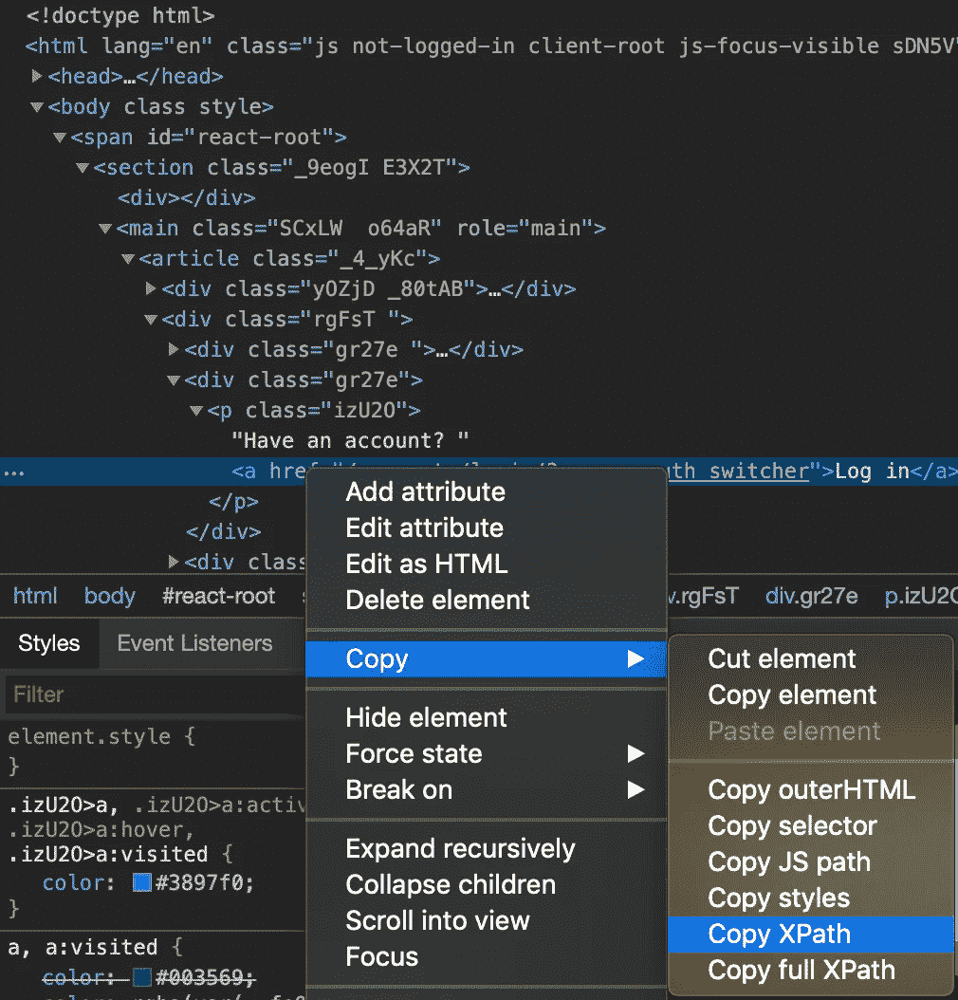
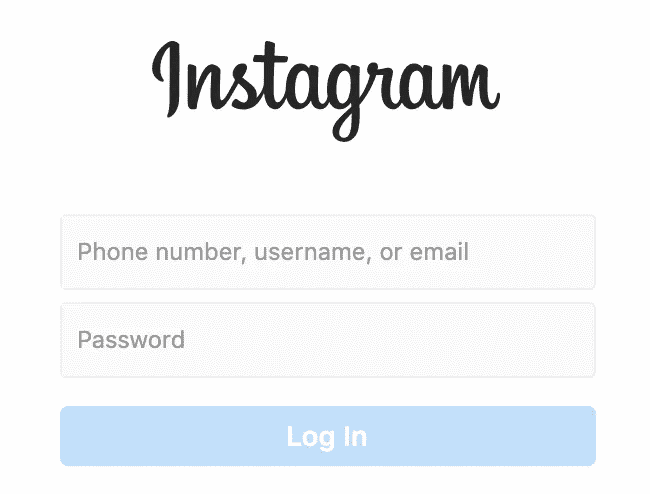

# 使用 Python 和 Selenium 实现鼠标点击和表单填写的自动化

> 原文：<https://towardsdatascience.com/using-python-and-selenium-to-automate-filling-forms-and-mouse-clicks-f87c74ed5c0f?source=collection_archive---------2----------------------->

对于这个例子，我们将通过 Instagram 的网站应用程序登录。

实际上，我在日常工作流程中使用 Python 和 Selenium。在我工作的公司，我们有自己的网络应用程序，可以在线发送报告。每份报告都有一个账户。

由于我们每天都有客户加入，我们还需要创建新的帐户。随着我们雇佣更多销售团队成员，客户数量呈指数级增长。创建新账户是一个非常手工的过程，看一份报告，然后输入信息。这是我发现硒的地方。

[*硒*](https://www.seleniumhq.org/) 是一款针对网页浏览器的自动化工具。除了 Python 之外，您还可以将它用于许多不同的编程语言。他们也有一个版本，你可以记录你使用浏览器的过程，他们能够模仿他们。

如果你有任何容易重复的任务，这是非常有用的。例如，在我的工作中，我从客户成功团队那里获得了一份新客户列表。在该文件中，它有帐户名、帐户 ID 和地址。我必须为每个新账户手工输入。硒可以解决这个问题。

让我们从简单的东西开始，自动登录 Instagram。登录任何网站基本上都是我们发送的一个小表格。我们将填写凭证的“表格”,然后单击提交按钮。

**要求:** *1。Python w/ selenium 模块
2。chrome driver(selenium 使用的特殊谷歌 chrome)*

首先要做的是下载并在必要时安装需求。假设你已经安装了 Python，你可以在模块上做一个`pip install`。我们需要的 *chromedriver* 可以在[这里](https://chromedriver.chromium.org/downloads)找到。

我们现在可以创建一个新的 Python 文件。让我们从我们的进口开始。

```
from selenium import webdriver
```

因为我们使用 chromedriver 作为应用程序。我们需要告诉 Python 它的位置。我刚刚下载了它，并把它放在我的下载文件夹中。我可以用它的路径设定它的位置。

```
chromedriver_location = "/Users/Downloads/chromedriver"
```

一旦我们知道了 *chromedriver* 的位置，我们现在就可以使用 Selenium 的 webdriver 调用它，告诉它去 Instagram 主页。

```
driver = webdriver.Chrome(chromedriver_location)
driver.get(‘https://www.instagram.com/')
```

我们现在可以试着运行这个脚本，看看会得到什么。如果设置正确，将会弹出一个新的 Google Chrome 实例，并把你带到所请求的站点。

让我们回到我们的代码，假设我们已经有了 Instagram 凭证。我们想告诉 Selenium 点击蓝色的链接中的*日志:*


Selenium 通过在 web 页面中查找元素来简化自动化。有多种方法可以找到 web 元素，比如 id、类名、文本等等。在这种情况下，我们将使用 Selenium webdriver 的`find_element_by_xpath`。

回到谷歌浏览器窗口，右键点击蓝色的*登录*链接。你想点击 *inspect，*应该会弹出一个窗口，显示所有的 web 元素和一个高亮显示的行。您现在想要点击高亮显示的行并*复制 xpath。*



一旦完成，你应该有这样的东西，当你粘贴下来。

`//*[[@id](http://twitter.com/id)=”react-root”]/section/main/article/div[2]/div[2]/p/a`



同样，用户名、密码和登录按钮的输入字段也是同样的过程。

我们可以在当前页面上继续操作。我们可以将这些 xpaths 作为字符串存储在代码中，以使其可读。

我们应该有三个来自这个页面的 xpaths 和一个来自初始登录的 xpaths。

```
first_login = '//*[[@id](http://twitter.com/id)=”react-root”]/section/main/article/div[2]/div[2]/p/a'username_input = '//*[[@id](http://twitter.com/id)="react-root"]/section/main/div/article/div/div[1]/div/form/div[2]/div/label/input'password_input = '//*[[@id](http://twitter.com/id)="react-root"]/section/main/div/article/div/div[1]/div/form/div[3]/div/label/input'login_submit = '//*[[@id](http://twitter.com/id)="react-root"]/section/main/div/article/div/div[1]/div/form/div[4]/button/div'
```

既然我们已经定义了 xpaths，现在我们可以告诉 Selenium webdriver 单击并发送一些输入字段的键！

让我们再次从第一次登录开始。我们使用`find_element_by_xpath`，并给它一个`first_login`变量。然后我们可以告诉它点击。

```
driver.find_element_by_xpath(first_login).click()
```

现在，它会将您带到带有输入字段的凭证页面。类似的过程，但现在我们希望 Selenium 用我们的用户名和密码填充这些字段。Selenium 有另一个叫做`send_keys`的方法，它让我们可以很容易地自动化打字。我们只要放一个字符串进去，它就会为我们打字。我们现在可以尝试虚拟变量，看看它是否有效。此外，尝试登录，知道我们会被拒绝。

```
driver.find_element_by_xpath(username_input).send_keys(“username”)
driver.find_element_by_xpath(password_input).send_keys(“password”)
driver.find_element_by_xpath(login_submit).click()
```

如果一切设置正确，我们的最终代码应该如下所示:

```
from selenium import webdriverchromedriver = "/Users/Downloads/chromedriver"driver = webdriver.Chrome(chromedriver)driver.get('https://www.instagram.com/')first_login = '//*[@id="react-root"]/section/main/article/div[2]/div[2]/p/a'username_input = '//*[@id="react-root"]/section/main/div/article/div/div[1]/div/form/div[2]/div/label/input'password_input = '//*[@id="react-root"]/section/main/div/article/div/div[1]/div/form/div[3]/div/label/input'login_submit = '//*[@id="react-root"]/section/main/div/article/div/div[1]/div/form/div[4]/button/div'driver.find_element_by_xpath(first_login).click()driver.find_element_by_xpath(username_input).send_keys("username")driver.find_element_by_xpath(password_input).send_keys("password")driver.find_element_by_xpath(login_submit).click()
```

我们现在可以运行这个脚本，并在浏览器中看到自动化。这个特定的脚本将工作，但从 Instagram 得到一个错误，因为我们没有适当的凭据。继续使用您自己的信息更改`send_keys`周围的用户名和密码字符串，它应该会让您成功登录。

正如你所看到的，这只是一个简单的例子，不同的人有不同的情况。可能性是无限的。

我还提供 ***家教和*** 职业指导[在这里](https://square.site/book/8M6SR06V2RQRB/mentor-melv)！

如果你喜欢这些内容，请随时在 [Patreon](https://www.patreon.com/join/melvfnz) 上支持我！

如果你们有任何问题、意见或担忧，请不要忘记通过 LinkedIn 与我联系！