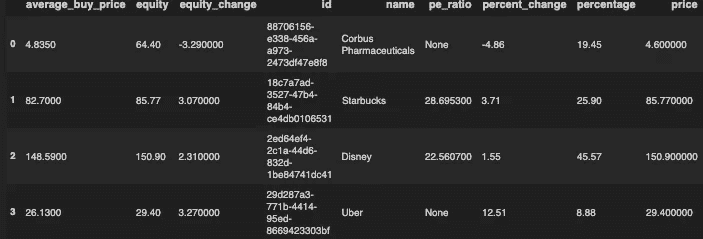
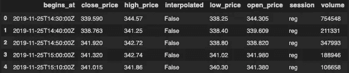
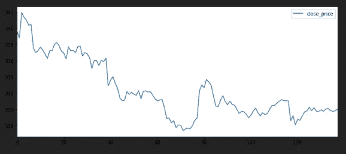

# 使用 Python 获取罗宾汉数据

> 原文：<https://towardsdatascience.com/using-python-to-get-robinhood-data-2c95c6e4edc8?source=collection_archive---------6----------------------->

Photo by [Ray Hennessy](https://unsplash.com/@rayhennessy?utm_source=medium&utm_medium=referral) on [Unsplash](https://unsplash.com?utm_source=medium&utm_medium=referral)

让我们自动化一些股票，可以用来建造一个交易机器人。

所以我已经和罗宾汉纠缠了几个月了。谈到股票或交易，我不是专家。但我认为用 Python 连接到我的 Robinhood 帐户会很酷。

在网上看了之后，我偶然发现了一个叫做`robin_stocks.`的 Python [模块](http://www.robin-stocks.com/en/)，所以这个模块非常方便，它可以做你在网站上可以做的任何事情。所以如果你想下订单，这是给你的。或者如果你想卖这个也是给你的。它还可以为您检索历史数据。

让我们开始假设你已经知道 Python 是如何工作的，我只做一个`pip install robin_stocks`。

我做的第一行代码是导入，我还导入了`pandas`来把它放入一个数据帧，并导入了`matplotlib.pyplot`来绘制它。导入之后，我们现在需要登录 Robinhood。只需在正确的字段中替换您的用户名和密码。

当我们运行脚本时，它应该要求一个代码，通常发送到您的手机号码。输入，你现在应该连接上了。我们现在可以使用`build_holdings()`获得所有的股票信息。当我们打印出`my_stocks`时，它看起来会像这样:

对于我个人的使用，我想把它放入一个数据框中。我尝试了`df = pd.DataFrame(my_stocks)`，但是结果是股票代码被作为索引读取，数据旋转不符合我的喜好。所以我多加了一点代码。

对不起，我的股票我不确定我在买卖什么，但是数据框架应该是这样的:

我们还可以获得某些股票的历史数据，对于这个例子，我将获得特斯拉的周数据并绘制它。代码、数据帧和绘图如下所示:

正如你可以告诉我还没有探索这个模块的能力。此外，我对股票市场有点缺乏经验，还没有玩过。但希望这能延伸到更有知识的人，这样他们就可以在日常生活中使用它。非常有可能建立自己的机器人投资者！

访问我的代码[这里](https://www.patreon.com/melvfnz)！

我在这里也可以得到辅导和职业指导！

如果你们有任何问题、评论或顾虑，请不要忘记通过 LinkedIn[与我联系！](https://www.linkedin.com/in/melvfernandez/)