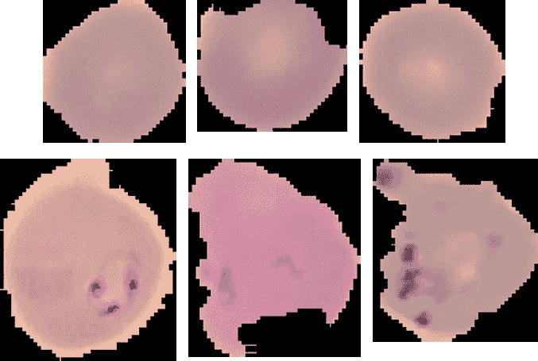
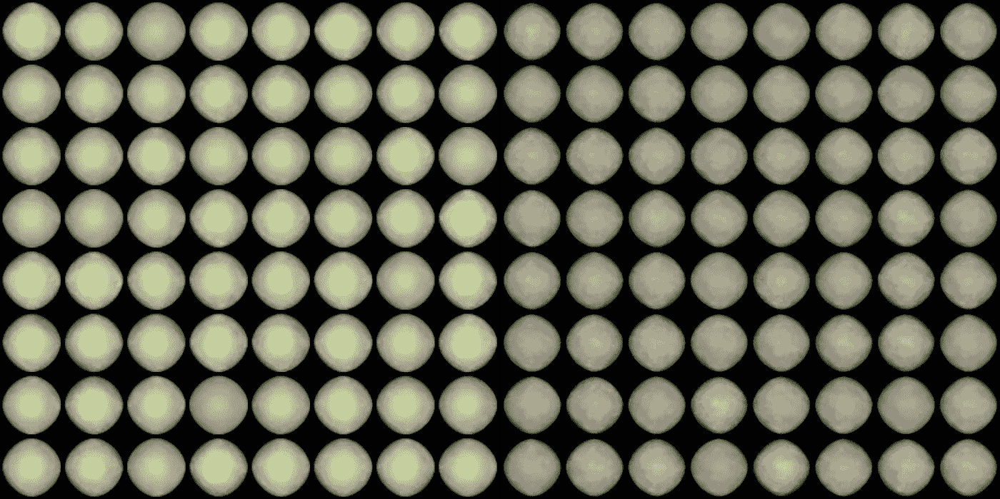
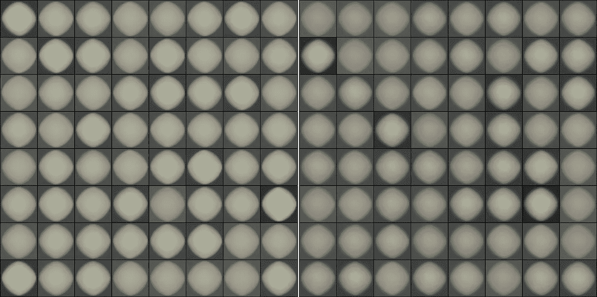
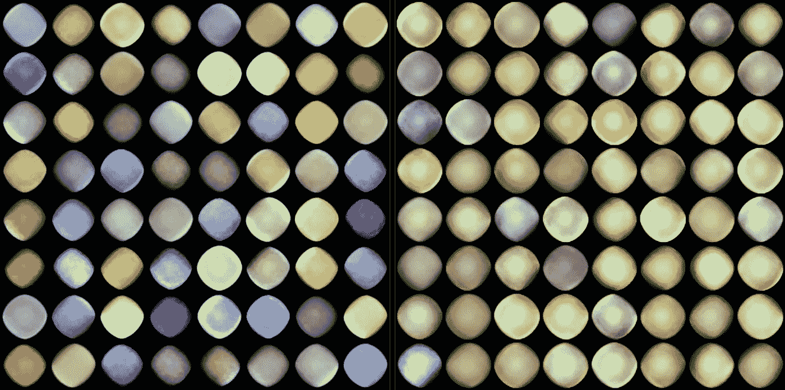

# 使用 PyTorch 生成疟疾感染细胞的图像

> 原文：<https://towardsdatascience.com/using-pytorch-to-generate-images-of-malaria-infected-cells-c2b4de260b23?source=collection_archive---------16----------------------->

## 不同的自动编码器和不同的初始化方案

在我寻求掌握机器学习和深度学习(为了做出令人兴奋的生物学发现)的过程中，我将变分自动编码器(VAEs)作为我清单上的下一个目标。看似简单，VAE 包括一个编码器，一个解码器和一个适当的损失函数。然而 VAEs 创造性应用的例子比比皆是，包括生成[图像](/vaes-generating-images-with-tensorflow-61de08e82f1f)、[音乐](https://magenta.tensorflow.org/music-vae)和[蛋白质部分](https://arxiv.org/abs/1712.03346)。我们马上就会看到为什么他们在这些事情上如此受欢迎！出于某种原因，人们似乎喜欢用 VAEs 生成数字为[和面部为](/teaching-a-variational-autoencoder-vae-to-draw-mnist-characters-978675c95776)和[的图像，所以我想尝试一些不同的东西。在寻找了一段时间后，我在 Kaggle 上发现了一个关于人类血细胞(健康的以及被疟疾病原体感染的*恶性疟原虫*)的](https://medium.com/@wuga/generate-anime-character-with-variational-auto-encoder-81e3134d1439)[数据集(顺便说一下，对数据集来说很棒)。由于这两个类别都包含了大约 14000 张图片，这并不算太差，所以我决定继续这样做，为这两个类别建立 VAEs 来生成健康的受感染细胞的图片。那有用吗？我不知道(可能不是太多)，但这是一个很好的学习经历，看起来肯定很愉快！](https://www.kaggle.com/iarunava/cell-images-for-detecting-malaria/version/1)

Examples of input images (not particularly pretty but hey you take what you can get, right?). Upper row are three healthy blood cells, lower row are three blood cells infected by the malaria pathogen P. falciparum (easily seen through the purple spots).

但是在我们沉浸在深度学习的乐趣中之前，先了解一些背景知识。VAEs 对大部件的标称任务在于预测它们的输入，称为重构。虽然这听起来可能微不足道，但是所有的自动编码器、vae 都有一个瓶颈结构。体系结构边缘的层比中间的层有更多的节点。因此，宽编码器通向最窄的瓶颈层，相应的解码器从那里开始，将输入恢复到原始尺寸。这阻止了 VAE 简单地将身份转换应用于其输入并完成它。

Structure of a standard autoencoder. Variational autoencoders replace the ‘z’ layer with vectors of means and variances to create sampling distributions. [Source](https://commons.wikimedia.org/wiki/File:Autoencoder_structure.png)

因此，网络必须学习图像的基本特征，以便重新创建它。瓶颈层所必需的这种受限表示是自动编码器通常用于去噪的主要原因。由于只有图像的真实特征才会出现在潜在特征中，因此在重建时会去除噪声。通过比较原始图像和重建图像并最小化它们的差异(理解为:最小化重建误差，例如可以是均方误差),我们已经有了损失函数。或者说，对于普通的自动编码器来说，我们已经做到了。

然而，可变自动编码器也有一个生成组件。实际上，它们可以让你得到输入图像的调整变体，而不是陈腐的复制，这就是为什么它们在音乐或视觉艺术等创意领域如此受欢迎。架构的不同之处在于，VAE 编码器输出的是均值向量和标准差向量，而不是永无止境的密集层阵列。这些现在可以用来形成样本分布。然后，我们从每个分布中抽取一个值，这些值填充瓶颈层。这就是导致变化的随机性发挥作用的地方。由于我们从分布中取样，所以每次运行 VAE 时，即使所有权重保持不变，输出也会不同。

到目前为止，一切顺利。如果我们按照指示改变架构，那么我们完成了吗？不完全是。我们仍然需要修改我们的损失函数。对于重建误差，我们将使用二值交叉熵。然而，我们还需要损失函数中的另一项，即[kull back–lei bler 散度](https://en.wikipedia.org/wiki/Kullback%E2%80%93Leibler_divergence) (KL 损失)。简单来说，这就是概率分布之间的差异。在我们的情况下，它将是 VAE 生成的概率分布和正态分布之间的差异之和。通过最小化这一点，我们迫使潜在空间中的分布围绕中心聚集(正态分布)。这导致在潜在空间中生成分布的重叠，并改善图像生成。因为否则，VAE 可能会通过为每种输入类型创建清晰分离的概率分布来“记忆”输入。通过对重建误差& KL 损失求和，我们得到我们的最终损失函数，我们试图在训练期间使其最小化。

现在我们可以建造了！如果你想尝试或者只是为你自己的项目窃取代码，我在 Jupyter 笔记本[这里](https://github.com/Bribak/vae_malaria)有全部内容。VAE 在 [PyTorch](https://pytorch.org/) 中实现，这是一个深度学习框架，甚至像我这样的生命科学人士都觉得使用它足够舒适。我开始无耻地从 [PyTorch repo](https://github.com/pytorch/examples) 中窃取 VAE 代码，然后调整&修改它，直到它符合我的需要。通常我会在谷歌的[联合实验室](https://colab.research.google.com/)上运行这些东西，因为它会免费给你一个特斯拉 K80 GPU，这绝对很棒！您可以将它与 Jupyter 笔记本电脑配合使用，连续运行长达 12 小时。

获得图像后，您必须将它们转换成 PyTorch 数据集。在我的笔记本中，这个实现非常简单，但是通常 PyTorch 数据集对象需要一个索引器(__getitem__)和一个长度(__len__)。我们可以利用这个机会对图像进行一些变换，比如使它们的大小相同，并使它们正常化。然后，我们可以将数据集馈送到数据加载器，数据加载器会将它分解成可用于训练的小批次。很简单，对吧？对于 VAE 本身，我们在 __init__ 部分实例化层，并在“forward”部分定义层交互。基本上就是一堆线性图层加上偶尔的 ReLU 激活功能。因为 VAEs 在训练中可能有点棘手(想想消失和爆炸的渐变，耶！)，我还在编码器和解码器上加了两个[批归一化](https://arxiv.org/abs/1502.03167)层。通过减少协变量偏移(增加两个交互层的独立性)，它们允许在训练期间更稳定，甚至具有轻微的正则化效果(这就是为什么如果您将模型切换到 eval 模式，它们会被关闭)。最后，我们需要一个 sigmoid 激活函数用于二进制交叉熵损失，以便所有值都在 0 和 1 之间。

显著增加训练稳定性的最后一点是层初始化。输入某一组权重可以在训练稳定性方面产生巨大的差异，尤其是对于深度神经网络。我开始用 [Xavier 初始化](http://proceedings.mlr.press/v9/glorot10a/glorot10a.pdf)我所有的线性层，这最终允许我训练 VAE 没有任何爆炸。这种方法从受给定层的输入&输出连接数量影响的随机均匀分布中采样初始权重。但是最近我偶然发现了一篇关于初始化方案的[优秀博文](https://medium.com/@jamesdell/weight-initialization-in-neural-networks-a-journey-from-the-basics-to-kaiming-954fb9b47c79)，包括[明凯初始化](https://arxiv.org/pdf/1502.01852.pdf)，所以我决定也尝试一下那个，并与 Xavier 初始化的 VAE 进行比较。显然，这种方法最适合类似 ReLU 的激活函数，它由一个从标准正态分布中提取的权重张量乘以一个与该层的传入连接数成反比的因子组成。

VAE-generated images of blood cells, either healthy (left panel) or infected with malaria (right panel). Here, the VAE was initialized with Xavier initialization.

此外，我添加了一个衰减的学习率(每一个时期后减半)以获得更好的性能。经过 10 个时期的训练后，我开始用训练好的 VAEs 生成图像。为此，从标准正态分布中采样随机值，将它们输入到训练好的 VAE 的瓶颈层，并将它们解码成生成的图像就足够了。如果我们看一看由 Xavier 初始化的 VAE 产生的图像，我们可以清楚地看到 VAE 确实从图像中学到了一些东西。未感染细胞(黄色)和感染细胞(紫色)之间的颜色差异非常明显。然后，如果你仔细观察，未感染的细胞似乎比感染的细胞更圆，形状更均匀。虽然你可以在受感染的细胞中看到一些粒度，但它并不真的像输入图像中一样清晰。对于从明凯初始化的 VAEs 生成的图像，我们也可以观察到明显的色差，但这里的粒度似乎更不明显。此外，图像似乎相当模糊。事实上，VAE 生成的图像[已经被指出](https://www.reddit.com/r/MachineLearning/comments/9t712f/dwhy_are_images_created_by_gan_sharper_than/)有点嘈杂。有时候，这并不一定是坏事。如果您还记得输入图像的粗糙边缘，那么边缘周围的一点模糊至少会使生成的图像更加美观。

VAE-generated images of blood cells, either healthy (left panel) or infected with malaria (right panel). Here, the VAE was initialized with Kaiming initialization.

从这里去哪里？据报道，与 VAEs 相比，生成敌对网络(GANs)可以创建分辨率更高的图像，因此如果这是一个因素，GANs 可能会有吸引力。此外，尤其是对于图像，使用线性图层可能不如使用卷积图层。建立一个 CNN-VAE 可能会大大提高生成图像的质量，所以如果你喜欢，就去试试吧！原则上，对这种未感染/感染细胞设置使用自动编码器可以让您了解相应细胞状态的特征(通过研究构建的潜在空间中的参数),并可能有助于疟疾的自动诊断。无论如何，我非常喜欢做这个小东西，并且学到了更多关于深度学习& PyTorch 的知识。期待下一个项目！

额外收获:如果你设置正确的参数，你可以强制你的 VAE 生成看起来像宝石或彩色鹅卵石的细胞图像。因为我们都值得美丽的形象！

Can you figure out how to get those beautiful cells from a different universe?