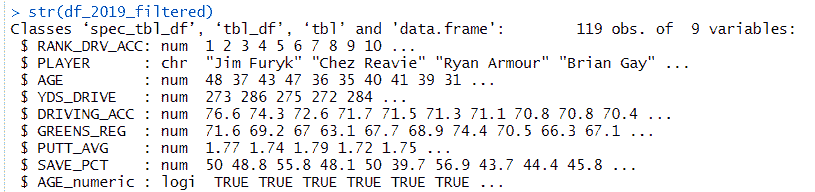

# 使用 R 进行探索性数据分析(EDA) —分析高尔夫统计数据

> 原文：<https://towardsdatascience.com/using-r-for-exploratory-data-analysis-eda-analyzing-golf-stats-812b5feb077a?source=collection_archive---------3----------------------->


无论您是数据架构师、数据工程师、数据分析师还是数据科学家，在开始一个新的数据项目时，我们都必须使用不熟悉的数据集。有点像和新数据集相亲。在感到舒适之前，你会想更多地了解它。

那么，我们怎么去呢？答案是**探索性数据分析(EDA)** 。

探索性数据分析是对数据集进行初步分析和发现的术语，通常在分析过程的早期进行。

作为一名数据专家，经历过这个过程后，我们会睡得更香。如果忽略这一步，在以后的步骤中会浪费很多时间..在架构基础和数据处理管道建立之后，需要重新工作来解决数据问题。

**样本数据集**

四大赛事结束后，泰格赢得了历史性的大师赛冠军，为什么不看看一些高尔夫统计数据呢？我在 espn.com 网站【http://www.espn.com/golf/statistics 上找到了 2019 年的高级统计数据。我把内容放在一个 Googlesheet 中以便于访问。正如您将很快看到的，这是一个非常基本的数据集，但它将让我们专注于 EDA 过程。

下面是我们数据集的样本行。


espn golf stats

我们将使用“googlesheets”库将数据集加载到 R 中。(Googlesheet 文件名为“golf_stats_espn”，sheetname 为“2019_stats”)。

```
library(googlesheets)googlesheet <- gs_title(“golf_stats_espn”)
df_2019 <- googlesheet %>% gs_read(ws = “2019_stats”)
```

**EDA 步骤 1:数据验证和数据质量**

函数将对结构进行健全性检查，并显示每个变量的样本数据。

```
str(df_2019)
```


str() function

如果你有使用 R 的经验，你可能很熟悉 *summary()* 函数。它工作得很好，但是一个更完整的函数是“skimr”包中的 *skim()* 函数。它按类型分解变量，并提供相关的摘要信息，以及每个数值变量的小直方图。

```
library(skimr)
skim(df_2019)
```


skim() function

除了“年龄”变量的看起来不错**。使用 R 和许多其他分析工具，在读入内容时会自动分配数据类型，称为“读取时模式”。对于“年龄”，我们的变量被赋予了字符类型，而不是数字类型。然而，我想把 AGE 作为一个数值类型，以便在下游应用数值函数。为什么 R 创建年龄变量作为字符类型？**

让我们做更多的 EDA，并对年龄变量运行一个 *table()* 函数。

```
with(df_2019, table(AGE))
```


table() function

table()函数在第一行显示变量的不同值，并在下一行显示出现的次数。对于年龄变量，我们可以看到“-”出现 1 次。r 别无选择，只能将变量定义为“字符”类型。

我们可以通过使用“DPLYR”包来解决这个问题。DPLYR 专门研究“数据角力”。使用这个包，您可以高效地完成很多工作——数据帧操作、转换、过滤、聚合等。

下面的 R 命令在执行了项目符号所描述的操作后创建了一个新的数据帧。

```
df_2019_filtered <- df_2019 %>%          # create new dataframe
 mutate(AGE_numeric = !(is.na(as.numeric(AGE)))) %>% 
 filter(AGE_numeric == TRUE) %>% 
 mutate(AGE = as.numeric(AGE))
```

*   mutate →创建一个新的布尔变量，标识它的值是否为数字
*   filter →使用在上面的 mutate 行中创建的新布尔变量过滤掉非数字变量
*   突变→替换“年龄”变量；现在定义为数值变量

下面是我们新的数据框架。



str() function

还有一个调整，我将把列“RK”重命名为一个更好的名称。

```
df_2019_filtered <- rename(df_2019_filtered, “RANK_DRV_ACC” = “RK”)
```

让我们在这里暂停一分钟。

***处理脏数据***

*   *对于本文，缺失的年龄行被过滤掉了。在一个真正的分析项目中，我们将不得不寻找最佳的行动方案(过滤行，替换字符数据，用 NULL 替换，等等)。*

**探索性数据分析(EDA)——第二部分**

随着我们的数据集被检查和清理…

第 2 部分更倾向于数据分析师和数据科学家。您可能会对在此阶段获得的见解感到惊讶，即使是在这个非常基础的数据集上。

***【plot _ histogram()】***

我们将使用“DataExplorer”库来了解关于我们的数据集的更多信息。 *plot_histogram()* 函数将为我们的每个数字变量返回一个单独的条形图。它显示了变量中每个值的频率(出现的次数)。

```
*library(DataExplorer)
plot_histogram(df_2019_filtered)*
```


*plot_histogram() function*

例如，“GREENS_REG”变量包含的值大约在 55 到 75 之间。根据条形图，我们看到大多数高尔夫球手大约有 65-70%的时间在果岭上击球。

***plot _ box plot()***

箱线图(盒须图)显示变量的数据分布。这个方框向我们展示了“五个数字的总结”——最小值、第一个四分位数、中间值、第三个四分位数和最大值。

下面的 *plot_boxplot()* 函数创建了 5 个箱/分区。我们将首先关注每驱动码数(YDS 驱动)变量。

```
plot_boxplot(df_2019_filtered, by = “YDS_DRIVE”)
```


plot_boxplot() function

我们可以看到一些非常有趣的相关性，将“年龄”变量与“每次驾驶的 YDS”进行比较。

*   年纪大的人打不了那么远。
*   有一个异常值。与同年龄组的其他人相比，一些 50 多岁的人仍在努力。

接下来，我们从“年龄”的角度再做一个箱线图。

```
plot_boxplot(df_2019_filtered, by = “AGE”)
```


plot_boxplot() function

*   左上角年龄最大的群体(48–55)的“驾驶准确率”(DRIVING_ACC)非常低。我希望年纪大的球员击球更短，但更准确…这不是真的，数据不会说谎。
*   年龄较大的群体(48-55 岁)也在推杆方面有困难。他们有最高的平均每洞推杆数(AVG 推杆)。

**探索性数据分析(EDA)——第三部分**

让我们把这个分析带到另一个层次。

*这个库中的功能更接近数据科学家花费时间的地方。*

*“ggcorrplot”为我们提供了一个“热图”,显示了关系之间的显著性(或不显著性)。人类不可能盯着电子表格并确定数据的列和行之间的模式/关系。*

*让我们使用“ggcorrplot”库。有时候，关键是更聪明地工作，而不是更努力地工作！*

```
*library(ggcorrplot)ggcorrplot(corr, type = “lower”, outline.col = “black”,
 lab=TRUE,
 ggtheme = ggplot2::theme_gray,
 colors = c(“#6D9EC1”, “white”, “#E46726”))*
```

**

*ggcorrplot() function*

## **1 =高度相关；0 =无关系；-1 =反比关系**

*运行该函数比盯着电子表格，试图查看行和列之间的关系要容易得多！*

*1 .我们的变量之间最重要的关系是“每次击球的码数”和“规则中的果岭数”。*

*2 .相反，最显著的反比关系存在于“年龄”和“每次行驶码数”之间。*

*如果你喜欢圆形胜过正方形，下面是使用圆形方法得到的相同数据。*

```
*ggcorrplot(corr, type = “lower”, outline.col = “black”,
 method=”circle”,
 ggtheme = ggplot2::theme_gray,
 colors = c(“#6D9EC1”, “white”, “#E46726”))*
```

**

***结论***

*尽管 EDA 过程至关重要，但它只是典型数据分析项目生命周期的开始。最有可能的是，一个组织的有价值的数据将不会来自 googlesheet，而是更有可能被埋藏在不同的数据库中，或者来自第三方供应商，甚至可能来自物联网数据流。*

*利用 R 和 EDA 过程将有助于为成功的分析项目铺平道路。*

*Jeff Griesemer 是 Froedtert Health 的一名分析开发人员。*