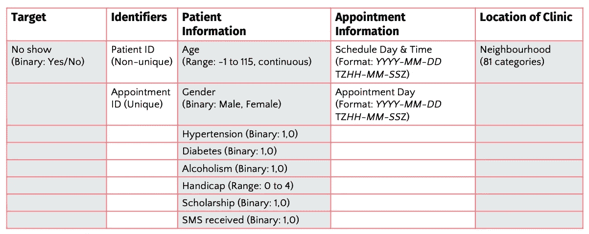
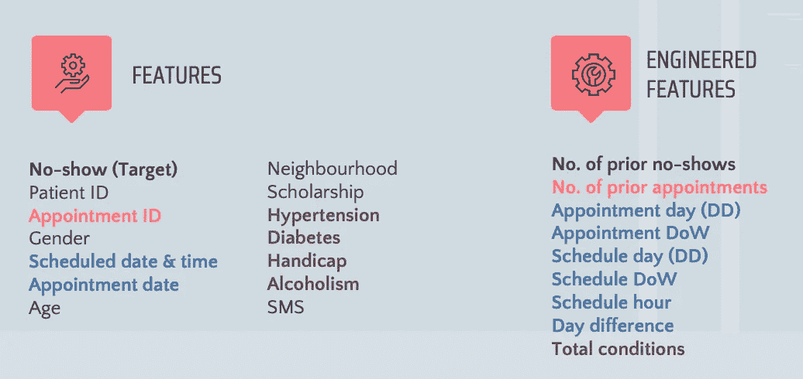
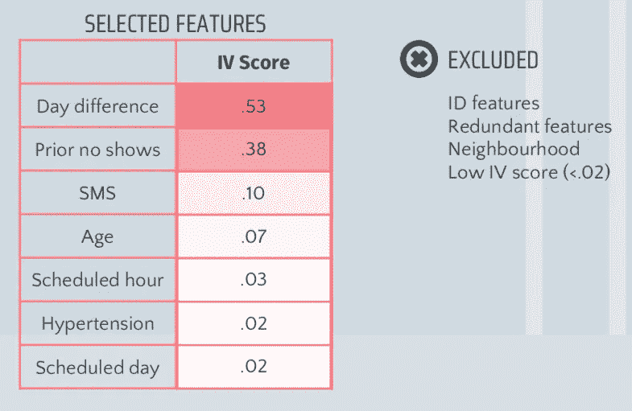
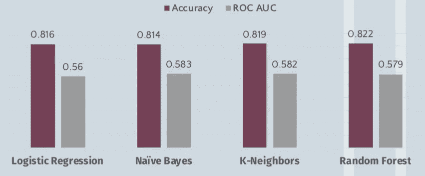
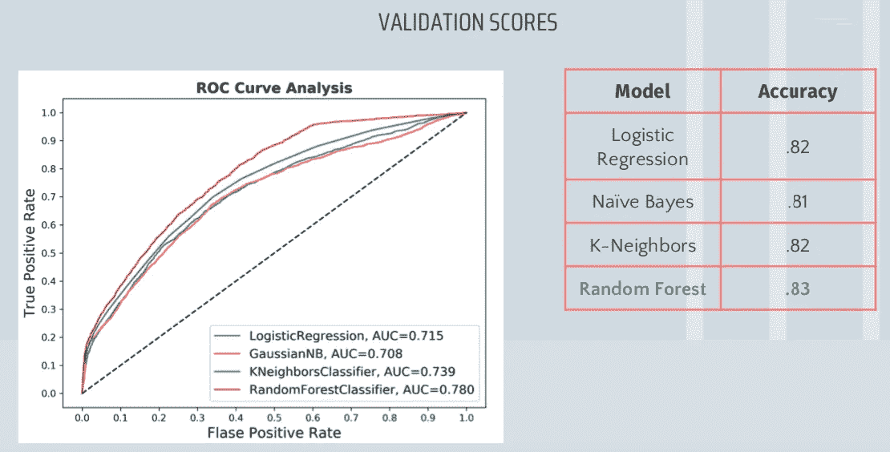
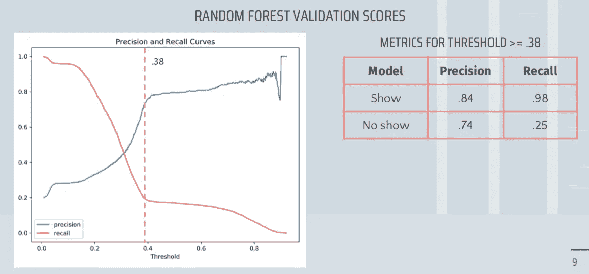
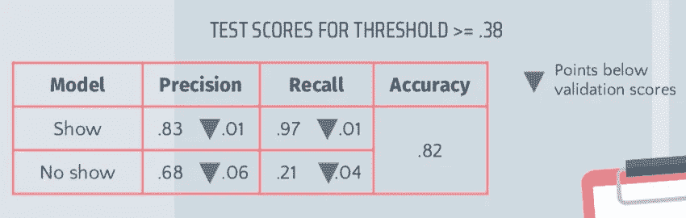
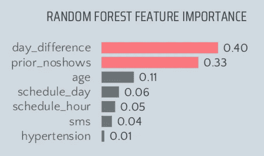
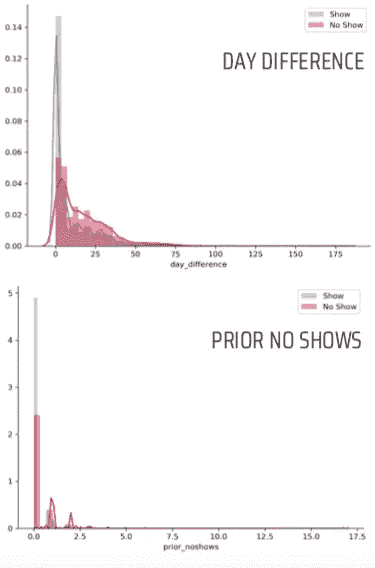

# 使用 RandomForest 预测医疗预约失约

> 原文：<https://towardsdatascience.com/using-randomforest-to-predict-medical-appointment-no-shows-b33575e3ff42?source=collection_archive---------27----------------------->

Photo by [Adhy Savala](https://unsplash.com/@adhy?utm_source=medium&utm_medium=referral) on [Unsplash](https://unsplash.com?utm_source=medium&utm_medium=referral)

对医疗机构来说，失约或错过预约的患者很常见，而且代价高昂。美国一项研究发现，多达 30%的患者会错过他们的预约，每年因此损失 1500 亿美元。

识别潜在的失约可以帮助医疗机构采取有针对性的干预措施(例如，提醒电话、重复预约预约时段)来减少失约和财务损失。

# 资料组

[Kaggle 数据集](https://www.kaggle.com/joniarroba/noshowappointments)包含了来自巴西一个城市的公共医疗机构的 11 万份预约记录。这些约会发生在 2016 年的 6 周内。

以下是数据集功能的总结:

Table summarising the dataset’s original variables

患者 id 是不唯一的，这表明同一患者在 6 周内有多次预约。为了避免数据泄露(如果将同一患者的数据用于验证和测试，就会发生这种情况)，我们将只在模型中包含患者的最新预约。

# 数据清理

有两个主要的清洁步骤:

1.  二进制编码(1，0)失约，性别和障碍。我假设障碍应该是二进制的，因为它在 Kaggle 上有描述。
2.  删除逻辑不一致的观察结果，如负年龄，以及计划日期晚于预约日期。

# 特征工程

特征工程用于记录日期时间特征，并保留从以前的约会(最近的约会之前的约会)中捕获的信息。

List of original dataset features and engineered features. Colours indicate the features from which the engineered features were created from.

通过从每个患者的失约和预约总数中分别减去 1 来计算先前失约和先前预约。

计划日期和约会日期分为星期几(DoW)和月几。预定时间也被分成一天中的几个小时。

天数差是指预定日期和约会日期之间的天数差。

总病情是高血压、糖尿病、残疾和酒精中毒的总和。换句话说，它显示了病人所患疾病的数量。

# 特征选择

特征是根据它们的[信息值(IV)](https://medium.com/@sundarstyles89/weight-of-evidence-and-information-value-using-python-6f05072e83eb) 选择的，这些信息值根据它们对目标的预测程度对特征进行排序和评分。

Selected features and their Information Value (IV) scores.

IV 分数< 0.02(非常差的预测因子的阈值)的特征被丢弃。使用保守阈值有助于确保有用的特征不会过早地从模型中排除。

事实证明，大多数特征对目标的预测能力很差。

此外，还去除了 ID 特征、冗余特征和邻域。邻域被删除是因为我找不到关于它们的额外信息，而且在模型中包含 80 个虚拟变量是不可取的。

在数据清理和特征选择之后，大约 62k 的观测值仍然存在。其中 20%没有出现。

# 五重交叉验证

数据集被分成 20%的测试数据集和 80%的交叉验证数据集。

使用 5 个训练-验证折叠，数据适合四个监督学习算法:

1.  逻辑回归
2.  朴素贝叶斯
3.  k-最近邻(KNN)
4.  随机森林

RandomCVSearch (5 倍，10 次迭代，50 次拟合)用于调整 KNN 和随机森林的超参数。

根据模型的平均准确性和受试者工作特征曲线下面积(ROC AUC)评分对模型进行评估。

不幸的是，这些型号的性能相似，我无法选择最佳型号。

*注意:我没有使用 F1 分数，因为它取决于所选的分类阈值，我打算在选择模型后对其进行调整。我使用 ROC AUC 评分和准确性，因为我想要最好的模型，而不考虑阈值。*

# 使用更多数据进行验证。

由于交叉验证对模型选择没有用，用于训练和验证的 80%被重新分成 60%训练和 20%验证。(以前交叉验证使用 64%用于训练，16%用于每个折叠的验证)。希望有一个更大的验证集会使模型之间的差异更加明显。

Graph depicting models’ ROC curves, and table of models’ accuracy scores

从 ROC 曲线分析，我们可以看到 RandomForest 优于其他算法。它的精确度也与其他的相当。我们将使用 RandomForest 作为未来的模型。

# 调整分类阈值

RandomForest 的分类阈值是基于这样的假设进行调整的，即医疗机构希望在大规模推广干预措施之前对其进行测试。因此，精确度优先于回忆。

我选择的阈值是 0.38，因为这大约是两条曲线逐渐变细的时间。这个阈值意味着 74%的时间(精确度)可以正确识别未出现者，并且大约四分之一的未出现者可以被识别(回忆)。

# 测试

使用 80%的数据重新训练该模型，并对剩余的 20%进行测试。

测试分数与验证分数相似，这表明该模型概括得很好。

# 近距离观察 RandomForest

RandomForest 的特征重要性表明，时差和先前的未出现在预测未出现中是重要的。

Histograms depicting the differences in distributions for shows and no-shows, for prior no shows and day difference.

特别是，失约者的预定日期和约定日期之间的差异更大，而且有失约的历史。

特征重要性的知识对于选择干预措施是有用的。例如，那些提前预约的病人可能会忘记他们的预约。一个可能的干预措施是建立更多的个人患者接触点(例如电话，因为短信似乎没有效果)。

另一方面，对于有失约史的患者来说，原因可能更习惯性。如果机构无法说服这些病人出现，重复预约他们的位置可能是一个可行的解决方案。

# 结论

总之，似乎可以从患者信息和预约数据中预测失约。更多关于诊所位置(如交通便利)、寻求的护理类型(如初级、专科)和患者(如教育、收入)的信息可能会改进模型。该模型还可以受益于对可能的干预措施的成本效益分析，以实现最具商业意义的精确度和召回率之间的平衡。

** * *查看我的*[*GitHub*上的代码](https://github.com/adelweiss/MedicalAppt)